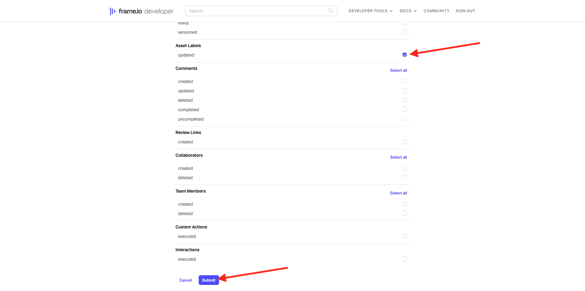
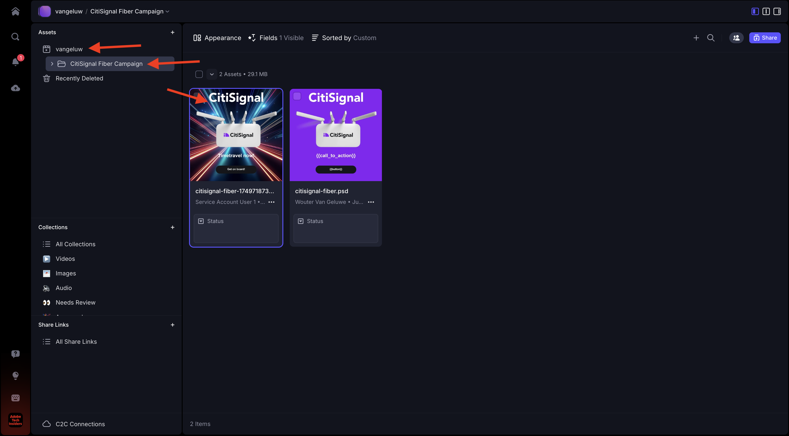
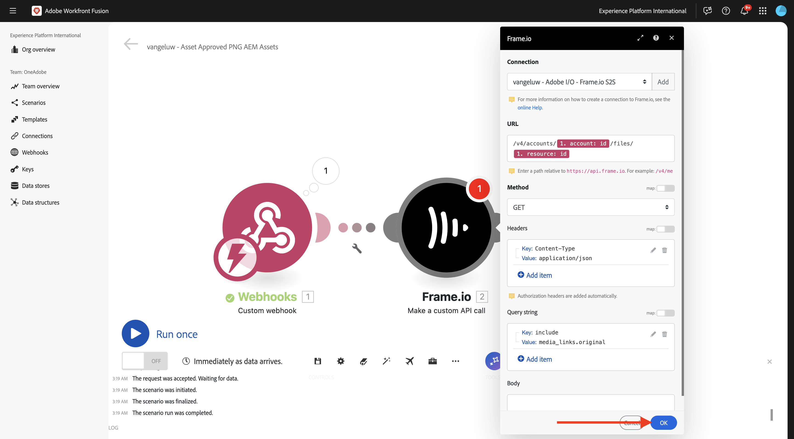
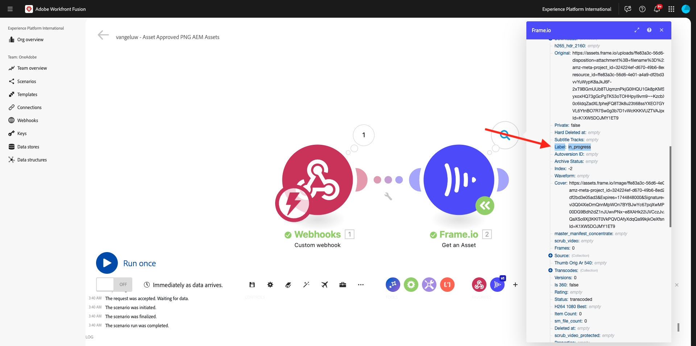
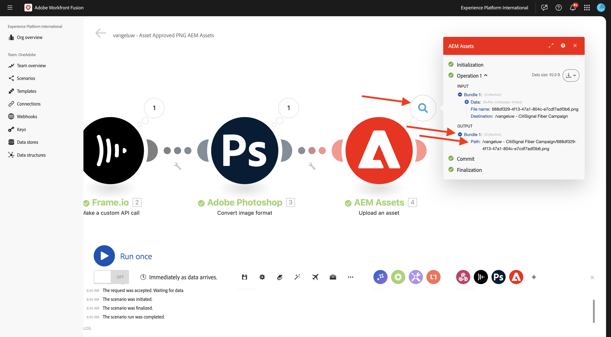
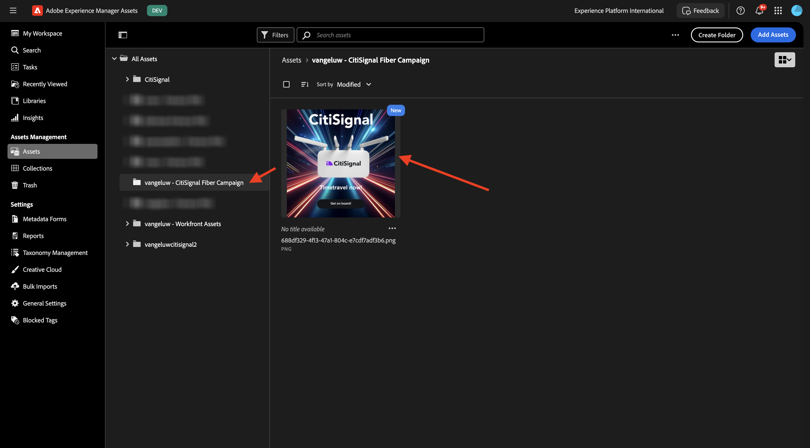

# 1.2.6 프레임 I/O - Workfront Fusion - AEM Assets

>[!IMPORTANT]
>
>이 연습을 완료하려면 작업 중인 AEM Assets CS Author 환경에 액세스할 수 있어야 합니다. 연습 [Adobe Experience Manager Cloud Service 및 Edge Delivery Services](./../../../modules/asset-mgmt/module2.1/aemcs.md){target="_blank"}을(를) 수행하면 이러한 환경에 액세스할 수 있습니다.

>[!IMPORTANT]
>
>이전에 작성자 환경을 사용하여 AEM Assets CS 프로그램을 구성한 경우 AEM CS 샌드박스가 최대 절전 모드일 수 있습니다. 이러한 샌드박스를 최대 절전 모드로 해제하는 데 10~15분이 소요되므로 나중에 중단되지 않도록 최대 절전 모드 프로세스를 지금 시작하는 것이 좋습니다.

이전 연습에서는 Adobe Firefly, Photoshop API 및 Workfront Fusion을 사용하여 Adobe Photoshop PSD 파일의 변형을 자동으로 생성하는 시나리오를 구성했습니다. 해당 시나리오의 출력은 새 Photoshop PSD 파일입니다.

그러나 비즈니스 팀에는 PSD 파일이 필요하지 않으며 PNG 파일 또는 JPG 파일이 필요합니다. 이 연습에서는 프레임 I/O의 자산이 승인되면 PNG 파일이 생성되고 이 PNG 파일이 AEM Assets에 자동으로 저장되는 새 자동화를 구성합니다.

## 1.2.6.1 새 시나리오 만들기

[https://experience.adobe.com/](https://experience.adobe.com/)&#x200B;(으)로 이동합니다. **Workfront Fusion**&#x200B;을 엽니다.

왼쪽 메뉴에서 **시나리오**(으)로 이동하여 폴더 `--aepUserLdap--`을(를) 선택합니다. **새 시나리오 만들기**&#x200B;를 클릭합니다.

이름 `--aepUserLdap-- - Asset Approved PNG AEM Assets`을(를) 사용합니다. **을(를) 클릭하세요.** 모듈에서 `webhook` 검색어를 입력한 다음 **웹후크**&#x200B;를 클릭합니다.

**사용자 지정 웹후크**&#x200B;를 클릭합니다.

새 웹후크를 만들려면 **추가**&#x200B;를 클릭하십시오.

이름 `--aepUserLdap-- - Frame.io Webhook`을(를) 사용합니다. **저장**&#x200B;을 클릭합니다.

그럼 이걸 보셔야죠 **클립보드에 주소 복사**&#x200B;를 클릭합니다.

## 1.2.6.2 Frame.io에서 Webhook 구성

[https://developer.frame.io/](https://developer.frame.io/)&#x200B;(으)로 이동합니다. **개발자 도구**&#x200B;를 클릭한 다음 **사용자 지정 작업**&#x200B;을 선택합니다.

**웹후크 만들기**&#x200B;를 클릭합니다.

다음 값을 입력합니다.

- **이름**: `--aepUserLdap-- - Asset Labels Updated` 사용
- **URL**: Workfront Fusion에서 방금 만든 웹후크의 URL을 입력하십시오.
- **팀**: 적절한 Frame.io 팀을 선택합니다. 이 경우에는 **하나의 Adobe 자습서**&#x200B;를 선택합니다.

아래로 스크롤하여 **자산 레이블 - 업데이트됨** 옆에 있는 확인란을 활성화합니다. **제출을 클릭합니다**.

그럼 이걸 보셔야죠

[https://app.frame.io/projects](https://app.frame.io/projects)&#x200B;(으)로 이동한 다음 이전에 만든 폴더(`--aepUserLdap--`)로 이동합니다. 이전 연습에서 만든 자산을 두 번 클릭하여 엽니다.

그럼 이런 걸 보셔야겠네요 **상태 없음** 필드를 클릭하고 상태를 **진행 중**(으)로 변경합니다.

Workfront Fusion으로 다시 전환합니다. 이제 연결이 **확인되었습니다**.

변경 내용을 저장하려면 **저장**&#x200B;을 클릭한 다음 **한 번 실행**&#x200B;을 클릭하여 빠른 테스트를 수행합니다.

Frame.io로 다시 전환하고 **진행 중** 필드를 클릭한 다음 **검토 필요**(으)로 상태를 변경합니다.

Workfront Fusion으로 다시 전환하고 **사용자 지정 Webhook** 모듈에서 버블을 클릭합니다.

버블의 상세 보기에는 Frame.io에서 받은 데이터가 표시됩니다. 여러 가지 신분증이 보일 겁니다 예를 들어 필드 **resource.id**&#x200B;은(는) 자산 **citsignal-fiber.psd**&#x200B;의 Frame.io에 있는 고유 ID를 표시합니다.

## 1.2.6.3 Frame.io에서 자산 세부 정보 가져오기

이제 사용자 지정 웹후크를 통해 Frame.io와 Workfront Fusion 간의 통신이 설정되었으므로 상태 레이블이 업데이트된 에셋에 대한 자세한 내용을 살펴봐야 합니다. 이렇게 하려면 이전 연습과 유사하게 Workfront Fusion에서 Frame.io 커넥터를 다시 사용합니다.

**을(를) 클릭하세요?** 모듈을 선택하고 검색어 `frame`을(를) 입력하십시오. **Frame.io**&#x200B;을 클릭합니다.

**Frame.io(기존)**&#x200B;을 클릭합니다.

**자산 가져오기**&#x200B;를 클릭합니다.

이전 연습에서 만든 연결과 동일한 연결(`--aepUserLdap-- - Frame.io Token`)로 설정되어 있는지 확인하십시오.

다음으로 **자산 ID**&#x200B;를 제공해야 합니다. **자산 ID**&#x200B;은(는) 초기 **사용자 지정 Webhook** 통신의 일부로 Frame.io에서 Workfront Fusion과 공유되며 **resource.id** 필드에서 찾을 수 있습니다. **resource.id**&#x200B;을(를) 선택하고 **확인**&#x200B;을(를) 클릭합니다.

변경 내용을 저장하려면 **저장**&#x200B;을 클릭하고 구성을 테스트하려면 **한 번 실행**&#x200B;을 클릭하십시오.

Frame.io로 다시 전환하고 **검토 필요** 필드를 클릭한 다음 상태를 **진행 중**(으)로 변경합니다.

Workfront Fusion으로 돌아가서 **Frame.io - 에셋 가져오기** 모듈에서 버블을 클릭합니다. 그러면 유사한 개요가 표시됩니다.

Frame.io에서 제공한 자산 세부 정보에서 **in_progress**(으)로 설정된 **Label**(이)라는 필드를 찾을 수 있습니다. 필터를 구성하려면 이후 단계에서 해당 필드를 사용해야 합니다.

## 1.2.6.4 PNG로 변환

**Frame.io 모듈 위로 마우스를 가져간 후 자산 가져오기** 및 **+** 아이콘을 클릭합니다.

검색어 `photoshop`을(를) 입력한 다음 **Adobe Photoshop**&#x200B;을(를) 클릭합니다.

**이미지 형식 변환**&#x200B;을 클릭합니다.

필드 **연결**&#x200B;이(가) 이전에 만든 연결(`--aepUserLdap-- - Adobe IO`)을 사용하고 있는지 확인하십시오.

**Input**&#x200B;에서 필드 **Storage**&#x200B;을(를) **External**(으)로 설정하고 **파일 위치**&#x200B;를 설정하여 **Frame.io - 에셋 가져오기** 모듈에서 반환된 변수 **Original**&#x200B;을(를) 사용합니다.

**출력**&#x200B;에서 **항목 추가**&#x200B;를 클릭합니다.

**출력** 구성의 경우 필드 **저장소**&#x200B;을(를) **Fusion 내부 저장소**(으)로 설정하고 **유형**&#x200B;을(를) **이미지/png**(으)로 설정합니다. **저장**&#x200B;을 클릭합니다.

**확인**&#x200B;을 클릭합니다.

변경 내용을 저장하려면 **저장**&#x200B;을 클릭하세요.

다음으로, 상태가 **승인됨**&#x200B;인 자산에 대해서만 PNG 파일이 렌더링되도록 필터를 설정해야 합니다. 이렇게 하려면 모듈 **Frame.io - 에셋 가져오기**&#x200B;와 **Adobe Photoshop - 이미지 형식 변환** 사이에 있는 **렌치** 아이콘을 클릭한 다음 **필터 설정**&#x200B;을 선택합니다.

다음 필드를 구성합니다.

- **레이블**: `Is Asset Approved`을(를) 사용합니다.
- **조건**: **Frame.io - 에셋 가져오기** 모듈의 응답에서 필드 **레이블**&#x200B;을(를) 선택하십시오.
- **기본 연산자**: **같음**&#x200B;을 선택하십시오.
- **값**: `approved`.

**확인**&#x200B;을 클릭합니다.

변경 내용을 저장하려면 **저장**&#x200B;을 클릭하고 구성을 테스트하려면 **한 번 실행**&#x200B;을 클릭하십시오.

Frame.io로 다시 전환하고 필드 **진행 중**&#x200B;을 클릭한 다음 상태를 **승인됨**(으)로 변경합니다.

Workfront Fusion으로 돌아갑니다. 이제 시나리오의 모든 모듈이 성공적으로 실행되었음을 알 수 있습니다. **Adobe Photoshop - 이미지 형식 변환** 모듈에서 버블을 클릭합니다.

**Adobe Photoshop - 이미지 형식 변환** 모듈의 실행에 대한 세부 정보에서 PNG 파일이 생성되었음을 확인할 수 있습니다. 다음 단계는 해당 파일을 AEM Assets CS에 저장하는 것입니다.

## AEM Assets CS의 1.2.6.5 스토어 PNG

**Adobe Photoshop - 이미지 형식 변환** 모듈에 마우스를 가져다 대고 **+** 아이콘을 클릭합니다.

검색어 `aem`을(를) 입력하고 **AEM Assets**&#x200B;을(를) 선택하십시오.

**자산 업로드**&#x200B;를 클릭합니다.

이제 AEM Assets CS에 대한 연결을 구성해야 합니다. **추가를 클릭합니다**.

다음 설정을 사용하십시오.

- **연결 유형**: **AEM Assets as a Cloud Service**.
- **연결 이름**: `--aepUserLdap-- AEM Assets CS`.
- **인스턴스 URL**: 다음과 같이 표시되는 AEM Assets CS 작성자 환경의 인스턴스 URL을 복사합니다. `https://author-pXXXXX-eXXXXXXX.adobeaemcloud.com`.
- **액세스 세부 정보 채우기 옵션**: **JSON 제공**&#x200B;을 선택합니다.

이제 **기술 계정 자격 증명을 JSON 형식**&#x200B;으로 제공해야 합니다. 이렇게 하려면 AEM Cloud Manager을 사용하여 따라야 할 여러 단계가 있습니다. 이 작업을 수행하는 동안 이 화면을 열어 둡니다.

[https://my.cloudmanager.adobe.com](https://my.cloudmanager.adobe.com){target="_blank"}(으)로 이동합니다. 선택해야 하는 조직은 `--aepImsOrgName--`입니다. 그러면 이런 것을 보게 될 겁니다. 프로그램을 열려면 클릭하세요. 이름은 `--aepUserLdap-- - Citi Signal`이어야 합니다.

세 점 **..**&#x200B;을(를) 클릭하고 **Developer Console**&#x200B;을(를) 선택합니다.

**Adobe으로 로그인**&#x200B;을 클릭합니다.

그러면 **Developer Console**(으)로 이동합니다. **새 기술 계정 만들기**&#x200B;를 클릭합니다.

그럼 이런 걸 보셔야겠네요 전체 JSON 페이로드를 클립보드에 복사합니다.

Workfront Fusion으로 돌아가서 전체 JSON 페이로드를 JSON 형식의 **기술 계정 자격 증명** 필드에 붙여 넣으십시오. **계속을 클릭합니다**.

그러면 연결의 유효성을 검사하고, 성공하면 AEM Assets 모듈에서 연결이 자동으로 선택됩니다. 다음으로 수행할 작업은 폴더를 구성하는 것입니다. 연습의 일부로 전용 폴더를 새로 만들어야 합니다.

새 전용 폴더를 만들려면 [https://experience.adobe.com](https://experience.adobe.com/)&#x200B;(으)로 이동하세요. 올바른 Experience Cloud 인스턴스가 선택되었는지 확인합니다. 이 인스턴스는 `--aepImsOrgName--`이어야 합니다. 그런 다음 **Experience Manager Assets**&#x200B;을(를) 클릭합니다.

AEM Assets CS 환경에서 **선택**&#x200B;을 클릭합니다. `--aepUserLdap-- - Citi Signal dev`(이)라는 이름을 지정해야 합니다.

**자산**(으)로 이동한 다음 **폴더 만들기**&#x200B;를 클릭합니다.

이름 `--aepUserLdap-- - Frame.io PNG`을(를) 입력하고 **만들기**&#x200B;를 클릭합니다.

그러면 폴더가 생성됩니다.

Workfront Fusion으로 돌아가서 **여기를 클릭하여 폴더**&#x200B;을(를) 선택한 다음 `--aepUserLdap-- - Frame.io PNG` 폴더를 선택하십시오.

대상이 `--aepUserLdap-- - Frame.io PNG`(으)로 설정되어 있는지 확인하십시오. 그런 다음 **Source 파일**&#x200B;에서 **맵**&#x200B;을 선택합니다.

**파일 이름**&#x200B;에서 변수 `{{3.filenames[]}}`을(를) 선택합니다.

**데이터**&#x200B;에서 변수 `{{3.files[]}}`을(를) 선택합니다.

>[!NOTE]
>
>Workfront Fusion의 변수는 `{{3.filenames[]}}` 구문을 사용하여 수동으로 지정할 수 있습니다. 변수의 숫자는 시나리오의 모듈을 참조합니다. 이 예제에서는 시나리오의 세 번째 모듈을 **Adobe Photoshop - 이미지 형식 변환**&#x200B;이라고 하며 시퀀스 번호가 **3**&#x200B;인 것을 볼 수 있습니다. 즉, 변수 `{{3.filenames[]}}`이(가) 시퀀스 번호가 3인 모듈에서 필드 **파일 이름[]**&#x200B;에 액세스합니다. 시퀀스 번호는 때때로 다를 수 있으므로 이러한 변수를 복사/붙여넣을 때 주의를 기울이고 사용된 시퀀스 번호가 올바른지 항상 확인합니다.

**확인**&#x200B;을 클릭합니다.

변경 내용을 저장하려면 **저장**&#x200B;을 클릭하세요.

이제 방금 만든 기술 계정에 대해 특정 권한을 설정해야 합니다. **Developer Console**&#x200B;의 **Cloud Manager**&#x200B;에서 계정을 만들 때 **읽기** 액세스 권한이 제공되었지만 이 사용 사례에서는 **쓰기** 액세스 권한이 필요합니다. AEM CS Author 환경으로 이동하여 이 작업을 수행할 수 있습니다.

[https://my.cloudmanager.adobe.com](https://my.cloudmanager.adobe.com){target="_blank"}(으)로 이동합니다. 선택해야 하는 조직은 `--aepImsOrgName--`입니다. 프로그램을 열려면 클릭하세요. 이름은 `--aepUserLdap-- - Citi Signal`이어야 합니다. 그러면 이런 것을 보게 될 겁니다. 작성자 URL을 클릭합니다.

**Adobe으로 로그인**&#x200B;을 클릭합니다.

**설정** > **보안** > **사용자**(으)로 이동합니다.

를 클릭하여 기술 계정 사용자 계정을 엽니다.

**그룹**(으)로 이동하여 이 기술 계정 사용자를 **DAM-Users** 그룹에 추가하십시오.

**저장 및 닫기**&#x200B;를 클릭합니다.

Workfront Fusion으로 돌아갑니다. 시나리오를 테스트하려면 **한 번 실행**&#x200B;을 클릭하세요.

Frame.io로 다시 전환하고 에셋의 상태가 다시 **승인됨**(으)로 변경되었는지 확인하십시오.

>[!NOTE]
>
>먼저 **진행 중** 또는 **검토 필요**(으)로 다시 변경한 후 **승인됨**(으)로 다시 변경해야 할 수 있습니다.

그러면 Workfront Fusio 시나리오가 활성화되고 성공적으로 완료됩니다. **AEM Assets** 모듈의 버블에 있는 정보를 보면 PNG 파일이 AEM Assets CS에 성공적으로 저장되었음을 알 수 있습니다.

AEM Assets CS로 돌아가 `--aepUserLdap-- - Frame.io PNG` 폴더를 엽니다. 이제 Workfront Fusion 시나리오의 일부로 생성된 PNG 파일이 표시됩니다. 파일을 두 번 클릭하여 엽니다.

이제 생성된 PNG 파일의 메타데이터에 대한 자세한 내용을 볼 수 있습니다.

이제 이 연습을 성공적으로 완료했습니다.

## 다음 단계

[Workfront Fusion을 사용한 Creative 워크플로 자동화의 요약 및 이점](./summary.md){target="_blank"}(으)로 이동

[Workfront Fusion을 사용한 Creative 워크플로 자동화로 돌아가기](./automation.md){target="_blank"}

[모든 모듈](./../../../overview.md){target="_blank"}(으)로 돌아가기
