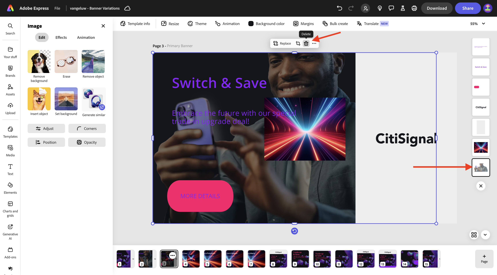

# 1.3.1 Adobe Express 시작하기

새 시크릿 브라우저 창을 열고 [https://www.adobe.com/home](https://www.adobe.com/home){target="_blank"}(으)로 이동합니다. **회사 또는 학교 계정**&#x200B;을(를) 사용하여 로그인한 다음 계정 **—aepImsOrgName—**&#x200B;을(를) 선택합니다.

Adobe Express은 조직 라이선스의 일부로 사용할 수 있습니다. Adobe Express에 액세스할 수 있도록 하려면 올바른 조직에 로그인했는지 확인해야 합니다. 이렇게 하려면 **프로필** 아이콘을 클릭하고 활성화된 계정을 확인합니다. 사용해야 하는 계정 이름이 `--aepImsOrgName--`입니다.

계정을 변경하려면 **프로필 전환**&#x200B;을 클릭하세요.

메뉴에서 올바른 계정을 선택하세요. 이 경우 **Experience Platform International**&#x200B;입니다(다른 조직일 수 있음).

올바른 계정이 활성화되면 **앱**(으)로 이동하여 **Adobe Express** 카드에서 **시작**&#x200B;을 클릭하세요.

이제 **Adobe Express**&#x200B;에 로그인되었습니다.

## 1.3.1.1 브랜드 템플릿에서 시작

Adobe Express에서 **브랜드**(으)로 이동합니다. 현재 브랜드 템플릿 라이브러리가 비어 있을 수 있습니다. CitiSignal은 이전에 브랜드 템플릿을 정의했으므로 이제 기존 템플릿을 다시 사용해야 합니다.

이렇게 하려면 [https://www.adobe.com/files/link/1c2f92cf-17bc-4d11-6031-dbd251e6cb57](https://www.adobe.com/files/link/1c2f92cf-17bc-4d11-6031-dbd251e6cb57)&#x200B;(으)로 이동하십시오.

그럼 이걸 보셔야죠 세 점 **..**&#x200B;을(를) 클릭합니다.

**복사본 만들기**&#x200B;를 선택합니다.

약 1분 후에 브랜드 템플릿의 개인 사본을 만들었다는 것을 확인하는 메시지가 표시됩니다.

Adobe Express, **브랜드**(으)로 돌아가서 페이지를 새로 고칩니다. 이제 **CitiSignal(Telco)** 브랜드 템플릿이 표시됩니다. **CitiSignal(Telco)** 브랜드 템플릿을 열려면 클릭하세요.

그런 다음 로고, 글꼴, 색상, 템플릿 등의 에셋 라이브러리가 표시됩니다.

**빠른 템플릿**(으)로 이동한 다음 클릭하여 템플릿 **배너 변형**&#x200B;을(를) 엽니다.

**새 파일 시작**&#x200B;을 클릭합니다.

그럼 이걸 보셔야죠

**Trade-up &amp; Save**&#x200B;라는 텍스트 상자를 클릭합니다. **다시 작성**&#x200B;을 선택하고 스타일을 선택한 다음 **생성**&#x200B;을 클릭합니다.

변형을 선택하고 **바꾸기**&#x200B;를 클릭합니다.

그러면 업데이트된 텍스트가 표시됩니다.

그런 다음 **자세한 정보** 텍스트를 클릭합니다.

**효과**&#x200B;를 선택하십시오.

**도형**(으)로 이동한 다음 **모두 보기**&#x200B;를 클릭합니다.

**finetune** 단추를 클릭합니다. **모양 크기**&#x200B;를 변경한 다음 색 단추를 클릭합니다.

**CitiSignal 색상 테마**&#x200B;에서 다른 색상을 선택하여 색상을 변경합니다.

그러면 변경된 버튼이 보일 거예요

그런 다음 **브랜드**(으)로 이동한 다음 **브랜드 적용**&#x200B;을 클릭합니다. 그런 다음 이미지 모양이 변경되는 것을 볼 수 있습니다.

**톱니바퀴** 아이콘을 클릭하여 **브랜드 적용** 설정을 자세히 설명합니다.

작업 중인 이미지에서 세 점 **..**&#x200B;을(를) 클릭한 다음 **복제**&#x200B;를 클릭합니다.

그러면 동일한 새 이미지가 표시됩니다. 화면 오른쪽에 있는 배경 레이어를 클릭합니다.

>[!IMPORTANT]
>
>이 연습을 완료하려면 작업 중인 AEM Assets CS Author 환경에 액세스할 수 있어야 합니다. 연습 [Adobe Experience Manager Cloud Service 및 Edge Delivery Services](./../../../modules/asset-mgmt/module2.1/aemcs.md){target="_blank"}을(를) 수행하면 이러한 환경에 액세스할 수 있습니다.

왼쪽 메뉴에서 **Assets**(으)로 이동하여 `--aepUserLdap-- - CitiSignal dev`(으)로 지정해야 하는 AEM Assets CS 저장소를 선택합니다. 그런 다음 **citisignal** 폴더로 이동합니다.

**homepage-hero-1.png** 이미지를 선택하십시오. 그러면 배경 레이어가 변경되는 것을 볼 수 있습니다.

표시된 대로 텍스트 상자를 선택하고 **다시 작성**&#x200B;을 클릭합니다. **구문 변경**&#x200B;을 선택한 다음 특정 스타일을 선택하십시오. **생성**&#x200B;을 클릭합니다.

변형을 선택하고 **바꾸기**&#x200B;를 클릭합니다.

그럼 이걸 보셔야죠 그런 다음 페이지 하단에 있는 페이지의 세 점 **..**&#x200B;을(를) 클릭하고 **복제**&#x200B;를 클릭합니다.

새로 만든 이미지에서 **미디어**(으)로 이동하여 **이미지 생성**&#x200B;을 클릭합니다.

**가로(4:3)**&#x200B;를 선택합니다.

`laser beams running through space` 프롬프트를 입력하고 **생성**&#x200B;을 클릭합니다.

그러면 Adobe Firefly에서 생성한 이미지가 표시됩니다. 이미지가 생성된 레이어는 맨 위에 있습니다.

새로 생성된 이미지를 아래로 이동하여 이전 배경 레이어 바로 위에 놓습니다.

이전 배경 레이어를 클릭하고 **삭제**&#x200B;를 선택하여 제거합니다.

전체 캔버스를 덮도록 이미지를 조정합니다.

텍스트 상자 **전환 및 저장**&#x200B;을(를) 선택하여 글꼴 색상을 **흰색**(으)로 변경합니다.

글꼴 색을 **흰색**(으)로 변경합니다.

글꼴 색상을 **white**(으)로도 변경하려면 다른 텍스트 상자를 선택하십시오.

글꼴 색을 **흰색**(으)로 변경합니다.

그런 다음 **크기 조정**&#x200B;을 클릭하고 사용자 지정 해상도 **2600** x **1080**&#x200B;을(를) 입력하십시오. **이미지 확장**&#x200B;에 대한 확인란이 선택되어 있는지 확인하십시오. **크기 조정**&#x200B;을 클릭합니다.

그럼 이걸 보셔야죠

몇 분 후에 이미지의 새로운 변형을 볼 수 있습니다. 하나를 선택한 다음 **유지**&#x200B;를 클릭합니다.

그럼 이걸 보셔야죠

사용 가능한 공간이 채워지도록 이미지를 이동하고 조정합니다.

그런 다음 **번역**&#x200B;을 클릭합니다.

**프랑스어**, **네덜란드어** 및 **스페인어** 등의 언어를 선택하십시오. 작업 중인 특정 페이지만 선택해야 합니다. 이 경우 **페이지 3**&#x200B;입니다. **번역**&#x200B;을 클릭합니다.

그러면 번역이 생성됩니다.

그런 다음 여러 새 페이지가 만들어지는 것을 볼 수 있습니다. **닫기** 아이콘을 클릭합니다.

번역을 확인하고 필요한 경우 변경합니다(예: 이 예에서 번역이 최적이 아닌 경우).

필요에 따라 텍스트를 업데이트합니다.

이제 자산이 준비되었습니다.

## 다음 단계

[Adobe Express의 애니메이션 및 비디오로 이동](./ex2.md){target="_blank"}

[Adobe Express 및 Adobe Experience Cloud](./express.md){target="_blank"}로 돌아가기

[모든 모듈](./../../../overview.md){target="_blank"}(으)로 돌아가기
