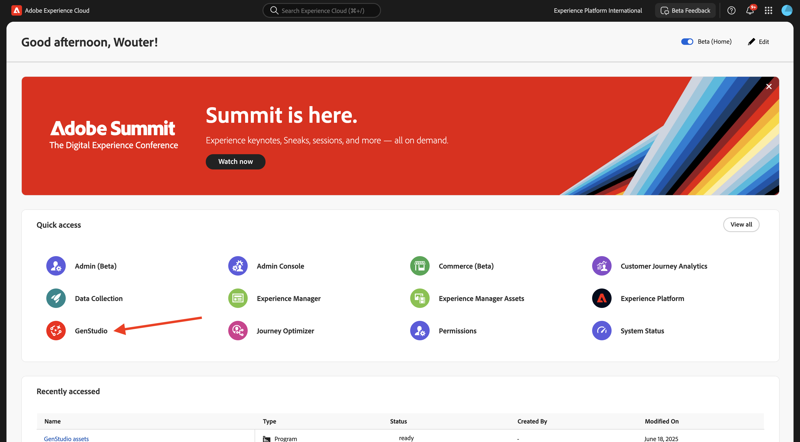
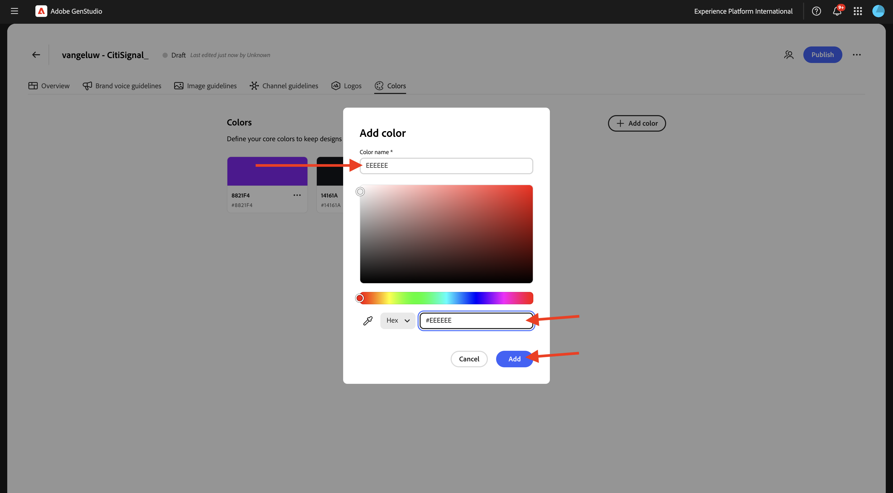
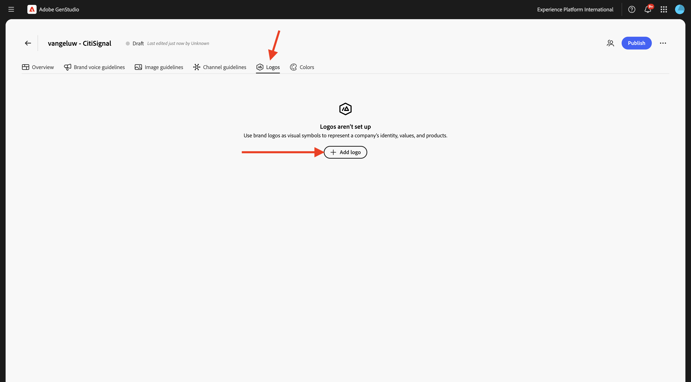
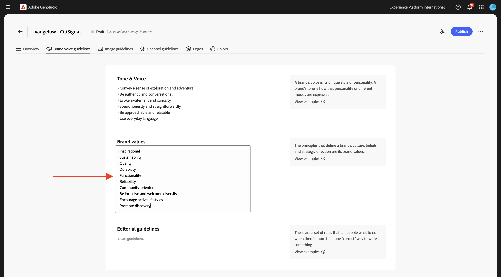

# 1.3.1 구성: 브랜드

브랜드는 조직, 제품, 서비스 또는 개념을 다른 브랜드와 구별합니다. 브랜드의 일부 측면이 로고와 같이 객관적인 반면, 다른 측면은 목소리 톤과 같이 주관적인 것입니다.

GenStudio for Performance Marketing은 브랜드의 풍부한 브랜드 정보를 사용하고 제품 및 성향 정보와 파트너 관계를 맺으며 포괄적인 브랜드 정체성을 구축합니다. 이 브랜드 정체성은 Adobe의 생성 AI 기술을 사용하여 온브랜드 콘텐츠 생성을 알리는 데 사용됩니다.

나만의 브랜드를 만들려면 아래 단계를 따르십시오.

[https://experience.adobe.com/](https://experience.adobe.com/){target="_blank"}(으)로 이동합니다. **GenStudio**&#x200B;을(를) 엽니다.



그럼 이걸 보셔야죠


GenStudio for Performance Marketing을 사용하기 위해 가장 먼저 해야 할 일은 브랜드를 구성하는 것입니다. **브랜드** 아이콘을 클릭합니다.


**+ 브랜드 추가**&#x200B;를 클릭합니다.


브랜드 이름 `--aepUserLdap-- - CitiSignal`을(를) 입력하십시오. **수동으로 추가**&#x200B;를 선택한 다음 **브랜드 추가**&#x200B;를 클릭합니다.


## 1.3.1.1색

그럼 이걸 보셔야죠 **색상**&#x200B;을 클릭하세요.


**+ 색상 추가**&#x200B;를 클릭합니다.


4가지 색상을 추가할 수 있습니다.

- `#8821F4`
- `#14161A`
- `#EEEEEE`
- `#FF006C`

`#8821F4` 색상에 대한 16진수 코드를 입력하십시오. **추가를 클릭합니다**.


**+ 색상 추가**&#x200B;를 클릭합니다.


`#14161A` 색상에 대한 16진수 코드를 입력하십시오. **추가를 클릭합니다**.


**+ 색상 추가**&#x200B;를 클릭합니다.


`#EEEEEE ` 색상에 대한 16진수 코드를 입력하십시오. **추가를 클릭합니다**.



**+ 색상 추가**&#x200B;를 클릭합니다.


`#FF006C ` 색상에 대한 16진수 코드를 입력하십시오. **추가를 클릭합니다**.


이제 이 항목을 사용할 수 있습니다.


## 1.3.1.2 로고

바탕 화면에 [CitiSignal-GSPeM-assets.zip](../../../assets/gspem/CitiSignal-GSPeM-assets.zip) 파일을 다운로드하고 압축을 풉니다.


그런 다음 **로고**(으)로 이동합니다. **+ 로고 추가**&#x200B;를 클릭합니다.



**찾아보기**&#x200B;를 클릭합니다.


**CitiSignal-GSPeM-assets** > **logos** 폴더로 이동하여 이 파일을 선택하십시오. **열기를 클릭합니다**.


그럼 이걸 드셔보세요 **로고 추가**&#x200B;를 클릭합니다.


그럼 이걸 드셔보세요


## 1.3.1.3 브랜드 음성 지침

그런 다음 **브랜드 음성 지침**(으)로 이동합니다.


**음색 및 음성**&#x200B;의 경우 다음을 사용하세요.

```
• Convey a sense of exploration and adventure
• Be authentic and conversational
• Evoke excitement and curiosity
• Speak honestly and straightforwardly
• Be approachable and relatable
• Use everyday language
```


**브랜드 값**&#x200B;의 경우 다음 항목을 사용하십시오.

```
• Inspirational
• Sustainability
• Quality
• Durability
• Functionality
• Reliability
• Community-oriented
• Be inclusive and welcome diversity
• Encourage active lifestyles
• Promote discovery
```



**편집 지침**&#x200B;의 경우 다음 항목을 사용하십시오.

```
• Keep sentences concise and impactful
• Use active voice
• Lists, bullets, and series should be consistent — either they all start with a noun, or they all start with a verb
• Use serial commas
```


**편집 제한 사항**&#x200B;의 경우 다음을 사용하십시오.

```
• Avoid activity-specific jargon unless it’s widely adopted
• Avoid promoting the skill level or experience level of the user of our outdoor equipment
• Avoid technical language or jargon
```


## 1.3.1.4 이미지 지침

그런 다음 **이미지 지침**(으)로 이동합니다.


**콘텐츠 형식**&#x200B;을(를) **Art**(으)로 설정하고 **설명**&#x200B;의 경우 다음 항목을 사용하십시오.

```
Capture candid, unposed shots of real people and futuristic animals engaging with technology in their daily lives to convey authenticity and relatability.
```


**컴포지션**&#x200B;의 경우 다음 항목을 사용하십시오.

```
Focus on the experiences, speed and emotions of using technology, rather than just the products themselves.
```


**환경**&#x200B;의 경우 다음 항목을 사용하십시오.

```
Highlight futuristic, clean, and professional settings that reflect innovation and connectivity.
```


**색상**&#x200B;의 경우 다음 항목을 사용하십시오.

```
Use a palette inspired by technology, including sleek metallics, cool purple and blue, and neutral tones.
```


**조명**&#x200B;의 경우 다음 항목을 사용하십시오.

```
Utilize bright, natural lighting to create a welcoming and dynamic atmosphere.
```


**무드**&#x200B;의 경우 다음 항목을 사용하십시오.

```
Each image should evoke a feeling of speed, innovation and being part of the future.
```


**제한**&#x200B;의 경우 다음 항목을 사용하십시오.

```
Avoid cluttered or busy backgrounds that detract from the main subject.
```


## 1.3.1.4 채널 지침

그런 다음 **채널 지침**(으)로 이동합니다.


**Email**&#x200B;의 경우 다음 값을 사용하십시오.

- **일반**

```
• Use simple, short sentences
• Be clear and concise
• Invoke a sense of adventure and exploration
```

- **제목 줄**

```
• Limit to less than 8 words
• Provide specific details about what’s inside the email
• Use sentence case
• Do not use end punctuation
```

- **사전 머리글**

```
• Limit to less than 80 characters
• Provide specific details about what’s inside the email
• Use sentence case
• Use ending punctuation
```

- **제목**

```
• Limit to less than 12 words
• Generate excitement through compelling and exciting statements
• Use sentence case
```

- **하위 헤드라인**: 지금은 비워 둡니다.

- **본문**

```
• Limit to less than 120 words
• Use bullet points for lists containing more than 3 items
• Use between 0 to 4 headings within the body to separate main ideas
• Use sentence case
• Use ending punctuation
```

- **Call-to-action(CTA)**

```
• Limit to between 1 to 3 short words
• Limit to less than 20 characters
• Use an action-oriented verb as the first word and intended action the end-user should take
• Avoid ending punctuation
• Use title case
```


**메타 광고**&#x200B;의 경우 다음 값을 사용하십시오.

- **일반**

```
• Use simple, short sentences
• Be clear and concise
• Invoke a sense of adventure and exploration
• Make product names prominent
• Use community-building concepts and language
```

- **제목**

```
• Limit  to less than 8 words
• Limit to less than 27 characters
• Make it clear what action the reader should take
• Use sentence case
• Avoid ending punctuation
```

- **본문**

```
• Limit to less than 125 characters
• Use sentence case
• Use ending punctuation
```

- **이미지 텍스트**: 지금은 비워 둡니다.


**배너 및 디스플레이 광고**&#x200B;의 경우 다음 값을 사용하십시오.

- **일반**

```
• Make readers feel inspired, interested, and sure of the next step
• Avoid word repetition
• Make product names prominent
```

- **제목**

```
• Clearly state the main benefit of the offer
• Use sentence case
• Use ending punctuation
• Limit to less than 60 characters
```

- **하위 헤드라인**: 지금은 비워 둡니다.

- **본문**

```
• Communicate the benefits of clicking into the offer
• Use sentence case
• Use ending punctuation
```

- **Call-to-action(CTA)**

```
• Limit to between 1 to 3 short words
• Limit to less than 20 characters
• Use an action-oriented verb as the first word
• Use title case
• Avoid ending punctuation
```


**LinkedIn**&#x200B;의 경우 다음 값을 사용하십시오.

- **일반**: 지금은 비워 둡니다.

- **제목**: 지금은 비워 둡니다.

- **설명**: 지금은 비워 둡니다.

- **소개 텍스트**: 지금은 비워 둡니다.

- **이미지 텍스트**: 지금은 비워 둡니다.


마지막으로 **개요**(으)로 이동합니다. 이제 구성한 모든 항목에 대한 개요를 볼 수 있습니다. 마지막으로 할 일이 하나 있어 **이 브랜드를 사용할 때**&#x200B;에서 **+ 추가**&#x200B;를 클릭합니다.


아래 텍스트를 입력하고 **변경 내용 저장**&#x200B;을 클릭합니다.

```
This is the default brand for CitiSignal marketing campaign. Use the CitiSignal brand for all brand and product campaigns that don't require specific guidelines.
```


**게시**&#x200B;를 클릭합니다.


**게시**&#x200B;를 다시 클릭합니다.


이제 브랜드가 게시되었으며 이 브랜드를 사용하여 브랜드 콘텐츠를 만들 수 있습니다. **완료**&#x200B;를 클릭합니다.


## 다음 단계

[구성: 가상 사용자, 제품 및 템플릿](./ex2.md){target="_blank"}(으)로 이동

[GenStudio for Performance Marketing](./genstudio.md){target="_blank"}로 돌아가기

[모든 모듈](./../../../overview.md){target="_blank"}(으)로 돌아가기
