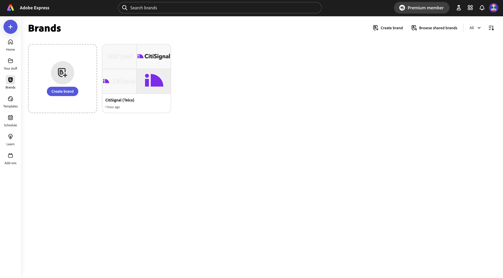
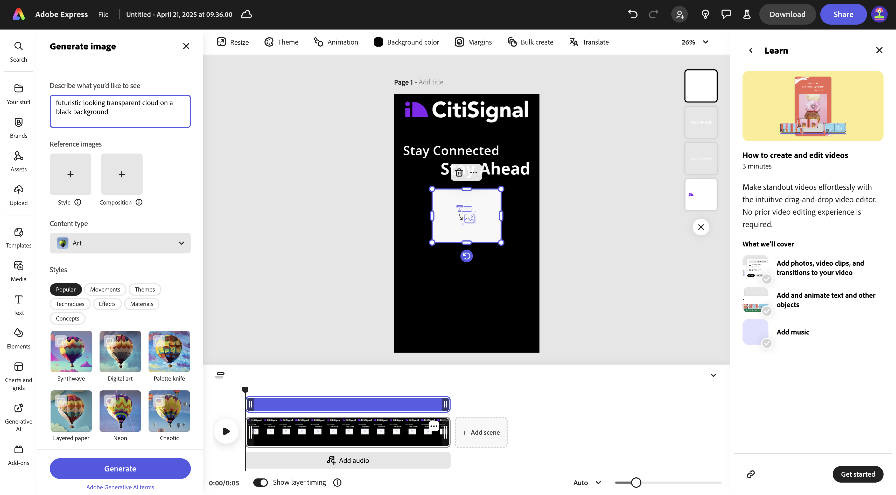
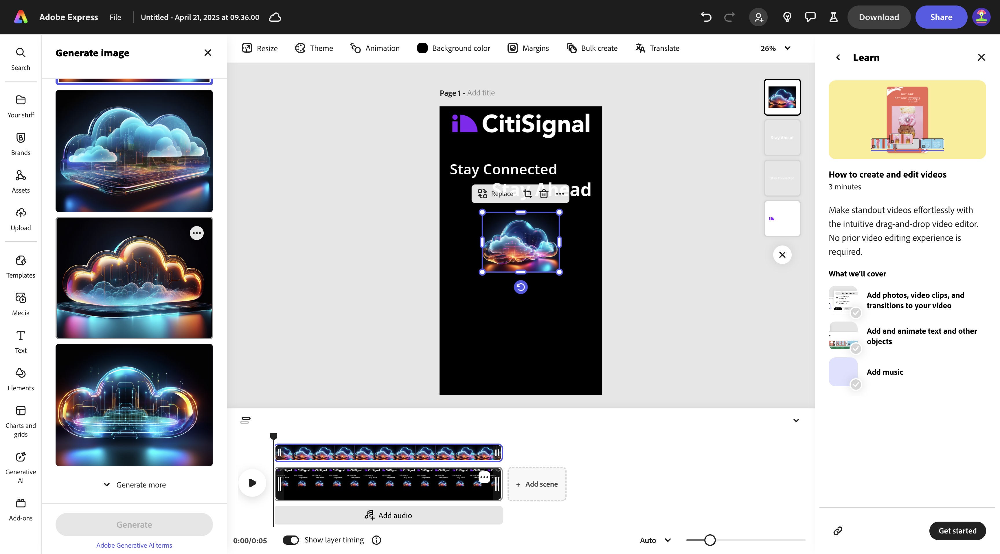
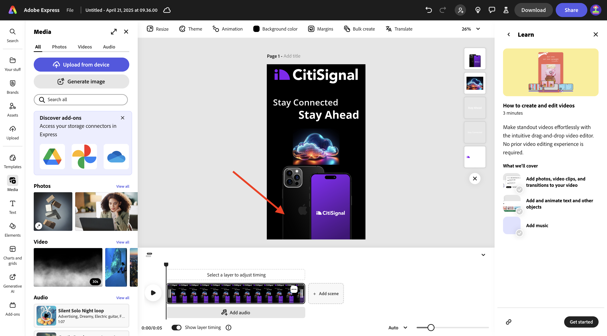
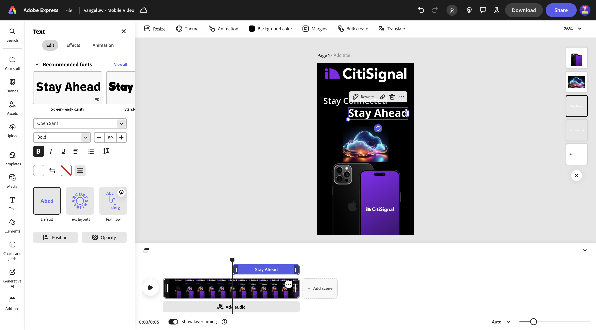
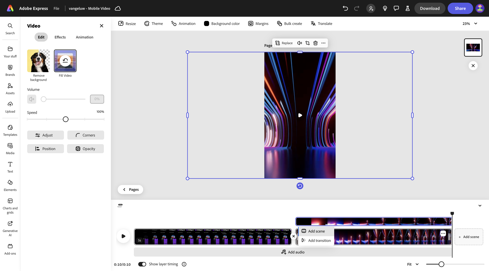
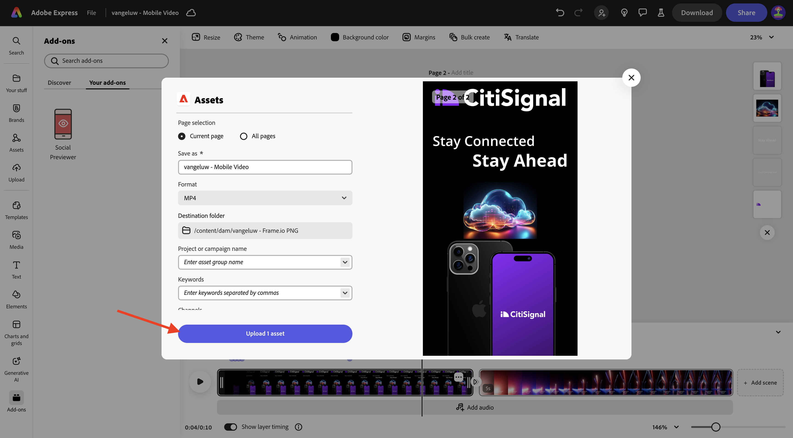
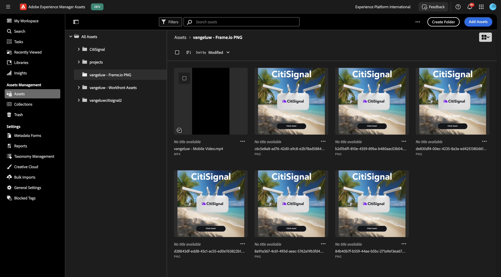
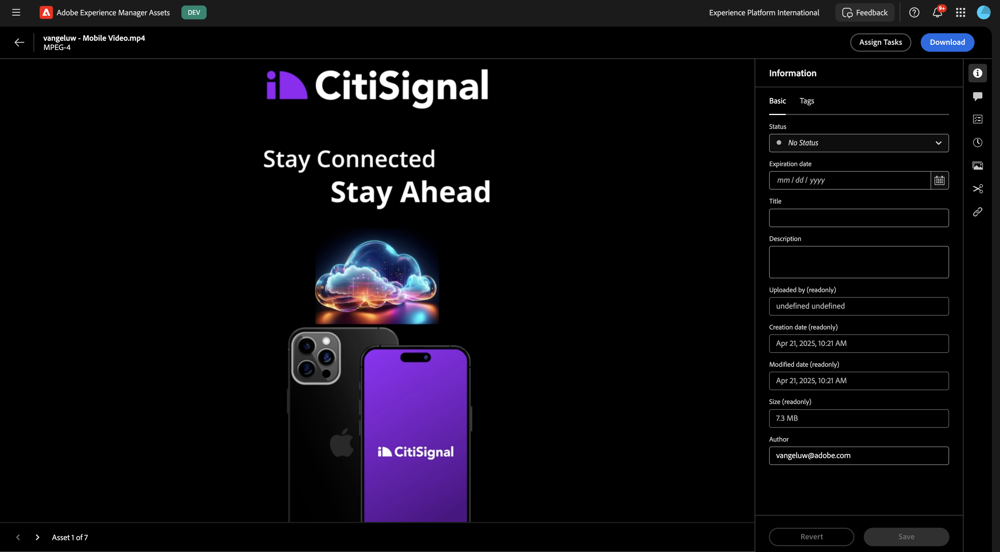

# 1.3.2 Adobe Express의 애니메이션 및 비디오

이 연습을 시작하기 전에 [https://tech-insiders.s3.us-west-2.amazonaws.com/one-adobe/Adobe_Express.zip](https://tech-insiders.s3.us-west-2.amazonaws.com/one-adobe/Adobe_Express.zip){target="_blank"}에서 필요한 자산을 다운로드하고 바탕 화면에서 압축을 풉니다.

## 1.3.2.1 비디오 만들기

[https://new.express.adobe.com/](https://new.express.adobe.com/){target="_blank"}(으)로 이동합니다. 새 **이미지**&#x200B;을(를) 만들려면 **+** 아이콘을 클릭하십시오.

**비디오**(으)로 이동한 다음 **모바일 비디오**&#x200B;를 선택합니다.

그럼 이걸 보셔야죠

**배경색**&#x200B;을 선택한 다음 **검정**&#x200B;을 선택하세요.

그런 다음 **CitiSignal** 로고를 추가해야 합니다. **브랜드**(으)로 이동하여 흰색 CitiSignal 로고를 선택하십시오. 세 점 **..**&#x200B;을(를) 클릭하고 **배치**&#x200B;를 선택합니다.

이미지 맨 위에 CitiSignal 로고를 가운데에 맞춥니다.

**텍스트**(으)로 이동한 다음 **텍스트 추가**&#x200B;를 선택합니다.

텍스트 `Stay Connected`을(를) 입력하고 아래 그림과 같이 유사한 위치에 텍스트 상자를 배치합니다.

**텍스트**(으)로 이동한 다음 **텍스트 추가**&#x200B;를 선택합니다. `Stay Ahead` 텍스트를 입력하십시오.

텍스트 상자를 아래 이미지에 표시된 것과 유사한 위치에 배치합니다.

**연결 유지** 텍스트가 있는 첫 번째 텍스트 상자를 선택합니다. **브랜드**, **글꼴**(으)로 이동합니다. 첫 번째 글꼴에서 세 점 **..**&#x200B;을(를) 클릭하고 **적용**&#x200B;을 클릭합니다.

**계속 앞으로** 텍스트가 있는 두 번째 텍스트 상자를 선택합니다. **브랜드**, **글꼴**(으)로 이동합니다. 세 번째 글꼴에서 세 점 **..**&#x200B;을(를) 클릭하고 **적용**&#x200B;을 클릭합니다.

그럼 이걸 보셔야죠 **미디어**(으)로 이동하여 **이미지 생성**&#x200B;을 선택합니다.

`futuristic looking transparent cloud on a black background` 프롬프트를 입력하고 **생성**&#x200B;을 클릭합니다.

**가로(4:3)**&#x200B;를 선택합니다.

그럼 이걸 보셔야죠 변형 중 하나를 선택합니다.

생성된 이미지를 가운데로 맞춥니다. **미디어**(으)로 이동한 다음 **장치에서 업로드**&#x200B;를 클릭합니다.

이전에 다운로드한 자산이 포함된 **Adobe_Express** 폴더로 이동하여 바탕 화면으로 이동합니다. **CitiSignalPhoneLogo.png** 파일을 선택하고 **열기**&#x200B;를 클릭합니다.

그럼 이걸 보셔야죠

아래 이미지와 비슷하게 보이도록 이미지를 아래로 드래그합니다.

프로젝트 이름을 `--aepUserLdap-- - Mobile Video`(으)로 변경합니다.

**애니메이션**(으)로 이동한 다음 **글라이드** 애니메이션을 클릭합니다.

**재생** 아이콘을 클릭하여 애니메이션을 테스트합니다.

텍스트 상자 **미리 보기**&#x200B;를 선택합니다.

텍스트 상자 **계속 진행하기**&#x200B;에 대한 타임라인 슬라이더를 조정하여 중간에 시작하도록 합니다.

**CitiSignal** 로고를 선택하십시오.

**슬라이드** 작업에서 세부 설정을 열고 기간을 2.5초로 변경합니다.

그런 다음 **다운로드**&#x200B;를 클릭합니다. **파일 형식** **MP4**&#x200B;을(를) 선택하고 **비디오 해상도**&#x200B;을(를) **1080p**(으)로 설정합니다. **다운로드**&#x200B;를 클릭합니다.

그러면 비디오 파일이 생성되고 컴퓨터에 다운로드됩니다. 이제 첫 번째 비디오가 준비되었습니다.

## 1.3.2.2 내 비디오에 추가

**타임라인** 보기를 닫습니다.

세 점 **..**&#x200B;을(를) 클릭하고 **복제**&#x200B;를 선택합니다.

그러면 새 페이지가 생성됩니다. 새 페이지로 작업하려면 **타임라인 편집**&#x200B;을 클릭하세요.

**+ 장면 추가**&#x200B;를 클릭합니다.

그러면 새 장면이 추가되는 것을 볼 수 있습니다.

이전에 다운로드한 자산이 포함된 **Adobe_Express** 폴더로 이동하여 바탕 화면으로 이동합니다. **`AdobeStock_648887461_trimmed.mp4`** 파일을 선택하고 **열기**&#x200B;를 클릭합니다.

그러면 비디오 파일이 새 장면에 추가됩니다.

두 장면 사이의 가운데를 클릭한 다음 **전환 추가**&#x200B;를 선택합니다.

**검정으로 이동**&#x200B;을 클릭합니다.

**기간**&#x200B;을 2초로 변경합니다. **재생** 단추를 클릭하여 전환을 테스트해 보십시오.

**텍스트**(으)로 이동한 다음 **텍스트 추가**&#x200B;를 클릭합니다.

`with lightning fast speed from CitiSignal` 텍스트를 입력하십시오. **가운데 정렬**&#x200B;을 클릭하여 텍스트를 가운데로 정렬합니다.

글꼴 크기를 **60**(으)로 변경합니다.

## Adobe Express에서 1.3.2.3 추가 기능 사용

**추가 기능**(으)로 이동하여 추가 기능 **소셜 미리 보기**&#x200B;를 검색합니다.

추가 기능을 추가하려면 **+ 추가**&#x200B;를 클릭하십시오.

추가 기능 **소셜 미리 보기**&#x200B;를 선택하고 **Instagram 게시물** 미리 보기 옵션을 클릭합니다. 이제 가장 일반적인 소셜 미디어 플랫폼에서 게시물이 어떻게 표시되는지 쉽게 미리 볼 수 있습니다.

## 1.3.2.4 Adobe Express에서 새 템플릿 만들기

**공유** 단추를 클릭한 다음 **템플릿 만들기**&#x200B;를 선택합니다.

`--aepUserLdap-- - Mobile Video` 이름을 사용하고 **CitiSignal(Telco)** 브랜드를 선택한 다음 **템플릿 저장**&#x200B;을(를) 클릭합니다.

이제 비디오 템플릿이 브랜드 템플릿에 저장됩니다.

## 1.3.2.5 AEM Assets CS에서 비디오를 저장합니다.

**공유**&#x200B;를 다시 클릭한 다음 **클라우드에 저장**&#x200B;을 선택합니다. **AEM Assets**&#x200B;을(를) 선택합니다.

**현재 페이지**&#x200B;를 선택하십시오. 이름 `--aepUserLdap-- - Mobile Video`을(를) 사용한 다음 **폴더 선택**&#x200B;을 클릭합니다.

**`--aepUserLdap-- - Frame.io PNG`** 폴더를 선택하고 **선택**&#x200B;을 클릭합니다.

**1개 에셋 업로드**&#x200B;를 클릭합니다.

[https://experience.adobe.com/](https://experience.adobe.com/){target="_blank"}(으)로 이동하여 **Experience Manager Assets**&#x200B;을(를) 클릭합니다.

`--aepUserLdap-- - Citi Signal dev`(이)라는 이름을 지정해야 하는 AEM Assets CS 환경을 선택하십시오.

**Assets**&#x200B;에서 **`--aepUserLdap-- - Frame.io PNG`** 폴더로 이동합니다. 자산을 열려면 **`--aepUserLdap-- - Mobile Video`** 자산을 두 번 클릭하십시오.

Adobe Express에서 만든 비디오를 이제 Adobe Experience Manager Assets에서 사용할 수 있습니다.

## 다음 단계

[Adobe Express에서 Assets 대량 만들기](./ex3.md){target="_blank"}(으)로 이동

[Adobe Express 및 Adobe Experience Cloud](./express.md){target="_blank"}로 돌아가기

[모든 모듈](./../../../overview.md){target="_blank"}(으)로 돌아가기
