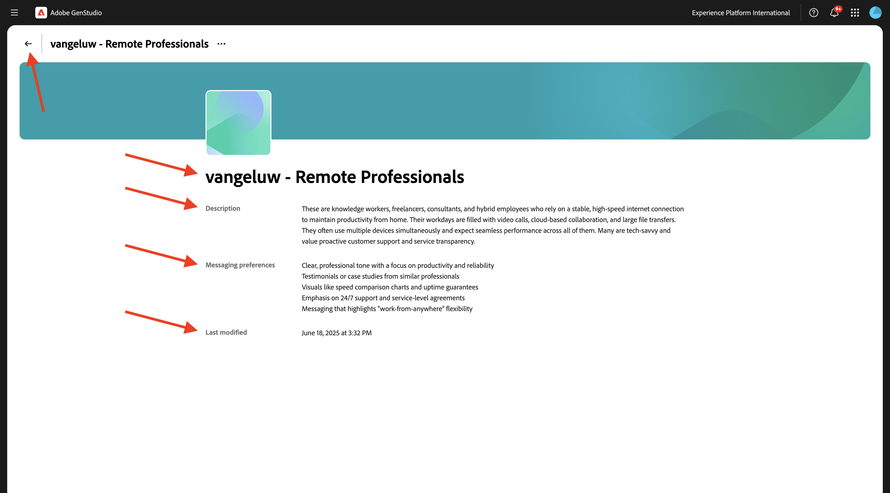
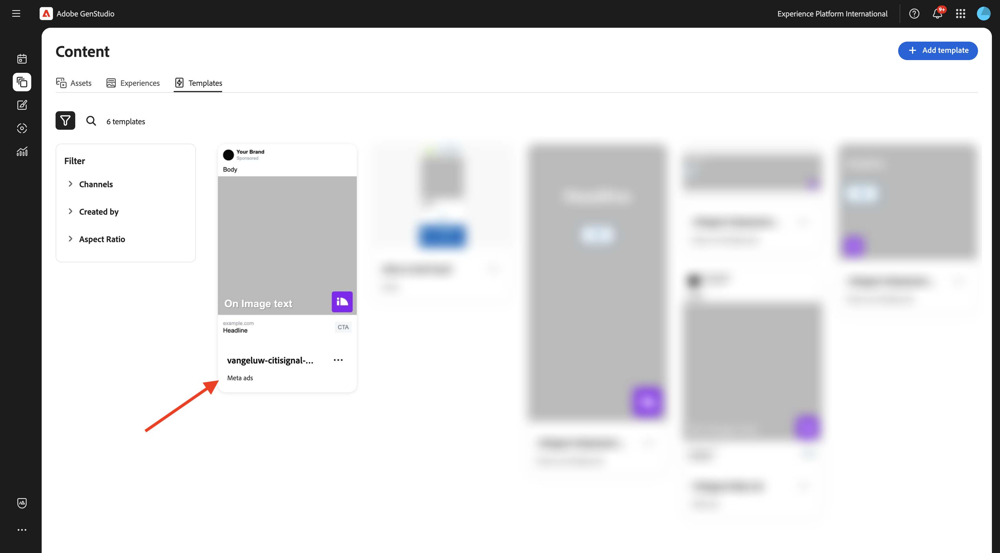
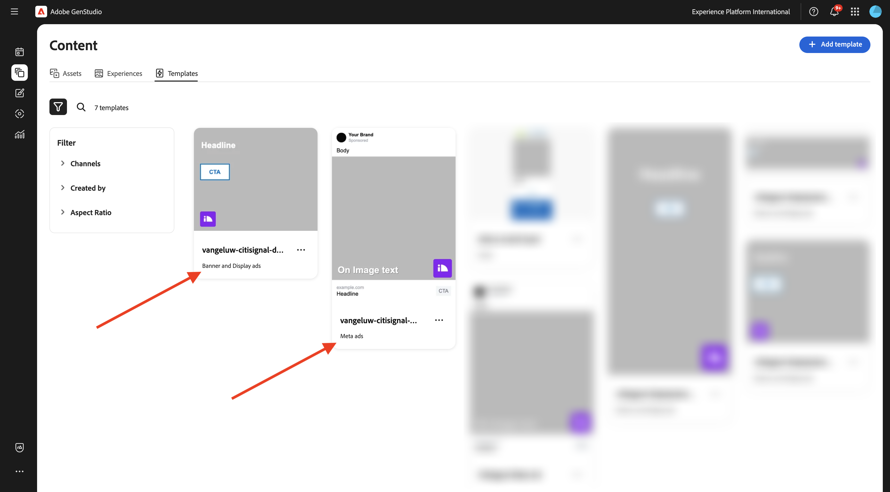
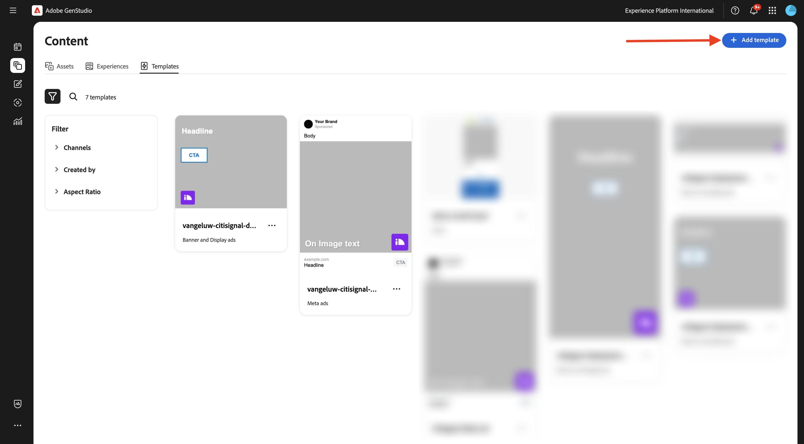

# 1.3.2 구성: 가상 사용자, 제품 및 템플릿

이 연습에서는 GenStudio for Performance Marketing에서 가상 사용자, 제품 및 템플릿을 구성합니다.

## 1.3.2.1개 제품

GenStudio for Performance Marketing의 제품은 제품 사양, 장점 및 차별화 요소에 대한 깊은 이해를 활용하여 효과적인 콘텐츠를 생성합니다.

제품은 이미지, 설명 및 가치 제안 등 특정 제품의 모든 요소를 포괄하여 일관된 브랜드 표현을 만듭니다. Adobe의 고급 AI 기술을 활용하는 GenStudio for Performance Marketing 지침(브랜드, 제품 및 가상 사용자)은 함께 작동하여 제품의 강점을 보여주고 모든 메시지에서 일관성을 보장하는 매력적인 콘텐츠를 생성합니다.

제품 만들기를 시작하려면 세 점 **..**&#x200B;을(를) 클릭한 다음 **제품**&#x200B;을(를) 선택하십시오.


**+ 제품 추가**&#x200B;를 클릭합니다.


**수동으로 추가**&#x200B;를 선택하고 **계속**&#x200B;을 클릭합니다.


그럼 이걸 보셔야죠


제품 이름은 `--aepUserLdap-- - CitiSignal Mobile Flex Plan`을(를) 참조하십시오.

필드 **설명**&#x200B;에 대해 다음 항목을 사용하십시오.

```
CitiSignal Mobile Flex is a next-gen 5G mobile plan that adapts to your lifestyle. Choose from Unlimited, Family Share, or Data Saver tiers, with optional add-ons like international roaming, hotspot tethering, and SmartFamily™ parental controls. All plans include priority access to CitiSignal’s 5G UltraWide network and seamless integration with CitiSignal Fiber for unified billing, shared data pools, and SmartSwitch™ connectivity. 
```

필드 **값 제안**&#x200B;에 대해 다음을 사용하십시오.

```
A mobile plan that flexes with your life—fast, fair, and fully connected to your world.
```

필드 **메시징 환경 설정**&#x200B;에 대해 다음을 사용하십시오.

```
Remote Professionals: “Work from anywhere with a mobile plan that’s as flexible as your schedule.”
Online Gamers: “Unlimited 5G. No throttling. Just pure performance—on the go.”
Smart Home Families: “One plan. One bill. One less thing to worry about.”
```

이제 제품 구성은 다음과 같아야 합니다. **뒤로** 아이콘을 클릭합니다.


**+ 제품 추가**&#x200B;를 클릭합니다.


**수동으로 추가**&#x200B;를 선택하고 **계속**&#x200B;을 클릭합니다.


그럼 이걸 보셔야죠


제품 이름은 `--aepUserLdap-- - CitiSignal Fiber Max`을(를) 참조하십시오.

필드 **설명**&#x200B;에 대해 다음 항목을 사용하십시오.

```
CitiSignal Fiber Max is our premium residential internet plan, engineered for households that demand uncompromising speed, stability, and coverage. With symmetrical speeds up to 2 Gbps, it’s ideal for remote professionals juggling Zoom calls and cloud apps, gamers chasing millisecond precision, and families running dozens of smart devices. The plan includes a Wi-Fi 6E router, optional mesh extenders for whole-home coverage, and proactive network monitoring. 
```

필드 **값 제안**&#x200B;에 대해 다음을 사용하십시오.

```
Power your work, play, and home with the fastest, most reliable fiber internet—built for the way you live today and tomorrow.
```

필드 **메시징 환경 설정**&#x200B;에 대해 다음을 사용하십시오.

```
Remote Professionals: “Stay connected, stay productive—no matter how many meetings or megabytes your day demands.”
Online Gamers: “Zero lag. Zero mercy. Dominate with 2 Gbps fiber and ultra-low ping.”
Smart Home Families: “Every room. Every device. Always on. Welcome to whole-home harmony.”
```

이제 제품 구성은 다음과 같아야 합니다. **뒤로** 아이콘을 클릭합니다.


그러면 구성한 2개의 제품이 표시됩니다.


## 1.3.2.2명의 가상 사용자

가상 사용자는 정보, 관심사, 불만 사항, 환경 설정 및 행동 트레이트를 포함하여 고객 세그먼트에 대한 실제 묘사를 제공합니다.

GenStudio for Performance Marketing은 지침(브랜드, 제품 및 가상 사용자)의 힘과 Adobe의 생성 AI 기술을 활용하여 대상 고객을 위한 개인화된 마케팅 콘텐츠를 선별합니다&#x200B;.

가상 사용자를 만들려면 세 점 **..**&#x200B;을(를) 클릭한 다음 **가상 사용자**&#x200B;를 선택하십시오.


**+ 사용자 추가**&#x200B;를 클릭합니다.


**수동으로 추가**&#x200B;를 선택하고 **계속**&#x200B;을 클릭합니다.


그럼 이걸 보셔야죠


사용자 이름은 `--aepUserLdap-- - Smart Home Families`입니다.

필드 **설명**&#x200B;에 대해 다음 항목을 사용하십시오.

```
These are tech-forward households with multiple connected devices—smart TVs, thermostats, security systems, voice assistants, and more. They value convenience, automation, and seamless connectivity across the home. They often have children and are concerned about online safety, parental controls, and whole-home coverage.
```

필드 **메시징 환경 설정**&#x200B;에 대해 다음을 사용하십시오.

```
Friendly, family-oriented tone
Visuals showing whole-home coverage and device compatibility
Messaging that highlights security, parental controls, and easy setup
Bundled offers (e.g., mesh Wi-Fi, smart home consultations)
How-to content or setup guides for non-tech-savvy users
```

이제 사용자 구성은 다음과 같아야 합니다. **뒤로** 아이콘을 클릭합니다.


**+ 사용자 추가**&#x200B;를 클릭합니다.


**수동으로 추가**&#x200B;를 선택하고 **계속**&#x200B;을 클릭합니다.


그럼 이걸 보셔야죠


사용자 이름은 `--aepUserLdap-- - Online Gamers`입니다.

필드 **설명**&#x200B;에 대해 다음 항목을 사용하십시오.

```
This persona includes competitive and casual gamers who demand ultra-fast, low-latency internet. They often stream gameplay, participate in multiplayer matches, and use voice chat platforms. They are highly sensitive to lag, jitter, and packet loss, and they’re vocal about their experiences online. Many are early adopters of new tech and value performance above all else.
```

필드 **메시징 환경 설정**&#x200B;에 대해 다음을 사용하십시오.

```
Bold, energetic tone with gaming lingo
Metrics like ping time, jitter, and upload/download speeds
Visuals showing latency improvements or side-by-side comparisons
Endorsements from gaming influencers or esports teams
Promotions tied to gaming platforms or bundles (e.g., free months of Xbox Game Pass)
```

이제 사용자 구성은 다음과 같아야 합니다. **뒤로** 아이콘을 클릭합니다.


**+ 사용자 추가**&#x200B;를 클릭합니다.


**수동으로 추가**&#x200B;를 선택하고 **계속**&#x200B;을 클릭합니다.


그럼 이걸 보셔야죠


사용자 이름은 `--aepUserLdap-- - Remote Professionals`입니다.

필드 **설명**&#x200B;에 대해 다음 항목을 사용하십시오.

```
These are knowledge workers, freelancers, consultants, and hybrid employees who rely on a stable, high-speed internet connection to maintain productivity from home. Their workdays are filled with video calls, cloud-based collaboration, and large file transfers. They often use multiple devices simultaneously and expect seamless performance across all of them. Many are tech-savvy and value proactive customer support and service transparency.
```

필드 **메시징 환경 설정**&#x200B;에 대해 다음을 사용하십시오.

```
Clear, professional tone with a focus on productivity and reliability
Testimonials or case studies from similar professionals
Visuals like speed comparison charts and uptime guarantees
Emphasis on 24/7 support and service-level agreements
Messaging that highlights “work-from-anywhere” flexibility
```

이제 사용자 구성은 다음과 같아야 합니다. **뒤로** 아이콘을 클릭합니다.



그러면 구성한 3개의 가상 사용자가 표시됩니다.


## 템플릿 1.3.2.3개

GenStudio for Performance Marketing을 통해 콘텐츠 작성자는 템플릿을 사용하여 일관된 온브랜드 마케팅 콘텐츠를 신속하게 제작할 수 있습니다. 템플릿은 사전 구성된 레이아웃 및 디자인 요소를 포함하는 시작점을 제공하여 새 콘텐츠를 생성하는 데 필요한 시간과 노력을 크게 줄입니다.

GenStudio for Performance Marketing에서는 애플리케이션 내에서 템플릿을 직접 만들 수 없지만 Adobe InDesign, Illustrator 또는 Express와 같이 인기 있는 디자인 도구를 사용하여 템플릿을 쉽게 디자인하고 준비할 수 있습니다. 디자인이 완료되면 GenStudio for Performance Marketing에서 사용하도록 조정할 수 있습니다. 이 연습에서는 사전 정의된 여러 템플릿을 GenStudio for Performance Marketing으로 가져옵니다.

이전 연습에서는 바탕 화면에 [CitiSignal-GSPeM-assets.zip](../../../assets/gspem/CitiSignal-GSPeM-assets.zip) 파일을 다운로드하고 압축을 풀었습니다. 해당 폴더에는 이제 GenStudio에서 가져와야 하는 4개의 샘플 템플릿이 포함되어 있습니다.


**콘텐츠** > **템플릿**(으)로 이동합니다. **+ 템플릿 추가**&#x200B;를 클릭합니다.


**메타 광고**&#x200B;를 선택한 다음 **찾아보기**&#x200B;를 클릭합니다.


다운로드한 **CitiSignal-GSPeM-assets** 파일이 포함된 폴더에서 **템플릿** 폴더로 이동합니다. **citisignal-meta-ad.html** 파일을 선택하고 **열기**&#x200B;를 클릭합니다.


그럼 이걸 보셔야죠 **다음**&#x200B;을 클릭합니다.


**다음**&#x200B;을 클릭합니다.


필드 **템플릿 이름**&#x200B;에 사용:
`--aepUserLdap---citisignal-meta-ad`을(를) 설정하고 종횡비를 **1:1**(으)로 설정합니다. **템플릿 게시**&#x200B;를 클릭합니다.


템플릿이 저장되었으며 템플릿 라이브러리에서 사용할 수 있습니다.



**+ 템플릿 추가**&#x200B;를 클릭합니다.


**배너 및 디스플레이 광고**&#x200B;를 선택한 다음 **찾아보기**&#x200B;를 클릭합니다.


다운로드한 **CitiSignal-GSPeM-assets** 파일이 포함된 폴더에서 **템플릿** 폴더로 이동합니다. **citisignal-displaytemplate-300x250.html** 파일을 선택하고 **열기**&#x200B;를 클릭합니다.


그럼 이걸 보셔야죠 **다음**&#x200B;을 클릭합니다.


**다음**&#x200B;을 클릭합니다.


필드 **템플릿 이름**&#x200B;에 사용:
`--aepUserLdap---citisignal-displaytemplate-300x250`을(를) 설정하고 **광고 너비** 및 **광고 높이**&#x200B;을(를) **300x250**(으)로 설정합니다. **템플릿 게시**&#x200B;를 클릭합니다.


템플릿이 저장되었으며 템플릿 라이브러리에서 사용할 수 있습니다.



**+ 템플릿 추가**&#x200B;를 클릭합니다.



**배너 및 디스플레이 광고**&#x200B;를 선택한 다음 **찾아보기**&#x200B;를 클릭합니다.


다운로드한 **CitiSignal-GSPeM-assets** 파일이 포함된 폴더에서 **템플릿** 폴더로 이동합니다. **citisignal-displaytemplate-300x600.html** 파일을 선택하고 **열기**&#x200B;를 클릭합니다.


그럼 이걸 보셔야죠 **다음**&#x200B;을 클릭합니다.


**다음**&#x200B;을 클릭합니다.


필드 **템플릿 이름**&#x200B;에 사용:
`--aepUserLdap---citisignal-displaytemplate-300x600`을(를) 설정하고 **광고 너비** 및 **광고 높이**&#x200B;을(를) **300x600**(으)로 설정합니다. **템플릿 게시**&#x200B;를 클릭합니다.


템플릿이 저장되었으며 템플릿 라이브러리에서 사용할 수 있습니다.


**+ 템플릿 추가**&#x200B;를 클릭합니다.


**배너 및 디스플레이 광고**&#x200B;를 선택한 다음 **찾아보기**&#x200B;를 클릭합니다.


다운로드한 **CitiSignal-GSPeM-assets** 파일이 포함된 폴더에서 **템플릿** 폴더로 이동합니다. **citisignal-displaytemplate-970x250.html** 파일을 선택하고 **열기**&#x200B;를 클릭합니다.


그럼 이걸 보셔야죠 **다음**&#x200B;을 클릭합니다.


**다음**&#x200B;을 클릭합니다.


필드 **템플릿 이름**&#x200B;에 사용:
`--aepUserLdap---citisignal-displaytemplate-970x250`을(를) 설정하고 **광고 너비** 및 **광고 높이**&#x200B;을(를) **970x250**(으)로 설정합니다. **템플릿 게시**&#x200B;를 클릭합니다.


템플릿이 저장되었으며 템플릿 라이브러리에서 사용할 수 있습니다.


이제 다음 연습에 필요한 템플릿을 구성했습니다.

## 다음 단계

[메타로 캠페인 활성화](./ex3.md){target="_blank"}(으)로 이동

[GenStudio for Performance Marketing](./genstudio.md){target="_blank"}로 돌아가기

[모든 모듈](./../../../overview.md){target="_blank"}(으)로 돌아가기
