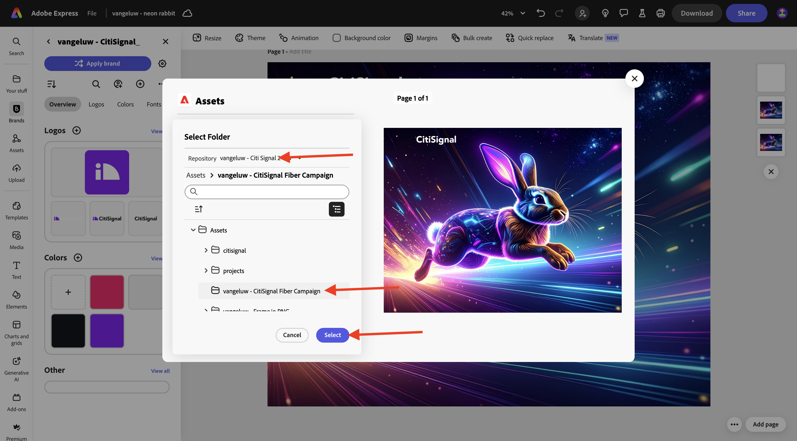
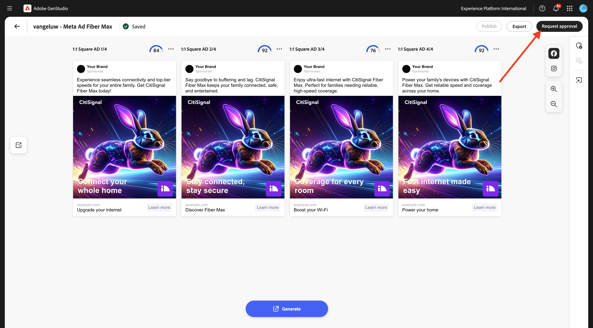
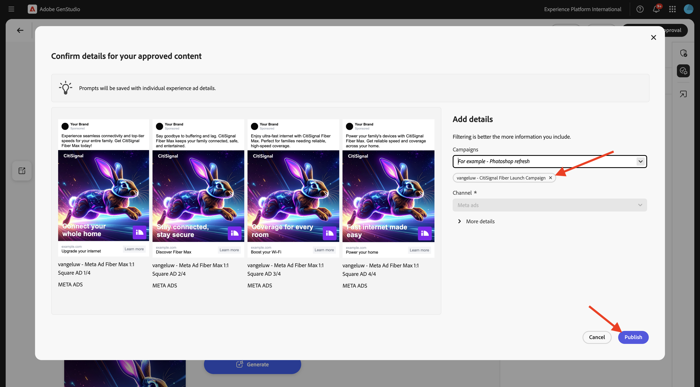
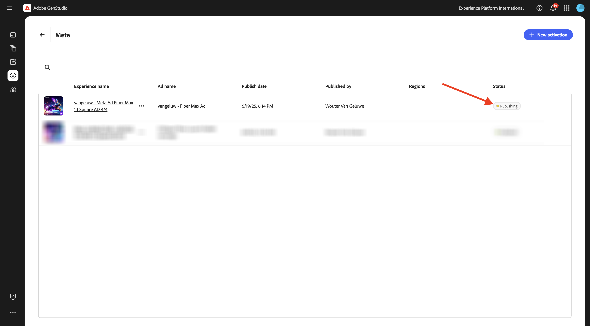

# 1.3.3 메타로 Campaign 활성화

>[!IMPORTANT]
>
>이 연습을 완료하려면 AEM Content Hub이 활성화된 작동 중인 AEM Assets CS 작성 환경에 액세스할 수 있어야 합니다. 연습 [Adobe Experience Manager Cloud Service 및 Edge Delivery Services](./../../../modules/asset-mgmt/module2.1/aemcs.md){target="_blank"}을(를) 수행하면 이러한 환경에 액세스할 수 있습니다.

>[!IMPORTANT]
>
>이 연습의 모든 단계를 실행하려면 기존 Adobe Workfront 환경에 액세스할 수 있어야 하며 해당 환경에서는 프로젝트 및 승인 워크플로우를 만들어야 합니다. [Adobe Workfront을 통한 워크플로우 관리](./../../../modules/asset-mgmt/module2.2/workfront.md){target="_blank"} 연습을 수행하면 필요한 설정을 사용할 수 있습니다.

>[!IMPORTANT]
>
>이전에 작성자 및 AEM Assets 환경으로 AEM Assets CS 프로그램을 구성한 경우 AEM CS 샌드박스가 최대 절전 모드일 수 있습니다. 이러한 샌드박스의 최대 절전 모드 해제 시간이 10~15분 정도 걸리는 점을 감안할 때, 나중에 최대 절전 모드 해제 프로세스를 기다릴 필요가 없도록 지금 시작하는 것이 좋습니다.

## 1.3.3.1 캠페인 만들기

**GenStudio for Performance Marketing**&#x200B;에서 왼쪽 메뉴의 **캠페인**(으)로 이동합니다. **+ 캠페인 추가**&#x200B;를 클릭합니다.


그러면 빈 캠페인 개요가 표시됩니다.


필드 이름은 `--aepUserLdap-- - CitiSignal Fiber Launch Campaign`을(를) 사용합니다.

필드 **설명**&#x200B;에 대해 아래 텍스트를 사용하십시오.

```
The CitiSignal Fiber Launch campaign introduces CitiSignal’s flagship fiber internet service—CitiSignal Fiber Max—to key residential markets. This campaign is designed to build awareness, drive sign-ups, and establish CitiSignal as the go-to provider for ultra-fast, reliable, and future-ready internet. The campaign will highlight the product’s benefits for remote professionals, online gamers, and smart home families, using persona-driven messaging across digital and physical channels.
```

필드 **목표**&#x200B;에 대해 아래 텍스트를 사용하십시오.

```
Generate brand awareness in target regions
Drive early sign-ups and pre-orders for CitiSignal Fiber Max
Position CitiSignal as a premium, customer-first fiber internet provider
Educate consumers on the benefits of fiber over cable or DSL
```

필드 **키 메시지**&#x200B;에 대해 아래 텍스트를 사용하십시오.

```
Supporting Points:
Symmetrical speeds up to 2 Gbps
Whole-home Wi-Fi 6E coverage
99.99% uptime guarantee
24/7 concierge support
No data caps or throttling
 Channels:
Digital Advertising: Google Display, YouTube pre-roll, Meta (Facebook/Instagram), TikTok (for gamers)
Email Marketing: Persona-segmented drip campaigns
Social Media: Organic and paid posts with testimonials, speed demos, and influencer partnerships
Out-of-Home (OOH): Billboards, transit ads in suburban commuter corridors
Local Events: Pop-up booths at tech expos, family festivals, and gaming tournaments
Direct Mail: Personalized flyers with QR codes for early sign-up discounts
 
Target Regions:
Primary Launch Markets:
Denver Metro Area, CO
Austin, TX
Raleigh-Durham, NC
Salt Lake City, UT
Demographic Focus:
Suburban neighborhoods with high remote work density
Areas with high smart home adoption
Zip codes with underserved or dissatisfied cable customers
```

그러면 다음 항목이 표시됩니다.


아래로 스크롤하여 더 많은 필드 보기:


필드 **시작**&#x200B;의 경우 오늘 날짜로 설정하십시오.

필드 **End**&#x200B;의 경우 지금부터 1개월 후의 날짜로 설정하십시오.

필드 **Status**&#x200B;의 경우 **Active**(으)로 설정하십시오.

필드 **채널**&#x200B;의 경우 **Meta**, **Email**, **유료 미디어**, **디스플레이**(으)로 설정하십시오.

**지역** 필드에 대해 선택한 지역을 선택하십시오.

필드 **참조** > **제품**&#x200B;에 대한 필드: 제품 `--aepUserLdap-- - CitiSignal Fiber Max`을(를) 선택하십시오.

**참조** > **가상 사용자**: 가상 사용자 `--aepUserLdap-- - Remote Professionals`, `--aepUserLdap-- - Online Gamers`, `--aepUserLdap-- - Smart Home Families` 선택

그런 다음 이 메시지가 표시됩니다.


이제 캠페인이 준비되었습니다. 돌아가려면 **화살표**&#x200B;를 클릭하십시오.


그러면 목록에 캠페인이 표시됩니다. 달력 보기 아이콘을 클릭하여 보기를 캠페인 달력으로 변경합니다.


그런 다음 활성화된 캠페인에 대한 보다 시각적 아이디어를 제공하는 캠페인 캘린더가 표시됩니다.


## 메타에 대한 1.3.3.2 설치 연결

>[!IMPORTANT]
>
>메타에 대한 연결을 설정하려면 사용 가능한 메타 사용자 계정이 있어야 하며 해당 사용자 계정을 메타 비즈니스 계정에 추가해야 합니다.

메타에 대한 연결을 설정하려면 세 점 **..**&#x200B;을(를) 클릭하고 **설정**&#x200B;을(를) 선택하십시오.


**메타 광고**&#x200B;에 대해 **연결**&#x200B;을 클릭합니다.


메타 계정을 사용하여 로그인합니다. **계속을 클릭합니다**.


계정이 Meta 비즈니스 계정에 연결되어 있으면 Meta에 구성된 비즈니스 포트폴리오를 선택할 수 있습니다.


연결이 성공적으로 설정되면 **X개의 연결된 계정**&#x200B;이 표시되는 줄을 클릭합니다.


그러면 GenStudio for Performance Marketing에 연결된 메타 비즈니스 계정에 대한 세부 정보가 표시됩니다.


## 1.3.3.3 새 자산 만들기

[https://firefly.adobe.com/](https://firefly.adobe.com/){target="_blank"}(으)로 이동합니다. `a neon rabbit running very fast through space` 프롬프트를 입력하고 **생성**&#x200B;을 클릭합니다.


그런 다음 여러 이미지가 생성되는 것을 볼 수 있습니다. 가장 좋아하는 이미지를 선택하고 **공유** 아이콘을 클릭한 다음 **Adobe Express에서 열기**&#x200B;를 선택합니다.


그러면 방금 생성한 이미지를 Adobe Express에서 편집할 수 있게 됩니다. 이제 이미지에 CitiSignal 로고를 추가해야 합니다. 이렇게 하려면 **브랜드**(으)로 이동하십시오.


그런 다음 GenStudio for Performance Marketing에서 만든 CitiSignal 브랜드 템플릿이 Adobe Express에 표시됩니다. `--aepUserLdap-- - CitiSignal`(으)로 지정해야 하는 브랜드 템플릿을 선택하려면 클릭하세요.


**로고**(으)로 이동한 다음 **흰색** Citigsignal 로고를 클릭하여 이미지에 놓습니다.


CitiSignal 로고를 중간에서 너무 멀지 않은 이미지 맨 위에 배치합니다.


**공유**&#x200B;를 클릭합니다.


**AEM Assets**&#x200B;을(를) 선택합니다.


**폴더 선택**&#x200B;을 클릭합니다.


`--aepUserLdap-- - CitiSignal`(이)라는 이름의 AEM Assets CS 저장소를 선택한 다음 `--aepUserLdap-- - CitiSignal Fiber Campaign` 폴더를 선택하십시오. **선택**&#x200B;을 클릭합니다.



그럼 이걸 보셔야죠 **1개 에셋 업로드**&#x200B;를 클릭합니다. 이제 이미지가 AEM Assets CS에 업로드됩니다.


[https://experience.adobe.com/](https://experience.adobe.com/){target="_blank"}(으)로 이동합니다. **Experience Manager Assets**&#x200B;을(를) 엽니다.


`--aepUserLdap-- - CitiSignal dev`(이)라는 이름을 지정해야 하는 AEM Assets CS 환경을 선택하십시오.


**Assets**(으)로 이동한 다음 `--aepUserLdap-- - CitiSignal Fiber Campaign` 폴더를 두 번 클릭합니다.


그러면 이와 비슷한 것을 볼 수 있을 겁니다. `--aepUserLdap-- - neon rabbit` 이미지를 두 번 클릭합니다.


그러면 `--aepUserLdap-- - neon rabbit` 이미지가 표시됩니다. **상태**&#x200B;를 **승인됨**(으)로 변경한 다음 **저장**&#x200B;을 클릭합니다.

>[!IMPORTANT]
>
>이미지의 상태가 **승인됨**(으)로 설정되지 않은 경우 GenStudio for Performance Marketing에 이미지가 표시되지 않습니다. GenStudio for Performance Marketing에서는 승인된 자산만 액세스할 수 있습니다.


GenStudio for Performance Marketing으로 다시 전환합니다. 왼쪽 메뉴에서 **Assets**(으)로 이동하여 AEM Assets CS 저장소를 선택합니다. 해당 저장소의 이름은 `--aepUserLdap-- - CitiSignal`입니다. 그러면 방금 만들고 승인한 이미지를 GenStudio for Performance Marketing 내에서 사용할 수 있게 됩니다.


## 1.3.3.4 메타 광고 만들기 및 승인

왼쪽 메뉴에서 **만들기**(으)로 이동합니다. **Meta**&#x200B;을(를) 선택하십시오.


이전에 가져온 **메타 광고** 템플릿을 선택합니다(이름이 `--aepUserLdap---citisignal-meta-ad`임). **사용**&#x200B;을 클릭합니다.


그럼 이걸 보셔야죠 광고 이름을 `--aepUserLdap-- - Meta Ad Fiber Max`(으)로 변경합니다.

**매개 변수**&#x200B;에서 다음 옵션을 선택하십시오.

- **브랜드**: `--aepUserLdap-- - CitiSignal`
- **언어**: `English (US)`
- **사용자**: `--aepUserLdap-- - Smart Home Families`
- **제품**: `--aepUserLdap-- - CitiSignal Fiber Max`

**콘텐츠에서 선택**&#x200B;을 클릭합니다.


자산 `--aepUserLdap-- - neon rabbit.png`을(를) 선택합니다. **사용**&#x200B;을 클릭합니다.


`focus on lightning fast internet for big families` 프롬프트를 입력하고 **생성**&#x200B;을 클릭합니다.


그럼 이런 걸 보셔야겠네요 이제 광고를 검토 및 승인할 준비가 되었습니다. 이렇게 하려면 **승인 요청**&#x200B;을 클릭하여 Adobe Workfront에 연결합니다.



`--aepUserLdap-- - CitiSignal Fiber Launch`(으)로 지정해야 하는 Adobe Workfront 프로젝트를 선택하십시오. **사용자 초대**&#x200B;에 자신의 전자 메일 주소를 입력하고 역할이 **승인자**(으)로 설정되어 있는지 확인하십시오.


또는 Adobe Workfront에서 기존 승인 워크플로를 사용할 수도 있습니다. 이렇게 하려면 **템플릿 사용**&#x200B;을 클릭하고 템플릿 `--aepuserLdap-- - Approval Workflow`을(를) 선택하십시오. **보내기**&#x200B;를 클릭합니다.


**Workfront에서 댓글 보기**&#x200B;를 클릭하면 이제 Adobe Workfront Proof UI로 전송됩니다.


Adobe Workfront Proof UI에서 **결정**&#x200B;을 클릭합니다.


**승인됨**&#x200B;을(를) 선택하고 **결정**&#x200B;을 클릭합니다.


**게시**&#x200B;를 클릭합니다.


`--aepUserLdap-- - CitiSignal Fiber Launch Campaign` 캠페인을 선택하고 **게시**&#x200B;를 클릭합니다.



**콘텐츠에서 열기**&#x200B;를 클릭합니다.


이제 4개의 메타 광고를 **콘텐츠** > **경험**&#x200B;에서 사용할 수 있습니다.


## 1.3.3.5 메타에 광고 게시

광고 중 하나를 선택한 다음 **활성화**&#x200B;를 클릭합니다.


목록에서 **Call to action**&#x200B;을(를) 선택하고 예제 URL을 입력하십시오. **다음**&#x200B;을 클릭합니다.


메타 계정, 연결된 Facebook 페이지, 메타 캠페인 및 메타 광고 세트를 선택합니다.

이름을 추가하고 `--aepUserLdap-- Fiber Max Ad`을(를) 사용합니다.

**다음**&#x200B;을 클릭합니다.


**게시**&#x200B;를 클릭합니다.


**확인**&#x200B;을 클릭합니다.


이제 광고 상태가 **게시**(으)로 설정되었으며, 이 작업에는 몇 분 정도 걸릴 수 있습니다.



몇 분 후에 광고 상태가 **게시됨**(으)로 변경됩니다. 즉, 광고가 GenStudio for Performance Marketing에서 메타로 전송되었습니다. 광고가 이미 메타에 게시되었음을 의미하지는 않습니다! 다양한 메타 플랫폼의 사용자가 볼 수 있도록 메타 비즈니스 계정에서 광고를 가져와 게시하는 데에는 아직 여러 단계가 있습니다.

**세부 정보 보기**&#x200B;를 클릭합니다.


**열기**&#x200B;를 클릭하면 Meta Business 계정으로 이동합니다.

>[!IMPORTANT]
>
>환경에 연결된 메타 비즈니스 계정에 액세스할 수 없는 경우 메타에서 이 광고를 시각화할 수 없습니다.


다음은 방금 생성한 광고의 개요이며, 이제 메타입니다.


이제 이 연습을 완료했습니다.

## 다음 단계

[요약 및 혜택](./summary.md){target="_blank"}(으)로 이동

[GenStudio for Performance Marketing](./genstudio.md){target="_blank"}로 돌아가기

[모든 모듈](./../../../overview.md){target="_blank"}(으)로 돌아가기
