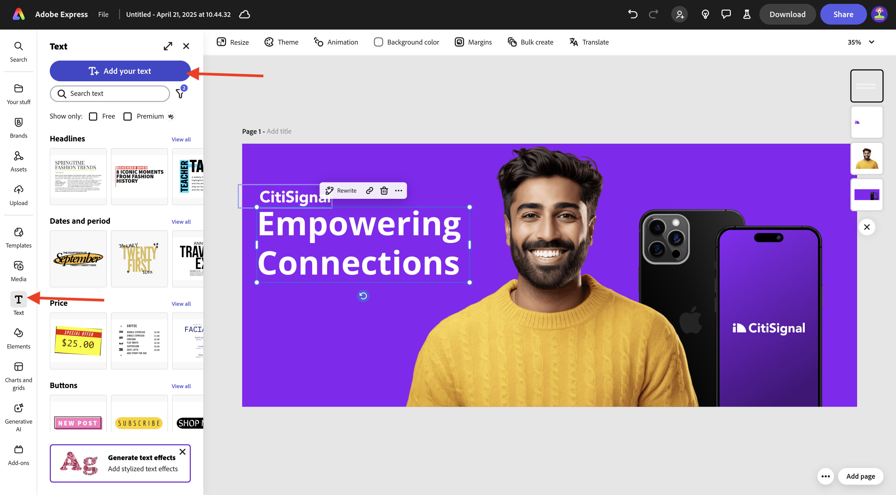
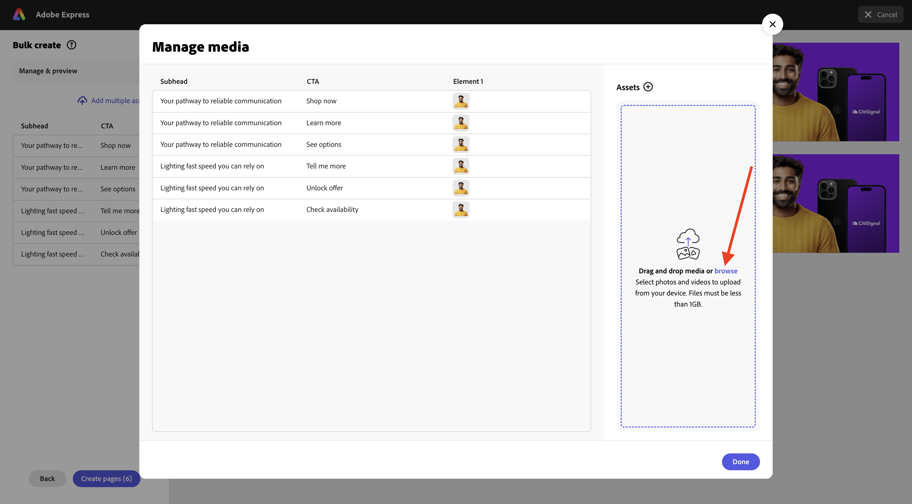
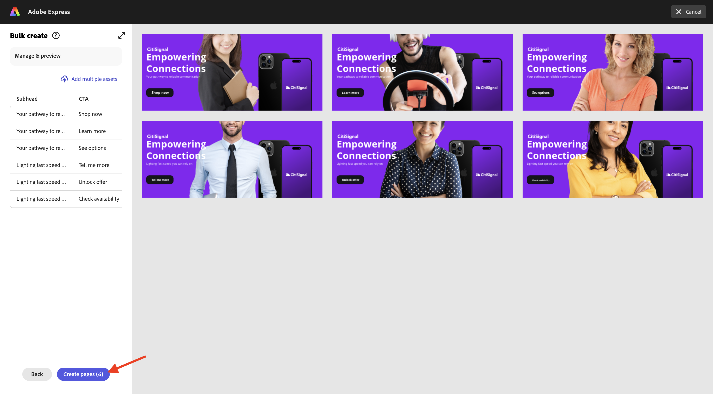

# 1.4.3 Adobe Express에서 Assets 벌크 만들기

이 연습을 시작하기 전에 [https://one-adobe-tech-insiders.s3.us-west-2.amazonaws.com/one-adobe/Adobe_Express.zip](https://one-adobe-tech-insiders.s3.us-west-2.amazonaws.com/one-adobe/Adobe_Express.zip){target="_blank"}에서 필요한 자산을 다운로드하고 바탕 화면에서 압축을 풉니다.

## 1.4.3.1 기본 자산 만들기

[https://new.express.adobe.com/](https://new.express.adobe.com/){target="_blank"}(으)로 이동합니다. 새 **이미지**&#x200B;을(를) 만들려면 **+** 아이콘을 클릭하십시오.

**사진**&#x200B;을 선택한 다음 **미디어 업로드**&#x200B;를 선택합니다.

이전에 다운로드한 자산이 포함된 **Adobe_Express** 폴더로 이동하여 바탕 화면으로 이동합니다. **banner.png** 파일을 선택하고 **열기**&#x200B;를 클릭합니다.

그럼 이걸 보셔야죠 **이미지 편집**&#x200B;을 선택합니다.

그런 다음 **미디어**(으)로 이동하여 **이미지 업로드**&#x200B;를 선택합니다. 이전에 다운로드한 자산이 포함된 **Adobe_Express** 폴더로 이동하여 바탕 화면으로 이동합니다. **man.png** 파일을 선택하고 **열기**&#x200B;를 클릭합니다.

그럼 이걸 보셔야죠

그런 다음 **CitiSignal** 로고를 추가해야 합니다. **브랜드**(으)로 이동하여 흰색 CitiSignal 로고를 선택하십시오. 세 점 **..**&#x200B;을(를) 클릭하고 **배치**&#x200B;를 선택합니다.

아래 이미지에서 동일한 위치를 반영하도록 CitiSignal 로고 이미지의 위치를 조정합니다.

**텍스트**(으)로 이동한 다음 **텍스트 추가**&#x200B;를 클릭합니다.

새 텍스트 상자에 `Empowering Connections` 텍스트를 추가합니다. 텍스트 상자를 아래 이미지에 표시된 것과 유사한 위치로 드래그합니다. 그런 다음 **브랜드**, **글꼴**(으)로 이동합니다. 세 번째 글꼴에서 세 점 **..**&#x200B;을(를) 클릭하고 **적용**&#x200B;을 클릭합니다.

그런 다음 글꼴 색상을 **흰색**(으)로 변경합니다.

다시 **텍스트**(으)로 이동한 다음 **텍스트 추가**&#x200B;를 클릭합니다.

새 텍스트 상자에 `Your pathway to reliable communication` 텍스트를 입력합니다. 아래 이미지와 유사하게 이전 텍스트 상자 아래에 있는 텍스트 상자의 위치를 조정합니다.

**브랜드**, **글꼴**(으)로 이동한 다음 두 번째 글꼴에서 세 점 **...**&#x200B;을(를) 클릭합니다. 그런 다음 **적용**&#x200B;을 클릭합니다.

그럼 이걸 드셔보세요 그런 다음 **요소**, **모양**(으)로 이동하여 둥근 사각형 모양을 클릭합니다.

그러면 이미지에 새로운 둥근 사각형 모양이 나타납니다. 단추처럼 보이도록 크기와 위치를 조정합니다. 그런 다음 둥근 사각형의 색상을 **black**(으)로 변경합니다.

다시 **텍스트**(으)로 이동한 다음 **텍스트 추가**&#x200B;를 클릭합니다.

새 텍스트 상자에 `Shop now` 텍스트를 입력하고 텍스트 상자의 위치를 단추 가운데로 변경합니다. **브랜드**, **글꼴**(으)로 이동한 다음 세 번째 글꼴의 세 점 **...**&#x200B;을(를) 클릭합니다. 그런 다음 **적용**&#x200B;을 클릭합니다.

그럼 이걸 보셔야죠

## Adobe Express에서 1.4.3.2 대량 만들기

**일괄 만들기**&#x200B;를 클릭합니다.

그럼 이걸 보셔야죠 **찾아보기**&#x200B;를 클릭합니다.

이전에 다운로드한 에셋이 포함된 **Adobe_Express** 폴더의 **Express 일괄 만들기** 폴더로 이동합니다. **CTA-options.csv** 파일을 선택하고 **열기**&#x200B;를 클릭합니다.

그럼 이걸 보셔야죠 **다음**&#x200B;을 클릭합니다.

**요소 연결**&#x200B;을 클릭합니다.

**신뢰할 수 있는 통신으로 가는 경로**&#x200B;라는 텍스트가 포함된 텍스트 상자를 선택합니다. 그런 다음 **요소 1** 단추를 클릭하고 CSV 파일의 필드(이 경우 필드 **하위 머리글**)에 연결합니다.

그런 다음 **지금 쇼핑** 텍스트가 포함된 텍스트 상자를 선택합니다.

그런 다음 **요소 1** 단추를 클릭하고 CSV 파일의 필드(이 경우 필드 **CTA**)에 연결합니다.

그럼 이걸 보셔야죠 그런 다음 해당 사용자의 이미지를 클릭합니다.

**요소 1** 단추를 클릭합니다.

그러면 이 팝업이 표시됩니다. **찾아보기**&#x200B;를 클릭합니다.

이전에 다운로드한 에셋이 포함된 **Adobe_Express** 폴더의 **Express 일괄 만들기** 폴더로 이동합니다. 6~7개의 이미지 파일을 선택하고 **열기**&#x200B;를 클릭합니다.

그러면 이걸 보게 될 거야. 자산의 각 변형에 다른 이미지를 끌어다 놓습니다. **완료** 클릭

그런 다음 생성되는 이미지의 변형을 보게 됩니다. **페이지 만들기**&#x200B;를 클릭합니다.

이제 변형이 준비되었으며 각 변형을 개별적으로 검사하여 검토하고 확인할 수 있습니다.

이제 이 연습을 완료했습니다.

## 다음 단계

[요약 및 혜택](./summary.md){target="_blank"}(으)로 이동

[Adobe Express 및 Adobe Experience Cloud](./express.md){target="_blank"}로 돌아가기

[모든 모듈](./../../../overview.md){target="_blank"}(으)로 돌아가기