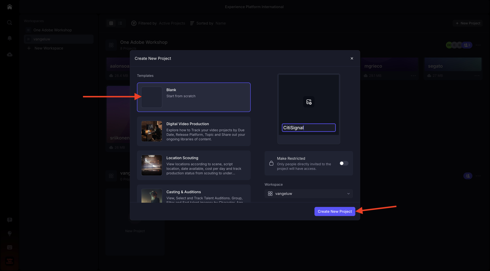
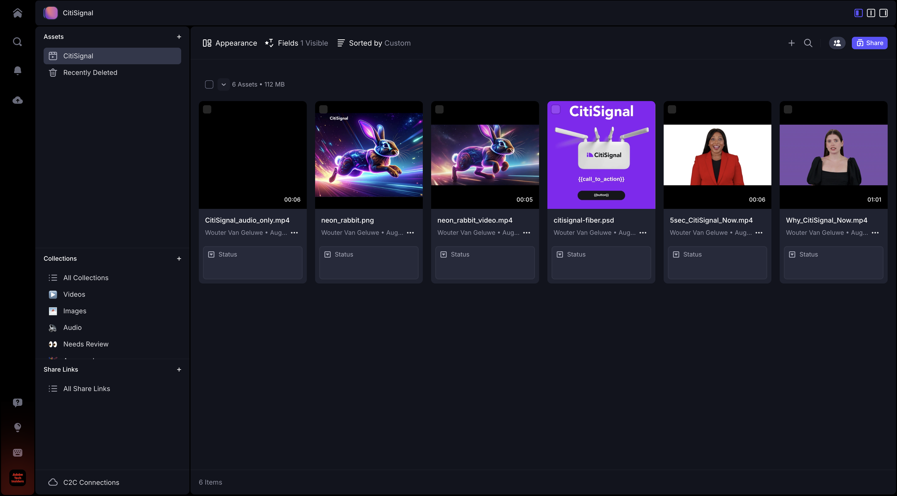

# 1.5.1 Frame.io 시작하기

>[!NOTE]
>
> 아래 스크린샷은 사용 중인 특정 환경을 보여 줍니다. 이 자습서를 수행하는 경우 환경에 다른 이름이 있을 수 있습니다. 이 자습서에 등록하면 사용할 환경 세부 정보가 제공되었으므로 해당 지침을 따르십시오.

[https://next.frame.io/](https://next.frame.io/)&#x200B;(으)로 이동합니다. `--aepImsOrgName--` 환경에 로그인했는지 확인하십시오.

올바른 환경에 로그인하지 않은 경우 왼쪽 하단에 있는 로고를 클릭한 다음 을(를) 클릭하여 사용해야 하는 환경을 선택합니다.

## 1.5.1.1 작업 공간 및 프로젝트 만들기

**+ 새 Workspace**&#x200B;을(를) 클릭합니다.

작업 영역 이름은 `--aepUserLdap--`을(를) 사용합니다. **저장**&#x200B;을 클릭합니다.

이제 작업 영역이 생성되었습니다. 그런 다음 새 프로젝트를 만들어야 합니다. **+ 새 프로젝트**&#x200B;을(를) 클릭합니다.

**Blank**&#x200B;을(를) 선택하고 `CitiSignal` 이름을 사용하십시오. **새 프로젝트 만들기**&#x200B;를 클릭합니다.

이제 프로젝트가 생성되었습니다. 이제 프로젝트에서 에셋을 업로드해야 합니다. **업로드**&#x200B;를 클릭합니다.

[https://tech-insiders.s3.us-west-2.amazonaws.com/Frame.io_Assets.zip](https://tech-insiders.s3.us-west-2.amazonaws.com/Frame.io_Assets.zip) 파일을 바탕 화면에 다운로드하고 바탕 화면에 압축 해제하세요.

모든 파일을 선택하고 **열기**&#x200B;를 클릭합니다.

>[!NOTE]
>
>스크린샷에서 볼 수 있듯이 현재 **음향 효과** 폴더가 선택되지 않았습니다. 이는 수동 업로드가 폴더 업로드를 지원하지 않기 때문입니다. 몇 분 후에 Frame.io Transfer 앱을 설치하여 해당 폴더 및 해당 파일을 업로드하는 데 사용할 수 있습니다.

몇 분 후에 Frame.io에서 파일을 사용할 수 있게 됩니다.

이제 파일을 수동으로 업로드했지만 Frame.io에서 파일을 업로드하고 다운로드하는 것이 더 빠르고 효과적인 방법입니다. 가장 좋은 방법은 Frame.io 전송 앱을 사용하는 것입니다.

## 1.5.1.2 Frame.io 전송 앱 다운로드 및 구성

[https://frame.io/transfer](https://frame.io/transfer)&#x200B;(으)로 이동하여 컴퓨터의 버전을 다운로드합니다.

응용 프로그램을 설치한 다음 엽니다.

애플리케이션이 열리면 로그인해야 합니다. **로그인**&#x200B;을 클릭합니다.

Adobe 계정의 전자 메일 주소를 입력하고 **이동**&#x200B;을 클릭하세요.

인증에 성공하면 **Frame.io 전송 앱 열기**&#x200B;를 클릭합니다.

그럼 이걸 보셔야죠 올바른 환경을 선택하려면 를 클릭하여 드롭다운 목록을 엽니다.

이 자습서에 사용해야 하는 환경을 선택하십시오. `--aepImsOrgName--`.

그러면 이전에 만든 작업 공간 및 프로젝트와 수동으로 업로드한 파일이 표시됩니다.

**업로드**&#x200B;를 클릭합니다.

이전에 다운로드한 압축 해제된 파일이 들어 있는 이전에 사용한 폴더로 이동합니다. **음향 효과** 폴더를 선택하고 **업로드**&#x200B;를 클릭합니다.

그러면 파일이 업로드됩니다.

업로드되면 Frame.io에서 새 폴더를 사용할 수 있게 됩니다.

## 1.5.1.3 Adobe Premiere Pro Beta 설정

이미 시작 모듈의 일부로 Adobe Premiere Pro Beta을 설치했습니다. Adobe Premiere Pro Beta과 함께 Frame.io를 사용하려면 이 통합을 위해 개발된 플러그인을 사용할 수 있습니다.

Creative Cloud 앱을 열고 `frame.io`을(를) 검색합니다.

검색 결과에서 아래로 스크롤하여 **Frame.io V4 댓글** 플러그인을 찾습니다. 클릭합니다.

그럼 이걸 보셔야죠 **설치**&#x200B;를 클릭합니다.

Adobe Premiere Pro Beta이 열려 있는 경우 플러그인을 설치하기 전에 먼저 **닫기**&#x200B;해야 합니다.

**확인**&#x200B;을 클릭합니다. 플러그인이 지금 설치 중입니다.

플러그인이 설치되면 컴퓨터에서 Adobe Premiere Pro Beta을 엽니다.

## 다음 단계

[-](./ex1.md){target="_blank"}(으)로 이동

[Frame.io로 워크플로 간소화](./frameio.md){target="_blank"}(으)로 돌아가기

[모든 모듈](./../../../overview.md){target="_blank"}(으)로 돌아가기
