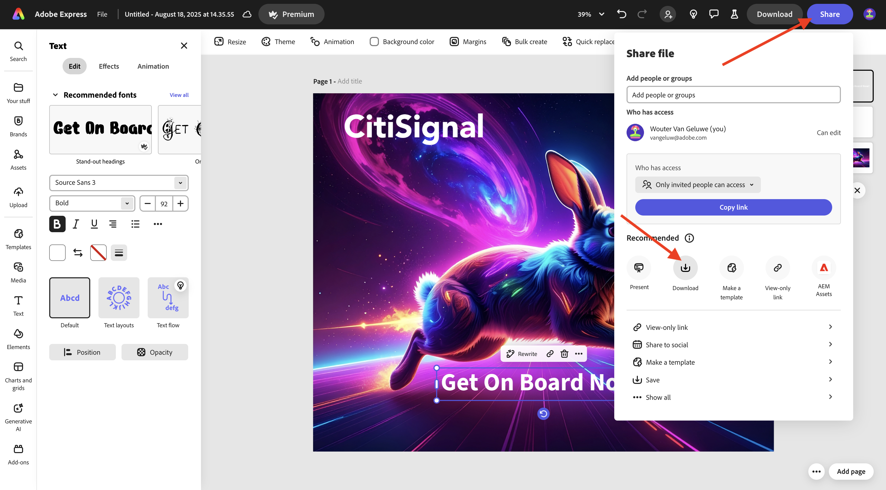
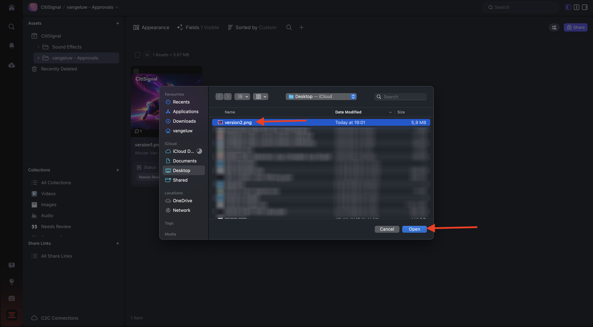

# Frame.io를 사용한 1.5.2 승인

>[!NOTE]
>
> 아래 스크린샷은 사용 중인 특정 환경을 보여 줍니다. 이 자습서를 수행하는 경우 환경에 다른 이름이 있을 수 있습니다. 이 자습서에 등록하면 사용할 환경 세부 정보가 제공되었으므로 해당 지침을 따르십시오.

Frame.io에서 승인 워크플로를 수행하려면 에셋이 있어야 합니다. 이 연습에서는 Adobe Firefly 및 Adobe Express을 사용하여 해당 에셋을 직접 만드는 것부터 시작합니다. 에셋이 있으면 Frame.io에서 업로드한 다음 최종적으로 승인합니다.

## 1.5.2.1 Adobe Firefly Services 및 Adobe Express을 사용하여 자산 만들기

[https://firefly.adobe.com/](https://firefly.adobe.com/){target="_blank"}(으)로 이동합니다. `a neon rabbit running very fast through space` 프롬프트를 입력하고 **생성**&#x200B;을 클릭합니다.

그런 다음 여러 이미지가 생성되는 것을 볼 수 있습니다. 가장 좋아하는 이미지를 선택하고 **공유** 아이콘을 클릭한 다음 **Adobe Express에서 열기**&#x200B;를 선택합니다.

그러면 방금 생성한 이미지를 Adobe Express에서 편집할 수 있게 됩니다. 이제 이미지에 CitiSignal 로고를 추가해야 합니다. 이렇게 하려면 **브랜드**(으)로 이동하십시오.

그러면 CitiSignal 브랜드 템플릿이 표시됩니다. GenStudio for Performance Marketing에서 만든 이 이름은 Adobe Express에 나타납니다. 이름에 `CitiSignal`이(가) 있는 브랜드 템플릿을 선택하려면 클릭하세요.

**로고**(으)로 이동한 다음 **흰색** Citigsignal 로고를 클릭하여 이미지에 놓습니다.

CitiSignal 로고를 중간에서 너무 멀지 않은 이미지 맨 위에 배치합니다.

**텍스트**(으)로 이동합니다.

**텍스트 추가**&#x200B;를 클릭합니다.

`Timetravel now!` 텍스트를 입력하고 글꼴 색상과 글꼴 크기를 변경하고 이 텍스트와 유사한 이미지를 갖도록 텍스트를 **굵게**(으)로 설정합니다.

**공유**&#x200B;를 클릭합니다.

**클릭... 모두 표시**.

아래로 스크롤하고 **다운로드**&#x200B;를 선택합니다.

**다운로드**&#x200B;를 클릭합니다.

그런 다음 로컬 컴퓨터에 자산을 보유하게 됩니다.

## 1.5.2.2 Frame.io에서 자산을 승인합니다.

[https://next.frame.io/](https://next.frame.io/)&#x200B;(으)로 이동합니다. `--aepImsOrgName--` 환경에 로그인했는지 확인하십시오.

올바른 환경에 로그인하지 않은 경우 왼쪽 하단에 있는 로고를 클릭한 다음 을(를) 클릭하여 사용해야 하는 환경을 선택합니다.

작업 영역으로 이동하여 이름을 `--aepUserLdap--`로 지정한 다음 **CitiSignal** 폴더를 엽니다. **+** 아이콘을 클릭한 다음 **새 폴더**&#x200B;를 선택합니다.

폴더 이름을 `--aepUserLdap-- - Approvals`(으)로 지정합니다. 폴더를 두 번 클릭하여 엽니다.

이제 이전 연습에서 만든 파일을 이 폴더에 업로드합니다. **업로드**&#x200B;를 클릭합니다.

파일을 선택하고 **열기**&#x200B;를 클릭합니다.

그럼 이걸 드셔보세요 파일을 두 번 클릭하여 엽니다.

아이콘을 활성화하여 고정된 주석을 남깁니다.

`Change CTA to "Get on board now!"`과(와) 같은 설명을 입력하십시오. 댓글을 공유하려면 **보내기** 아이콘을 클릭하세요.

그럼 이걸 드셔보세요 **필드**(으)로 이동

**상태** 필드에서 상태를 **검토 필요**(으)로 변경합니다.

그럼 이걸 드셔보세요 돌아가려면 화살표를 클릭하여 폴더로 돌아갑니다.

세 점 **..**&#x200B;을(를) 클릭하고 **이름 바꾸기**&#x200B;를 선택합니다.

파일 이름을 `version1.png`(으)로 변경합니다.

## 1.5.2.3 Adobe Express에서 디자인 변경

[https://new.express.adobe.com/your-stuff/files](https://new.express.adobe.com/your-stuff/files)&#x200B;(으)로 이동하여 이전에 만든 이미지를 다시 엽니다.

CTA 텍스트를 `Get On Board Now!`(으)로 변경합니다.

**공유**&#x200B;를 클릭한 다음 **다운로드**&#x200B;를 선택합니다.

**다운로드**&#x200B;를 클릭합니다.

그런 다음 로컬 컴퓨터에 새 이미지를 다운로드합니다. 파일 이름을 `version2.png`(으)로 바꾸십시오.

## 1.5.2.4 Frame.io에서 버전2 승인

Frame.io의 폴더에서 **+** 아이콘을 클릭하고 **자산 업로드**&#x200B;를 선택합니다.

**version2.png** 파일을 선택하고 **열기**&#x200B;를 클릭합니다.

그런 다음 **version1.png** 파일 위에 **version2.png** 파일을 끌어 놓습니다. 이 작업을 수행하면 Frame.io에서 버전 스태킹이 활성화됩니다.

그럼 이걸 보셔야죠

이미지의 세 점 **..**&#x200B;을(를) 클릭한 다음 **버전 비교**&#x200B;를 선택합니다.

그런 다음 두 버전의 파일을 모두 보여 주는 이 비교 보기가 표시됩니다. **필드**(으)로 이동

**상태** 필드를 **승인됨**(으)로 변경합니다.

그럼 이걸 드셔보세요 폴더 보기로 돌아가려면 화살표 아이콘을 클릭합니다.

세 점 **..**&#x200B;을(를) 클릭하고 다른 응용 프로그램에서 이 파일을 사용하려면 **다운로드**&#x200B;를 선택하십시오.

## 다음 단계

[1.5.3 Frame.io 및 Premiere Pro](./ex3.md){target="_blank"}

[Frame.io로 워크플로 간소화](./frameio.md){target="_blank"}(으)로 돌아가기

[모든 모듈](./../../../overview.md){target="_blank"}(으)로 돌아가기
