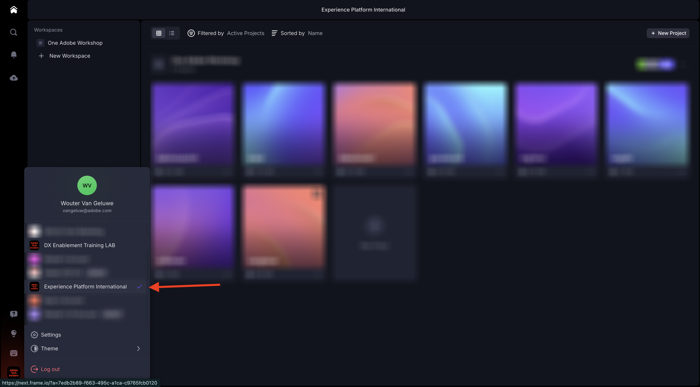

# 1.5.3 Frame.io 및 Premiere Pro

>[!NOTE]
>
> 아래 스크린샷은 사용 중인 특정 환경을 보여 줍니다. 이 자습서를 수행하는 경우 환경에 다른 이름이 있을 수 있습니다. 이 자습서에 등록하면 사용할 환경 세부 정보가 제공되었으므로 해당 지침을 따르십시오.

[https://next.frame.io/](https://next.frame.io/)&#x200B;(으)로 이동합니다. `--aepImsOrgName--` 환경에 로그인했는지 확인하십시오.

올바른 환경에 로그인하지 않은 경우 왼쪽 하단에 있는 로고를 클릭한 다음 을(를) 클릭하여 사용해야 하는 환경을 선택합니다.

## 1.5.3.1 Adobe Premiere Pro Beta 설정

이미 시작 모듈의 일부로 Adobe Premiere Pro Beta을 설치했습니다. Adobe Premiere Pro Beta과 함께 Frame.io를 사용하려면 이 통합을 위해 개발된 플러그인을 사용할 수 있습니다.

Creative Cloud 앱을 열고 `frame.io`을(를) 검색합니다.

검색 결과에서 아래로 스크롤하여 **Frame.io V4 댓글** 플러그인을 찾습니다. 클릭합니다.

그럼 이걸 보셔야죠 **설치**&#x200B;를 클릭합니다.

Adobe Premiere Pro Beta이 열려 있는 경우 플러그인을 설치하기 전에 먼저 **닫기**&#x200B;해야 합니다.

**확인**&#x200B;을 클릭합니다. 플러그인이 지금 설치 중입니다.

플러그인이 설치되면 컴퓨터에서 Adobe Premiere Pro Beta을 엽니다.

## 다음 단계

[요약 및 혜택](./summary.md){target="_blank"}(으)로 이동

[Frame.io로 워크플로 간소화](./frameio.md){target="_blank"}(으)로 돌아가기

[모든 모듈](./../../../overview.md){target="_blank"}(으)로 돌아가기
