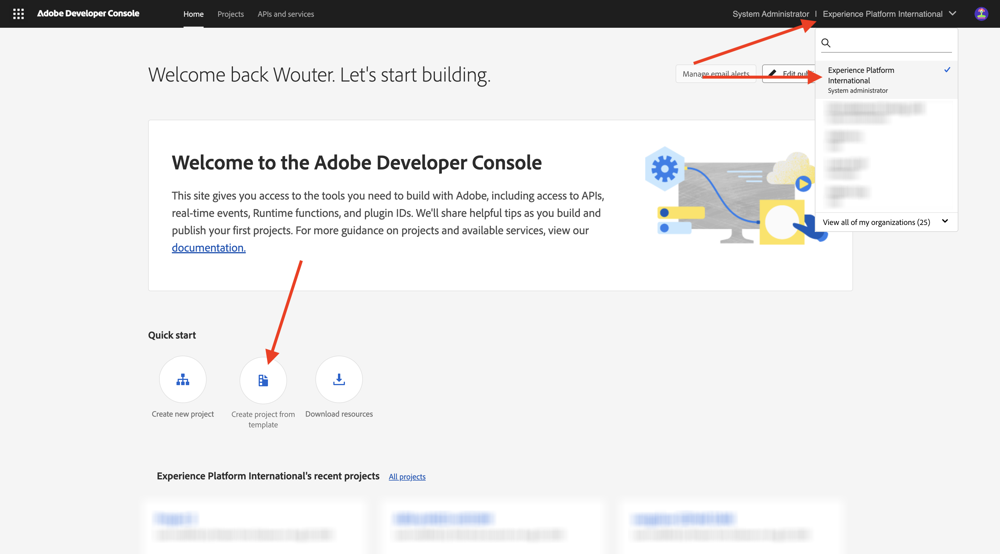

# 1.6.1 Adobe IO 및 App Builder

## 1.6.1.1 Adobe I/O 프로젝트 만들기

[https://developer.adobe.com/console/home](https://developer.adobe.com/console/home){target="_blank"}(으)로 이동합니다.

화면 오른쪽 상단 모서리에서 올바른 인스턴스를 선택해야 합니다. 인스턴스는 `--aepImsOrgName--`입니다.

>[!NOTE]
>
> 아래 스크린샷은 선택된 특정 조직을 보여 줍니다. 이 자습서를 수행하는 경우 조직의 이름이 다를 수 있습니다. 이 자습서에 등록하면 사용할 환경 세부 정보가 제공되었으므로 해당 지침을 따르십시오.

**템플릿에서 프로젝트 만들기**&#x200B;를 선택합니다.

**App Builder**&#x200B;을(를) 선택합니다.

이름 `--aepUserLdap-- GSPeM EXT`을(를) 입력하십시오. **저장**&#x200B;을 클릭합니다.

그럼 이런 걸 보셔야겠네요

## 1.6.1.2 개발 환경 구성

확장 가능한 앱을 만들고 제출하고 배포하려면 컴퓨터의 로컬 개발 환경에 다음 응용 프로그램 및 패키지가 설치되어 있어야 합니다.

- Node.js(버전 20.x 이상)
- npm(Node.js와 함께 패키지됨)
- Adobe Developer 명령줄 인터페이스(CLI)

이러한 응용 프로그램 또는 패키지가 컴퓨터에 아직 설치되지 않은 경우 다음 단계를 수행합니다.

### Node.js 및 npm

[https://nodejs.org/en/download](https://nodejs.org/en/download)&#x200B;(으)로 이동합니다. 그런 다음 Node.js 및 npm을 설치하기 위해 실행해야 하는 여러 터미널 명령과 함께 이 메시지가 표시됩니다. 여기에 표시된 명령은 MacBook에 적용할 수 있습니다.

먼저 새 터미널 창을 엽니다. 스크린샷의 2행에 언급된 명령을 붙여넣고 실행합니다.

`curl -o- https://raw.githubusercontent.com/nvm-sh/nvm/v0.40.3/install.sh | bash`

그런 다음 스크린샷의 5행에 있는 명령을 실행합니다.

`\. "$HOME/.nvm/nvm.sh"`

두 명령을 성공적으로 실행한 후 다음 명령을 실행합니다.

`node -v`

버전 번호가 반환되는 것을 볼 수 있습니다.

그런 다음 이 명령을 실행합니다.

`npm -v`

버전 번호가 반환되는 것을 볼 수 있습니다.

마지막 2개의 명령이 버전 번호를 성공적으로 반환한 경우 이 2개의 기능을 성공적으로 구성했습니다.

### Adobe Developer 명령줄 인터페이스(CLI)

Adobe Developer 명령줄 인터페이스(CLI)를 설치하려면 터미널 창에서 다음 명령을 실행합니다.

`npm install -g @adobe/aio-cli`

이 명령을 실행하는 데 2분 정도 걸릴 수 있습니다. 종료 결과는 다음과 유사해야 합니다.

이제 Adobe Developer 명령줄 인터페이스(CLI)도 성공적으로 설치되었습니다.

이제 App Builder 프로젝트를 실행할 수 있도록 기본 요소를 설정했습니다.

## 다음 단계

[AWS S3 버킷 만들기](./ex2.md){target="_blank"}(으)로 이동

[GenStudio for Performance Marketing - 확장성](./genstudioext.md){target="_blank"}(으)로 돌아가기

[모든 모듈](./../../../overview.md){target="_blank"}(으)로 돌아가기
