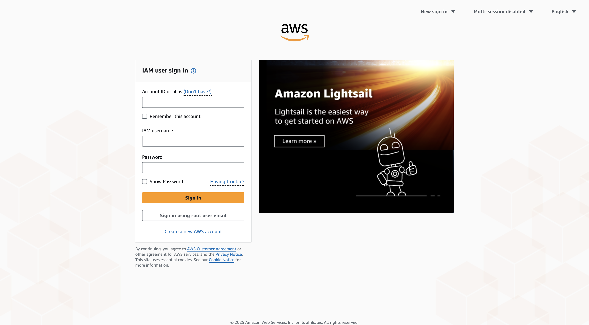
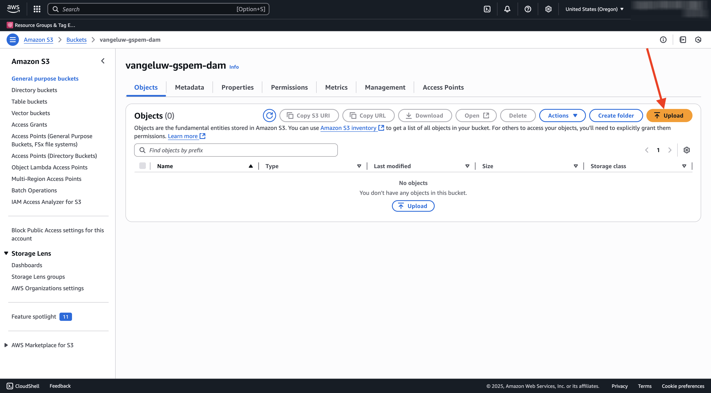
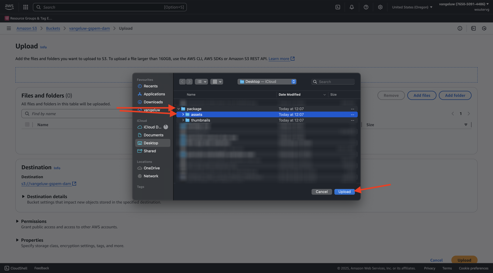

# 1.6.2 AWS S3 버킷 만들기

## 1.6.2.1 S3 버킷 만들기

[https://console.aws.amazon.com](https://console.aws.amazon.com)&#x200B;(으)로 이동하여 로그인합니다.

>[!NOTE]
>
>아직 AWS 계정이 없는 경우 개인 이메일 주소를 사용하여 새 AWS 계정을 만드십시오.

로그인하면 **AWS 관리 콘솔**(으)로 리디렉션됩니다.

검색 창에서 **s3**&#x200B;을(를) 검색합니다. 첫 번째 검색 결과를 클릭합니다. **S3 - 클라우드의 확장 가능한 저장소**.

그러면 **Amazon S3** 홈 페이지가 표시됩니다. **버킷 만들기**&#x200B;를 클릭합니다.

**버킷 만들기** 화면에서 `--aepUserLdap---gspem-dam` 이름을 사용하십시오.

다른 모든 기본 설정은 그대로 둡니다. 아래로 스크롤하여 **버킷 만들기**&#x200B;를 클릭합니다.

그러면 버킷이 만들어지는 것이 보이고 Amazon S3 홈페이지로 리디렉션됩니다.

## S3 버킷에 액세스할 수 있는 권한 설정

다음 단계는 S3 버킷에 대한 액세스를 설정하는 것입니다.

이렇게 하려면 [https://console.aws.amazon.com/iam/home](https://console.aws.amazon.com/iam/home)&#x200B;(으)로 이동하십시오.

AWS 리소스에 대한 액세스는 Amazon Identity and Access Management(IAM)에 의해 제어됩니다.

이제 이 페이지가 표시됩니다.

왼쪽 메뉴에서 **사용자**&#x200B;를 클릭합니다. 그러면 **사용자** 화면이 표시됩니다. **사용자 만들기**&#x200B;를 클릭합니다.

그런 다음 사용자를 구성합니다.

- 사용자 이름: `s3_--aepUserLdap--_gspem_dam` 사용

**다음**&#x200B;을 클릭합니다.

그러면 이 권한 화면이 표시됩니다. **직접 정책 첨부**&#x200B;를 클릭합니다.

모든 관련 S3 정책을 보려면 검색어 **s3**&#x200B;을(를) 입력하십시오. **AmazonS3FullAccess** 정책을 선택하십시오. 아래로 스크롤하여 **다음**&#x200B;을 클릭합니다.

구성을 검토합니다. **사용자 만들기**&#x200B;를 클릭합니다.

그러면 이걸 보게 될 거야. **사용자 보기**&#x200B;를 클릭합니다.

**보안 자격 증명**&#x200B;을 클릭한 다음 **액세스 키 만들기**&#x200B;를 클릭합니다.

**AWS 외부에서 실행 중인 응용 프로그램**&#x200B;을 선택합니다. 아래로 스크롤하여 **다음**&#x200B;을 클릭합니다.

**액세스 키 만들기** 클릭

그러면 이걸 보게 될 거야. 비밀 액세스 키를 보려면 **표시**&#x200B;를 클릭하세요.

**비밀 액세스 키**&#x200B;이(가) 표시됩니다.

>[!IMPORTANT]
>
>자격 증명을 컴퓨터의 텍스트 파일에 저장합니다.
>
> - 액세스 키 ID: ...
> - 비밀 액세스 키: ...
>
> **완료**&#x200B;를 클릭하면 자격 증명이 다시 표시되지 않습니다!

**완료**&#x200B;를 클릭합니다.

이제 AWS S3 버킷을 성공적으로 만들었고 이 버킷에 액세스할 수 있는 권한이 있는 사용자를 만들었습니다.

## 1.6.2.2 S3 버킷에 Assets 업로드

검색 창에서 **s3**&#x200B;을(를) 검색합니다. 첫 번째 검색 결과를 클릭합니다. **S3 - 클라우드의 확장 가능한 저장소**.

새로 만든 S3 버킷을 열려면 클릭하세요. 해당 버킷의 이름은 `--aepUserLdap---gspem-dam`이어야 합니다.

**업로드**&#x200B;를 클릭합니다.

그럼 이걸 보셔야죠

CitiSignal 이미지 파일 [여기](./../../asset-mgmt/module2.2/images/CitiSignal_Neon_Rabbit.zip){target="_blank"}를 다운로드할 수 있습니다.

파일을 바탕 화면으로 내보냅니다.

해당 폴더에 있는 2개의 이미지 파일을 가져와 S3 버킷 업로드 창에 놓습니다. **업로드**&#x200B;를 클릭합니다.

그럼 이걸 보셔야죠 이제 S3 버킷, 이미지 파일 및 IAM 사용자를 외부 DAM 앱에서 사용할 준비가 되었습니다.

## 다음 단계

[외부 DAM 앱 만들기](./ex3.md){target="_blank"}(으)로 이동

[GenStudio for Performance Marketing - 확장성](./genstudioext.md){target="_blank"}(으)로 돌아가기

[모든 모듈](./../../../overview.md){target="_blank"}(으)로 돌아가기
