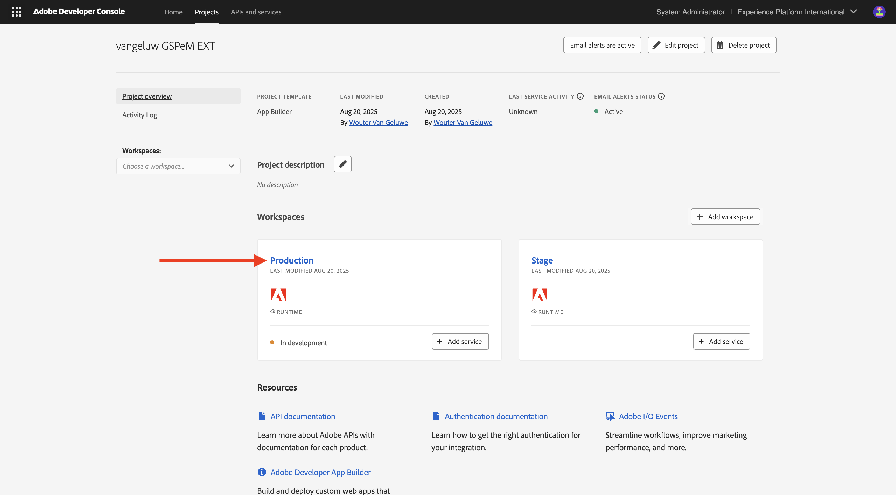

# 1.6.3 외부 DAM 앱 만들기 및 배포

## 1.6.3.1 샘플 앱 파일 다운로드

[https://github.com/woutervangeluwe/genstudio-external-dam-app](https://github.com/woutervangeluwe/genstudio-external-dam-app)&#x200B;(으)로 이동합니다. **코드**&#x200B;를 클릭한 다음 **ZIP 다운로드**&#x200B;를 선택합니다.


zip 파일을 바탕 화면에 압축 해제합니다.


## 1.6.3.2 Adobe Developer 명령줄 인터페이스 구성

**genstudio-external-dam-app-main** 폴더를 마우스 오른쪽 단추로 클릭하고 **폴더에서 새 터미널**&#x200B;을 선택합니다.


그럼 이걸 보셔야죠 `aio login` 명령을 입력하십시오. 이 명령은 사용자 브라우저로 리디렉션되고 사용자가 로그인합니다.


로그인에 성공하면 브라우저에 표시됩니다.


그러면 브라우저가 터미널 창으로 다시 리디렉션됩니다. **로그인 성공**&#x200B;이라는 메시지와 브라우저가 반환하는 긴 토큰이 표시됩니다.


다음 단계는 외부 DAM 앱에 사용할 인스턴스 및 Adobe IO 프로젝트를 구성하는 것입니다.

이렇게 하려면 이전에 구성한 Adobe IO 프로젝트에서 파일을 다운로드해야 합니다.

[https://developer.adobe.com/console/home](https://developer.adobe.com/console/home){target="_blank"}(으)로 이동하여 이전에 만든 `--aepUserLdap-- GSPeM EXT` 프로젝트를 엽니다. **프로덕션** 작업 영역을 엽니다.



**모두 다운로드**&#x200B;를 클릭합니다. JSON 파일이 다운로드됩니다.


**다운로드** 디렉터리에서 외부 DAM 앱의 루트 디렉터리로 JSON 파일을 복사합니다.


터미널 창으로 돌아갑니다. `aio app use XXX-YYY-Production.json` 명령을 입력하십시오.

>[!NOTE]
>
>파일 이름과 일치하도록 위의 명령에서 파일 이름을 변경해야 합니다.

명령이 실행되면 이제 외부 DAM 앱이 이전에 만든 App Builder을 사용하여 Adobe IO 프로젝트에 연결됩니다.


## 1.6.3.3 GenStudio 확장성 SDK 설치

**GenStudio 확장성 SDK**&#x200B;을 설치해야 합니다. SDK에 대한 자세한 내용은 [https://github.com/adobe/genstudio-extensibility-sdk](https://github.com/adobe/genstudio-extensibility-sdk)에서 확인할 수 있습니다.

SDK을 설치하려면 터미널 창에서 다음 명령을 실행합니다.

`npm install @adobe/genstudio-extensibility-sdk`


몇 분 후에 SDK이 설치됩니다.


## 1.6.3.4 Visual Studio 코드에서 외부 DAM 앱을 검토합니다.

Visual Studio 코드를 엽니다. 폴더를 열려면 **열기...**&#x200B;를 클릭하세요.


이전에 다운로드한 앱이 포함된 **genstudio-external-dam-app-main** 폴더를 선택하십시오. **열기를 클릭합니다**.


**.env** 파일을 열려면 클릭하세요.


**.env** 파일은 이전 단계에서 실행한 `aio app use` 명령에 의해 만들어졌으며 App Builder을 사용하여 Adobe IO 프로젝트에 연결하는 데 필요한 정보가 포함되어 있습니다.


이제 외부 DAM 앱이 이전에 만든 AWS S3 버킷에 연결할 수 있도록 **.env** 파일에 다음 세부 정보를 추가해야 합니다.

```
AWS_ACCESS_KEY_ID=
AWS_SECRET_ACCESS_KEY=
AWS_REGION=
AWS_BUCKET_NAME=
```

이전 연습에서 IAM 사용자를 만든 후 필드 **`AWS_ACCESS_KEY_ID`** 및 **`AWS_SECRET_ACCESS_KEY`**&#x200B;을(를) 사용할 수 있습니다. 이를 기록하라는 메시지가 표시되면 이제 값을 복사할 수 있습니다.


버킷 이름 옆의 AWS S3 홈 보기에서 **`AWS_REGION`** 필드를 가져올 수 있습니다. 이 예제에서 지역은 **us-west-2**&#x200B;입니다.


필드 **`AWS_BUCKET_NAME`**&#x200B;은(는) `--aepUserLdap---gspem-dam`이어야 합니다.

이 정보를 사용하면 이러한 각 변수의 값을 업데이트할 수 있습니다.

```
AWS_ACCESS_KEY_ID=XXX
AWS_SECRET_ACCESS_KEY=YYY
AWS_REGION=us-west-2
AWS_BUCKET_NAME=--aepUserLdap---gspem-dam
```

이제 이 텍스트를 `.env.dev`과(와) `.env.prod` 파일에 모두 붙여 넣어야 합니다. 변경 사항을 저장하는 것을 잊지 마십시오.


그런 다음 터미널 창으로 돌아갑니다. 이 명령 실행:

`export $(grep -v '^#' .env | xargs)`


마지막으로, 외부 DAM 앱을 다른 통합과 구분할 수 있도록 GenStudio for Performance Marketing 내에 표시되는 레이블을 변경해야 합니다. 이렇게 하려면 탐색기에서 **src/genstudiopem > web-src > src**(으)로 드릴다운하여 찾을 수 있는 **Constants.ts** 파일을 엽니다.

14호선을 다음으로 변경해야 합니다.

`export const extensionLabel: string = "--aepUserLdap-- - External S3 DAM";`

변경 사항을 저장하는 것을 잊지 마십시오.


## 1.6.3.5 외부 DAM 앱 실행

터미널 창에서 `aio app run` 명령을 실행합니다. 그러면 1-2분 후에 보게 될 거예요.


이제 앱이 실행 중인지 확인했습니다. 다음 단계는 배포하는 것입니다.

먼저 **CTRL+C**&#x200B;를 눌러 앱 실행을 중지합니다. 그런 다음 `aio app deploy` 명령을 입력합니다. 이 명령은 코드를 Adobe IO에 배포합니다.

따라서 배포된 애플리케이션에 액세스하기 위한 유사한 URL을 받게 됩니다.

`https://133309-201burgundyguan.adobeio-static.net/index.html`


이제 테스트 목적으로 위의 URL에 접두사로 `?ext=`을(를) 추가하여 해당 URL을 쿼리 문자열 매개 변수로 사용할 수 있습니다. 그러면 이 쿼리 문자열 매개 변수가 생성됩니다.

`?ext=https://133309-201burgundyguan.adobeio-static.net/index.html`

[https://experience.adobe.com/genstudio/create](https://experience.adobe.com/genstudio/create)&#x200B;(으)로 이동합니다.


그런 다음 쿼리 문자열 매개 변수를 **#** 바로 앞에 추가합니다. 새 URL은 다음과 같아야 합니다.

`https://experience.adobe.com/?ext=https://133309-201burgundyguan.adobeio-static.net/index.html#/@experienceplatform/genstudio/create`

페이지가 정상적으로 로드됩니다. 새 배너를 만들려면 **배너**&#x200B;를 클릭하십시오.


템플릿을 선택하고 **사용**&#x200B;을 클릭합니다.


**콘텐츠에서 선택**&#x200B;을 클릭합니다.


그런 다음 외부 DAM을 선택할 수 있습니다. 드롭다운 목록에서 `--aepUserLdap-- - External S3 DAM`(이)라는 이름을 지정해야 합니다.


그럼 이걸 보셔야죠 **neon_rabbit_banner.jpg** 이미지를 선택하고 **사용**&#x200B;을 클릭합니다.


이제 S3 버킷에서 실행되는 외부 DAM의 이미지를 선택했습니다. 선택한 이미지를 사용하면 이제 연습 [1.3.3.4 메타 광고 만들기 및 승인](./../module1.3/ex3.md#create--approve-meta-ad)에 설명된 대로 일반 워크플로를 따를 수 있습니다.


로컬 컴퓨터에서 코드를 변경할 때 앱을 다시 배포해야 합니다. 다시 배포할 때 다음 터미널 명령을 사용합니다.

`aio app deploy --force-build --force-deploy`


이제 앱을 게시할 준비가 되었습니다.

## 다음 단계

[앱을 개인적으로 게시](./ex4.md){target="_blank"}(으)로 이동

[GenStudio for Performance Marketing - 확장성](./genstudioext.md){target="_blank"}(으)로 돌아가기

[모든 모듈](./../../../overview.md){target="_blank"}(으)로 돌아가기
