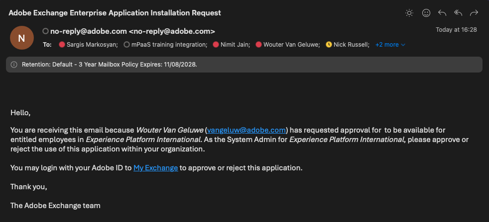

# 1.6.4 코드를 배포하고 앱을 비공개로 게시합니다

앱을 비공개로 게시하면 쿼리 문자열 매개 변수를 사용하지 않고도 GenStudio for Performance Marketing에서 앱을 사용할 수 있습니다.

## 1.6.4.1 앱 게시

[https://developer.adobe.com/console/projects](https://developer.adobe.com/console/projects){target="_blank"}(으)로 이동합니다.

>[!NOTE]
>
> 아래 스크린샷은 선택된 특정 조직을 보여 줍니다. 이 자습서를 수행하는 경우 조직의 이름이 다를 수 있습니다. 이 자습서에 등록하면 사용할 환경 세부 정보가 제공되었으므로 해당 지침을 따르십시오.

이름이 `--aepUserLdap-- GSPeM EXT`이어야 하는 App Builder을 사용하여 Adobe IO 프로젝트를 엽니다.

**프로덕션**(으)로 이동합니다.

**비공개 게시**&#x200B;를 클릭합니다.

그런 다음 여러 필드를 작성해야 합니다.

다음 필드를 다음과 같이 채웁니다.

- **앱 제목**: `--aepUserLdap-- - External DAM AWS S3`.
- **앱 설명**: `External DAM AWS S3`
- **연락처 전자 메일**: 전자 메일 주소 입력
- **앱 아이콘**: 다음 이미지를 다운로드하여 사용: [S3 이미지](./images/s3.jpeg)
- **검토자 참고**: 외부 DAM AWS S3

**제출을 클릭합니다**.

**제출을 클릭합니다**.

## 1.6.4.2 앱 승인

개발자가 게시를 위해 새 앱을 제출하면 조직의 시스템 관리자에게 알림이 전송되고 검토 및 승인을 요청받습니다.

시스템 관리자인 경우 이 전자 메일을 받은 다음 **내 Exchange**&#x200B;를 클릭하여 해당 프로세스를 시작할 수 있습니다.

**Adobe Exchange**&#x200B;에 App Builder 응용 프로그램이 표시되고 방금 제출된 앱이 현재 검토 보류 중입니다. **앱에 대한**&#x200B;검토`--aepUserLdap-- - External DAM AWS S3` 단추를 클릭합니다.

댓글에 추가하고 **승인**&#x200B;을 클릭합니다.

이제 앱이 승인되었으며 쿼리 문자열 매개 변수를 지정하지 않아도 GenStudio for Performance Marketing에서 자동으로 작동합니다.

## 다음 단계

[요약 및 혜택](./summary.md){target="_blank"}(으)로 이동

[GenStudio for Performance Marketing - 확장성](./genstudioext.md){target="_blank"}(으)로 돌아가기

[모든 모듈](./../../../overview.md){target="_blank"}(으)로 돌아가기
