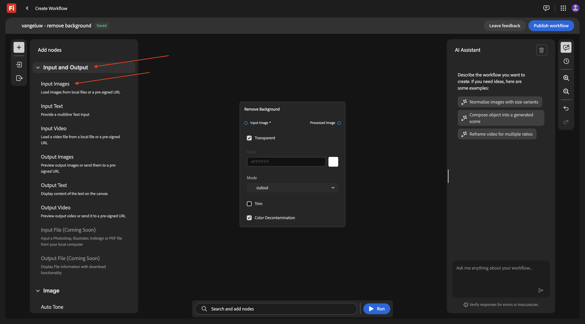
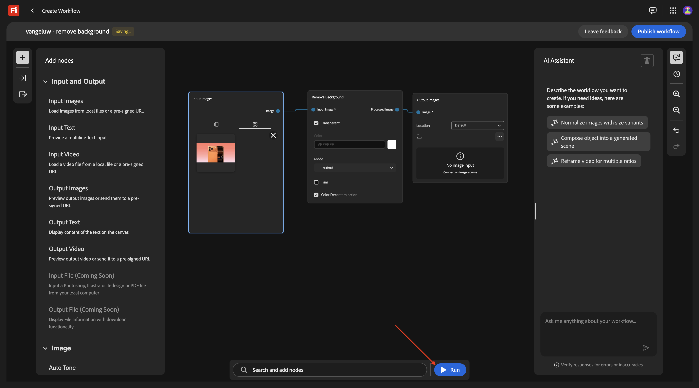
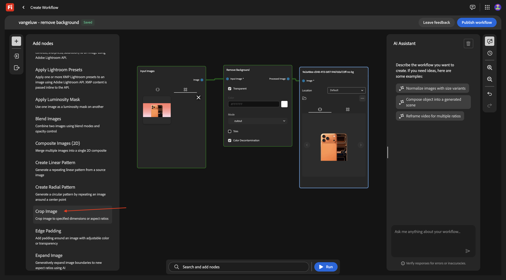
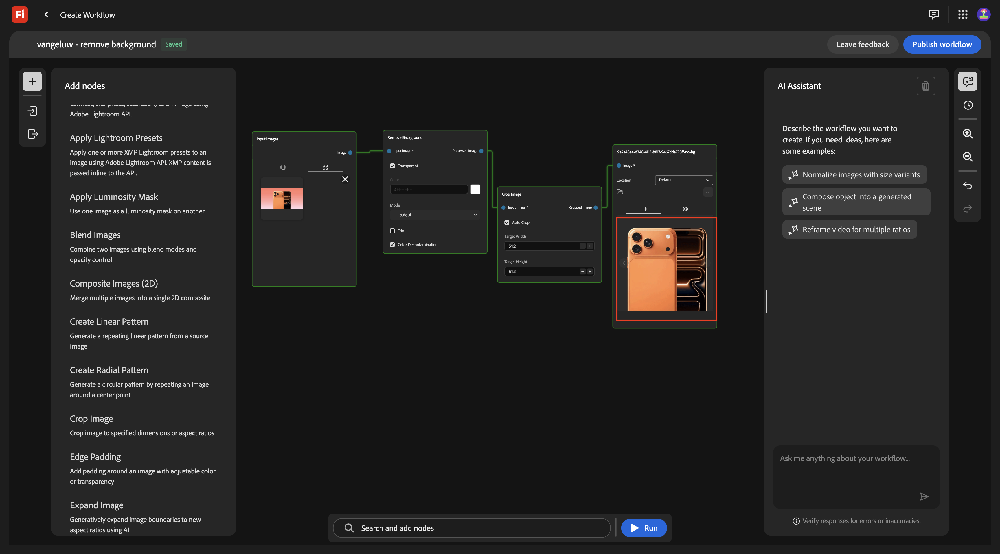
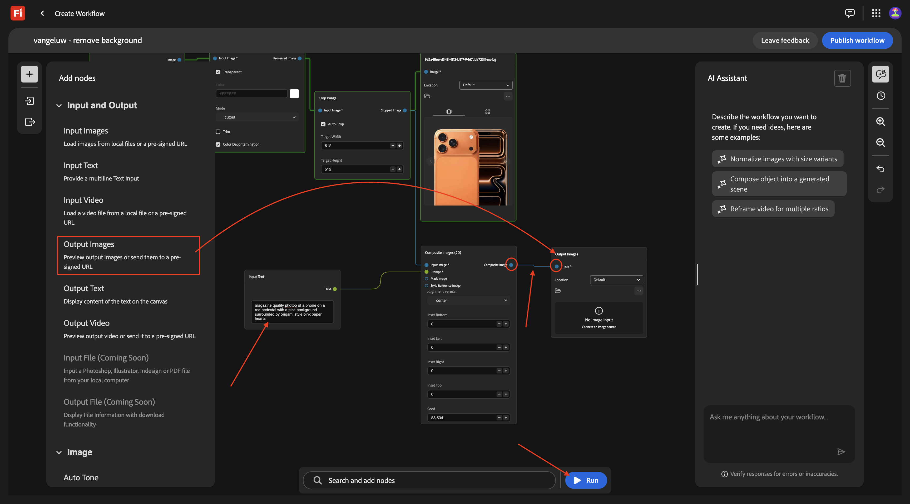
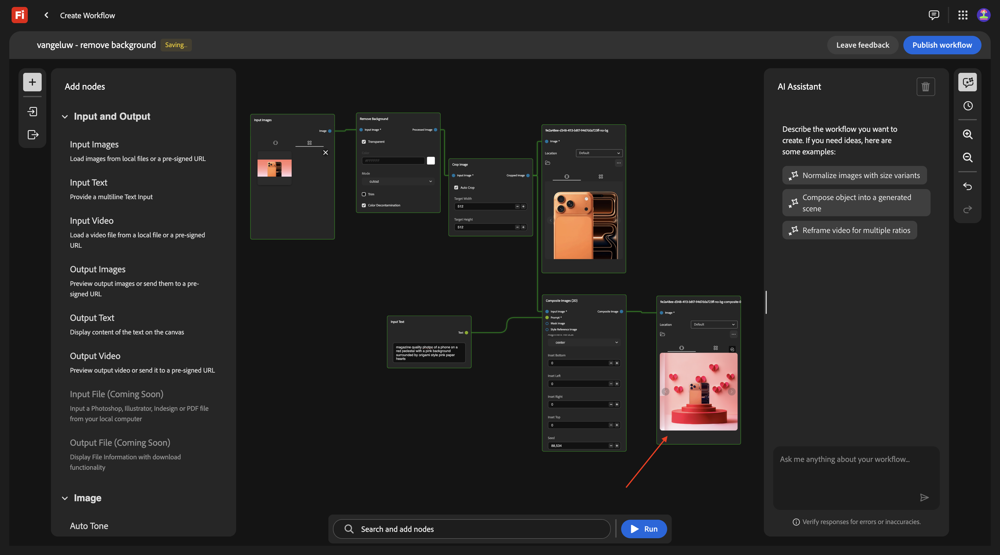
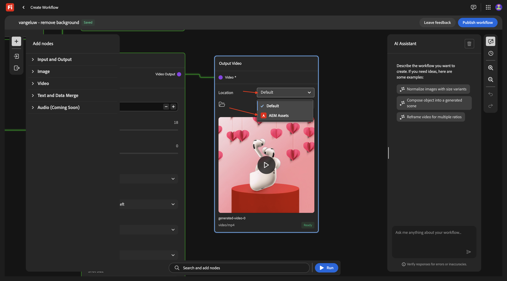
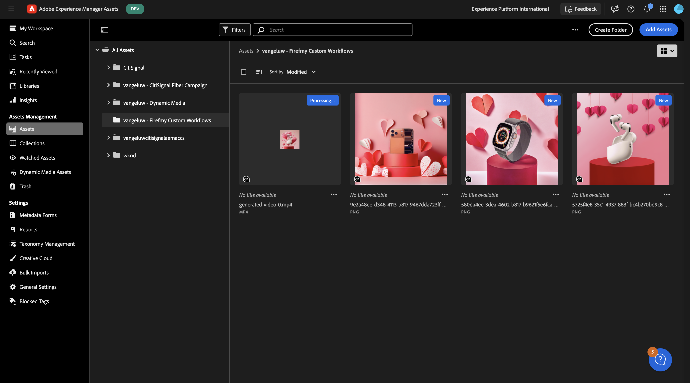

# 1.7.1 Firefly 사용자 지정 워크플로우 시작하기

[!BADGE Beta]

+++Beta 세부 정보
Firefly 사용자 정의 워크플로 Beta을 사용함으로써 귀하는 Beta이 어떠한 종류의 보증도 없이 &quot;있는 그대로&quot; 제공된다는 것을 인정합니다. Adobe은 Beta을 유지, 수정, 업데이트, 변경, 수정 또는 지원할 의무가 없습니다. 이러한 Beta 및/또는 동봉된 자료의 올바른 기능이나 성능에 어떤 식으로든 의존하지 말고 주의하는 것이 좋습니다. Beta은 Adobe의 기밀 정보로 간주됩니다.  귀하가 Adobe에 제공한 모든 &quot;피드백&quot;(Beta 사용 중 발생하는 문제 또는 결함, 제안, 개선 사항 및 권장 사항을 포함하되 이에 국한되지 않는 Beta 관련 정보)은 이에 따라 해당 피드백에 대한 모든 권한, 제목 및 관심을 포함하여 Adobe에 할당됩니다.

+++

[https://firefly.adobe.com](https://firefly.adobe.com)&#x200B;(으)로 이동합니다. 오른쪽 상단 모서리의 프로필 아이콘을 클릭하고 올바른 인스턴스를 선택했는지 확인합니다. 올바른 인스턴스는 `--aepImsOrgName--`이어야 합니다.

**프로덕션**(으)로 이동합니다.

그럼 이걸 보셔야죠 **워크플로 만들기(베타)**&#x200B;를 클릭합니다.

## 1.7.1.1 배경 제거

Firefly 사용자 지정 워크플로에 대해 알아보려면 이제 특정 이미지의 배경을 제거하는 데 중점을 둔 기본 사용 사례를 구현합니다.

워크플로 이름을 `vangeluw - remove background`(으)로 변경합니다.

**이미지** 열기

**배경 제거**&#x200B;를 선택한 다음 이 노드를 캔버스로 끌어서 놓습니다.

이제 입력 이미지 노드 및 출력 이미지 노드를 **배경 제거**&#x200B;에 연결해야 합니다.

위로 스크롤하여 **입력 및 출력**(으)로 이동합니다. **입력 이미지** 노드를 클릭하고 캔버스로 끌어서 놓습니다.

그럼 이걸 드셔보세요 **입력 이미지** 노드에서 **이미지** 옆의 파란색 점 위로 마우스를 이동하고 **배경 제거** 노드에서 **입력 이미지** 옆의 파란색 점에 선을 그어 **입력 이미지** 노드를 **배경 제거** 노드에 연결합니다.

그럼 이걸 드셔보세요 그런 다음 **출력 이미지** 노드를 클릭하고 캔버스로 드래그합니다.

그럼 이걸 드셔보세요 **배경 제거** 노드에서 **출력 이미지** 옆의 파란색 점 위로 마우스를 이동하고 **출력 이미지** 노드에서 **이미지** 옆의 파란색 점에 선을 그어 **배경 제거** 노드를 **출력 이미지** 노드에 연결합니다.

그럼 이걸 드셔보세요

이제 기본 워크플로우를 테스트할 준비가 되었습니다. 데스크톱에 [phone.png](./assets/phone.png) 이미지를 다운로드합니다.

워크플로우로 돌아갑니다. **입력 이미지** 노드의 **드래그 앤 드롭** 영역을 클릭합니다.

**phone.png** 파일을 선택하십시오. **열기를 클릭합니다**.

그럼 이걸 보셔야죠 **실행**&#x200B;을 클릭합니다.

1-2분 후에 이 결과가 표시됩니다.

## 1.7.1.2 배경 + 자르기 제거

이제 캔버스에 **자르기** 노드를 추가해야 합니다. 메뉴에서 **이미지**(으)로 이동한 다음 아래로 스크롤하여 **자르기**&#x200B;를 찾습니다. 캔버스로 드래그합니다.

**Crop** 노드를 **백그라운드 제거** 노드와 **출력 이미지** 노드 사이에 배치합니다.

이제 **백그라운드 제거** 노드와 **출력 이미지** 노드 간의 연결을 제거해야 합니다. 두 노드 사이의 라인을 두 번 눌러 이 작업을 수행할 수 있습니다.

그럼 이걸 드셔보세요 **백그라운드 제거** 노드를 **자르기** 노드에 연결한 다음 **자르기** 노드를 **출력 이미지** 노드에 연결하십시오.

**자동 자르기** 확인란을 선택한 다음 **실행**&#x200B;을 클릭하여 워크플로를 테스트할 수 있습니다.

1-2분 후에는 다른 해상도의 이미지를 보여 주는 이 메시지가 표시됩니다.

## 1.7.1.3 배경 + 자르기 + 합성 이미지 제거

메뉴에서 **이미지**&#x200B;에서 **합성 이미지(2D)** 노드를 선택하고 캔버스로 끕니다.

**합성 이미지(2D)** 노드에서 **자른 이미지** 옆의 파란색 점을 **입력 이미지** 옆의 파란색 점에 연결하여 **자르기** 노드에 두 번째 연결을 추가합니다.

메뉴에서 **입력 및 출력**&#x200B;에서 **입력 텍스트** 노드를 선택하고 캔버스로 드래그합니다.

**입력 텍스트** 노드의 **텍스트** 옆에 있는 녹색 점을 **합성 이미지(2D)** 노드의 **프롬프트** 옆에 있는 녹색 점에 연결합니다.

그럼 이걸 드셔보세요 **입력 텍스트** 노드에서 아래 프롬프트를 입력하십시오.

`magazine quality photo of a phone on a red pedestal with a pink background surrounded by origami style pink paper hearts`

메뉴에서 **입력 및 출력**&#x200B;에서 **출력 이미지** 노드를 선택하고 캔버스로 드래그합니다.

**합성 이미지(2D)** 노드의 **합성 이미지** 옆에 있는 파란색 점을 **출력 이미지** 노드의 **입력 이미지** 옆에 있는 파란색 점에 연결합니다.

**실행**&#x200B;을 클릭합니다.

몇 분 후에 이와 같은 항목을 볼 수 있습니다. 그러면 제공된 프롬프트를 기반으로 한 컴포지션에 특정 해상도로 원본 이미지가 표시됩니다.

## 1.7.1.4 배경 제거 + 자르기 + 합성 이미지 + 비디오 생성

메뉴에서 **비디오**(으)로 이동합니다. **비디오 생성** 노드를 선택하고 캔버스로 드래그합니다.

**합성 이미지(2D)** 노드의 **합성 이미지** 옆에 있는 파란색 점을 **비디오 생성** 노드의 **입력 이미지** 옆에 있는 파란색 점에 연결합니다.

메뉴에서 **입력 및 출력**(으)로 이동합니다. **입력 텍스트** 노드를 선택하고 캔버스로 끌어서 놓습니다.

**입력 텍스트** 노드의 **텍스트** 옆에 있는 녹색 점을 **비디오 생성** 노드의 **프롬프트** 옆에 있는 녹색 점에 연결합니다.

`background hearts fluttering`입력 텍스트&#x200B;**노드에 프롬프트**&#x200B;을(를) 입력하십시오.

메뉴에서 **입력 및 출력**(으)로 이동합니다. **출력 비디오** 노드를 선택하고 캔버스로 드래그합니다.

**비디오 생성** 노드의 **비디오 출력** 옆에 있는 자주색 점을 **출력 비디오** 노드의 **비디오** 옆에 있는 자주색 점에 연결합니다.

**실행**&#x200B;을 클릭합니다.

비디오 몇 개 후에 제공된 이미지와 프롬프트의 조합을 기반으로 비디오를 보여주는 이 메시지가 표시됩니다.

## 1.7.1.5 크기 조절

이제 1개 이미지에 대해 이 작업을 수행했습니다. 이제 이 워크플로우를 여러 이미지에 사용하겠습니다.

다음 이미지를 바탕 화면에 다운로드합니다.

- [watch.jpg](./assets/watch.jpg)
- [airpods.jpg](./assets/airpods.jpg)

워크플로우에서 첫 번째 노드인 **입력 이미지**(으)로 돌아갑니다. 현재 선택한 이미지를 제거합니다.

**끌어다 놓기** 영역을 클릭합니다.

다운로드한 3개의 이미지를 선택합니다. **열기를 클릭합니다**.

그럼 이걸 보셔야죠 **실행**&#x200B;을 클릭합니다.

몇 분 후에 생성되는 이미지가 3개, 비디오가 3개 있는 유사한 출력이 표시됩니다.

## AEM Assets CS의 1.7.1.5 스토어

이 연습에서는 AEM Assets CS에서 사용자 지정 워크플로의 일부로 만들어진 자산을 저장합니다.

먼저 AEM Assets CS 환경에 새 폴더를 만들어야 합니다.

이렇게 하려면 [https://experience.adobe.com](https://experience.adobe.com)&#x200B;(으)로 이동하십시오. **Experience Manager Assets**&#x200B;을(를) 열려면 클릭하세요.

`--aepUserLdap-- - CitiSignal AEM + ACCS`(이)라는 이름을 지정해야 하는 AEM Assets CS 환경을 선택하십시오.

**Assets**(으)로 이동하여 **폴더 만들기**&#x200B;를 클릭합니다.

`--aepUserLdap-- - Firefly Custom Workflows` 이름을 입력하십시오. **만들기**&#x200B;를 클릭합니다.

사용자 지정 워크플로우로 돌아가서 **출력 이미지** 노드로 이동합니다. **기본**&#x200B;을 클릭한 다음 **AEM Assets**&#x200B;을(를) 선택합니다.

그러면 이 팝업이 표시됩니다. AEM Assets CS 저장소를 선택한 다음 방금 만든 폴더(`--aepUserLdap-- - Firefly Custom Workflows`)를 선택합니다. **선택**&#x200B;을 클릭합니다.

**출력 비디오** 노드로 이동합니다. **기본**&#x200B;을 클릭한 다음 **AEM Assets**&#x200B;을(를) 선택합니다.

그러면 이 팝업이 표시됩니다. AEM Assets CS 저장소를 선택한 다음 방금 만든 폴더(`--aepUserLdap-- - Firefly Custom Workflows`)를 선택합니다. **선택**&#x200B;을 클릭합니다.

그럼 이걸 드셔보세요 **실행**&#x200B;을 클릭합니다.

몇 분 정도 지나면 작성된 에셋을 AEM Assets CS의 폴더에서 사용할 수 있게 됩니다.

## 다음 단계

[워크플로 빌더](./workflowbuilder.md){target="_blank"}(으)로 돌아가기

[모든 모듈](./../../../overview.md){target="_blank"}(으)로 돌아가기
