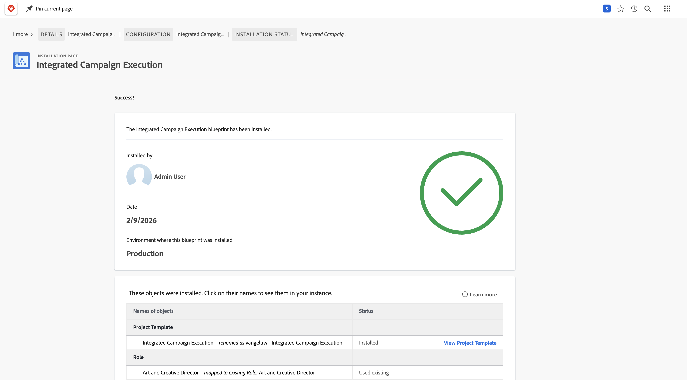
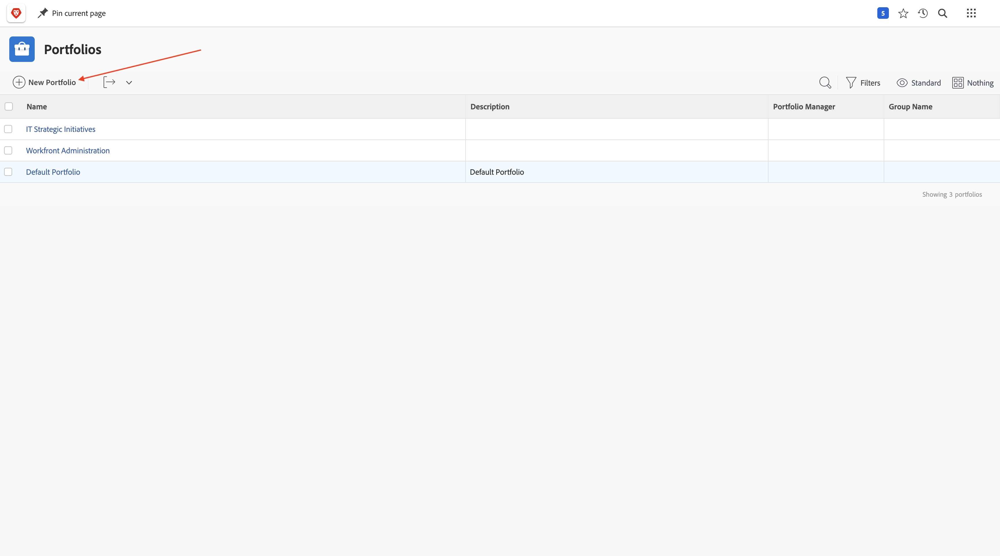
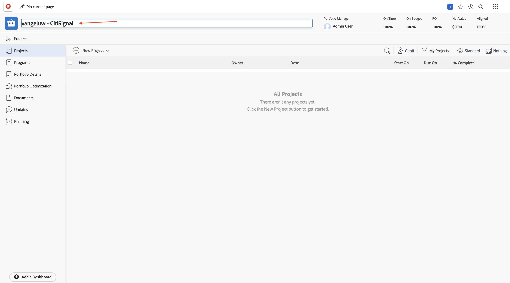
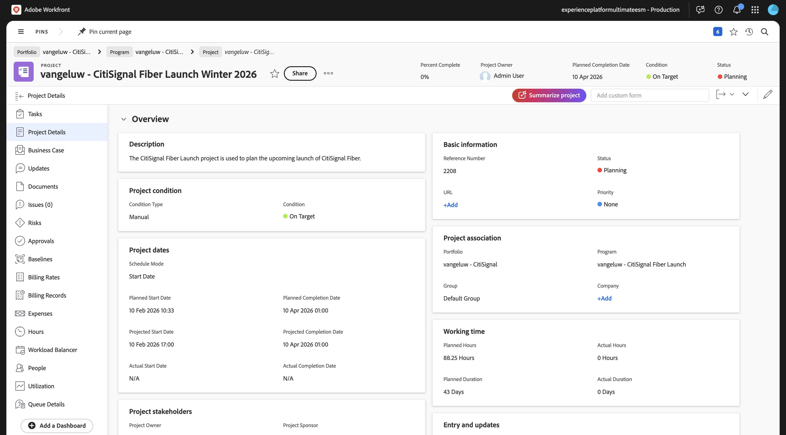
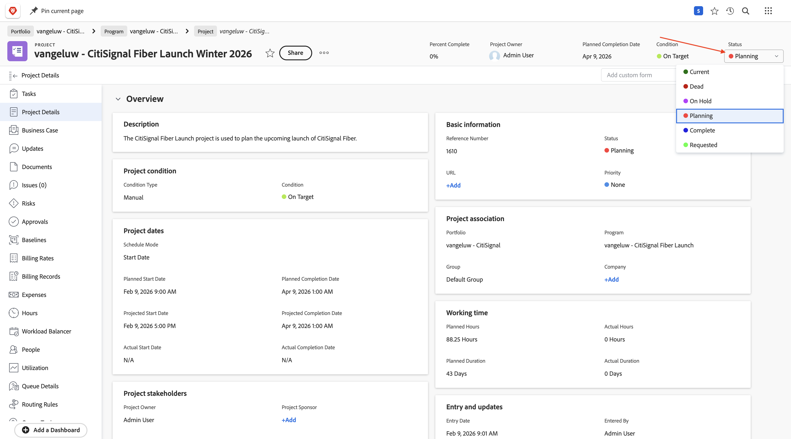
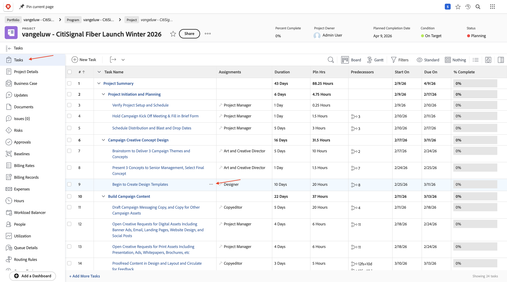

# 1.8.1 Workfront, Frame.io 및 ESM 시작하기

## 1.8.1.1 Workfront 워크플로 용어

다음은 주요 Workfront 개체 및 개념입니다.

| 이름 | 마지막 업데이트 |
| ---------------------- | ------------ | 
| 포트폴리오 | 통합 특성이 있는 프로젝트 모음입니다. 이러한 프로젝트는 일반적으로 동일한 리소스, 예산 또는 시간대에 대해 경쟁합니다. |
| 프로그램 | 잘 정의된 이점을 얻기 위해 유사한 프로젝트를 함께 그룹화할 수 있는 포트폴리오 내의 하위 집합입니다. |
| 프로젝트 | 특정 일정 내에 완료해야 하며 특정 예산과 리소스 수를 사용해야 하는 많은 양의 작업입니다. 관리하기 쉽도록 하려면 프로젝트를 일련의 작업으로 나눕니다. 모든 작업을 완료하면 프로젝트가 완료됩니다. |
| 프로젝트 템플릿 | 프로젝트 템플릿을 사용하여 조직의 프로젝트와 관련된 대부분의 반복 가능한 프로세스, 정보 및 설정을 캡처할 수 있습니다. 템플릿을 만든 후 기존 프로젝트에 첨부하거나 이를 사용하여 새 프로젝트를 빌드할 수 있습니다. |
| 작업 | 최종 목표 달성(프로젝트 완료)을 위한 단계로 수행해야 하는 활동. 작업은 독립적으로 존재할 수 없습니다. 항상 프로젝트의 일부입니다. |
| 할당 | 문제 또는 작업에 할당된 사용자, 작업 역할 또는 팀입니다. 프로젝트, 포트폴리오 또는 프로그램에는 할당이 있을 수 없습니다. |
| 문서/버전 | Workfront 내의 개체에 첨부된 모든 파일입니다. 동일한 문서가 동일한 오브젝트에 업로드될 때마다 버전 번호가 지정됩니다. 사용자는 이전 버전의 문서에 대한 몇 가지 옵션을 보고 변경할 수 있습니다. |
| 승인 | 작업, 문서 또는 타임시트와 같은 특정 작업 항목에서는 감독자 또는 다른 사용자가 해당 작업 항목을 승인해야 할 수 있습니다. 이러한 승인 프로세스를 승인이라고 합니다. |

[https://experience.adobe.com/](https://experience.adobe.com/){target="_blank"}(으)로 이동합니다. **Workfront**&#x200B;을(를) 열려면 클릭하세요.

그러면 이걸 보게 될 거야.

## 1.8.1.2 Workfront 블루프린트 사용

다음 단계에서는 템플릿을 사용하여 새 프로젝트를 만듭니다. Adobe Workfront에서는 활성화하기만 하면 되는 사용 가능한 여러 블루프린트를 제공합니다.

CitiSignal의 사용 사례의 경우 **통합 캠페인 실행** 블루프린트를 사용해야 합니다.

해당 블루프린트를 설치하려면 메뉴를 열고 **블루프린트**&#x200B;를 선택합니다.

**마케팅** 필터를 선택한 다음 아래로 스크롤하여 블루프린트 **통합 캠페인 실행**&#x200B;을 찾습니다. **설치**&#x200B;를 클릭합니다.

**계속**&#x200B;을 클릭합니다.

**프로젝트 템플릿 이름**&#x200B;을(를) `--aepUserLdap-- - Integrated Campaign Execution`(으)로 변경합니다.

**블루프린트 설치**&#x200B;를 클릭합니다.

그럼 이걸 보셔야죠 설치하는 데 2분 정도 걸릴 수 있습니다.

몇 분 후에 블루프린트가 설치됩니다.

## 1.8.1.3 새 프로젝트 만들기

**메뉴**&#x200B;를 열고 **포트폴리오**(으)로 이동합니다.

**+ 새 Portfolio**&#x200B;을(를) 클릭합니다.

포트폴리오 이름 `--aepUserLdap-- - CitiSignal`을(를) 입력하십시오.

**프로그램**(으)로 이동한 다음 **+ 새 프로그램**&#x200B;을 클릭합니다. **새 프로그램**&#x200B;을 선택하세요.

프로그램 이름 `--aepUserLdap-- CitiSignal Fiber Launch`을(를) 입력하십시오.

프로그램에서 **프로젝트**(으)로 이동합니다. **+ 새 프로젝트**&#x200B;를 클릭한 다음 **템플릿의 새 프로젝트**&#x200B;를 선택하십시오.

`--aepUserLdap-- - Integrated Campaign Execution` 템플릿을 선택하고 **템플릿 사용**&#x200B;을 클릭합니다.

그럼 이걸 보셔야죠 이름을 `--aepUserLdap-- - CitiSignal Fiber Launch Winter 2026`(으)로 변경하고 **프로젝트 만들기**&#x200B;를 클릭합니다.

이제 프로젝트가 생성되었습니다. **프로젝트 세부 정보**(으)로 이동합니다.

**프로젝트 세부 정보**(으)로 이동합니다. **설명**&#x200B;에서 현재 텍스트를 선택하려면 클릭하세요.

설명을 `The CitiSignal Fiber Launch project is used to plan the upcoming launch of CitiSignal Fiber.`(으)로 설정

**변경 내용 저장**&#x200B;을 클릭합니다.

이제 프로젝트를 사용할 준비가 되었습니다.

프로젝트의 작업 및 종속성은 선택한 템플릿을 기반으로 생성되었으며 사용자로 설정되었습니다. 프로젝트 소유자. 프로젝트의 상태가 **계획**(으)로 설정되었습니다. 목록에서 다른 값을 선택하여 프로젝트의 상태를 변경할 수 있습니다.

## Frame.io의 1.8.1.4 프로젝트 보기

[https://next.frame.io/](https://next.frame.io/){target="_blank"}(으)로 이동합니다. 로그인하고 사용할 인스턴스를 선택합니다. 이 예제에서는 **Experience Platform International ESM**&#x200B;입니다. 방금 만든 프로젝트의 Frame.io에 폴더가 이미 있습니다. 폴더 이름은 이전에 입력한 프로젝트 이름의 이름을 따릅니다.

이는 Workfront 및 Frame.io를 포함하여 Adobe 엔터프라이즈 제품 전반에 걸쳐 에셋의 중앙 저장소 역할을 하는 클라우드 기반 스토리지 솔루션인 엔터프라이즈 스토리지 관리의 기능입니다.

Adobe 엔터프라이즈 스토리지의 주요 이점은 다음과 같습니다.

- 크리에이티브 및 작업 관리 자산을 위한 통합 스토리지 레이어
- 보안 액세스 제어를 위해 Adobe IMS(Identity Management system)를 통해 중앙 집중식 권한
- Workfront 및 Frame.io에서 전체 에셋 가시성
- 엔터프라이즈 요구 사항에 맞는 확장 가능한 스토리지 및 할당량 관리

## 1.8.1.5 새 작업 만들기

Gop는 Workfront으로 돌아왔습니다. **작업**(으)로 이동하고 **디자인 템플릿 만들기 시작** 작업을 마우스로 가리킨 다음 세 점 **..**&#x200B;을(를) 클릭합니다.

**아래에 작업 삽입** 옵션을 선택하십시오.

작업 이름 `Create layout using approved assets and copy`을(를) 입력하십시오.

**할당** 필드를 **Designer** 역할로 설정합니다.
필드 **기간**&#x200B;을(를) **5일**(으)로 설정합니다.
필드 전임 작업을 **9**(으)로 설정합니다.
필드 **시작 일자** 및 **기한 일자**&#x200B;를 입력하십시오(이 작업의 시작 일자는 이전 작업의 종료 일자 이후여야 함).

화면에서 다른 위치를 클릭하여 새 작업을 저장합니다.

그럼 이걸 보셔야죠 작업을 클릭하여 엽니다.

**작업 세부 정보**(으)로 이동하여 **설명** 필드를 `This task is used to track the progress of the creation of the assets for the CitiSignal Fiber Launch Campaign.`(으)로 설정합니다.

**변경 내용 저장**&#x200B;을 클릭합니다.

그럼 이걸 보셔야죠 **할당** 필드를 클릭하고 **나에게 할당**&#x200B;을 선택합니다.

**저장**&#x200B;을 클릭합니다.

**작업**&#x200B;을 클릭하세요.

그럼 이걸 보셔야죠

이 작업의 일부로 새 자산을 만들어야 합니다. 다음 단계에서는 먼저 디자이너가 예상되는 내용을 알 수 있도록 Workfront에서 참조 이미지를 제공합니다. 그런 다음 Designer의 역할로 전환하고 Adobe Express을 사용하여 해당 에셋을 직접 만듭니다.

## 1.8.1.6 참조 이미지 업로드

참조 이미지 [여기](./assets/reference_images.zip)를 데스크톱에 다운로드하고 압축을 풉니다.

Workfront에서 **프로젝트** 수준으로 이동합니다.

**문서**(으)로 이동하고 **+ 새로 추가**&#x200B;를 클릭한 다음 **문서**&#x200B;를 선택합니다.

다운로드한 폴더에 참조 이미지가 포함되어 있는 로 이동합니다. 모든 이미지를 선택하고 **열기**&#x200B;를 클릭합니다.

몇 분 후에 모든 이미지가 업로드되어 프로젝트에 첨부됩니다.

참조 이미지가 있는 디자이너는 이제 이 캠페인에 대한 새 에셋을 만들 수 있습니다.

## 다음 단계

다음 단계: [새 에셋을 만들고 검토 및 승인](./ex2.md){target="_blank"}

[Workfront, Frame.io 및 Enterprise Storage Management를 사용한 통합 검토 및 승인](./esm.md){target="_blank"}(으)로 돌아가기

[모든 모듈](./../../../overview.md){target="_blank"}(으)로 돌아가기
