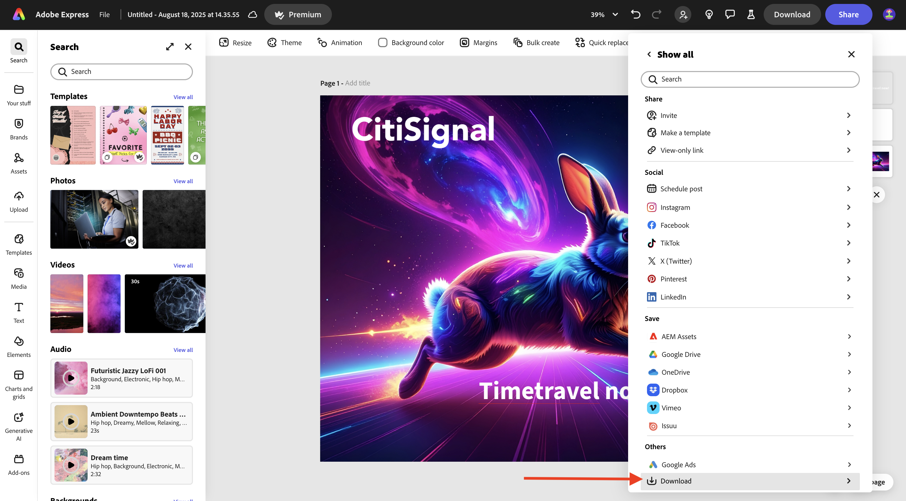
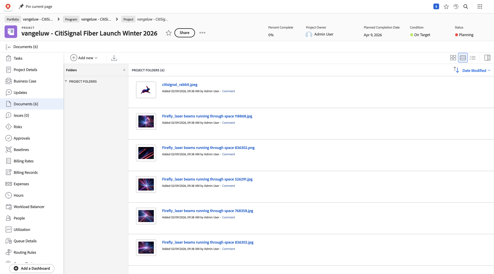
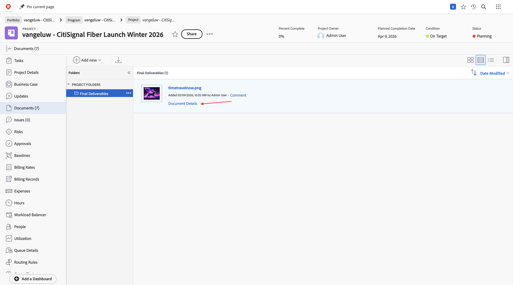
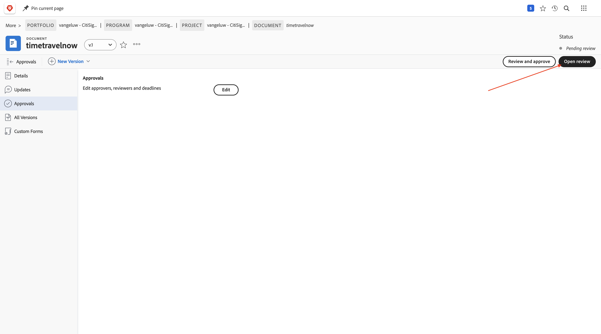

# 1.8.2 새 에셋 만들기, 검토 및 승인

## 1.8.2.1 Frame.io에서 참조 이미지 확인

[https://next.frame.io/](https://next.frame.io/){target="_blank"}(으)로 이동합니다. 를 클릭하여 프로젝트의 폴더를 엽니다.

이제 Workfront에 제공된 모든 참조 이미지가 표시됩니다. 이제 디자이너는 보안 환경에서 Workfront에 업로드된 모든 파일에 자동으로 액세스할 수 있습니다.

**+**&#x200B;을(를) 클릭한 다음 **새 폴더**&#x200B;을(를) 선택합니다.

`Final Deliverables` 이름을 입력하고 **enter**&#x200B;를 누르십시오. 이 폴더는 designerL이 만들 최종 문서를 업로드하는 데 사용됩니다.

## 1.8.2.2 Adobe Firefly Services 및 Adobe Express을 사용하여 새 에셋 만들기

>[!NOTE]
>
>새 자산을 직접 만들지 않으려는 경우 완료된 버전 [여기](./images/timetravelnow.png)를 다운로드할 수 있습니다.

[https://firefly.adobe.com/](https://firefly.adobe.com/){target="_blank"}(으)로 이동합니다. `a neon rabbit running very fast through space` 프롬프트를 입력하고 **생성**&#x200B;을 클릭합니다.

그런 다음 여러 이미지가 생성되는 것을 볼 수 있습니다. 가장 좋아하는 이미지를 선택하고 **공유** 아이콘을 클릭한 다음 **Adobe Express에서 열기**&#x200B;를 선택합니다.

그러면 방금 생성한 이미지를 Adobe Express에서 편집할 수 있게 됩니다. 이제 이미지에 CitiSignal 로고를 추가해야 합니다. 이렇게 하려면 **브랜드**(으)로 이동하십시오.

그러면 CitiSignal 브랜드 템플릿이 표시됩니다. GenStudio for Performance Marketing에서 만든 이 이름은 Adobe Express에 나타납니다. 이름에 `CitiSignal`이(가) 있는 브랜드 템플릿을 선택하려면 클릭하세요.

**로고**(으)로 이동한 다음 **흰색** Citigsignal 로고를 클릭하여 이미지에 놓습니다.

CitiSignal 로고를 중간에서 너무 멀지 않은 이미지 맨 위에 배치합니다.

**텍스트**(으)로 이동합니다.

**텍스트 추가**&#x200B;를 클릭합니다.

`Timetravel now!` 텍스트를 입력하고 글꼴 색상과 글꼴 크기를 변경하고 이 텍스트와 유사한 이미지를 갖도록 텍스트를 **굵게**(으)로 설정합니다.

**공유**&#x200B;를 클릭합니다.

**클릭... 모두 표시**.

아래로 스크롤하고 **다운로드**&#x200B;를 선택합니다.

**다운로드**&#x200B;를 클릭합니다.

그런 다음 로컬 컴퓨터에 자산을 보유하게 됩니다.

파일 이름을 `timetravelnow.png`(으)로 변경합니다.

## 1.8.2.3 Frame.io에서 자산을 검토합니다.

[https://next.frame.io/](https://next.frame.io/){target="_blank"}(으)로 돌아가서 프로젝트의 폴더를 엽니다.

**업로드**&#x200B;를 클릭합니다.

**timetravelnow.png** 파일을 선택하고 **열기**&#x200B;를 클릭합니다.

그럼 이걸 보셔야죠

상태를 **검토 필요**(으)로 변경한 다음 이미지를 두 번 클릭하여 엽니다.

환경에서 검토자 중 한 명에게 태그를 지정하고 다음과 같은 메시지를 추가합니다. `ready for your feedback on this one`

그런 다음 검토자가 주석을 달아 변경 작업을 수행하거나 상태가 양호한지 확인할 수 있습니다.

## 1.8.2.4 Workfront에서 자산을 확인합니다.

디자인 팀이 제작하는 에셋에 대해 반복하는 동안 Workfront의 프로젝트 관리자는 현재 진행 중인 에셋을 따라 작업을 수행할 수 있습니다. Workfront으로 돌아갑니다. 페이지를 새로 고칩니다.

이제 Frame.io에서 만든 폴더가 Workfront에 나타납니다. 클릭하여 엽니다.

그럼 이걸 보셔야죠 **timetravelnow.png** 파일을 마우스로 가리킨 다음 **문서 세부 정보**&#x200B;를 클릭합니다.

프로젝트 관리자는 이제 해당 이미지의 현재 버전을 볼 수 있으므로 어떤 일이 일어나고 있으며 이 작업이 활발하게 진행되고 있는지 알 수 있습니다.

## 1.8.2.5 자산 승인

Workfront에서 **승인**(으)로 이동하여 **추가**&#x200B;를 클릭합니다.

자신을 승인자로 추가한 다음 **요청 제출**&#x200B;을 클릭합니다.

그럼 이걸 보셔야죠 **검토 열기**&#x200B;를 클릭하면 Frame.io로 이동합니다.

Frame.io에서 모든 주석을 보고 자산을 검토할 수 있습니다. **의사 결정** 필드를 열려면 클릭하세요.

**승인됨**&#x200B;을(를) 선택합니다.

Workfront으로 다시 전환하고 페이지를 새로 고치면 여기에서 상태도 변경됩니다. 에셋이 승인되었으며 다음으로 게재 및 활성화에 사용할 수 있습니다.

## 다음 단계

[Workfront, Frame.io 및 Enterprise Storage Management를 사용한 통합 검토 및 승인](./esm.md){target="_blank"}(으)로 돌아가기

[모든 모듈](./../../../overview.md){target="_blank"}(으)로 돌아가기
