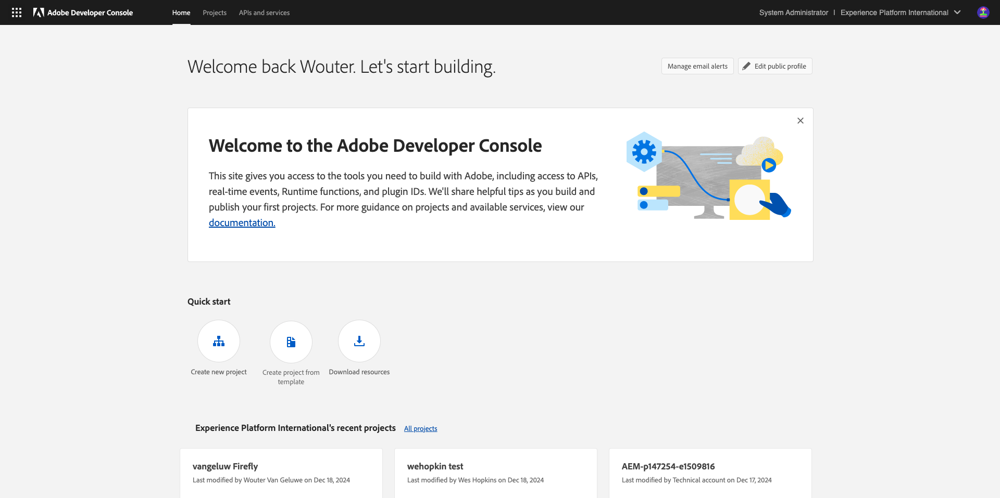
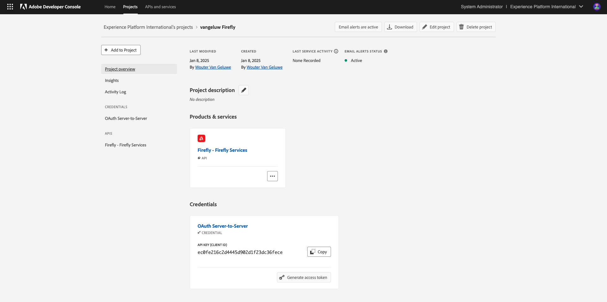
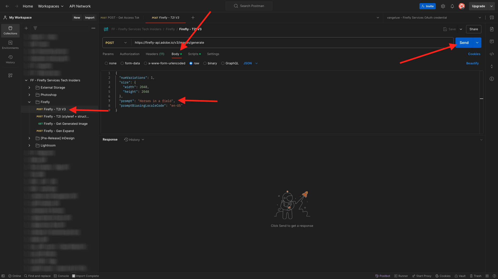

# 1.1.1 Firefly 서비스 시작하기

Postman 및 Adobe I/O을 사용하여 Adobe Firefly 서비스 API를 쿼리하는 방법에 대해 알아봅니다.

## 1.1.1.1 Adobe I/O 프로젝트 구성

이 연습에서는 Firefly 서비스 API에 대해 쿼리하는 데 Adobe I/O을 사용합니다. Adobe I/O을 설정하려면 다음 단계를 따르십시오.

1. [https://developer.adobe.com/console/home](https://developer.adobe.com/console/home){target="_blank"}(으)로 이동합니다.

{zoomable="yes"}

1. 화면 오른쪽 상단 모서리에서 올바른 인스턴스를 선택해야 합니다. 인스턴스는 `--aepImsOrgName--`입니다. **새 프로젝트 만들기**&#x200B;를 선택합니다.

{zoomable="yes"}

1. **+ 프로젝트에 추가**&#x200B;를 선택하고 **API**&#x200B;를 선택합니다.

{zoomable="yes"}

화면이 다음과 같아야 합니다.

{zoomable="yes"}

1. **Creative Cloud**&#x200B;을 선택하고 **Firefly - Firefly 서비스**&#x200B;을 선택한 후 **다음**&#x200B;을 선택합니다.

{zoomable="yes"}

1. 자격 증명의 이름을 지정하십시오. `--aepUserLdap-- - Firefly Services OAuth credential`다음 **다음**&#x200B;을 선택하세요.

{zoomable="yes"}

1. 기본 프로필 **기본 Firefly 서비스 구성**&#x200B;을 선택하고 **구성된 API 저장**&#x200B;을 선택합니다.

{zoomable="yes"}

이제 Adobe I/O 통합이 준비되었습니다.

{zoomable="yes"}

## 1.1.1.2 Postman 환경 다운로드

1. **Postman용 다운로드**&#x200B;를 선택한 다음 **OAuth 서버 간**&#x200B;을(를) 선택하여 Postman 환경을 다운로드합니다.

{zoomable="yes"}

1. 프로젝트 이름을 선택합니다.

{zoomable="yes"}

1. **프로젝트 편집**&#x200B;을 선택합니다.

{zoomable="yes"}

1. 통합 이름을 입력하십시오. `--aepUserLdap-- Firefly`다음 **저장**&#x200B;을 선택합니다.

{zoomable="yes"}

이제 Adobe I/O 통합 설정이 완료되었습니다.

{zoomable="yes"}

## 1.1.1.3 Adobe I/O에 대한 Postman 인증

>[!IMPORTANT]
>
>Adobe 직원의 경우 [PostBuster](./../../../postbuster.md)을(를) 사용하려면 여기 지침을 따르십시오.

1. [Postman 다운로드](https://www.postman.com/downloads/){target="_blank"}에서 OS용 Postman의 관련 버전을 다운로드하여 설치하십시오.

{zoomable="yes"}

1. 응용 프로그램을 시작합니다.

Postman에는 환경과 컬렉션의 두 가지 개념이 있습니다.

- 환경 파일에는 거의 일관되지 않은 모든 환경 변수가 포함되어 있습니다. 환경에서는 클라이언트 ID 및 기타 같은 보안 자격 증명과 함께 Adobe 환경의 IMSOrg와 같은 항목을 찾을 수 있습니다. 이전에 Adobe I/O 설정 중에 환경 파일을 다운로드했으며 이름이 **`oauth_server_to_server.postman_environment.json`**&#x200B;입니다.

- 컬렉션에는 사용할 수 있는 여러 API 요청이 포함되어 있습니다. 2개의 컬렉션을 사용합니다.
   - Adobe I/O 인증을 위한 1개 컬렉션
   - 이 단원의 연습에 대한 컬렉션 1개

1. 로컬 데스크톱에 [postman-ff.zip](./../../../assets/postman/postman-ff.zip)을(를) 다운로드합니다.

{zoomable="yes"}

**postman.zip** 파일에 다음 파일이 있습니다.

    - &#39;Adobe IO - OAuth.postman_collection.json&#39;
    - &#39;FF - Firefly 서비스 기술 내부자.postman_collection.json&#39;

1. **postman-ff.zip**&#x200B;의 압축을 풀고 다음 2개의 파일을 바탕 화면의 폴더에 저장합니다.
- Adobe IO - OAuth.postman_collection.json
- FF - Firefly 서비스 기술 내부자.postman_collection.json
- oauth_server_to_server.postman_environment.json

{zoomable="yes"}

1. Postman에서 **가져오기**&#x200B;를 선택합니다.

{zoomable="yes"}

1. **파일**&#x200B;을 선택하세요.

{zoomable="yes"}

1. 폴더에서 세 개의 파일을 선택한 다음 **열기** 및 **가져오기**&#x200B;를 선택합니다.

{zoomable="yes"}

{zoomable="yes"}

아니요. API를 통해 Firefly 서비스와 상호 작용할 수 있도록 Postman에 필요한 모든 기능을 갖추고 있습니다.

## 1.1.1.4 액세스 토큰 요청

그런 다음 올바르게 인증되었는지 확인하려면 액세스 토큰을 요청해야 합니다.

1. 오른쪽 상단의 환경 드롭다운 목록을 확인하여 요청을 실행하기 전에 올바른 환경을 선택했는지 확인하십시오. 선택한 환경의 이름은 이 `--aepUserLdap-- Firefly Services OAuth Credential`과(와) 유사해야 합니다.

{zoomable="yes"}

선택한 환경의 이름은 이 `--aepUserLdap-- Firefly Services OAuth Credential`과(와) 유사해야 합니다.

{zoomable="yes"}

이제 Postman 환경 및 컬렉션이 구성되고 작동하므로 Postman에서 Adobe I/O으로 인증할 수 있습니다.

1. **Adobe IO - OAuth** 컬렉션에서 이름이 **POST - 액세스 토큰 가져오기**&#x200B;인 요청을 선택하고 **전송**&#x200B;을 선택합니다.

**쿼리 매개 변수** 아래에 두 개의 변수 `API_KEY` 및 `CLIENT_SECRET`이(가) 참조되었습니다. 이 변수는 선택한 환경 `--aepUserLdap-- Firefly Services OAuth Credential`에서 가져온 것입니다.

{zoomable="yes"}

성공하면 전달자 토큰, 액세스 토큰 및 만료 창이 포함된 응답이 Postman의 **Body** 섹션에 표시됩니다.

{zoomable="yes"}

다음 정보가 포함된 유사한 응답이 표시됩니다.

| 키 | 값 |
|:-------------:| :---------------:| 
| token_type | **전달자** |
| access_token | **eyJhbGciOiJSU...** |
| expires_in | **86399** |

**전달자 토큰** Adobe I/O에 특정 값(매우 긴 access_token)과 만료 창이 있으며, 이제 24시간 동안 유효합니다. 즉, 24시간 후 Postman을 사용하여 Adobe I/O을 인증하려면 이 요청을 다시 실행하여 새 토큰을 생성해야 합니다.

## 1.1.1.5 Firefly 서비스 API, 텍스트 2 이미지

이제 Firefly 서비스 API에 첫 번째 요청을 보낼 준비가 되었습니다.

1. **FF - Firefly 서비스 기술 내부자** 컬렉션에서 이름이 **POST - Firefly - T2I V3**&#x200B;인 요청을 선택합니다.

{zoomable="yes"}

1. 응답에서 이미지 URL을 복사하여 웹 브라우저에서 열어 이미지를 봅니다.

{zoomable="yes"}

`horses in a field`을(를) 묘사하는 멋진 이미지를 볼 수 있습니다.

{zoomable="yes"}

다음 연습을 계속하기 전에 언제든지 API 요청을 재생하십시오.

## 다음 단계

[Microsoft Azure 및 사전 서명된 URL을 사용하여 Firefly 프로세스 최적화](./ex2.md){target="_blank"}(으)로 이동

[Adobe Firefly 서비스 개요](./firefly-services.md){target="_blank"}(으)로 돌아가기

[모든 모듈](./../../../overview.md){target="_blank"}(으)로 돌아가기
