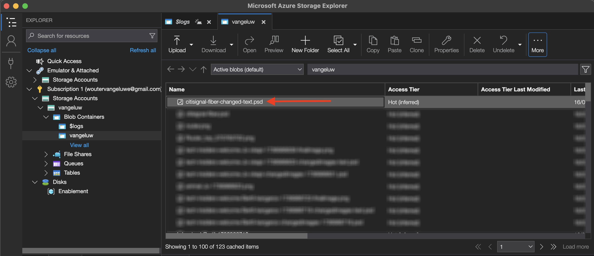

# 1.1.3 Photoshop API 작업

## 1.1.3.1 Adobe I/O 통합 업데이트

[https://developer.adobe.com/console/home](https://developer.adobe.com/console/home)(으)로 이동합니다.


**프로젝트**(으)로 이동한 다음 클릭하여 이전 연습에서 만든 프로젝트를 엽니다. 이 프로젝트는 `--aepUserLdap-- Firefly`입니다.


**+ 프로젝트에 추가**&#x200B;를 클릭한 다음 **API**&#x200B;를 클릭합니다.


**Creative Cloud**&#x200B;을(를) 선택하고 **Photoshop - Firefly 서비스**&#x200B;를 클릭합니다. **다음**&#x200B;을 클릭합니다.


**다음**&#x200B;을 클릭합니다.


그런 다음 이 통합에 사용할 수 있는 권한을 정의할 제품 프로필을 선택해야 합니다.

프로필 **기본 Firefly 서비스 구성** 및 **기본 Creative Cloud 자동화 서비스 구성**&#x200B;을 선택하십시오.

**구성된 API 저장**&#x200B;을 클릭합니다.


이제 Adobe I/O 프로젝트가 Photoshop 및 Firefly 서비스 API와 작동하도록 업데이트되었습니다.


## 1.1.3.2 프로그래밍 방식으로 PSD 파일과 상호 작용합니다

파일을 다운로드합니다. 데스크톱으로 [citisignal-fiber.psd](./../../../assets/ff/citisignal-fiber.psd)(으)로 이동합니다.

Photoshop에서 **citisignal-fiber.psd** 파일을 엽니다. 그럼 이걸 드셔보세요


**레이어** 창에서는 파일의 디자이너가 각 레이어에 고유한 이름을 지정했음을 알 수 있습니다. Photoshop에서 PSD 파일을 열어 레이어 정보를 볼 수 있지만 프로그래밍 방식으로 수행할 수도 있습니다.

첫 번째 API 요청을 Photoshop API로 전송하겠습니다.

Postman으로 이동합니다. Photoshop에 API 요청을 전송하기 전에 Adobe I/O을 인증해야 합니다. 이전에 사용한 요청을 **POST - 액세스 토큰 가져오기**(으)로 바꿉니다.

**Params**(으)로 이동하여 매개 변수 **Scope**&#x200B;이(가) 제대로 설정되어 있는지 확인하십시오. **범위**&#x200B;의 **값**&#x200B;은(는) 다음과 같이 표시되어야 합니다.

`openid,session,AdobeID,read_organizations,additional_info.projectedProductContext, ff_apis, firefly_api`

그런 다음 **보내기**&#x200B;를 클릭합니다.


그러면 Photoshop API와 상호 작용할 수 있는 유효한 액세스 토큰이 있습니다.


### 1.1.3.2.1 Photoshop API - Hello World

다음으로 모든 권한 및 액세스가 올바르게 설정되었는지 테스트하기 위해 Photoshop API에 대해 알아보겠습니다. **Photoshop** 컬렉션에서 이름이 **Photoshop Hello(테스트 인증)인 요청을 엽니다.** 질문에 답합니다. **보내기**&#x200B;를 클릭합니다.


그러면 다음 응답을 받게 됩니다. **Photoshop API 시작!**.


그런 다음 PSD 파일 **citisignal-fiber.psd**&#x200B;과(와) 프로그래밍 방식으로 상호 작용하려면 저장소 계정에 업로드해야 합니다. Azure 저장소 탐색기를 사용하여 컨테이너에 끌어다 놓아 수동으로 수행할 수 있지만, 이번에는 API를 통해 수행해야 합니다.

### 1.1.3.2.2 Azure에 PSD 업로드

Postman에서 **Azure 저장소 계정에 PSD 업로드** 요청을 엽니다. 이전 연습에서는 이제 사용할 Postman에서 이러한 환경 변수를 구성했습니다.

- `AZURE_STORAGE_URL`
- `AZURE_STORAGE_CONTAINER`
- `AZURE_STORAGE_SAS_READ`
- `AZURE_STORAGE_SAS_WRITE`

**Azure 저장소 계정에 PSD 업로드** 요청에서 볼 수 있듯이 URL은 이러한 변수를 사용하도록 구성되어 있습니다.


이제 **Body**&#x200B;에서 **citisignal-fiber.psd** 파일을 추가해야 합니다.


그럼 이걸 드셔보세요 **보내기**&#x200B;를 클릭합니다.


그런 다음 Azure에서 이 빈 응답을 다시 가져와야 합니다. 즉, 파일은 Azure 저장소 계정의 컨테이너에 저장됩니다.


Azure Storage Explorer를 사용하여 보면 폴더를 새로 고친 후 파일이 표시됩니다.


### 1.1.3.2.3 Photoshop API - 매니페스트 가져오기

그런 다음 PSD 파일의 매니페스트 파일을 가져와야 합니다. Postman에서 요청 **Photoshop - PSD 매니페스트 가져오기**&#x200B;를 엽니다. **본문**(으)로 이동합니다.

본문은 다음과 같아야 합니다.

```json
{
  "inputs": [
    {
      "storage": "external",
      "href": "{{AZURE_STORAGE_URL}}/{{AZURE_STORAGE_CONTAINER}}/citisignal-fiber.psd{{AZURE_STORAGE_SAS_READ}}"
    }
  ],
  "options": {
    "thumbnails": {
      "type": "image/jpeg"
    }
  }
}
```

**보내기**&#x200B;를 클릭합니다.

응답에서 이제 링크가 표시됩니다. Photoshop의 작업이 완료되는 데 시간이 걸릴 수 있으므로 Photoshop은 대부분의 수신 요청에 대한 응답으로 상태 파일을 제공합니다. 요청의 상황을 이해하려면 상태 파일을 읽어야 합니다.


상태 파일을 읽으려면 **Photoshop - PS 상태 가져오기** 요청을 여십시오. 그러면 이 요청에서 변수를 URL로 사용하는 것을 볼 수 있습니다. 이 URL은 보낸 이전 요청인 **Photoshop - PSD 매니페스트 가져오기**&#x200B;에 의해 설정된 변수입니다. 변수가 각 요청의 **스크립트**&#x200B;에 설정되어 있습니다.

**보내기**&#x200B;를 클릭합니다.


그럼 이걸 보셔야죠 현재 상태가 **보류 중**(으)로 설정되어 있습니다. 즉, 프로세스가 아직 완료되지 않았습니다.


상태가 **성공**(으)로 변경될 때까지 **Photoshop - PS 상태 가져오기** 요청에서 두 번 더 보내기를 클릭할 수 있습니다. 몇 분 정도 걸릴 수 있습니다.

응답을 사용할 수 있으면 PSD 파일의 모든 레이어에 대한 정보가 포함된 json 파일이 표시됩니다. 여기에서 레이어 이름 또는 레이어 ID와 같은 정보를 볼 수 있으므로 유용한 정보입니다.


예를 들어 `2048x2048-cta` 텍스트를 검색합니다. 그럼 이걸 보셔야죠


### 1.1.3.2.4 Photoshop API - 텍스트 변경

다음으로, 이제 API를 사용하여 클릭 유도 문안 텍스트를 변경해야 합니다. Postman에서 **Photoshop - 텍스트 변경** 요청을 열고 **본문**(으)로 이동합니다.

그럼 이걸 보셔야죠 다음을 확인할 수 있습니다.

- 먼저 입력 파일을 지정했습니다. `citisignal-fiber.psd`
- 두 번째로 변경할 레이어가 지정되고 변경할 텍스트가 지정됩니다
- 셋째, 출력 파일이 지정되었습니다. `citisignal-fiber-changed-text.psd`

```json
{
  "inputs": [
    {
      "storage": "external",
      "href": "{{AZURE_STORAGE_URL}}/{{AZURE_STORAGE_CONTAINER}}/citisignal-fiber.psd{{AZURE_STORAGE_SAS_READ}}"
    }
  ],
  "options": {
    "layers": [
      {
        "name": "2048x2048-cta",
        "text": {
          "content": "Get Fiber now!"
        }
      }
    ]
  },
  "outputs": [
    {
      "storage": "azure",
      "href": "{{AZURE_STORAGE_URL}}/{{AZURE_STORAGE_CONTAINER}}/citisignal-fiber-changed-text.psd{{AZURE_STORAGE_SAS_WRITE}}",
      "type": "vnd.adobe.photoshop",
      "overwrite": true
    }
  ]
}
```

원본 입력 파일을 재정의하지 않으려는 경우 출력 파일의 이름이 다릅니다.

**보내기**&#x200B;를 클릭합니다.


이전과 마찬가지로 응답에는 진행 상황을 계속 추적하는 상태 파일을 가리키는 링크가 포함되어 있습니다.


상태 파일을 읽으려면 **Photoshop - PS 상태 가져오기** 요청을 다시 열고 **보내기**&#x200B;를 클릭하십시오. 상태가 즉시 **성공**(으)로 설정되지 않은 경우 몇 초 정도 기다린 후 **보내기**&#x200B;를 다시 클릭합니다.

상태가 **성공**(으)로 설정되면 이 상태가 표시됩니다. `outputs[0]._links.renditions[0].href` 경로에 Photoshop에서 만들고 변경된 텍스트를 포함하는 출력 파일의 URL이 표시됩니다.

출력 파일을 다운로드하려면 URL을 클릭합니다.


그런 다음 **citisignal-fiber-changed-text.psd** 파일이 컴퓨터로 다운로드되고 나면 파일을 열 수 있습니다. 그러면 콜 투 액션의 자리 표시자가 **지금 Fiber 가져오기!** 텍스트로 바뀌었습니다.


마지막으로 Azure Storage 탐색기를 사용하여 컨테이너에 해당 파일도 표시됩니다.



이제 이 연습을 완료했습니다.

다음 단계: [요약 및 이점](./summary.md)

[모듈 1.1로 돌아가기](./firefly-services.md)

[모든 모듈로 돌아가기](./../../../overview.md)
