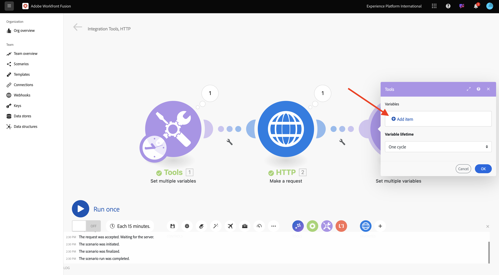
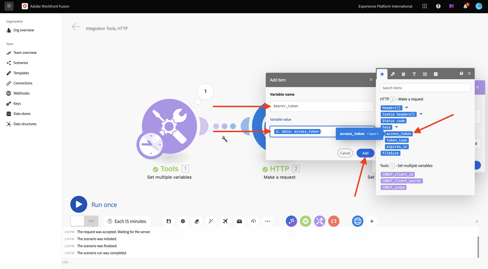
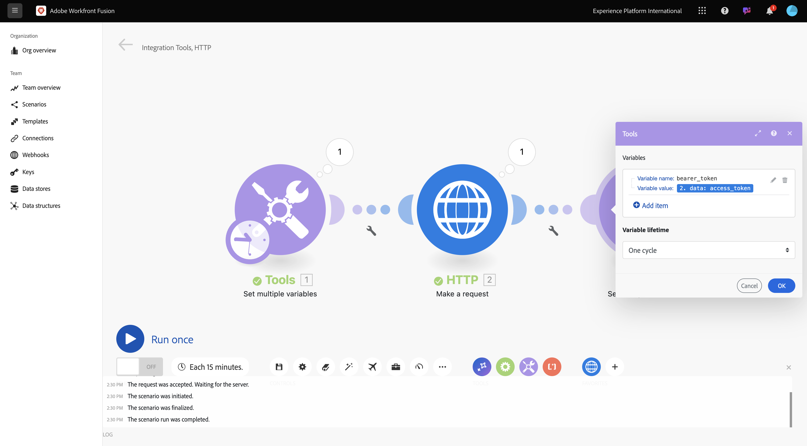
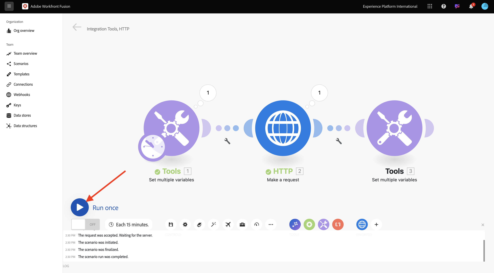

# 1.2.1 Workfront Fusion 시작하기

이 연습에서는 Workfront Fusion 및 Adobe I/O 를 사용하여 Adobe Firefly 서비스 API를 쿼리합니다.

## 1.2.1.1 새 시나리오 만들기

[https://experience.adobe.com/](https://experience.adobe.com/)(으)로 이동합니다. **Workfront Fusion**&#x200B;을 열려면 클릭하세요.

그럼 이걸 보셔야죠 **시나리오**(으)로 이동합니다.

새 폴더를 만들려면 **+** 아이콘을 클릭하십시오.

폴더 이름은 `--aepUserLdap--`을(를) 사용합니다. **저장**&#x200B;을 클릭합니다.

폴더를 선택한 다음 **새 시나리오 만들기**&#x200B;를 클릭합니다.

그러면 빈 시나리오가 표시됩니다. **도구** 아이콘을 클릭하고 **여러 변수 설정**&#x200B;을 선택합니다.

이제 **시계** 아이콘을 새로 추가된 **여러 변수 설정** 위로 이동해야 합니다.

그러면 이걸 보게 될 거야.

그런 다음 물음표를 마우스 오른쪽 단추로 클릭하고 **모듈 삭제**&#x200B;를 선택합니다.

그런 다음 **여러 변수 설정** 개체를 마우스 오른쪽 단추로 클릭하고 **설정**&#x200B;을 선택합니다.

## 1.2.1.2 Adobe I/O 인증 구성

이제 Adobe I/O에 대해 인증하는 데 필요한 변수를 구성해야 합니다. 이전 연습에서는 Adobe I/O 프로젝트를 만들었습니다. 이제 Workfront Fusion에서 해당 Adobe I/O 프로젝트의 변수를 정의해야 합니다.

다음 변수를 정의해야 합니다.

| 키 | 값 |
|:-------------:| :---------------:| 
| `CONST_client_id` | Adobe I/O 프로젝트 클라이언트 ID |
| `CONST_client_secret` | Adobe I/O 프로젝트 클라이언트 암호 |
| `CONST_scope` | Adobe I/O 프로젝트 범위 |

[https://developer.adobe.com/console/projects](https://developer.adobe.com/console/projects)(으)로 이동하여 이름이 `--aepUserLdap-- Firefly`인 Adobe I/O 프로젝트를 열면 이러한 변수를 찾을 수 있습니다.

프로젝트에서 **OAuth Serverto-Server**&#x200B;을(를) 클릭하여 위의 키에 대한 값을 확인합니다.

위의 키와 값을 사용하여 **여러 변수를 설정** 개체를 구성할 수 있습니다. **항목 추가**&#x200B;를 클릭합니다.

**변수 이름**: **CONST_client_id** 및 해당 **변수 값**&#x200B;을(를) 입력하고 **추가**&#x200B;를 클릭하십시오.

**항목 추가**&#x200B;를 클릭합니다.

**변수 이름**: **CONST_client_secret** 및 해당 **변수 값**&#x200B;을(를) 입력하고 **추가**&#x200B;를 클릭하십시오.

**항목 추가**&#x200B;를 클릭합니다.

**변수 이름**: **CONST_scope** 및 해당 **변수 값**&#x200B;을(를) 입력하고 **추가**&#x200B;를 클릭하십시오.

**확인**&#x200B;을 클릭합니다.

**여러 변수 설정** 개체 위에 마우스를 놓고 큰 **+** 아이콘을 클릭하여 다른 모듈을 추가합니다.

그럼 이걸 보셔야죠

검색 창에서 **http**&#x200B;을(를) 입력하십시오. **HTTP**&#x200B;을(를) 선택하여 엽니다.

**요청**&#x200B;을 선택합니다.

| 키 | 값 |
|:-------------:| :---------------:| 
| `URL` | `https://ims-na1.adobelogin.com/ims/token/v3` |
| `Method` | `POST` |
| `Body Type` | `x-www-form-urlencoded` |

**항목 추가**&#x200B;를 클릭합니다.

아래 각 값에 대한 항목을 추가합니다.

| 키 | 값 |
|:-------------:| :---------------:| 
| `client_id` | `CONST_client_id`에 대해 미리 정의된 변수 |
| `client_secret` | `CONST_client_secret`에 대해 미리 정의된 변수 |
| `scope` | `CONST_scope`에 대해 미리 정의된 변수 |
| `grant_type` | `client_credentials` |

`client_id`에 대한 구성입니다.

`client_secret`에 대한 구성입니다.

`scope`에 대한 구성입니다.

`grant_type`에 대한 구성입니다.

구성 개요. 아래로 스크롤하여 **구문 분석 응답**&#x200B;에 대한 확인란을 선택하십시오. **확인**&#x200B;을 클릭합니다.

그럼 이걸 보셔야죠 **한 번 실행**&#x200B;을 클릭합니다.

시나리오가 실행되면 이 메시지가 표시됩니다.

**여러 변수 설정** 개체에서 **물음표** 아이콘을 클릭하여 해당 개체가 실행될 때 발생한 상황을 확인합니다.

**HTTP - 요청 만들기** 개체에서 **물음표** 아이콘을 클릭하여 해당 개체가 실행될 때 발생한 상황을 확인합니다. **OUTPUT**&#x200B;에 Adobe I/O이 반환한 **access_token**&#x200B;이(가) 표시됩니다.

**HTTP - 요청** 개체 위에 마우스를 놓고 **+** 아이콘을 클릭하여 다른 모듈을 추가합니다.

검색 창에서 `tools`을(를) 검색합니다. **도구**&#x200B;를 선택하십시오.

**여러 변수 설정**&#x200B;을 선택합니다.

**항목 추가**&#x200B;를 선택합니다.

**변수 이름**&#x200B;을(를) `bearer_token`(으)로 설정합니다. `access_token`을(를) 동적 **변수 값**(으)로 선택합니다. **추가**&#x200B;를 클릭하세요.

그럼 이걸 드셔보세요 **확인**&#x200B;을 클릭합니다.

**한 번 실행**&#x200B;을 다시 클릭합니다.

시나리오가 실행되면 마지막 **여러 변수 설정** 개체에서 **물음표** 아이콘을 클릭합니다. 그러면 access_token이 `bearer_token` 변수에 저장되어 있는지 확인해야 합니다.

그런 다음 첫 번째 개체 **여러 값을 설정**&#x200B;을 마우스 오른쪽 단추로 클릭하고 **이름 바꾸기**&#x200B;를 선택합니다.

이름을 **Initialize 상수**(으)로 설정합니다. **확인**&#x200B;을 클릭합니다.

두 번째 개체의 이름을 바꾸고 이름을 **Adobe I/O 인증**(으)로 설정합니다. **확인**&#x200B;을 클릭합니다.

세 번째 개체의 이름을 바꾸고 이름을 **전달자 토큰 설정**(으)로 설정합니다. **확인**&#x200B;을 클릭합니다.

그럼 이걸 드셔보세요

그런 다음 시나리오 이름을 `--aepUSerLdap-- - Adobe I/O Authentication`(으)로 변경합니다.

**저장**&#x200B;을 클릭합니다.

다음 단계: [1.2.2 Workfront Fusion 내에서 Adobe API 사용](./ex2.md)

[모듈 1.2로 돌아가기](./automation.md)

[모든 모듈로 돌아가기](./../../../overview.md)
