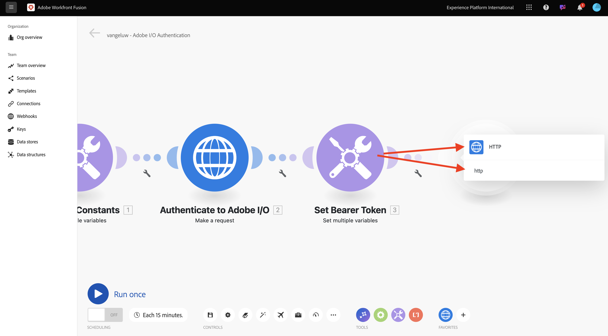
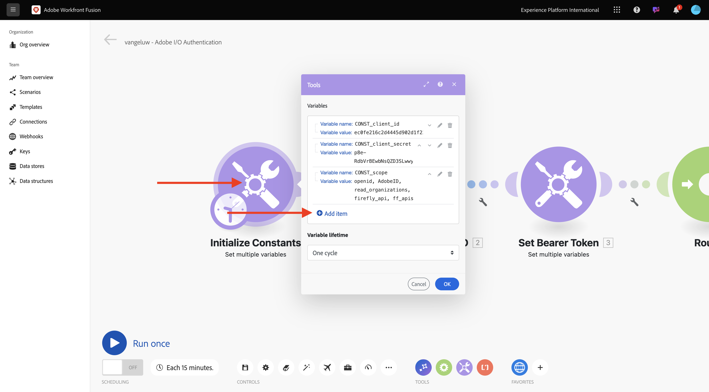
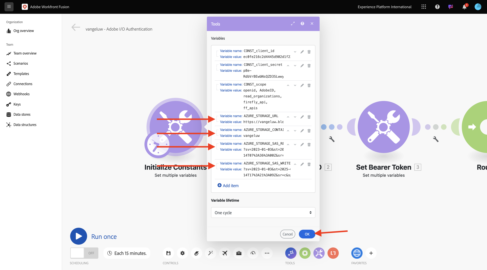

# 1.2.2 Workfront Fusion 내에서 Adobe API 사용

## 1.2.2.1 Workfront Fusion에서 Firefly 텍스트를 사용하여 API 이미지 만들기

다른 모듈을 추가하려면 두 번째 **여러 변수 설정** 노드 위로 마우스를 가져간 후 **+**&#x200B;을(를) 클릭하십시오.


**http**&#x200B;을(를) 검색한 다음 **HTTP**&#x200B;을(를) 선택하십시오.



**요청**&#x200B;을 선택합니다.


다음 변수를 선택합니다.

- **URL**: `https://firefly-api.adobe.io/v3/images/generate`
- **메서드**: `POST`

**헤더 추가**&#x200B;를 클릭합니다.


다음 헤더를 입력해야 합니다.

| 키 | 값 |
|:-------------:| :---------------:| 
| `x-api-key` | `CONST_client_id`에 대해 저장된 변수 |
| `Authorization` | `Bearer ` + `bearer_token`에 대해 저장된 변수 |
| `Content-Type` | `application/json` |
| `Accept` | `*/*` |

`x-api-key`에 대한 세부 정보를 입력하십시오. **추가를 클릭합니다**.


**헤더 추가**&#x200B;를 클릭합니다.


`Authorization`에 대한 세부 정보를 입력하십시오. **추가를 클릭합니다**.


**헤더 추가**&#x200B;를 클릭합니다. `Content-Type`에 대한 세부 정보를 입력하십시오. **추가를 클릭합니다**.


**헤더 추가**&#x200B;를 클릭합니다. `Accept`에 대한 세부 정보를 입력하십시오. **추가를 클릭합니다**.


**본문 유형**&#x200B;을(를) **원시**(으)로 설정합니다. **콘텐츠 형식**&#x200B;의 경우 **JSON(application/json)**&#x200B;을(를) 선택하십시오.


이 페이로드를 **콘텐츠 요청** 필드에 붙여 넣으십시오.

```json
{
  "numVariations": 1,
  "size": {
    "width": 2048,
    "height": 2048
  },
  "prompt": "Horses in a field",
  "promptBiasingLocaleCode": "en-US"
}
```

**응답 구문 분석**&#x200B;에 대한 확인란을 선택하십시오. **확인**&#x200B;을 클릭합니다.


**한 번 실행**&#x200B;을 클릭합니다.


시나리오가 실행되면 이 메시지가 표시됩니다.


**을(를) 클릭하세요?네 번째 노드 HTTP의** 아이콘으로 응답을 볼 수 있습니다. 응답에 이미지 파일이 표시됩니다.


이미지 URL을 복사하여 브라우저 창에서 엽니다. 그러면 다음과 같은 메시지가 표시됩니다.


**HTTP** 개체를 마우스 오른쪽 단추로 클릭하고 이름을 **Firefly T2I**(으)로 바꾸십시오.


변경 내용을 저장하려면 **저장**&#x200B;을 클릭하세요.


## 1.2.2.2 Workfront Fusion에서 Photoshop API 사용

**전달자 토큰 설정** 및 **Firefly T2I** 노드 사이의 **렌치** 아이콘을 클릭합니다. **라우터 추가**&#x200B;를 선택하십시오.


**Firefly T2I** 개체를 마우스 오른쪽 단추로 클릭하고 **복제**&#x200B;를 선택합니다.


복제된 개체를 **Router** 개체 가까이 끌어다 놓으면 **Router**&#x200B;에 자동으로 연결됩니다. 그럼 이걸 드셔보세요


이제 **Firefly T2I** HTTP 요청에 따라 동일한 복사본이 있습니다. **Firefly T2I** HTTP 요청의 일부 설정은 시간 절약제인 **Photoshop API**&#x200B;와 상호 작용해야 하는 설정과 유사합니다. 이제 요청 URL 및 페이로드와 같이 동일하지 않은 변수만 변경하면 됩니다.

**URL**&#x200B;을(를) `https://image.adobe.io/pie/psdService/text`(으)로 변경합니다.


**요청 콘텐츠**&#x200B;를 아래 페이로드로 바꿉니다.

```json
{
  "inputs": [
    {
      "storage": "external",
      "href": "{{AZURE_STORAGE_URL}}/{{AZURE_STORAGE_CONTAINER}}/sevoi-psd.psd{{AZURE_STORAGE_SAS_READ}}"
    }
  ],
  "options": {
    "layers": [
      {
        "name": "2048x2048-button",
        "text": {
          "content": "Click here"
        }
      },
      {
        "name": "2048x2048-cta",
        "text": {
          "content": "Buy this stuff"
        }
      }
    ]
  },
  "outputs": [
    {
      "storage": "azure",
      "href": "{{AZURE_STORAGE_URL}}/{{AZURE_STORAGE_CONTAINER}}/sevoi-psd-changed-text.psd{{AZURE_STORAGE_SAS_WRITE}}",
      "type": "vnd.adobe.photoshop",
      "overwrite": true
    }
  ]
}
```


이 **콘텐츠 요청**&#x200B;이 제대로 작동하려면 일부 변수가 없습니다.

- `AZURE_STORAGE_URL`
- `AZURE_STORAGE_CONTAINER`
- `AZURE_STORAGE_SAS_READ`
- `AZURE_STORAGE_SAS_WRITE`

첫 번째 노드로 돌아가서 **상수 초기화**&#x200B;를 클릭한 다음 이러한 각 변수에 대해 **항목 추가**&#x200B;를 선택합니다.



| 키 | 예제 값 |
|:-------------:| :---------------:| 
| `AZURE_STORAGE_URL` | `https://vangeluw.blob.core.windows.net` |
| `AZURE_STORAGE_CONTAINER` | `vangeluw` |
| `AZURE_STORAGE_SAS_READ` | `?sv=2023-01-03&st=2025-01-13T07%3A36%3A35Z&se=2026-01-14T07%3A36%3A00Z&sr=c&sp=rl&sig=4r%2FcSJLlt%2BSt9HdFdN0VzWURxRK6UqhB8TEvbWkmAag%3D` |
| `AZURE_STORAGE_SAS_WRITE` | `?sv=2023-01-03&st=2025-01-13T17%3A21%3A09Z&se=2025-01-14T17%3A21%3A09Z&sr=c&sp=racwl&sig=FD4m0YyyqUj%2B5T8YyTFJDi55RiTDC9xKtLTgW0CShps%3D` |

Postman으로 돌아가서 **환경 변수**&#x200B;를 열어 변수를 찾을 수 있습니다.


이 값을 Workfront Fusion에 복사하고 이 4개 변수 각각에 대해 새 항목을 추가합니다.

그럼 이걸 드셔보세요 **확인**&#x200B;을 클릭합니다.



그런 다음 복제된 HTTP 요청으로 돌아가 **요청 콘텐츠**&#x200B;를 업데이트합니다. Postman에서 복사한 변수인 **요청 콘텐츠**&#x200B;에 검정색 변수가 표시됩니다. 이제 Workfront Fusion에서 방금 정의한 변수로 변경해야 합니다. 검정색 텍스트를 삭제하고 올바른 변수로 교체하여 각 변수를 하나씩 바꿉니다.


**입력** 섹션에 세 가지 변경 사항이 있습니다.


**출력** 섹션에도 3가지 변경 사항이 있습니다. **확인**&#x200B;을 클릭합니다.


복제된 노드를 마우스 오른쪽 단추로 클릭하고 **이름 바꾸기**&#x200B;를 선택합니다. 이름을 **Photoshop 텍스트 변경**(으)로 변경합니다.


그럼 이걸 드셔보세요


다음 단계: [1.2.3 ...](./ex3.md)

[모듈 1.2로 돌아가기](./automation.md)

[모든 모듈로 돌아가기](./../../../overview.md)
