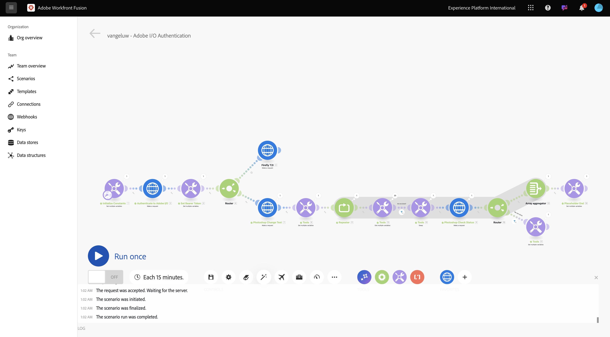

# 1.2.3 Workfront Fusion을 사용한 프로세스 자동화

이제 시나리오가 다음과 같습니다.



## 1.2.3.1 여러 값에 대해 반복

지금까지 Photoshop 파일의 텍스트를 정적 값으로 변경했습니다. 콘텐츠 제작 워크플로의 크기를 조정하고 자동화하려면 값 목록을 반복하고 해당 값을 Photoshop 파일에 동적으로 삽입해야 합니다. 다음 단계에서는 기존 시나리오의 값 반복을 추가합니다.

**라우터** 노드와 **Photoshop 변경 텍스트** 노드 사이에서 **렌치** 아이콘을 클릭하고 **모듈 추가**&#x200B;를 선택합니다.


`flow`을(를) 검색하고 **흐름 제어**&#x200B;를 선택합니다.


**반복자**&#x200B;를 선택하십시오.


그럼 이걸 드셔보세요


CSV 파일과 같은 입력 파일을 읽을 수 있지만, 지금은 텍스트 문자열을 정의하고 해당 텍스트 파일을 분할하여 CSV 파일의 기본 버전을 사용해야 합니다.

**T** 아이콘을 클릭하여 **split** 함수를 찾을 수 있습니다. 이 아이콘을 클릭하면 텍스트 값을 조작하는 데 사용할 수 있는 모든 함수가 표시됩니다. **split** 함수를 클릭하면 이 함수가 표시됩니다.


분할 함수에서는 세미콜론 앞에 값 배열을 예상하며 세미콜론 뒤에 구분 기호를 지정해야 합니다. 이 테스트에서는 2개의 필드 **지금 구입** 및 **여기를 클릭**&#x200B;하는 간단한 배열을 사용해야 하며 사용할 구분 기호는 **,**&#x200B;입니다.

현재 비어 있는 **split** 함수 `{{split("Buy now, Click here "; ",")}}`을(를) 바꾸어 **Array** 필드에 이 함수를 입력하십시오. **확인**&#x200B;을 클릭합니다.


이제 반복기가 구성되었으며 지금 시나리오를 실행하는 경우 해당 반복기가 두 번 실행됩니다. 현재 **Photoshop 텍스트 변경** 노드에서 정적 값을 사용하고 있으므로 문제가 계속 발생합니다. 입력 및 출력 필드의 정적 값 대신 일부 변수를 추가하려면 **Photoshop 텍스트 변경**&#x200B;을 클릭합니다.


**콘텐츠 요청**&#x200B;에 **여기를 클릭하세요** 텍스트가 표시됩니다. 이 텍스트는 배열에서 나오는 값으로 대체해야 합니다.


**여기를 클릭하세요** 텍스트를 삭제하고 **반복자** 노드에서 변수 **값**&#x200B;을(를) 선택하여 대체합니다. 이렇게 하면 Photoshop 문서의 버튼에 대한 텍스트가 동적으로 업데이트됩니다.


Azure 저장소 계정에서 파일을 쓰는 데 사용되는 파일 이름도 업데이트해야 합니다. 파일 이름이 정적인 경우 모든 새 반복이 이전 파일을 덮어쓰게 되므로 사용자 정의된 파일을 잃게 됩니다. 현재 정적 파일 이름은 **sevoi-psd-changed-text.psd**&#x200B;이며 지금 업데이트해야 합니다. 단어 `text` 뒤에 커서를 놓습니다.


먼저 하이픈 `-`을(를) 추가한 다음 **번들 순서 위치** 값을 선택합니다. 이렇게 하면 첫 번째 반복의 경우 Workfront Fusion에서 파일 이름에 `-1`을(를) 추가하고 두 번째 반복 `-2`을(를) 추가합니다. **확인**&#x200B;을 클릭합니다.


시나리오를 저장한 다음 **한 번 실행**&#x200B;을 클릭합니다.


시나리오가 실행되면 Azure 스토리지 탐색기로 돌아가서 폴더를 새로 고칩니다. 그러면 새로 만든 파일 2개가 표시됩니다.


각 파일을 다운로드하여 엽니다. 그러면 버튼에 여러 가지 글자가 적혀 있는 것을 볼 수 있을 거예요 `sevoi-psd-changed-text-1.psd` 파일입니다.


`sevoi-psd-changed-text-2.psd` 파일입니다.


## 1.2.3.2 Webhook을 사용하여 시나리오 활성화

지금까지 수동으로 시나리오를 실행하여 테스트했습니다. 이제 외부 환경에서 활성화할 수 있도록 웹후크로 시나리오를 업데이트하겠습니다.

**+** 아이콘을 클릭하고 **Webhook**&#x200B;을(를) 검색한 다음 **Webhooks**&#x200B;을(를) 선택하십시오.


**사용자 지정 웹후크**&#x200B;를 선택하십시오.

**사용자 지정 Webhook** 노드를 드래그하여 캔버스의 첫 번째 노드에 연결할 수 있습니다. 이를 **Initialize Constants**&#x200B;이라고 합니다.


**사용자 지정 Webhook** 노드를 클릭합니다. **추가**&#x200B;를 클릭합니다.


**Webhook 이름**&#x200B;을(를) `--aepUserLdap-- - Tutorial 1.2`(으)로 설정합니다.


**요청 헤더 가져오기**&#x200B;에 대한 확인란을 선택합니다. **저장**&#x200B;을 클릭합니다.


이제 웹후크 URL을 사용할 수 있습니다. URL을 복사합니다.


Postman을 열고 **FF - Firefly 서비스 기술 내부자** 컬렉션에 새 폴더를 추가합니다.


폴더 이름을 `--aepUserLdap-- - Workfront Fusion`(으)로 지정합니다.


방금 만든 폴더에서 세 점 **..**&#x200B;을(를) 클릭하고 **요청 추가**&#x200B;를 선택합니다.


**메서드 형식**&#x200B;을(를) **POST**(으)로 설정하고 주소 표시줄에 웹후크의 URL을 붙여 넣습니다.


변수 요소를 외부 소스에서 Workfront Fusion 시나리오로 제공할 수 있도록 사용자 지정 본문을 보내야 합니다. **본문**(으)로 이동한 다음 **원시**&#x200B;을(를) 선택합니다.


아래 텍스트를 요청 본문에 붙여넣습니다. **보내기**&#x200B;를 클릭합니다.

```json
{
    "psdTemplate": "placeholder",
    "xlsFile": "placeholder"
}
```


Workfront Fusion으로 돌아갑니다. 이제 사용자 지정 웹후크에 **확인함**&#x200B;을(를) 나타내는 메시지가 표시됩니다.


**저장**&#x200B;을 클릭한 다음 **한 번 실행**&#x200B;을 클릭합니다. 이제 시나리오가 활성화되지만 Postman에서 **보내기**&#x200B;를 다시 클릭해야 실행됩니다.


Postman으로 이동한 다음 **보내기**&#x200B;를 다시 클릭합니다.


그런 다음 시나리오가 다시 실행되고 이전과 마찬가지로 2개의 파일이 만들어집니다.


마지막으로 Postman 요청 이름을 `POST - Send Request to Workfront Fusion Webhook`(으)로 변경합니다.


다음 단계: [요약 및 이점](./summary.md)

[모듈 1.2로 돌아가기](./automation.md)

[모든 모듈로 돌아가기](./../../../overview.md)
