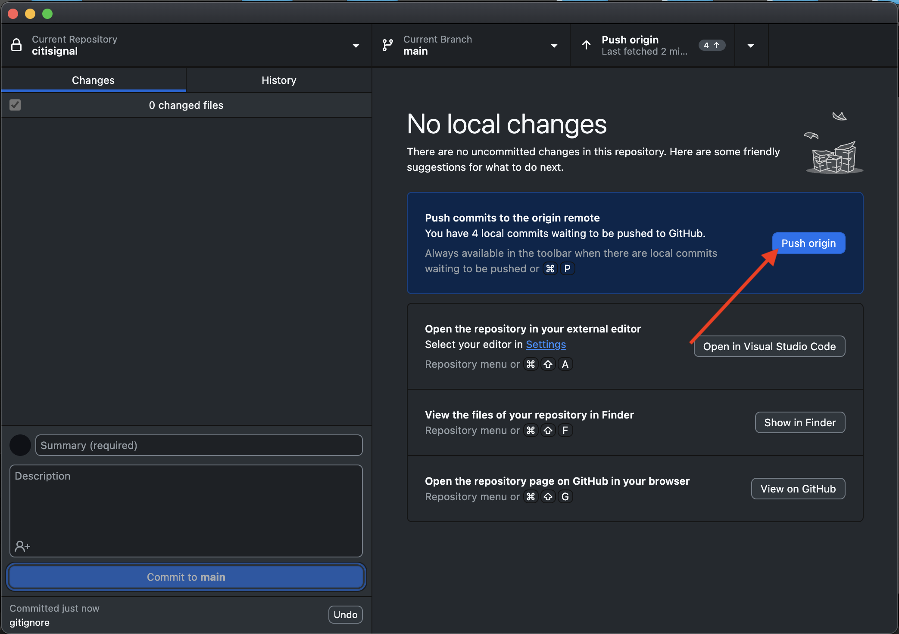

# 2.1.6 AEM Edge Delivery Services MarTech 플러그인

AEM MarTech 플러그인은 AEM 프로젝트에 대한 전체 MarTech 스택을 빠르게 설정하는 데 도움이 됩니다.

>[!NOTE]
>
>이 플러그인은 현재 공동 혁신 프로젝트를 통해 AEM 엔지니어링과 협업하여 고객이 사용할 수 있습니다. [https://github.com/adobe-rnd/aem-martech](https://github.com/adobe-rnd/aem-martech)에서 자세한 정보를 찾을 수 있습니다.

**citsignal** GitHub 리포지토리에 사용 중인 폴더로 이동합니다. 폴더 이름을 마우스 오른쪽 단추로 클릭한 다음 **폴더의 새 터미널**&#x200B;을 선택합니다.


그러면 이걸 보게 될 거야. 다음 명령을 붙여 넣고 **enter**&#x200B;를 누르십시오.

```
git subtree add --squash --prefix plugins/martech https://github.com/adobe/aem-experimentation.git main
```

그럼 이걸 보셔야죠


**citsignal** GitHub 리포지토리에 사용 중인 폴더로 이동하여 **plugins** 폴더를 엽니다. 이제 이름이 **martech**&#x200B;인 폴더가 표시됩니다.


Visual Studio 코드에서 **head.html** 파일을 엽니다. 아래 코드를 복사하여 **head.html** 파일에 붙여넣습니다.

```javascript
<link rel="preload" as="script" crossorigin="anonymous" href="/plugins/martech/src/index.js"/>
<link rel="preload" as="script" crossorigin="anonymous" href="/plugins/martech/src/alloy.min.js"/>
<link rel="preconnect" href="https://edge.adobedc.net"/>
<!-- change to adobedc.demdex.net if you enable third party cookies -->
```

변경 내용을 저장합니다.


Visual Studio 코드에서 **scripts** 폴더로 이동하여 **scripts.js** 파일을 엽니다. 아래 코드를 복사하여 기존 가져오기 스크립트 아래의 **scripts.js** 파일에 붙여넣습니다.

```javascript
import {
  initMartech,
  updateUserConsent,
  martechEager,
  martechLazy,
  martechDelayed,
} from '../plugins/martech/src/index.js';
```

변경 내용을 저장합니다.


```javascript
const isConsentGiven = true;
  const martechLoadedPromise = initMartech(
    // The WebSDK config
    // Documentation: https://experienceleague.adobe.com/en/docs/experience-platform/web-sdk/commands/configure/overview#configure-js
    {
      datastreamId: "045c5ee9-468f-47d5-ae9b-a29788f5948f",
      orgId: "907075E95BF479EC0A495C73@AdobeOrg",
      onBeforeEventSend: (payload) => {
        // set custom Target params 
        // see doc at https://experienceleague.adobe.com/en/docs/platform-learn/migrate-target-to-websdk/send-parameters#parameter-mapping-summary
        payload.data.__adobe.target ||= {};

        // set custom Analytics params
        // see doc at https://experienceleague.adobe.com/en/docs/analytics/implementation/aep-edge/data-var-mapping
        payload.data.__adobe.analytics ||= {};
      },

      // set custom datastream overrides
      // see doc at:
      // - https://experienceleague.adobe.com/en/docs/experience-platform/web-sdk/commands/datastream-overrides
      // - https://experienceleague.adobe.com/en/docs/experience-platform/datastreams/overrides
      edgeConfigOverrides: {
        // Override the datastream id
        // datastreamId: '...'

        // Override AEP event datasets
        // com_adobe_experience_platform: {
        //   datasets: {
        //     event: {
        //       datasetId: '...'
        //     }
        //   }
        // },

        // Override the Analytics report suites
        // com_adobe_analytics: {
        //   reportSuites: ['...']
        // },

        // Override the Target property token
        // com_adobe_target: {
        //   propertyToken: '...'
        // }
      },
    },
    // The library config
    {
      launchUrls: ["https://assets.adobedtm.com/b754ed1bed61/b9f7c7c484de/launch-28b548849fb9.min.js"],
      personalization: !!getMetadata('target') && isConsentGiven,
    },
  );
```


```javascript
if (main) {
    decorateMain(main);
    await Promise.all([
      martechLoadedPromise.then(martechEager),
      waitForLCP(LCP_BLOCKS),
    ]);
  }
```


```javascript
await martechLazy();
```


```javascript
window.setTimeout(() => {
    martechDelayed();
    return import('./delayed.js');
  }, 3000);
```




이제 GitHub 사용자 계정(이 예에서는 `woutervangeluwe`)으로 XXX를 바꾼 후 `main--citisignal--XXX.aem.page/us/en` 및/또는 `main--citisignal--XXX.aem.live/us/en`(으)로 이동하여 웹 사이트에 대한 변경 사항을 볼 수 있습니다.

이 예에서 전체 URL은 다음과 같이 됩니다.
`https://main--citisignal--woutervangeluwe.aem.page/us/en` 및/또는 `https://main--citisignal--woutervangeluwe.aem.live/us/en`.

다음 단계: [요약 및 이점](./summary.md){target="_blank"}

[모듈 2.1로 돌아가기](./aemcs.md){target="_blank"}

[모든 모듈로 돌아가기](./../../../overview.md){target="_blank"}
