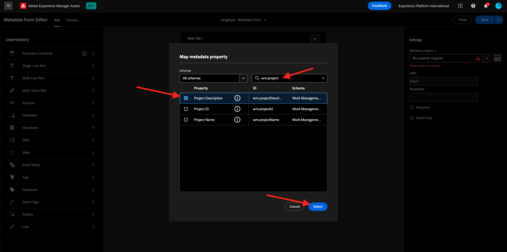
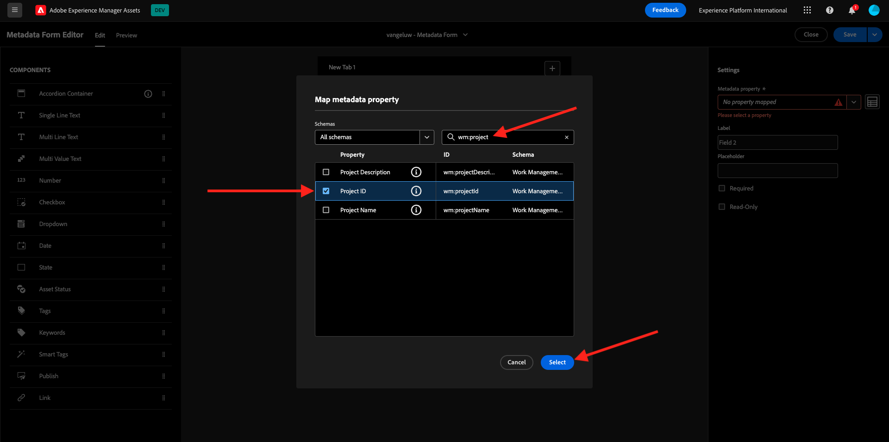
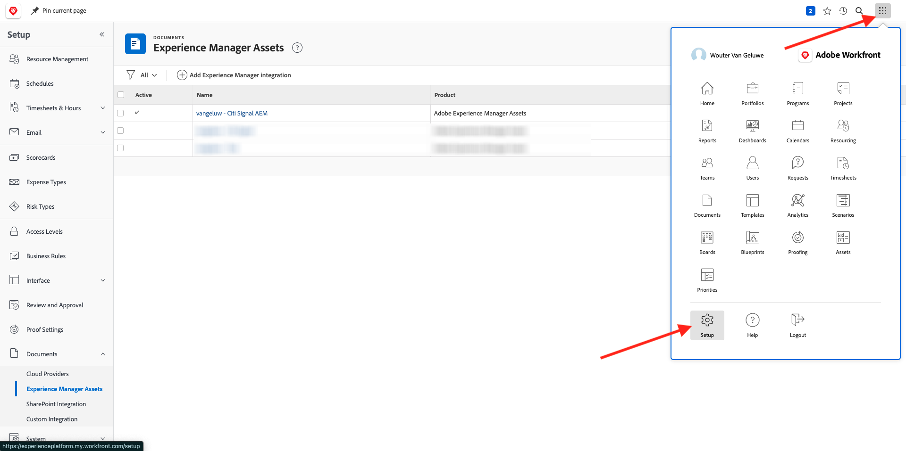

# 2.2.1 Workfront 시작하기

[https://experienceplatform.my.workfront.com/](https://experienceplatform.my.workfront.com/){target="_blank"}(으)로 이동하여 Adobe Workfront에 로그인합니다.

그럼 이걸 보게나

## 2.2.1.1 AEM Assets 통합 구성

9개 점 **햄버거** 아이콘을 클릭한 다음 **설정**&#x200B;을 선택합니다.

왼쪽 메뉴에서 **문서**(으)로 스크롤한 다음 **Experience Manager Assets**&#x200B;을 클릭합니다.

**+ Experience Manager 통합 추가**&#x200B;를 클릭합니다.

통합 이름은 `--aepUserLdap-- - Citi Signal AEM`을(를) 사용합니다.

**Experience Manager 저장소** 드롭다운을 열고 `--aepUserLdap-- - Citi Signal`(으)로 지정해야 하는 AEM CS 인스턴스를 선택합니다.

**메타데이터**&#x200B;에서 다음 매핑을 구성합니다.

| Workfront 필드 | Experience Manager Assets 필드 |
| --------------- | ------------------------------ | 
| **문서** > **이름** | **wm:documentName** |
| **프로젝트** > **설명** | **wm:projectDescription** |
| **작업** > **이름** | **wm:taskName** |
| **작업** > **설명** | **wm:taskDescription** |

**개체 메타데이터 동기화**&#x200B;에 대해 스위치를 사용하도록 설정하십시오.

**저장**&#x200B;을 클릭합니다.

이제 Workfront에서 AEM Assets CS로의 통합이 구성되었습니다.

## 2.2.1.2 AEM Assets과 메타데이터 통합 구성

다음으로, AEM Assets에 있는 에셋의 메타데이터 필드를 AEM과 공유하도록 Workfront을 구성해야 합니다.

이렇게 하려면 [https://experience.adobe.com/](https://experience.adobe.com/)(으)로 이동하십시오. **Experience Manager Assets**&#x200B;을(를) 클릭합니다.

`--aepUserLdap-- - Citi Signal dev`(이)라는 이름을 지정해야 하는 AEM Assets 환경을 선택하려면 클릭하십시오.

그럼 이걸 보셔야죠 왼쪽 메뉴에서 **Assets**(으)로 이동하여 **폴더 만들기**&#x200B;를 클릭합니다.

폴더 이름을 `--aepUserLdap-- - Workfront Assets`로 지정하고 **만들기**&#x200B;를 클릭합니다.

그런 다음 왼쪽 메뉴에서 **메타데이터 Forms**(으)로 이동한 다음 **만들기**&#x200B;를 클릭합니다.

이름 `--aepUserLdap-- - Metadata Form`을(를) 사용하고 **만들기**&#x200B;를 클릭합니다.

3개의 새 **한 줄 텍스트** 필드를 양식에 추가하고 첫 번째 필드를 선택합니다. 그런 다음 **메타데이터 속성** 필드 옆에 있는 **스키마** 아이콘을 클릭합니다.

검색 필드에 `wm:project`을(를) 입력한 다음 **프로젝트 설명** 필드를 선택합니다. **선택**&#x200B;을 클릭합니다.

필드의 레이블을 **프로젝트 설명**(으)로 변경합니다.

그런 다음 두 번째 **한 줄 텍스트** 필드를 선택하고 **메타데이터 속성** 필드 옆에 있는 **스키마** 아이콘을 다시 클릭합니다.

그러면 이 팝업이 다시 표시됩니다. 검색 필드에 `wm:project`을(를) 입력한 다음 **프로젝트 ID** 필드를 선택합니다. **선택**&#x200B;을 클릭합니다.

필드의 레이블을 **프로젝트 ID**(으)로 변경합니다.

세 번째 **한 줄 텍스트** 필드를 선택하고 **메타데이터 속성** 필드 옆에 있는 **스키마** 아이콘을 다시 클릭합니다.

그러면 이 팝업이 다시 표시됩니다. 검색 필드에 `wm:project`을(를) 입력한 다음 **프로젝트 이름** 필드를 선택합니다. **선택**&#x200B;을 클릭합니다.

필드의 레이블을 **프로젝트 이름**(으)로 변경합니다. **저장**&#x200B;을 클릭합니다.

양식의 **Tab 이름**&#x200B;을(를) `--aepUserLdap-- - Workfront Metadata`(으)로 변경합니다. **저장** 및 **닫기**&#x200B;를 클릭합니다.

**메타데이터 양식**&#x200B;이(가) 구성되었습니다.

그런 다음 이전에 만든 폴더에 메타데이터 양식을 할당해야 합니다. 메타데이터 양식에 대한 확인란을 선택하고 **폴더에 할당**&#x200B;을 클릭합니다.

폴더 이름을 `--aepUserLdap-- - Workfront Assets`(으)로 지정합니다. **할당**&#x200B;을 클릭합니다.

이제 메타데이터 양식이 폴더에 할당되었습니다.

## 2.2.1.2 AEM Sites 통합 구성

>[!NOTE]
>
>이 플러그인은 현재 **조기 액세스** 모드이며 아직 일반적으로 사용할 수 없습니다.
>
>이 플러그인은 사용 중인 Workfront 인스턴스에 이미 설치되어 있을 수 있습니다. 이미 설치되어 있는 경우 아래 지침을 검토할 수 있지만 구성에서 변경할 필요가 없습니다.

[https://experience.adobe.com/#/@experienceplatform/aem/extension-manager/universal-editor](https://experience.adobe.com/#/@experienceplatform/aem/extension-manager/universal-editor){target="_blank"}(으)로 이동합니다.

이 플러그인의 **toggle**&#x200B;이(가) **활성화됨**(으)로 설정되어 있는지 확인하십시오. 그런 다음 **톱니바퀴** 아이콘을 클릭합니다.

**확장 구성** 팝업이 표시됩니다. 이 플러그인을 사용하도록 다음 필드를 구성합니다.

| 키 | 값 |
| --------------- | ------------------------------ | 
| **`IMS_ENV`** | **PROD** |
| **`WORKFRONT_INSTANCE_URL`** | **https://experienceplatform.my.workfront.com** |
| **`SHOW_CUSTOM_FORMS`** | **&#39;{&quot;previewUrl&quot;: true, &quot;publishUrl&quot;: true}&#39;** |

**저장**&#x200B;을 클릭합니다.

Workfront UI로 돌아가서 9개 점 **햄버거** 아이콘을 클릭합니다. **설치**&#x200B;를 선택하십시오.

왼쪽 메뉴에서 **사용자 지정 Forms**(으)로 이동하여 **양식**&#x200B;을(를) 선택합니다. **+ 새 사용자 정의 양식**&#x200B;을 클릭합니다.

**작업**&#x200B;을 선택하고 **계속**&#x200B;을 클릭합니다.

그러면 빈 사용자 정의 양식이 표시됩니다. 양식 이름 `Content Fragment & Integration ID`을(를) 입력하십시오.

새 **한 줄 텍스트** 필드를 캔버스로 끌어서 놓습니다.

다음과 같이 새 필드를 구성합니다.

- **레이블**: **콘텐츠 조각**
- **이름**: **`aem_workfront_integration_content_fragment`**

새 **한 줄 텍스트** 필드를 캔버스에 추가하고 다음과 같이 새 필드를 구성합니다.

- **레이블**: **통합 ID**
- **이름**: **`aem_workfront_integration_id`**

**적용**&#x200B;을 클릭합니다.

이제 두 번째 사용자 정의 양식을 구성해야 합니다. **+ 새 사용자 정의 양식**&#x200B;을 클릭합니다.

**작업**&#x200B;을 선택하고 **계속**&#x200B;을 클릭합니다.

그러면 빈 사용자 정의 양식이 표시됩니다. 양식 이름 `Preview & Publish URL`을(를) 입력하십시오.

새 **한 줄 텍스트** 필드를 캔버스로 끌어서 놓습니다.

다음과 같이 새 필드를 구성합니다.

- **레이블**: **미리 보기 URL**
- **이름**: **`aem_workfront_integration_preview_url`**

새 **한 줄 텍스트** 필드를 캔버스에 추가하고 다음과 같이 새 필드를 구성합니다.

- **레이블**: **Publish URL**
- **이름**: **`aem_workfront_integration_publish_url`**

**적용**&#x200B;을 클릭합니다.

그러면 2개의 사용자 정의 양식을 사용할 수 있습니다.

다음 단계: [2.2.2 Workfront 증명](./ex2.md){target="_blank"}

[모듈 2.2로 돌아가기](./workfront.md){target="_blank"}

[모든 모듈로 돌아가기](./../../../overview.md){target="_blank"}
