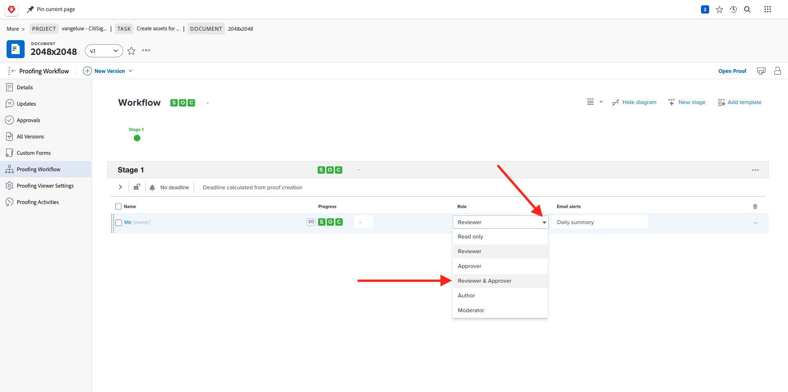

# 2.2.2 Workfront을 사용한 증명

## 2.2.2.1 새 승인 흐름 만들기

[https://experienceplatform.my.workfront.com/](https://experienceplatform.my.workfront.com/){target="_blank"}(으)로 이동합니다.

9개 점 **햄버거** 아이콘을 클릭하고 **교정**&#x200B;을 선택합니다.

**워크플로**(으)로 이동하여 **+ 신규**&#x200B;를 클릭한 다음 **새 템플릿**&#x200B;을(를) 선택하십시오.

**템플릿 이름**&#x200B;을(를) `--aepUserLdap-- - Approval Workflow`(으)로 설정하고 **템플릿 소유자**&#x200B;를 직접 설정합니다.

아래로 스크롤하여 **단계** > **단계 1**&#x200B;에서 **검토자 및 승인자**&#x200B;의 **역할**&#x200B;과(와) 함께 **Wouter Van Geluwe**&#x200B;을(를) 추가합니다.

**만들기**&#x200B;를 클릭합니다.

이제 기본 승인 워크플로를 사용할 준비가 되었습니다.

## 2.2.2.2 새 프로젝트 만들기

Workfront 홈페이지에서 **내 프로젝트** 탭의 **새로 만들기**&#x200B;를 클릭합니다. **빈 프로젝트**&#x200B;를 선택하십시오.

그럼 이걸 보셔야죠 이름을 `--aepUserLdap-- - CitiSignal Fiber Launch`(으)로 변경합니다.

이제 프로젝트가 생성되었습니다.

## 2.2.2.3 새 작업 만들기

작업의 이름을 입력하십시오. **파이버 캠페인용 에셋 만들기**. **작업 만들기**&#x200B;를 클릭합니다.

그럼 이걸 보셔야죠

## 2.2.2.4 작업에 새 문서 추가 승인 플로우를 거칩니다.

**+ 새로 추가**&#x200B;를 클릭한 다음 **문서**&#x200B;을(를) 선택합니다.

데스크톱에 [이 파일](./images/2048x2048.png)을 다운로드하세요.

{width="50px" align="left"}

**2048x2048.png** 파일을 선택하고 **열기**&#x200B;를 클릭합니다.

그럼 이걸 드셔보세요 **증명 만들기**&#x200B;를 클릭한 다음 **고급 증명**&#x200B;을 선택합니다.

**새 증명** 창에서 이전에 만든 워크플로 템플릿을 선택합니다. 워크플로 템플릿의 이름은 `--aepuserLdap-- - Approval Workflow`이어야 합니다. **증명 만들기**&#x200B;를 클릭합니다.

그러면 다시 작업에 참여하게 됩니다. **할당 대상** 단추를 클릭하고 **할당 대상**&#x200B;을 선택합니다.

**저장**&#x200B;을 클릭합니다.

**작업**&#x200B;을 클릭하세요.

**증명 열기** 클릭

이제 증명을 검토할 수 있습니다. 문서를 변경해야 하는 설명을 추가하려면 **설명 추가**&#x200B;를 선택하십시오.

댓글을 입력하고 **게시물**&#x200B;을 클릭하세요. Click **Close**.

이제 역할을 **검토자**&#x200B;에서 **검토자 및 승인자**(으)로 변경해야 합니다. 이렇게 하려면 작업으로 돌아가서 **증명 워크플로**&#x200B;를 클릭합니다.

역할을 **검토자**&#x200B;에서 **검토자 및 승인자**(으)로 변경하십시오.

작업으로 돌아가 증명을 다시 엽니다. 이제 새 버튼 **결정**&#x200B;이 표시됩니다. 클릭합니다.

**변경 필요**&#x200B;를 선택하고 **결정**&#x200B;을 클릭합니다.

그럼 다시 오셔야 합니다 이제 제공된 설명을 고려한 두 번째 이미지를 업로드해야 합니다.

데스크톱에 [이 파일](./images/2048x2048_buynow.png)을 다운로드하세요.

{width="50px" align="left"}

작업 보기에서 승인되지 않은 이전 이미지 파일을 선택합니다. **+ 새로 추가**&#x200B;를 클릭하고 **버전**&#x200B;을 선택한 다음 **문서**&#x200B;를 선택합니다.

**2048x2048_buynow.png** 파일을 선택하고 **열기**&#x200B;를 클릭합니다.

그럼 이걸 드셔보세요 **증명 만들기**&#x200B;를 클릭한 다음 **고급 증명**&#x200B;을 다시 선택하십시오.

그러면 이걸 보게 될 거야. Workfront에서 이전 승인 워크플로가 여전히 유효하다고 가정함에 따라 **워크플로 템플릿**&#x200B;이(가) 미리 선택됩니다. **증명 만들기**&#x200B;를 클릭합니다.

**증명 열기**&#x200B;를 선택합니다.

이제 두 버전의 파일이 나란히 표시됩니다.

**결정**&#x200B;을 클릭하고 **승인됨**&#x200B;을 선택한 다음 **결정**&#x200B;을 다시 클릭합니다.

증명 미리 보기를 닫습니다.

그런 다음 승인된 자산을 사용하여 작업 보기로 돌아갑니다. 이제 이 자산을 AEM Assets에 공유해야 합니다.

**공유 화살표** 아이콘을 클릭하고 `--aepUserLdap-- - Citi Signal AEM`(이)라는 AEM Assets 통합을 선택합니다.

이전에 만든 폴더(`--aepUserLdap-- - Workfront Assets`)를 두 번 클릭합니다.

**폴더 선택**&#x200B;을 클릭합니다.

1~2분 후 문서가 이제 AEM Assets에 게시됩니다. 문서 이름 옆에 AEM 아이콘이 표시됩니다.

**요약 열기**&#x200B;를 클릭합니다.

**메타데이터**(으)로 이동하십시오. 다음 내용이 표시됩니다.

**개요**(으)로 이동한 다음 **+ 추가**&#x200B;를 클릭하여 설명을 추가합니다.

설명을 입력합니다. 이제 증명 및 문서 설정이 완료되었습니다.

## 2.2.2.5 AEM Assets에서 파일 보기

이름이 `--aepUserLdap - Workfront Assets`인 AEM Assets의 폴더로 이동합니다.

이미지 아래의 세 점을 클릭한 다음 **세부 정보**&#x200B;를 선택합니다.

그러면 이전에 만든 Workfront과 AEM Assets 간의 통합에 의해 자동으로 채워진 값과 함께 메타데이터 양식이 표시됩니다.

[모듈 2.2로 돌아가기](./workfront.md){target="_blank"}

[모든 모듈로 돌아가기](./../../../overview.md){target="_blank"}
