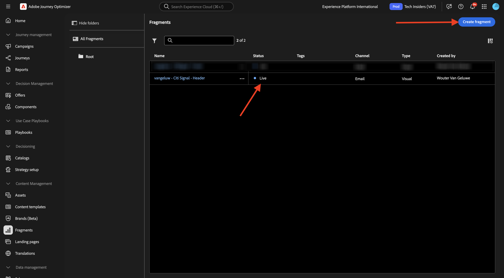
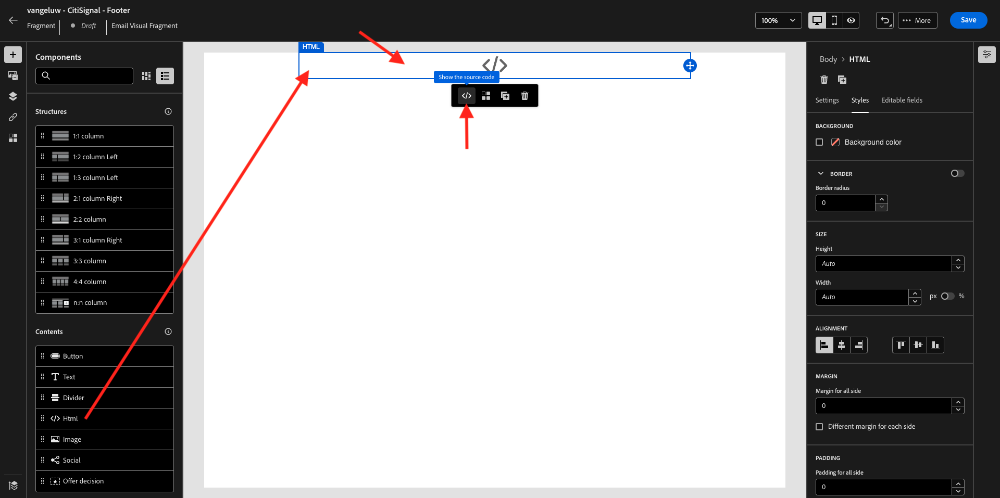
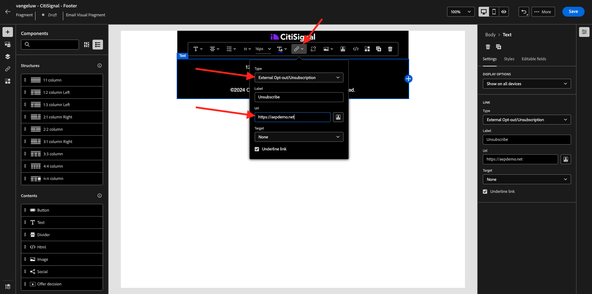

# 3.1.2 메시지에 사용할 조각 만들기

이 연습에서는 2개의 조각, 즉 재사용 가능한 머리글에 1개 및 재사용 가능한 바닥글에 1개를 구성합니다.

[Adobe Journey Optimizer](https://experience.adobe.com)(으)로 이동하여 Adobe Experience Cloud에 로그인합니다. **Journey Optimizer**&#x200B;을(를) 클릭합니다.


Journey Optimizer의 **Home** 보기로 리디렉션됩니다. 먼저 올바른 샌드박스를 사용하고 있는지 확인하십시오. 사용할 샌드박스를 `--aepSandboxName--`이라고 합니다.


## 3.1.2.1 헤더 조각 만들기

왼쪽 메뉴에서 **조각**&#x200B;을 클릭합니다. 조각은 Journey Optimizer 내의 재사용 가능한 구성 요소로서 중복을 방지하고, 이메일 메시지의 머리글이나 바닥글 변경과 같이 모든 메시지에 영향을 미치는 향후 변경 사항을 용이하게 합니다.

**조각 만들기**&#x200B;를 클릭합니다.


이름 `--aepUserLdap-- - CitiSignal - Header`을(를) 입력하고 **유형: 시각적 조각**&#x200B;을(를) 선택합니다. **만들기**&#x200B;를 클릭합니다.


그러면 이걸 보게 될 거야. 왼쪽 메뉴에서 이메일(행 및 열) 구조를 정의하는 데 사용할 수 있는 구조 구성 요소를 찾을 수 있습니다.

메뉴에서 캔버스로 **1:1 열**&#x200B;을(를) 끌어서 놓습니다. 로고 이미지의 자리 표시자가 됩니다.


그런 다음 콘텐츠 구성 요소를 사용하여 이러한 블록 내에 콘텐츠를 추가할 수 있습니다. 첫 번째 행의 첫 번째 셀에 **Image** 구성 요소를 끌어서 놓습니다. **찾아보기**&#x200B;를 클릭합니다.


그러면 AEM Assets 미디어 라이브러리를 보여주는 팝업이 열립니다. **citi-signal-images** 폴더로 이동하고 **CitiSignal-Logo-White.png** 이미지를 클릭하여 선택하고 **선택**&#x200B;을 클릭합니다.

>[!NOTE]
>
>AEM Assets 라이브러리에 Citi Signal 이미지가 없으면 [여기](./../../../../assets/ajo/CitiSignal-images.zip)에서 찾을 수 있습니다. 데스크톱에 다운로드하고 **citi-signal-images** 폴더를 만든 다음 해당 폴더의 모든 이미지를 업로드하세요.


그러면 이걸 보게 될 거야. 이미지가 흰색이며 아직 표시되지 않습니다. 이제 이미지가 올바르게 표시되도록 배경색을 정의해야 합니다. **스타일**&#x200B;을 클릭한 다음 **배경색** 상자를 클릭합니다.


팝업에서 **16진수** 색상 코드를 **#8821F4**(으)로 변경한 다음 **100%** 필드를 클릭하여 포커스를 변경합니다. 그러면 이미지에 새 색상이 적용된 것을 볼 수 있습니다.


현재 이미지도 약간 너무 큽니다. **너비** 전환기를 **40%**(으)로 이동하여 너비를 변경해 보겠습니다.


이제 헤더 조각이 준비되었습니다. **저장**&#x200B;을 클릭한 다음 화살표를 클릭하여 이전 화면으로 돌아갑니다.


조각을 사용하려면 먼저 게시해야 합니다. **게시**&#x200B;를 클릭합니다.


몇 분 후에 조각 상태가 **Live**(으)로 변경되었습니다.
다음으로, 이메일 메시지의 바닥글에 대한 새 조각을 만들어야 합니다. **조각 만들기**&#x200B;를 클릭합니다.



## 3.1.2.2 바닥글 조각 만들기

**조각 만들기**&#x200B;를 클릭합니다.


이름 `--aepUserLdap-- - CitiSignal - Footer`을(를) 입력하고 **유형: 시각적 조각**&#x200B;을(를) 선택합니다. **만들기**&#x200B;를 클릭합니다.


그러면 이걸 보게 될 거야. 왼쪽 메뉴에서 이메일(행 및 열) 구조를 정의하는 데 사용할 수 있는 구조 구성 요소를 찾을 수 있습니다.

메뉴에서 캔버스로 **1:1 열**&#x200B;을(를) 끌어서 놓습니다. 바닥글 콘텐츠의 자리 표시자가 됩니다.


그런 다음 콘텐츠 구성 요소를 사용하여 이러한 블록 내에 콘텐츠를 추가할 수 있습니다. 첫 번째 행의 첫 번째 셀에 **HTML** 구성 요소를 끌어서 놓습니다. 구성 요소를 클릭하여 선택한 다음 **&lt;/>** 아이콘을 클릭하여 HTML 소스 코드를 편집합니다.



그러면 이걸 보게 될 거야.


아래 HTML 코드 조각을 복사하여 Journey Optimizer의 **HTML 편집** 창에 붙여 넣습니다.

```html
<!--[if mso]><table cellpadding="0" cellspacing="0" border="0" width="100%"><tr><td style="text-align: center;" ><![endif]-->
<table style="width: auto; display: inline-block;">
  <tbody>
    <tr class="component-social-container">
      <td style="padding: 5px">
        <a style="text-decoration: none;" href="https://www.facebook.com" data-component-social-icon-id="facebook">
        
        </a>
      </td>
      <td style="padding: 5px">
        <a style="text-decoration: none;" href="https://x.com" data-component-social-icon-id="twitter">
        
        </a>
      </td>
      <td style="padding: 5px">
        <a style="text-decoration: none;" href="https://www.instagram.com" data-component-social-icon-id="instagram">
         
        </a>
      </td>
    </tr>
  </tbody>
</table>
<!--[if mso]></td></tr></table><![endif]-->
```

그럼 이걸로 드셔보세요 7, 12 및 17행에서 이제 AEM Assets 라이브러리의 자산을 사용하여 이미지 파일을 삽입해야 합니다.


커서가 7행에 있는지 확인한 다음 왼쪽 메뉴에서 **Assets**&#x200B;을(를) 클릭합니다. **자산 선택기 열기**&#x200B;를 클릭하여 이미지를 선택합니다.


**citi-signal-images** 폴더를 열고 **Icon_Facebook.png** 이미지를 클릭하여 선택합니다. **선택**&#x200B;을 클릭합니다.


커서가 12행에 있는지 확인한 다음 **자산 선택기 열기**&#x200B;를 클릭하여 이미지를 선택합니다.


**citi-signal-images** 폴더를 열고 **Icon_X.png** 이미지를 클릭하여 선택합니다. **선택**&#x200B;을 클릭합니다.


커서가 17행에 있는지 확인한 다음 **자산 선택기 열기**&#x200B;를 클릭하여 이미지를 선택합니다.


**citi-signal-images** 폴더를 열고 **Icon_Instagram.png** 이미지를 클릭하여 선택합니다. **선택**&#x200B;을 클릭합니다.


그러면 이걸 보게 될 거야. **저장**&#x200B;을 클릭합니다.


그러면 편집기로 돌아갑니다. 배경과 이미지 파일이 모두 흰색이므로 아이콘이 아직 표시되지 않습니다. 배경색을 변경하려면 **스타일**(으)로 이동하여 **배경색** 확인란을 클릭하세요.


**16진수** 색 코드를 **#000000**(으)로 변경합니다.


정렬을 가운데로 변경합니다.


바닥글에 다른 부분을 추가하겠습니다. 방금 만든 HTML 구성 요소 위에 **이미지** 구성 요소를 끌어서 놓습니다. **찾아보기**&#x200B;를 클릭합니다.


**`CitiSignal_Footer_Logo.png`** 이미지 파일을 클릭하여 선택하고 **선택**&#x200B;을 클릭합니다.


**스타일**(으)로 이동한 다음 **배경색** 확인란을 클릭합니다. 검정색으로 다시 변경하겠습니다. **16진수** 색 코드를 **#000000**(으)로 변경합니다.


너비를 **20%**(으)로 변경하고 정렬이 가운데로 설정되어 있는지 확인하십시오.


그런 다음 만든 HTML 구성 요소 아래에 **Text** 구성 요소를 끌어다 놓습니다. **찾아보기**&#x200B;를 클릭합니다.


자리 표시자 텍스트를 대체하여 아래 텍스트를 복사하여 붙여넣습니다.

```
1234 N. South Street, Anywhere, US 12345

Unsubscribe

©2024 CitiSignal, Inc and its affiliates. All rights reserved.
```

**텍스트 맞춤**&#x200B;을 가운데로 설정합니다.


**글꼴 색**&#x200B;을(를) 흰색, **#FFFFFF**(으)로 변경합니다.


**배경색**&#x200B;을(를) 검정색, **#000000**(으)로 변경합니다.


바닥글에서 **구독 취소** 텍스트를 선택하고 메뉴 막대에서 **링크** 아이콘을 클릭합니다. **Type**&#x200B;을(를) **외부 옵트아웃/구독 취소**(으)로 설정하고 URL을 **https://aepdemo.net/unsubscribe.html**(구독 취소 링크에 빈 URL을 사용할 수 없음)로 설정합니다.



그럼 이걸로 드셔보세요 이제 바닥글이 준비되었습니다. **저장**&#x200B;을 클릭한 다음 화살표를 클릭하여 이전 페이지로 돌아갑니다.


전자 메일에 사용할 수 있도록 바닥글을 게시하려면 **게시**&#x200B;를 클릭하세요.


몇 분 후에 바닥글의 상태가 **Live**(으)로 변경됩니다.


이제 이 연습을 완료했습니다.

## 다음 단계

[3.1.3(으)로 이동 여정 및 이메일 메시지 만들기](./ex3.md){target="_blank"}

[Adobe Journey Optimizer: 오케스트레이션](./journey-orchestration-create-account.md){target="_blank"}(으)로 돌아가기

[모든 모듈](./../../../../overview.md){target="_blank"}(으)로 돌아가기
