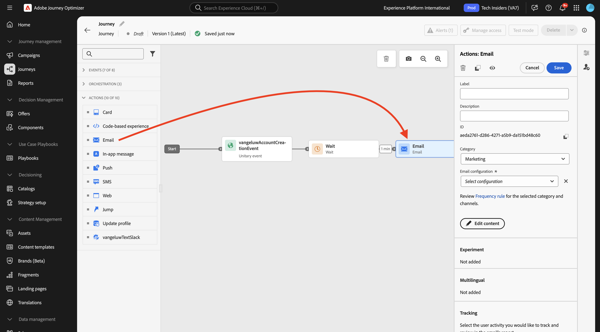
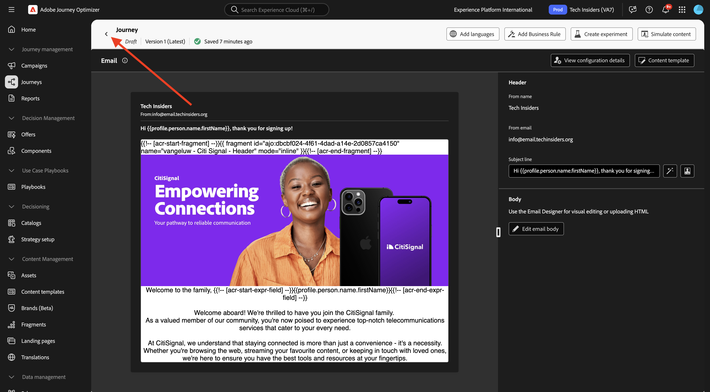
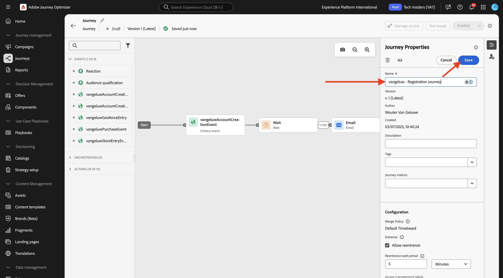

# 3.1.3 여정 및 이메일 메시지 만들기

이 연습에서는 데모 웹 사이트에서 다른 사람이 계정을 만들 때 트리거해야 하는 여정 및 메시지를 구성합니다.

[Adobe Journey Optimizer](https://experience.adobe.com)&#x200B;(으)로 이동하여 Adobe Experience Cloud에 로그인합니다. **Journey Optimizer**&#x200B;을(를) 클릭합니다.


Journey Optimizer의 **Home** 보기로 리디렉션됩니다. 먼저 올바른 샌드박스를 사용하고 있는지 확인하십시오. 사용할 샌드박스를 `--aepSandboxName--`이라고 합니다.


## 3.1.3.1 여정 만들기

왼쪽 메뉴에서 **여정**&#x200B;을 클릭합니다. 그런 다음 **여정 만들기**&#x200B;를 클릭하여 새 여정을 만듭니다.


그러면 빈 여정 화면이 표시됩니다.


이전 연습에서는 새 **이벤트**&#x200B;를 만들었습니다. 이 `--aepUserLdap--AccountCreationEvent`과(와) 같이 이름을 지정했습니다. 이는 이벤트 생성의 결과였습니다.


이제 이 이벤트를 이 여정의 시작으로 간주해야 합니다. 이렇게 하려면 화면 왼쪽으로 이동하여 이벤트 목록에서 이벤트를 검색할 수 있습니다.


이벤트를 선택하고 여정 캔버스에 끌어서 놓습니다. 이제 여정은 다음과 같습니다.


여정의 두 번째 단계로 **대기** 단계를 짧게 추가해야 합니다. 화면의 왼쪽으로 이동하여 **오케스트레이션** 섹션을 찾습니다. 프로필 속성을 사용하게 되며 이러한 속성이 실시간 고객 프로필에 채워져 있는지 확인해야 합니다.


이제 여정은 다음과 같습니다. 화면 오른쪽에서 대기 시간을 구성해야 합니다. 1분으로 설정합니다. 이렇게 하면 이벤트가 실행된 후에 프로필 속성을 사용할 수 있는 충분한 시간이 제공됩니다. 변경 내용을 저장하려면 **저장**&#x200B;을 클릭하세요.


여정의 세 번째 단계로 **전자 메일** 작업을 추가해야 합니다. 화면의 왼쪽으로 이동하여 **작업**&#x200B;을(를) 선택하고 **전자 메일** 작업을 선택한 다음 여정의 두 번째 노드에 끌어서 놓습니다. 이제 이 항목을 볼 수 있습니다.



**카테고리**&#x200B;을(를) **마케팅**(으)로 설정하고 전자 메일을 보낼 수 있는 전자 메일 구성을 선택하십시오. 이 경우 선택할 전자 메일 구성은 **Email-TI**&#x200B;입니다.


## 3.1.3.2 메시지 만들기

메시지를 만들려면 **콘텐츠 편집**&#x200B;을 클릭하세요.


이제 이 항목을 볼 수 있습니다.


**개인화 대화 상자 열기** 아이콘을 클릭합니다.


`Hi ` 텍스트를 쓰십시오. 다음으로 **아래에 저장된 필드**&#x200B;이름`profile.person.name.firstName`에 대한 개인화 토큰을 가져와야 합니다. 왼쪽 메뉴에서 **개인 > 전체 이름 > 이름** 필드로 이동하여 **+** 아이콘을 클릭합니다. 그러면 개인화 토큰이 텍스트 필드에 표시되는 것을 볼 수 있습니다.


다음으로 **텍스트를 추가하십시오. 등록해 주셔서 감사합니다!** 질문에 답합니다. **저장**&#x200B;을 클릭합니다.


이제 이메일 본문 구성을 시작할 수 있습니다. **전자 메일 본문 편집**&#x200B;을 클릭합니다.


실제 메시지의 콘텐츠 만들기를 시작하기 전에 메시지의 콘텐츠에 대해 생각하는 것이 좋습니다. 메시지의 일부 콘텐츠는 메시지 자체에 고유하지만, 다른 부분은 고객에게 보내는 모든 이메일에 대해 동일할 수 있는 표준 구성 요소입니다.

이전 연습에서는 이러한 표준 구성 요소를 Journey Optimizer에서 조각으로 이미 만들었으며, 이제 이 메시지와 만들 다른 모든 향후 메시지에서 참조할 수 있습니다.

다음 화면에서는 전자 메일 콘텐츠를 제공하는 3가지 방법이 표시됩니다.

- **처음부터 디자인**: 빈 캔버스로 시작하고 WYSIWYG 편집기를 사용하여 구조 및 콘텐츠 구성 요소를 끌어서 놓아 전자 메일의 콘텐츠를 시각적으로 빌드합니다.
- **직접 코딩하기**: HTML을 사용하여 코딩하여 전자 메일 템플릿을 만듭니다.
- **HTML 가져오기**: 편집할 수 있는 기존 HTML 템플릿을 가져옵니다.

**처음부터 디자인**&#x200B;을 클릭합니다.


왼쪽 메뉴에서 이메일(행 및 열) 구조를 정의하는 데 사용할 수 있는 구조 구성 요소를 찾을 수 있습니다.


왼쪽 메뉴에서 **조각**&#x200B;을 찾을 수 있습니다. 이 메뉴에서 이전에 만든 조각이 표시됩니다.


캔버스에 머리글과 바닥글을 추가하려면 먼저 이메일에 2개의 구조를 추가해야 합니다. 왼쪽 메뉴에서 **+** 아이콘을 클릭하고 2개의 **1:1 열** 구성 요소를 캔버스로 드래그합니다.


왼쪽 메뉴에서 **조각**(으)로 돌아갑니다. 머리글 조각을 첫 번째 구성 요소로 끌어다 놓고 바닥글 조각을 두 번째 구성 요소로 끌어다 놓습니다. 그러면 이걸 보게 될 거야.


왼쪽 메뉴에서 **+** 아이콘을 클릭하고 2개의 **1:1 열** 구성 요소를 캔버스(머리글과 바닥글 사이)로 끌어서 놓습니다.


첫 번째 **1:1 열** 구성 요소에서 **Image** 구성 요소를 끌어서 놓습니다. **찾아보기**&#x200B;를 클릭합니다.


**citi-signal-images** 폴더에서 **`welcome_email_image.png`** 이미지를 선택하고 **선택**&#x200B;을 클릭합니다.


그러면 다음 항목이 제공됩니다.


그런 다음 **내용**(으)로 이동하여 네 번째 행의 구조 구성 요소에서 **텍스트** 구성 요소를 끌어서 놓습니다.


기본 텍스트 **을(를) 선택하십시오. 여기에 텍스트를 입력하십시오.모든 텍스트 편집기와 마찬가지로**&#x200B;합니다. 대신 **가족에 오신 것을 환영합니다,**&#x200B;을(를) 작성하세요. 도구 모음에서 **개인화 추가** 아이콘을 클릭합니다.


**에 저장된**&#x200B;이름`profile.person.name.firstName` 개인화 토큰을 가져와야 합니다. 메뉴에서 **Person** 요소를 찾아 **전체 이름** 요소로 드릴다운한 다음 **+** 아이콘을 클릭하여 이름 필드를 식 편집기에 추가합니다.

**저장**&#x200B;을 클릭합니다.


이제 개인화 필드가 텍스트에 추가된 방식을 알 수 있습니다.


같은 텍스트 필드에서 **Enter**&#x200B;를 두 번 눌러 두 줄을 추가하고 다음 텍스트를 복사하여 붙여 넣습니다.

```
Welcome aboard! We're thrilled to have you join the CitiSignal family. 
As a valued member of our community, you're now poised to experience top-notch telecommunications services that cater to your every need.

At CitiSignal, we understand that staying connected is more than just a convenience - it's a necessity. Whether you're browsing the web, streaming your favourite content, or keeping in touch with loved ones, we're here to ensure you have the best tools and resources at your fingertips.
```


**텍스트 맞춤**&#x200B;을 가운데로 설정하여 필요에 맞게 메시지의 모양과 느낌을 자유롭게 조정할 수 있습니다. 완료되면 **저장**&#x200B;을 클릭하세요.


이메일을 미리 볼 준비가 되었는지 확인하기 위해 수행할 마지막 검사는 **콘텐츠 시뮬레이션** 단추를 클릭합니다.


이메일 메시지를 시뮬레이션하려면 먼저 테스트 프로필을 추가해야 합니다. **테스트 프로필 관리**&#x200B;를 클릭합니다.


**ID 네임스페이스 입력** 필드 옆에 있는 아이콘을 클릭하여 **전자 메일** 네임스페이스를 선택합니다.

ID 네임스페이스 목록에서 **전자 메일** 네임스페이스를 선택합니다. **ID 값** 필드에 이전 연습에서 사용했으며 Adobe Experience Platform에 이미 저장되어 있는 이전 프로필의 전자 메일 주소를 입력합니다. **프로필 추가**&#x200B;를 클릭합니다. 이전 화면으로 돌아갑니다.


그러면 이제 이 고객 프로필에 대해 시뮬레이션된 이메일 메시지가 표시됩니다. 이제 제목 줄과 본문에서 개인화의 유효성을 검사하고 원하는 경우 증명 이메일을 보낼 수 있습니다.

미리 보기를 닫으려면 **닫기**&#x200B;를 클릭하십시오.


메시지를 저장하고 왼쪽 상단 모서리의 제목 줄 텍스트 옆에 있는 **화살표**&#x200B;를 클릭하여 메시지 대시보드로 돌아가려면 **저장**&#x200B;을 클릭합니다.


여정으로 돌아가려면 **화살표**&#x200B;를 클릭하십시오.



## 3.1.3.3 여정 게시

**저장**&#x200B;을 클릭합니다.


여정 이름을 계속 지정해야 합니다. 화면 오른쪽 상단의 **속성** 아이콘을 클릭하면 됩니다.


그런 다음 여기에 여정 이름을 입력할 수 있습니다. `--aepUserLdap-- - Registration Journey`을(를) 사용하십시오. **저장**&#x200B;을 클릭합니다.



이제 **게시**&#x200B;를 클릭하여 여정을 게시할 수 있습니다.


**게시**&#x200B;를 다시 클릭합니다.


몇 분 후에 여정 상태가 **Live**(으)로 변경되고 여정 성능에 대한 실시간 대시보드가 표시됩니다.


이제 이 연습을 완료했습니다.

## 다음 단계

[3.1.4(으)로 이동 데이터 수집 속성 업데이트 및 여정 테스트](./ex4.md){target="_blank"}

[Adobe Journey Optimizer: 오케스트레이션](./journey-orchestration-create-account.md){target="_blank"}(으)로 돌아가기

[모든 모듈](./../../../../overview.md){target="_blank"}(으)로 돌아가기
