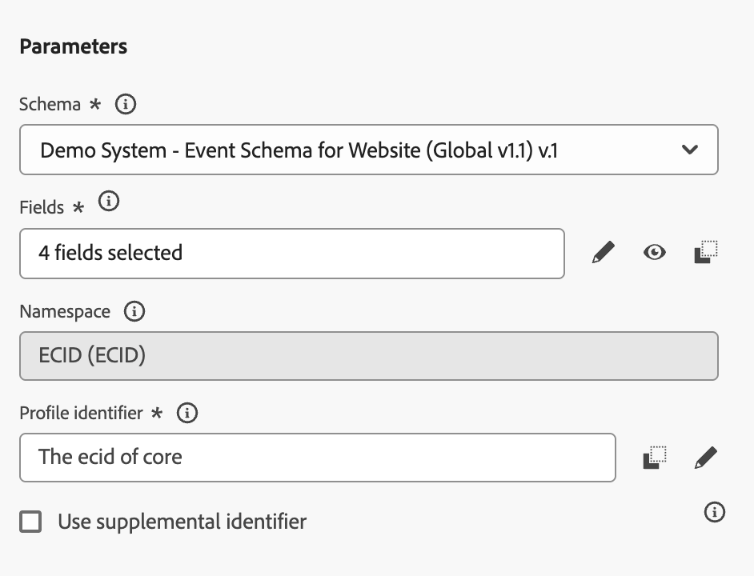

# 3.2.1 이벤트 정의

[Adobe Journey Optimizer](https://experience.adobe.com)(으)로 이동하여 Adobe Experience Cloud에 로그인합니다. **Journey Optimizer**&#x200B;을(를) 클릭합니다.

Journey Optimizer의 **Home** 보기로 리디렉션됩니다. 먼저 올바른 샌드박스를 사용하고 있는지 확인하십시오. 사용할 샌드박스를 `--aepSandboxName--`이라고 합니다. 그러면 샌드박스 `--aepSandboxName--`의 **홈** 보기에 있게 됩니다.

왼쪽 메뉴에서 아래로 스크롤하여 **구성**&#x200B;을 클릭합니다. 그런 다음 **이벤트**&#x200B;에서 **관리** 단추를 클릭합니다.

그러면 사용 가능한 모든 이벤트의 개요가 표시됩니다. 나만의 이벤트를 만들려면 **이벤트 만들기**&#x200B;를 클릭하세요.

그러면 비어 있는 새 이벤트 창이 나타납니다.
이벤트의 이름으로 `--aepUserLdap--GeofenceEntry`을(를) 사용합니다.

설명을 `Geofence Entry Event`(으)로 설정합니다.

**Type**&#x200B;이(가) **Unitary**(으)로 설정되어 있는지 확인하고, **이벤트 ID 유형** 선택에 대해 **시스템 생성**&#x200B;을 선택하십시오

그런 다음 스키마를 선택해야 합니다. 여기에 표시되는 모든 스키마는 Adobe Experience Platform 스키마입니다.

일부 스키마는 표시되지 않습니다. Adobe Experience Platform에는 사용할 수 있는 스키마가 더 많습니다.
이 목록에 표시하려면 스키마에 특정 필드 그룹이 연결되어 있어야 합니다. 여기에 표시되는 데 필요한 필드 그룹을 `Orchestration eventID`이라고 합니다.

Adobe Experience Platform에서 이러한 스키마가 정의되는 방식을 간단히 살펴보겠습니다.

왼쪽 메뉴에서 **스키마**(으)로 이동하여 새 브라우저 탭에서 엽니다. **스키마**&#x200B;에서 **찾아보기**(으)로 이동하여 사용 가능한 스키마 목록을 확인하십시오.
스키마 `Demo System - Event Schema for Website (Global v1.1)`을(를) 엽니다.

스키마를 열면 필드 그룹 `Orchestration eventID`이(가) 스키마의 일부임을 알 수 있습니다.
이 필드 그룹에는 `_experience.campaign.orchestration.eventID`과(와) `originJourneyID` 필드 두 개만 있습니다.

이 필드 그룹과 이 특정 eventID 필드가 스키마의 일부이면 Adobe Journey Optimizer에서 해당 스키마를 사용할 수 있습니다.

Adobe Journey Optimizer의 이벤트 구성으로 돌아갑니다.

이 사용 사례에서는 고객이 특정 위치에 있는지 파악하기 위해 Geofence 이벤트를 수신 대기하려고 하므로 이제 이벤트에 대한 스키마로 스키마 `Demo System - Event Schema for Website (Global v1.1)`을(를) 선택합니다.

그러면 Adobe Journey Optimizer에서 일부 필수 필드를 자동으로 선택하지만, Adobe Journey Optimizer에서 사용할 수 있는 필드를 편집할 수 있습니다.

필드를 편집하려면 **연필** 아이콘을 클릭하십시오.

그러면 필드를 선택할 수 있는 스키마 계층 구조가 있는 팝업 창이 표시됩니다.

ECID 및 오케스트레이션 eventID와 같은 필드는 필수이며 미리 선택됩니다.

그러나 마케터는 여정에게 컨텍스트를 제공하는 모든 데이터 포인트에 대해 유연하게 액세스해야 합니다. 따라서 다음 필드도 최소값으로 선택하겠습니다(위치 컨텍스트 노드 내에 있음).

- 구/군/시

완료되면 **확인**&#x200B;을 클릭하세요.

Adobe Journey Optimizer에는 고객을 식별하기 위한 식별자도 필요합니다. Adobe Journey Optimizer은 Adobe Experience Platform에 연결되어 있으므로 여정의 기본 식별자는 자동으로 스키마의 식별자로 사용됩니다.
또한 기본 식별자는 Adobe Experience Platform의 전체 ID 그래프를 자동으로 고려하며, 사용 가능한 모든 ID, 장치 및 채널의 모든 동작을 동일한 프로필에 연결하여 Adobe Journey Optimizer이 상황에 맞고 관련성이 있으며 일관성이 있도록 합니다. **저장**&#x200B;을 클릭합니다.

그러면 이벤트가 사용 가능한 이벤트 목록의 일부가 됩니다.

마지막으로 사용자 지정 이벤트에 대한 `Orchestration eventID`을(를) 복구해야 합니다.

이벤트 목록에서 이벤트를 클릭하여 다시 엽니다.
이벤트에서 **필드** 옆에 있는 **페이로드 보기** 아이콘을 클릭합니다.

**페이로드 보기** 아이콘을 클릭하면 이 이벤트에 대한 샘플 XDM 페이로드가 열립니다. `eventID`줄이 표시될 때까지 **페이로드**&#x200B;에서 아래로 스크롤합니다.

구성을 테스트하기 위해 마지막에 필요한 `eventID`을(를) 적어 두십시오.

이 예제에서 `eventID`은(는) `4df8dc10731eba7b0c37af83a9db38d4de7aa6aebcce38196d9d47929b9c598e`입니다.

이제 만들고 있는 여정을 트리거할 이벤트를 정의했습니다. 여정이 트리거되면 City와 같은 지오펜스 필드 및 선택했을 수 있는 다른 모든 필드(예: 국가, 위도 및 경도)를 여정이 사용할 수 있게 됩니다.

사용 사례 설명에서 설명한 대로 날씨에 따라 달라지는 상황에 맞는 프로모션을 제공해야 합니다. 날씨 정보를 얻기 위해서는 해당 지역의 날씨 정보를 제공하는 외부 데이터 소스를 정의해야 합니다. **OpenWeather API** 서비스를 사용하여 해당 정보를 제공합니다.

## 다음 단계

[3.2.2로 이동 외부 데이터 원본 정의](./ex2.md){target="_blank"}

[Adobe Journey Optimizer: 외부 데이터 원본 및 사용자 지정 작업으로 돌아가기](journey-orchestration-external-weather-api-sms.md){target="_blank"}

[모든 모듈](./../../../../overview.md){target="_blank"}(으)로 돌아가기
