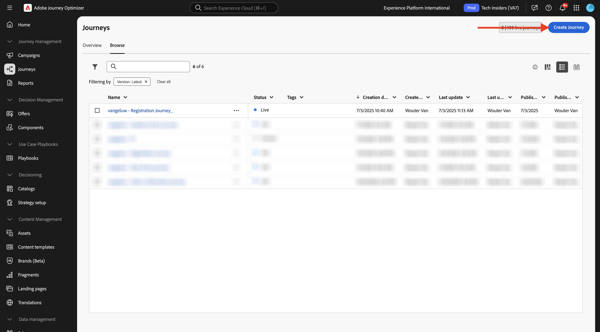
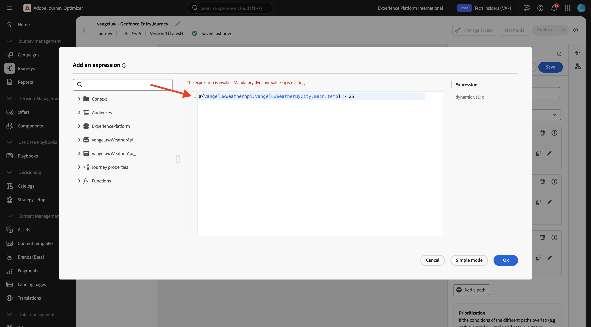
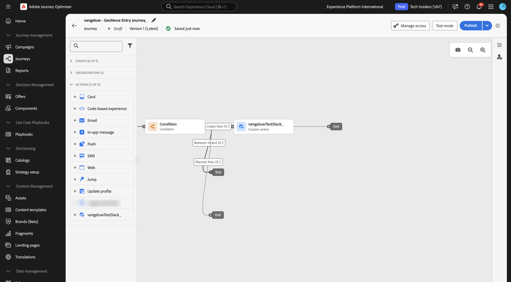
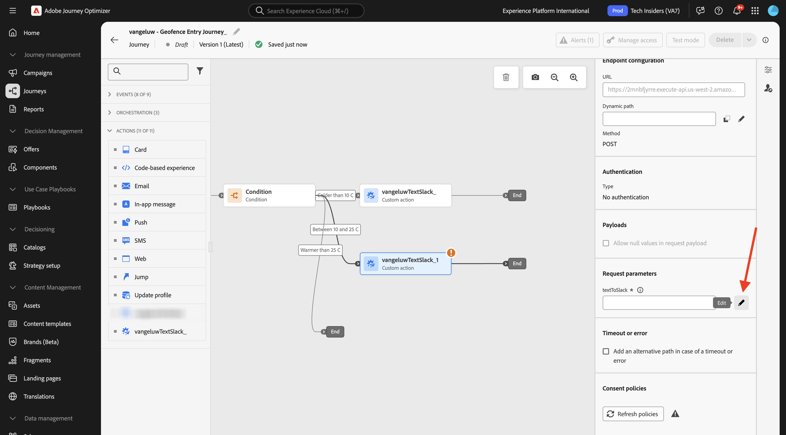

# 3.2.4 여정 및 메시지 만들기

이 연습에서는 Adobe Journey Optimizer을 사용하여 여정 및 여러 문자 메시지를 만듭니다.

이 사용 사례의 목표는 고객이 있는 곳의 날씨 상태에 따라 다른 메시지를 보내는 것입니다. 3개의 시나리오가 정의되었습니다.

- 섭씨 10도 이상 차갑게
- 섭씨 10° ~ 25°
- 섭씨 25°C보다 따뜻함

이러한 3가지 조건의 경우 Adobe Journey Optimizer에서 3개의 메시지를 정의해야 합니다.

## 3.2.4.1 여정 만들기

[Adobe Journey Optimizer](https://experience.adobe.com)(으)로 이동하여 Adobe Experience Cloud에 로그인합니다. **Journey Optimizer**&#x200B;을(를) 클릭합니다.


Journey Optimizer의 **Home** 보기로 리디렉션됩니다. 먼저 올바른 샌드박스를 사용하고 있는지 확인하십시오. 사용할 샌드박스를 `--aepSandboxName--`이라고 합니다. 그러면 샌드박스 `--aepSandboxName--`의 **홈** 보기에 있게 됩니다.


왼쪽 메뉴에서 **여정**(으)로 이동한 다음 **여정 만들기**&#x200B;를 클릭하여 여정 만들기를 시작합니다.



여정 이름을 지정해야 합니다.

여정 이름으로 `--aepUserLdap-- - Geofence Entry Journey`을(를) 사용합니다. 지금은 다른 값을 설정할 수 없습니다. **저장**&#x200B;을 클릭합니다.


화면 왼쪽에서 **이벤트**&#x200B;를 봅니다. 이전에 만든 이벤트가 해당 목록에 표시됩니다. 선택한 다음 여정 캔버스에 드래그하여 놓습니다. 그러면 여정은 다음과 같이 표시됩니다. **저장**&#x200B;을 클릭합니다.


그런 다음 **오케스트레이션**&#x200B;을 클릭합니다. 이제 사용 가능한 **오케스트레이션** 기능이 표시됩니다. **조건**&#x200B;을 선택한 다음 여정 캔버스에 끌어서 놓습니다.


이제 이 조건에 대해 세 개의 경로를 구성해야 합니다.

- 기온이 섭씨 10도보다 더 춥다
- 섭씨 10도에서 25도 사이입니다
- 기온이 섭씨 25도 이상입니다

첫 번째 조건을 정의하겠습니다.

### 상태 1: 섭씨 10도 이상 차갑게

**조건**&#x200B;을 클릭합니다.  **경로1**&#x200B;을(를) 클릭하고 경로 이름을 **10C 이상**(으)로 편집합니다. Path1의 식에 대한 **편집** 아이콘을 클릭합니다.


그러면 빈 **단순 편집기** 화면이 표시됩니다. 쿼리가 좀 더 발전하므로 **고급 모드**&#x200B;가 필요합니다. **고급 모드**&#x200B;를 클릭합니다.


그러면 코드를 입력할 수 있는 **고급 편집기**&#x200B;가 표시됩니다.


아래 코드를 선택하여 **고급 편집기**&#x200B;에 붙여 넣으십시오.

`#{--aepUserLdap--WeatherApi.--aepUserLdap--WeatherByCity.main.temp} <= 10`

그러면 이걸 보게 될 거야.


이 조건의 일부로 온도를 검색하려면 고객이 현재 있는 도시를 제공해야 합니다.
**City**&#x200B;은(는) Open Weather API 설명서에서 이전에 보았던 것처럼 동적 매개 변수 `q`에 연결해야 합니다.

스크린샷에 표시된 대로 필드 **동적 값: q**&#x200B;을(를) 클릭합니다.


사용 가능한 데이터 원본 중 하나에서 고객의 현재 도시가 포함된 필드를 찾아야 합니다. 이 경우 **컨텍스트**&#x200B;에서 찾아야 합니다.


`--aepUserLdap--GeofenceEntry.placeContext.geo.city`(으)로 이동하여 필드를 찾을 수 있습니다.

해당 필드를 클릭하거나 **+**&#x200B;을(를) 클릭하면 `q` 매개 변수의 동적 값으로 추가됩니다. 이 필드는 예를 들어 모바일 앱에서 구현한 지리적 위치 서비스로 채워집니다. 이 경우 데모 웹 사이트의 데이터 수집 속성을 사용하여 이를 시뮬레이션합니다. **확인**&#x200B;을 클릭합니다.


### 조건 2: 섭씨 10° ~ 25°

첫 번째 조건을 추가하면 이 화면이 표시됩니다. **경로 추가**&#x200B;를 클릭합니다.


**경로1**&#x200B;을(를) 두 번 클릭하고 경로 이름을 **10에서 25C 사이**(으)로 편집합니다. 이 경로의 식에 대한 **편집** 아이콘을 클릭합니다.


그러면 빈 **단순 편집기** 화면이 표시됩니다. 쿼리가 좀 더 발전하므로 **고급 모드**&#x200B;가 필요합니다. **고급 모드**&#x200B;를 클릭합니다.


그러면 코드를 입력할 수 있는 **고급 편집기**&#x200B;가 표시됩니다.


아래 코드를 선택하여 **고급 편집기**&#x200B;에 붙여 넣으십시오.

`#{--aepUserLdap--WeatherApi.--aepUserLdap--WeatherByCity.main.temp} > 10 and #{--aepUserLdap--WeatherApi.--aepUserLdap--WeatherByCity.main.temp} <= 25`

그러면 이걸 보게 될 거야.


이 조건의 일부로 온도를 검색하려면 고객이 현재 있는 도시를 제공해야 합니다.
**City**&#x200B;은(는) Open Weather API 설명서에서 이전에 보았던 것처럼 동적 매개 변수 **q**&#x200B;에 연결해야 합니다.

스크린샷에 표시된 대로 필드 **동적 값: q**&#x200B;을(를) 클릭합니다.


그런 다음 사용 가능한 데이터 소스 중 하나에서 고객의 현재 도시가 포함된 필드를 찾아야 합니다.


`--aepUserLdap--GeofenceEntry.placeContext.geo.city`(으)로 이동하여 필드를 찾을 수 있습니다. 해당 필드를 클릭하면 매개 변수 **q**&#x200B;에 대한 동적 값으로 추가됩니다. 이 필드는 예를 들어 모바일 앱에서 구현한 지리적 위치 서비스로 채워집니다. 이 경우 데모 웹 사이트의 데이터 수집 속성을 사용하여 이를 시뮬레이션합니다. **확인**&#x200B;을 클릭합니다.


다음으로 세 번째 조건을 추가합니다.

### 조건 3: 섭씨 25도 이상

두 번째 조건을 추가하면 이 화면이 표시됩니다. **경로 추가**&#x200B;를 클릭합니다.


Path1을 두 번 클릭하여 이름을 **25C보다 따뜻함**(으)로 변경합니다.
그런 다음 이 경로의 식에 대한 **편집** 아이콘을 클릭합니다.


그러면 빈 **단순 편집기** 화면이 표시됩니다. 쿼리가 좀 더 발전하므로 **고급 모드**&#x200B;가 필요합니다. **고급 모드**&#x200B;를 클릭합니다.


그러면 코드를 입력할 수 있는 **고급 편집기**&#x200B;가 표시됩니다.


아래 코드를 선택하여 **고급 편집기**&#x200B;에 붙여 넣으십시오.

`#{--aepUserLdap--WeatherApi.--aepUserLdap--WeatherByCity.main.temp} > 25`

그러면 이걸 보게 될 거야.



이 조건의 일부로 온도를 검색하려면 고객이 현재 있는 도시를 제공해야 합니다.
**City**&#x200B;은(는) Open Weather API 설명서에서 이전에 보았던 것처럼 동적 매개 변수 **q**&#x200B;에 연결해야 합니다.

스크린샷에 표시된 대로 필드 **동적 값: q**&#x200B;을(를) 클릭합니다.


그런 다음 사용 가능한 데이터 소스 중 하나에서 고객의 현재 도시가 포함된 필드를 찾아야 합니다.


```--aepUserLdap--GeofenceEntry.placeContext.geo.city```(으)로 이동하여 필드를 찾을 수 있습니다. 해당 필드를 클릭하면 매개 변수 **q**&#x200B;에 대한 동적 값으로 추가됩니다. 이 필드는 예를 들어 모바일 앱에서 구현한 지리적 위치 서비스로 채워집니다. 이 경우 데모 웹 사이트의 데이터 수집 속성을 사용하여 이를 시뮬레이션합니다. **확인**&#x200B;을 클릭합니다.


이제 구성된 경로가 3개 있습니다. **저장**&#x200B;을 클릭합니다.


이는 학습 목적의 여정으로, 이제 마케터가 메시지를 전달해야 하는 다양한 옵션을 표시하기 위해 몇 가지 작업을 구성합니다.

## 3.2.4.2 경로에 대한 메시지 보내기: 섭씨 10도보다 낮음

각 온도 컨텍스트에 대해 고객에게 문자 메시지를 보내려고 시도합니다. 이 연습에서는 휴대폰 번호 대신 Slack 채널로 실제 메시지를 보냅니다.

**10C보다 추운** 경로에 초점을 맞추겠습니다.


왼쪽 메뉴에서 **작업**(으)로 돌아가서 `--aepUserLdap--TextSlack` 작업을 선택한 다음 **메시지** 작업 뒤에 끌어다 놓습니다.


**작업 매개 변수**(으)로 이동하여 `textToSlack` 매개 변수에 대한 **편집** 아이콘을 클릭합니다.


팝업 창에서 **고급 모드**&#x200B;를 클릭합니다.


아래 코드를 선택하여 복사한 후 **고급 모드 편집기**&#x200B;에 붙여 넣으십시오. **확인**&#x200B;을 클릭합니다.

`"Brrrr..." + #{ExperiencePlatform.ProfileFieldGroup.profile.person.name.firstName} + ",  it's cold and freezing outside. Get comfortable at home with a 20% discount on a Disney+ subscription!"`


완료된 작업이 표시됩니다. **저장**&#x200B;을 클릭합니다.


이제 여정의 이 경로가 준비되었습니다.

## 3.2.4.3 경로에 대한 메시지 보내기: 섭씨 10~25도 사이

각 온도 컨텍스트에 대해 고객에게 메시지를 보내려고 시도합니다. 이 연습에서는 휴대폰 번호 대신 Slack 채널로 실제 메시지를 보냅니다.

**10~25C** 경로에 초점을 맞추겠습니다.



왼쪽 메뉴에서 **작업**(으)로 돌아가서 `--aepUserLdap--TextSlack` 작업을 선택한 다음 **메시지** 작업 뒤에 끌어다 놓습니다.


**작업 매개 변수**(으)로 이동하여 `textToSlack` 매개 변수에 대한 **편집** 아이콘을 클릭합니다.



팝업 창에서 **고급 모드**&#x200B;를 클릭합니다.


아래 코드를 선택하여 복사한 후 **고급 모드 편집기**&#x200B;에 붙여 넣으십시오. **확인**&#x200B;을 클릭합니다.

`"What nice weather for the time of year, " + #{ExperiencePlatform.ProfileFieldGroup.profile.person.name.firstName} + " 20% discount on Apple AirPods so you can go for a walk and listen to your favorite podcast!"`


완료된 작업이 표시됩니다. **확인**&#x200B;을 클릭합니다.


이제 여정의 이 경로가 준비되었습니다.

## 3.2.4.4 메시지 전송 경로: 섭씨 25도 이상

각 온도 컨텍스트에 대해 고객에게 메시지를 보내려고 시도합니다. 이 연습에서는 휴대폰 번호 대신 Slack 채널로 실제 메시지를 보냅니다.

**25C보다 따뜻한** 경로에 초점을 맞추겠습니다.


왼쪽 메뉴에서 **작업**(으)로 돌아가서 `--aepUserLdap--TextSlack` 작업을 선택한 다음 **메시지** 작업 뒤에 끌어다 놓습니다.


**작업 매개 변수**(으)로 이동하여 `textToSlack` 매개 변수에 대한 **편집** 아이콘을 클릭합니다.


팝업 창에서 **고급 모드**&#x200B;를 클릭합니다.


아래 코드를 선택하여 복사한 후 **고급 모드 편집기**&#x200B;에 붙여 넣으십시오. **확인**&#x200B;을 클릭합니다.

`"So warm, " + #{ExperiencePlatform.ProfileFieldGroup.profile.person.name.firstName} + "! 20% discount on adding 10GB of extra data so you can get online at the beach!"`


완료된 작업이 표시됩니다. **저장**&#x200B;을 클릭합니다.


이제 여정의 이 경로가 준비되었습니다.

## 3.2.4.5 여정 게시

이제 여정이 완전히 구성되었습니다. **게시**&#x200B;를 클릭합니다.


**게시**&#x200B;를 다시 클릭합니다.


이제 여정이 게시되었습니다.


## 다음 단계

[3.2.5로 이동](./ex5.md){target="_blank"} 여정 트리거

[Adobe Journey Optimizer: 외부 데이터 원본 및 사용자 지정 작업으로 돌아가기](journey-orchestration-external-weather-api-sms.md){target="_blank"}

[모든 모듈](./../../../../overview.md){target="_blank"}(으)로 돌아가기
