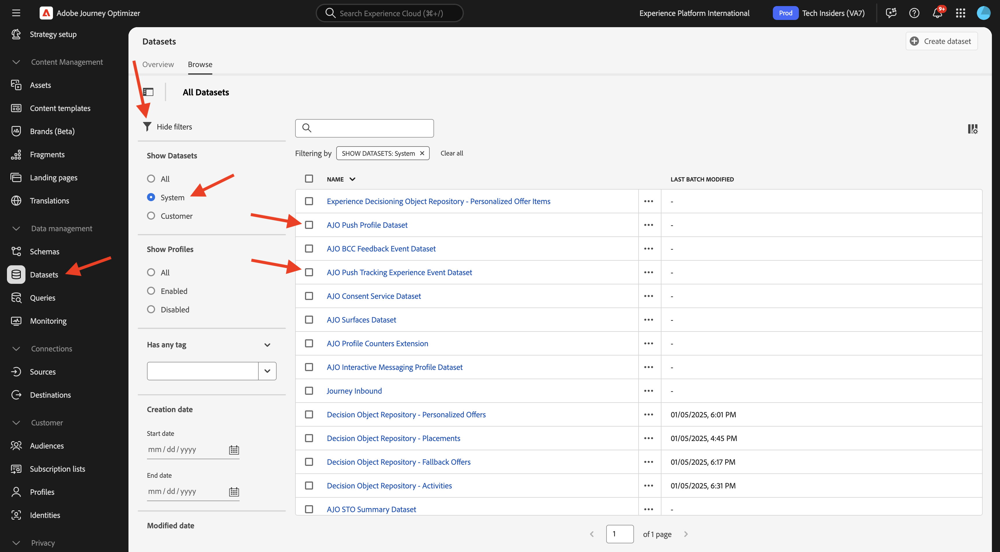
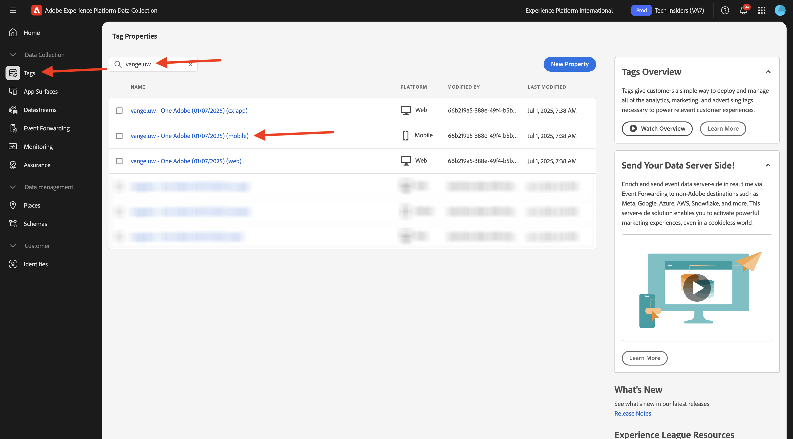
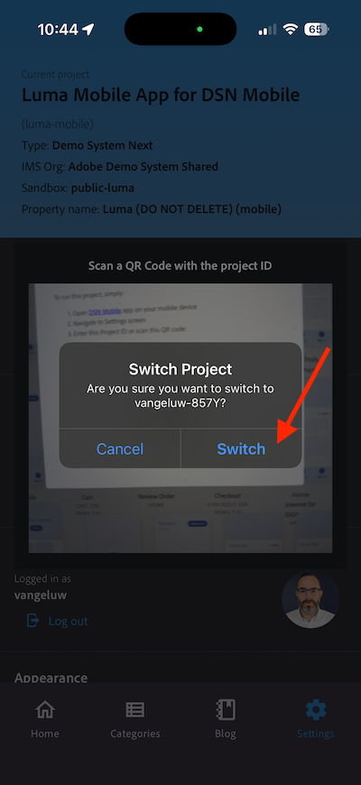

# 3.3.1 푸시 알림 시작

Adobe Journey Optimizer에서 푸시 알림을 사용하기 위해 확인하고 알아야 할 다양한 설정이 있습니다.

확인할 모든 설정은 다음과 같습니다.

- Adobe Experience Platform의 데이터 세트 및 스키마
- 모바일용 데이터스트림
- 모바일용 데이터 수집 속성
- 푸시 인증서의 앱 표면
- AEP Assurance을 사용하여 푸시 설정 테스트

이것을 하나씩 검토해 봅시다.

[Adobe Journey Optimizer](https://experience.adobe.com)&#x200B;(으)로 이동하여 Adobe Experience Cloud에 로그인합니다. **Journey Optimizer**&#x200B;을(를) 클릭합니다.

Journey Optimizer의 **Home** 보기로 리디렉션됩니다. 먼저 올바른 샌드박스를 사용하고 있는지 확인하십시오. 사용할 샌드박스를 `--aepSandboxName--`이라고 합니다. 그러면 샌드박스 **의**&#x200B;홈`--aepSandboxName--` 보기에 있게 됩니다.

## 3.3.1.1 푸시 데이터 세트

Adobe Journey Optimizer은 데이터 세트를 사용하여 모바일 장치의 푸시 토큰 또는 푸시 메시지(예: 보낸 메시지, 열린 메시지 등)와의 상호 작용 등을 Adobe Journey Optimizer 데이터 세트에 저장합니다.

화면 왼쪽의 메뉴에서 **데이터 세트**(으)로 이동하여 이러한 데이터 세트를 찾을 수 있습니다. 시스템 데이터 세트를 표시하려면 **필터 사용** 아이콘을 클릭합니다.

**시스템**&#x200B;에 대한 옵션을 사용하도록 설정하고 **AJO**&#x200B;을 검색합니다. 그러면 푸시 알림에 사용되는 데이터 세트가 표시됩니다.

## 모바일용 3.3.1.2 데이터스트림

[https://experience.adobe.com/#/data-collection/](https://experience.adobe.com/#/data-collection/)&#x200B;(으)로 이동합니다.

왼쪽 메뉴에서 **데이터스트림**(으)로 이동하여 [시작](./../../../../modules/getting-started/gettingstarted/ex2.md)에서 만든 데이터스트림(`--aepUserLdap-- - One Adobe Datastream (Mobile)`)을 검색합니다. 클릭하여 엽니다.

**Adobe Experience Platform** 서비스에서 **편집**&#x200B;을 클릭합니다.

그러면 정의된 데이터 스트림 설정과 이벤트 및 프로필 속성이 저장될 데이터 세트가 표시됩니다.

아직 활성화되지 않은 경우 다음 옵션도 활성화해야 합니다.

- **Offer Decisioning**
- **개인화 대상**
- **Adobe Journey Optimizer**

**저장**&#x200B;을 클릭합니다.

## 3.3.1.3 모바일에 대한 데이터 수집 속성을 검토합니다.

[https://experience.adobe.com/#/data-collection/](https://experience.adobe.com/#/data-collection/), **태그**(으)로 이동합니다. [시작하기](./../../../../modules/getting-started/gettingstarted/ex1.md) 모듈의 일부로 데이터 수집 태그 속성이 만들어졌습니다.

이러한 데이터 수집 태그 속성을 이전 모듈의 일부로 이미 사용하고 있습니다.

모바일에 대한 데이터 수집 속성을 열려면 를 클릭합니다.

데이터 수집 속성에서 **확장**(으)로 이동합니다. 모바일 앱에 필요한 다양한 확장이 표시됩니다. **Adobe Experience Platform Edge Network** 확장을 클릭하여 선택한 다음 **구성**&#x200B;을 선택합니다.

그러면 모바일용 데이터스트림이 여기에 연결되어 있는 것을 볼 수 있습니다. 다음으로 확장 개요로 돌아가려면 **취소**&#x200B;를 클릭합니다.

그럼 다시 여기로 돌아오게 될 거야 **AEP Assurance**&#x200B;용 확장이 표시됩니다. AEP Assurance을 사용하면 모바일 앱에서 데이터를 수집하거나 경험을 제공하는 방법을 검사, 증명, 시뮬레이션 및 확인할 수 있습니다. AEP Assurance에 대한 자세한 내용은 [https://experienceleague.adobe.com/en/docs/experience-platform/assurance/home](https://experienceleague.adobe.com/ko/docs/experience-platform/assurance/home)에서 확인할 수 있습니다.

그런 다음 **구성**&#x200B;을 클릭하여 확장 **Adobe Journey Optimizer**&#x200B;을(를) 엽니다. 이 확장을 사용하면 Adobe Journey Optimizer에 대한 푸시 알림 및 측정을 사용할 수 있습니다.

그런 다음 푸시 이벤트 추적을 위한 데이터 세트가 여기에서 연결되는지 확인합니다. 데이터 수집 속성을 변경할 필요가 없습니다. 이전 화면으로 돌아가려면 **취소**&#x200B;를 클릭하세요.

## 3.3.1.4 앱 표면 설정 검토

[https://experience.adobe.com/#/data-collection/](https://experience.adobe.com/#/data-collection/)&#x200B;(으)로 이동합니다. 왼쪽 메뉴에서 **앱 표면**(으)로 이동하여 **DX 데모 앱 APNS**&#x200B;용 앱 표면을 엽니다.

그러면 iOS 및 Android에 대해 구성된 앱 표면이 표시됩니다.

## 3.3.1.5 AEP Assurance을 사용하여 푸시 알림 설정을 테스트합니다.

**시작하기** 모듈의 일부로 **DX 데모** 모바일 응용 프로그램을 이미 설치했습니다. 앱이 설치되면 디바이스의 홈 화면에서 찾을 수 있습니다. 아이콘을 클릭하여 앱을 엽니다.

로그인하면 알림 전송 권한을 요청하는 알림이 표시됩니다. 자습서의 일부로 알림을 전송하므로 **허용**&#x200B;을 클릭하세요.

그러면 앱의 홈페이지가 표시됩니다. **설정**(으)로 이동합니다.

설정에서 현재 **공개 프로젝트**&#x200B;가 앱에 로드되어 있습니다. **사용자 지정 프로젝트**&#x200B;를 클릭합니다.

이제 사용자 지정 프로젝트를 로드할 수 있습니다. 프로젝트를 쉽게 로드하려면 QR 코드를 클릭하십시오.

**시작하기** 섹션을 거쳐서 이 결과를 얻었습니다. 자동으로 만든 **Mobile Retail 프로젝트**&#x200B;를 열려면 클릭하세요.

실수로 브라우저 창을 닫은 경우 또는 향후 데모 또는 지원 세션을 위해 [https://dsn.adobe.com/projects](https://dsn.adobe.com/projects)&#x200B;(으)로 이동하여 웹 사이트 프로젝트에 액세스할 수도 있습니다. Adobe ID으로 로그인하면 이 메시지가 표시됩니다. 모바일 앱 프로젝트를 클릭하여 엽니다.

그런 다음 **실행**&#x200B;을 클릭합니다.

그러면 QR 코드가 포함된 이 팝업이 표시됩니다. 모바일 앱 내에서 이 QR 코드를 스캔합니다.

그러면 앱에 프로젝트 ID가 표시됩니다. **전환**&#x200B;을 클릭합니다.

이제 앱을 사용할 준비가 되었습니다.

이제 QR 코드를 스캔하여 모바일 장치를 Assurance 세션에 연결해야 합니다.

AEP Assurance 세션을 시작하려면 [https://experience.adobe.com/#/data-collection/](https://experience.adobe.com/#/data-collection/)&#x200B;(으)로 이동합니다. 왼쪽 메뉴에서 **Assurance**&#x200B;을(를) 클릭합니다. 그런 다음 **세션 만들기**&#x200B;를 클릭합니다.

**딥링크 연결**&#x200B;을 선택한 다음 **시작**&#x200B;을 클릭합니다.

값을 입력합니다.

- 세션 이름: `--aepUserLdap-- - Push Debugging`
- 기본 URL: `dxdemo://default`

**다음**&#x200B;을 클릭합니다.

그러면 화면에 QR 코드가 표시되며, 이 코드를 iOS 장치로 스캔해야 합니다.

모바일 장치에서 카메라 앱을 열고 Assurance에 표시되는 QR 코드를 스캔합니다.

그러면 PIN 코드를 입력하라는 팝업 화면이 표시됩니다. AEP Assurance 화면에서 PIN 코드를 복사하고 **연결**&#x200B;을 클릭합니다.

그러면 이걸 보게 될 거야.

이제 Assurance에서 클라이언트 장치가 Assurance 세션에 연결되어 있음을 알 수 있습니다. **구성**&#x200B;을 클릭합니다.

아래로 스크롤하여 **Push Debug**&#x200B;를 실행합니다. **+** 아이콘을 클릭한 다음 **저장**&#x200B;을 클릭합니다.

**Push Debug**(으)로 이동합니다. 이걸 보셔야죠

자세한 설명:

- 첫 번째 열인 **Client**&#x200B;에는 iOS 장치에서 사용 가능한 식별자가 표시됩니다. ECID와 푸시 토큰이 표시됩니다.
- 두 번째 열에는 **App Store 자격 증명 및 구성**&#x200B;이 표시됩니다
- 두 번째 열에는 푸시 토큰이 있는 플랫폼(APNS 또는 APNSSandbox)에 대한 추가 정보와 함께 **프로필** 정보가 표시됩니다. **프로필 검사** 단추를 클릭하면 Adobe Experience Platform으로 이동하며 전체 실시간 고객 프로필이 표시됩니다.

푸시 구성 설정을 테스트하려면 **테스트 푸시 설정 보내기** 단추로 이동합니다. **테스트 푸시 알림 보내기** 클릭

**푸시 알림 보내기** 단추를 클릭할 때 **DX 데모** 앱이 열려 있지 않은지 확인해야 합니다. 앱이 열려 있으면 푸시 알림이 백그라운드에서 수신되어 표시되지 않을 수 있습니다.

그런 다음 모바일 장치에 표시되는 것과 같은 푸시 알림이 표시됩니다.

푸시 알림을 받은 경우 설정이 올바르고 제대로 작동하며 이제 Journey Optimizer에서 푸시 메시지를 전송하는 실제 여정을 만들 수 있습니다.

## 다음 단계

[3.3.2(으)로 이동 푸시 메시지로 여정 구성](./ex2.md){target="_blank"}

[Adobe Journey Optimizer: 푸시 및 인앱 메시지](ajopushinapp.md){target="_blank"}(으)로 돌아가기

[모든 모듈](./../../../../overview.md){target="_blank"}(으)로 돌아가기
