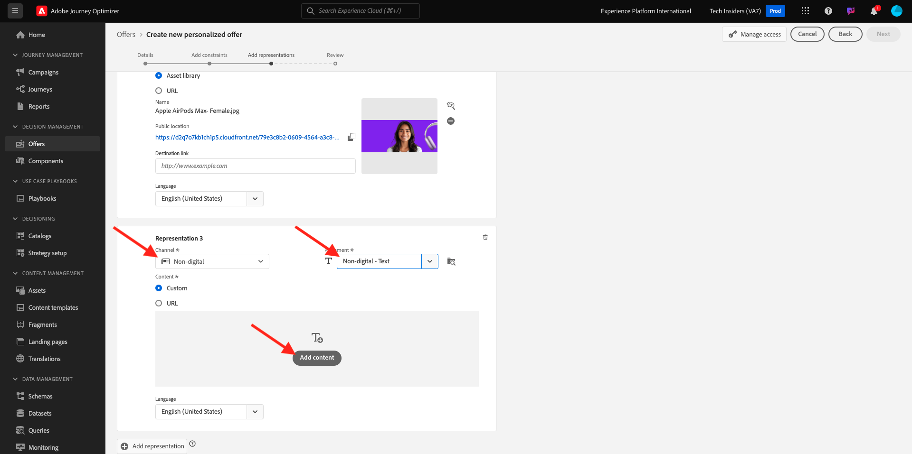
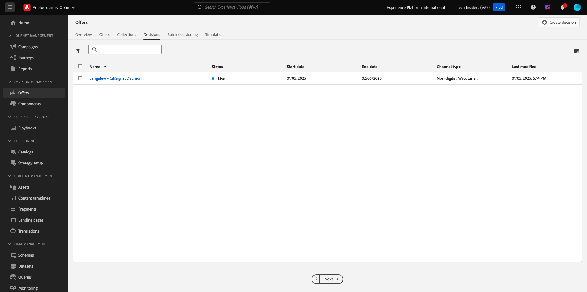

# 3.3.2 오퍼 및 의사 결정 구성

## 3.3.2.1 개인화된 오퍼 만들기

이 연습에서는 4개의 **개인화된 오퍼**&#x200B;를 만듭니다. 이러한 오퍼를 생성할 때 고려해야 할 세부 사항은 다음과 같습니다.

| 이름 | 날짜 범위 | 이메일에 대한 이미지 링크 | 웹용 이미지 링크 | 텍스트 | 우선 순위 | 적격성 | 언어 | 캡핑 빈도 | 이미지 이름 |
|-----|------------|----------------------|--------------------|------|:--------:|--------------|:-------:|:-------:|:-------:|
| `--aepUserLdap-- - AirPods Max` | 오늘 - 1개월 후 | https://bit.ly/4a9RJ5d | Assets 라이브러리에서 선택 | `{{ profile.person.name.firstName }}, 10% discount on AirPods Max` | 25 | 모두 - 여성 고객 | 영어(미국) | 3 | Apple AirPods Max- Female.jpg |
| `--aepUserLdap-- - Galaxy S24` | 오늘 - 1개월 후 | https://bit.ly/3W8yuDv | Assets 라이브러리에서 선택 | `{{ profile.person.name.firstName }}, 5% discount on Galaxy S24` | 15 | 모두 - 여성 고객 | 영어(미국) | 3 | Galaxy S24 - Female.jpg |
| `--aepUserLdap-- - Apple Watch` | 오늘 - 1개월 후 | https://bit.ly/4fGwfxX | https://bit.ly/4fGwfxX | `{{ profile.person.name.firstName }}, 10% discount on Apple Watch` | 25 | 모두 - 남성 고객 | 영어(미국) | 3 | Apple 시계 - Male.jpg |
| `--aepUserLdap-- - Galaxy Watch 7` | 오늘 - 1개월 후 | https://bit.ly/4gTrkeo | Assets 라이브러리에서 선택 | `{{ profile.person.name.firstName }}, 5% discount on Galaxy Watch 7` | 15 | 모두 - 남성 고객 | 영어(미국) | 3 | Galaxy Watch7 - Male.jpg |

{style="table-layout:auto"}

[Adobe Journey Optimizer](https://experience.adobe.com)(으)로 이동하여 Adobe Experience Cloud에 로그인합니다. **Journey Optimizer**&#x200B;을(를) 클릭합니다.

Journey Optimizer의 **Home** 보기로 리디렉션됩니다. 먼저 올바른 샌드박스를 사용하고 있는지 확인하십시오. 사용할 샌드박스를 `--aepSandboxName--`이라고 합니다. 그러면 샌드박스 `--aepSandboxName--`의 **홈** 보기에 있게 됩니다.

왼쪽 메뉴에서 **오퍼**&#x200B;를 클릭한 다음 **오퍼**(으)로 이동합니다. **+ 오퍼 만들기**&#x200B;를 클릭합니다.

그러면 이 팝업이 표시됩니다. **개인 맞춤화된 오퍼**&#x200B;를 선택하고 **다음**&#x200B;을 클릭합니다.

이제 **세부 정보** 보기에 있습니다.

이 경우 오퍼 `--aepUserLdap-- - AirPods Max`을(를) 구성해야 합니다. 위 표의 정보를 사용하여 필드를 작성하십시오. 이 예제에서 Personalized Offer의 이름은 **vangeluw - AirPods Max**&#x200B;입니다. 또한 **시작 날짜 및 시간**&#x200B;을 오늘로 설정하고 **종료 날짜 및 시간**&#x200B;을 지금부터 한 달 후의 날짜로 설정하십시오.

이 작업을 완료하면 이 작업을 수행해야 합니다. **다음**&#x200B;을 클릭합니다.

그러면 다음과 같은 결과가 표시됩니다.

**정의된 결정 규칙별**&#x200B;을 선택하고 **+** 아이콘을 클릭하여 **모두 - 여성 고객** 규칙을 추가합니다.

위 표에 표시된 대로 **우선 순위**&#x200B;를 채우십시오. 그런 다음 **+ 한도 만들기**&#x200B;를 클릭하여 이 오퍼를 고객에게 표시할 수 있는 횟수를 정의합니다.

캡핑에 대해 다음을 선택합니다.

- **최대 가용량 이벤트 선택**: **결정 이벤트**
- **최대 가용량 유형**: **프로필당(각 프로필의 최대 가용량 적용)**
- **이벤트 수 제한**: **3**
- **최대 가용량 다시 설정**: **일별**
- **간격**: **1일**

이렇게 하면 이 오퍼가 고객당 하루에 3번 이상 표시되지 않습니다.

**만들기**&#x200B;를 클릭합니다.

그럼 다시 여기로 오십시오. **다음**&#x200B;을 클릭합니다.

이제 **표시**&#x200B;를 만들어야 합니다. 표현은 **Placement**&#x200B;와(과) 실제 자산의 조합입니다.

**표시 1**&#x200B;에 대해 다음을 선택하세요.

- 채널: 웹
- 배치: 웹 - 이미지
- 컨텐츠: URL
- 공개 위치: 위 표의 **웹용 이미지 링크** 열에서 URL을 복사합니다.

또는 콘텐츠에 대해 **자산 라이브러리**&#x200B;를 선택한 다음 **찾아보기**&#x200B;를 클릭할 수 있습니다.

그런 다음 Assets 라이브러리의 팝업이 표시되고 **enablement-assets** 폴더로 이동하여 이미지 파일 **Apple AirPods Max - Female.jpg**&#x200B;을(를) 선택합니다. 그런 다음 **선택**&#x200B;을 클릭합니다.

그러면 이걸 보게 될 거야. **+ 표시 추가**&#x200B;를 클릭합니다.

**표시 2**&#x200B;에 대해 다음을 선택하세요.

- 채널: 이메일
- 배치: 이메일 - 이미지
- 컨텐츠: URL
- 공개 위치: **자산 라이브러리**&#x200B;를 선택하십시오. **찾아보기** 클릭

그런 다음 Assets 라이브러리의 팝업이 표시되고 **enablement-assets** 폴더로 이동하여 이미지 파일 **Apple AirPods Max - Female.jpg**&#x200B;을(를) 선택합니다. 그런 다음 **선택**&#x200B;을 클릭합니다.

그러면 이걸 보게 될 거야. **+ 표시 추가**&#x200B;를 클릭합니다.

**표시 3**&#x200B;에 대해 다음을 선택하세요.

- 채널: 비디지털
- 배치: 비디지털 - 텍스트

그런 다음 컨텐츠를 추가해야 합니다. 이 경우 작업 호출로 사용할 텍스트를 추가하는 것을 의미합니다.

**사용자 지정**&#x200B;을 선택하고 **콘텐츠 추가**&#x200B;를 클릭합니다.

그러면 이 팝업이 표시됩니다.

위의 표에서 **텍스트** 필드를 보고 여기에 해당 텍스트를 입력하십시오(이 경우 `{{ profile.person.name.firstName }}, 10% discount on AirPods Max`).

프로필 속성을 선택하여 오퍼 텍스트에 동적 필드로 포함할 수도 있습니다. 이 예제에서는 필드 `{{ profile.person.name.firstName }}`을(를) 통해 이 오퍼를 받을 고객의 이름이 오퍼 텍스트에 포함되도록 합니다.

그러면 이걸 보게 될 거야. **저장**&#x200B;을 클릭합니다.

이제 이걸 가지셨네요. **다음**&#x200B;을 클릭합니다.

그러면 새 **개인화된 오퍼**&#x200B;에 대한 개요가 표시됩니다. **마침을 클릭합니다**.

**저장 및 승인**&#x200B;을 클릭합니다.

그러면 오퍼 개요에서 새로 만든 개인화된 오퍼를 사용할 수 있게 됩니다.

이제 위의 단계를 반복하여 위 표에 나와 있는 제품에 대한 세 가지 다른 개인화된 오퍼를 만들어야 합니다.

완료되면 **개인화된 오퍼**&#x200B;에 대한 **오퍼 개요** 화면에 모든 오퍼가 표시됩니다.

## 3.3.2.2 대체 오퍼 만들기

4개의 개인화된 오퍼를 만든 후에는 이제 **대체 오퍼**&#x200B;를 구성해야 합니다.

**오퍼** 보기에 있는지 확인하세요. **+ 오퍼 만들기**&#x200B;를 클릭합니다.

그러면 이 팝업이 표시됩니다. **대체 오퍼**&#x200B;를 선택하고 **다음**&#x200B;을(를) 클릭합니다.

그러면 이걸 보게 될 거야. 대체 오퍼 이름 `--aepUserLdap-- - CitiSignal Fallback Offer`을(를) 입력하십시오. **다음**&#x200B;을 클릭합니다.

이제 **표시**&#x200B;를 만들어야 합니다. 표현은 **Placement**&#x200B;와(과) 실제 자산의 조합입니다.

**표시 1**&#x200B;에 대해 다음을 선택하세요.

- **채널**: **웹**
- **배치**: **웹 - 이미지**
- **컨텐츠**: **자산 라이브러리**

이미지를 선택하려면 **찾아보기**&#x200B;를 클릭하세요.

그러면 Assets 라이브러리의 팝업이 표시되고 **citi-signal-images** 폴더로 이동하여 이미지 파일 **App-Banner-Ad.jpg**&#x200B;을(를) 선택합니다. 그런 다음 **선택**&#x200B;을 클릭합니다.

그러면 이걸 보게 될 거야. **+ 표시 추가**&#x200B;를 클릭합니다.

**표시 2**&#x200B;에 대해 다음을 선택하세요.

- **채널**: **전자 메일**
- **배치**: **전자 메일 - 이미지**
- **컨텐츠**: **자산 라이브러리**

이미지를 선택하려면 **찾아보기**&#x200B;를 클릭하세요.

그러면 Assets 라이브러리의 팝업이 표시되고 **citi-signal-images** 폴더로 이동하여 이미지 파일 **App-Banner-Ad.jpg**&#x200B;을(를) 선택합니다. 그런 다음 **선택**&#x200B;을 클릭합니다.

그러면 이걸 보게 될 거야. **+ 표시 추가**&#x200B;를 클릭합니다.

**표시 3**&#x200B;에 대해 다음을 선택하세요.

- **채널**: **디지털이 아님**
- **배치**: **디지털이 아님 - 텍스트**
- **콘텐츠**: **사용자 지정**

**콘텐츠 추가**&#x200B;를 클릭합니다.

그러면 이 팝업이 표시됩니다. `{{ profile.person.name.firstName }}, download the CitiSignal app now!` 텍스트를 입력하고 **저장**&#x200B;을 클릭합니다.

그러면 이걸 보게 될 거야. **다음**&#x200B;을 클릭합니다.

그러면 새 **대체 오퍼**&#x200B;에 대한 개요가 표시됩니다. **마침을 클릭합니다**.

마지막으로 **저장 및 승인**&#x200B;을 클릭합니다.

**오퍼 개요** 화면에서 다음을 볼 수 있습니다.

## 3.3.2.3 컬렉션 만들기

컬렉션은 개인화된 오퍼 목록에서 오퍼의 하위 집합을 **필터링**&#x200B;하고, 결정 프로세스의 속도를 높이기 위해 결정의 일부로 사용하는 데 사용됩니다.

**컬렉션**(으)로 이동합니다. **+ 컬렉션 만들기**&#x200B;를 클릭합니다.

그러면 이 팝업이 표시됩니다. 다음과 같이 컬렉션을 구성합니다. **다음**&#x200B;을 클릭합니다.

- 컬렉션 이름: `--aepUserLdap-- - CitiSignal Collection` 사용
- **정적 컬렉션 만들기**&#x200B;를 선택합니다.

**다음**&#x200B;을 클릭합니다.

다음 화면에서는 이전 연습에서 만든 네 개의 **개인화된 오퍼**&#x200B;를 선택합니다. **저장**&#x200B;을 클릭합니다.

이제 다음이 표시됩니다.

## 3.3.2.4 의사 결정 만들기

의사 결정에는 배치, 개인화된 오퍼 컬렉션 및 대체 오퍼가 결합되어 궁극적으로 Offer Decisioning 엔진에서 사용하여 우선 순위, 자격 제한 및 총/사용자 한도 등 개인화된 각 오퍼 특성을 기반으로 특정 프로필에 가장 적합한 오퍼를 찾는 것이 좋습니다.

**결정**&#x200B;을 구성하려면 **결정**(으)로 이동하십시오. **+ 결정 만들기**&#x200B;를 클릭합니다.

그러면 이걸 보게 될 거야. 다음과 같이 필드를 채웁니다. **다음**&#x200B;을 클릭합니다.

- 이름: `--aepUserLdap-- - CitiSignal Decision`
- 시작 날짜 및 시간: 오늘
- 종료 날짜 및 시간: 오늘 + 1개월

다음 화면에서는 결정 범위에 배치를 추가해야 합니다. **웹 - 이미지**, **전자 메일 - 이미지** 및 **디지털 이외 - 텍스트** 배치에 대한 결정 범위를 만들어야 합니다.

먼저 드롭다운에서 해당 배치를 선택하여 **비디지털 - 텍스트**&#x200B;에 대한 결정 범위를 만듭니다. 그런 다음 **추가** 단추를 클릭하여 평가 기준을 추가합니다.

컬렉션 `--aepUserLdap-- - CitiSignal Collection`을(를) 선택하고 **추가**&#x200B;를 클릭합니다.

그러면 이걸 보게 될 거야. 새 결정 범위를 추가하려면 **+** 단추를 클릭하십시오.

**웹 - 이미지** 배치를 선택하고 평가 기준에 따라 컬렉션 `--aepUserLdap-- - CitiSignal Collection`을(를) 추가하십시오. 그런 다음 **+** 단추를 다시 클릭하여 새 결정 범위를 추가합니다.

**전자 메일 - 이미지** 배치를 선택하고 평가 기준에 따라 컬렉션 `--aepUserLdap-- - CitiSignal Collection`을(를) 추가하십시오. 그런 다음 **다음**&#x200B;을 클릭합니다.

이제 **대체 오퍼**&#x200B;을(를) 선택해야 합니다. 대체 오퍼의 이름은 `--aepUserLdap-- - CitiSignal Fallback Offer`입니다. **다음**&#x200B;을 클릭합니다.

결정을 검토하십시오. **마침을 클릭합니다**.

팝업에서 **저장 및 활성화**&#x200B;를 클릭합니다.

그리고 마지막으로 이제 개요에서 결정을 확인할 수 있습니다.

이제 결정을 성공적으로 구성했습니다. 이제 의사 결정이 라이브되며, 이를 사용하여 실시간으로 고객에게 최적화되고 개인화된 오퍼를 제공할 수 있습니다.

## 다음 단계

[3.3.3(으)로 이동하여 Offer Decisioning용 데이터 수집 클라이언트 속성 및 웹 SDK 설정 준비](./ex3.md){target="_blank"}

[Offer Decisioning](offer-decisioning.md){target="_blank"}로 돌아가기

[모든 모듈](./../../../../overview.md){target="_blank"}(으)로 돌아가기
