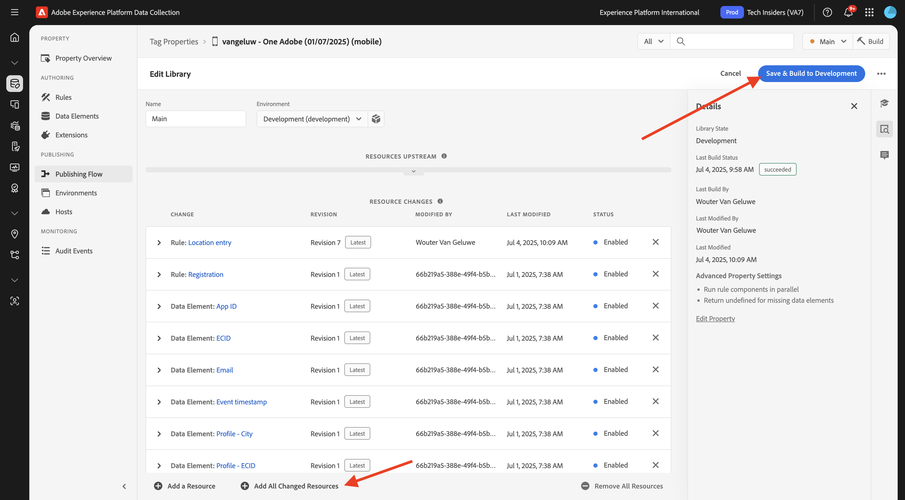

# 3.3.2 푸시 메시지로 여정 구성

[Adobe Journey Optimizer](https://experience.adobe.com)&#x200B;(으)로 이동하여 Adobe Experience Cloud에 로그인합니다. **Journey Optimizer**&#x200B;을(를) 클릭합니다.

Journey Optimizer의 **Home** 보기로 리디렉션됩니다. 먼저 올바른 샌드박스를 사용하고 있는지 확인하십시오. 사용할 샌드박스를 `--aepSandboxName--`이라고 합니다. 그러면 샌드박스 **의**&#x200B;홈`--aepSandboxName--` 보기에 있게 됩니다.

## 3.3.2.1 새 이벤트 만들기

왼쪽 메뉴에서 **구성**(으)로 이동한 다음 **이벤트**&#x200B;에서 **관리**&#x200B;를 클릭합니다.

**이벤트** 화면에 다음과 유사한 보기가 표시됩니다. **이벤트 만들기**&#x200B;를 클릭합니다.

그러면 빈 이벤트 구성이 표시됩니다.
먼저 이벤트에 다음과 같은 이름(`--aepUserLdap--StoreEntryEvent`)을 지정하고 설명을 `Store Entry Event`(으)로 설정하십시오.
다음은 **이벤트 유형** 선택입니다. **단일**&#x200B;을(를) 선택합니다.
다음은 **이벤트 ID 유형** 선택 항목입니다. **시스템 생성**&#x200B;을 선택하십시오.

다음은 스키마 선택 사항입니다. 이 연습을 위해 스키마가 준비되었습니다. 스키마 `Demo System - Event Schema for Mobile App (Global v1.1) v.1`을(를) 사용하십시오.

스키마를 선택하면 **페이로드** 섹션에서 여러 필드를 선택할 수 있습니다. 필드 **Namespace**&#x200B;이(가) **ECID**(으)로 설정되어 있는지 확인하십시오. 이제 이벤트가 완전히 구성되었습니다.

**저장**&#x200B;을 클릭합니다.

이제 이벤트가 구성 및 저장되었습니다. 이벤트를 다시 클릭하여 **이벤트 편집** 화면을 다시 엽니다.

**페이로드** 필드 위로 마우스를 가져간 후 **페이로드 보기** 아이콘을 클릭합니다.

이제 예상 페이로드의 예를 볼 수 있습니다.

이벤트에는 고유한 오케스트레이션 eventID가 있으며 `_experience.campaign.orchestration.eventID`이(가) 표시될 때까지 해당 페이로드에서 아래로 스크롤하여 찾을 수 있습니다.

이벤트 ID는 다음 단계에서 빌드할 여정을 트리거하기 위해 Adobe Experience Platform에 전송해야 하는 ID입니다. 다음 단계에서 필요하므로 이 eventID를 기록하십시오.
`"eventID": "aa895251f76831e6440f169f1bb9d2a4388f0696d8e2782cfab192a275817dfa"`

**확인**&#x200B;을 클릭합니다.

**취소**&#x200B;를 클릭합니다.

## 3.3.2.2 여정 만들기

왼쪽 메뉴에서 **여정**(으)로 이동하여 **여정 만들기**&#x200B;를 클릭합니다.

그러면 이걸 보게 될 거야. 여정 이름을 지정하십시오. `--aepUserLdap-- - Store Entry journey`. **저장**&#x200B;을 클릭합니다.

먼저 이벤트를 여정 시작점으로 추가해야 합니다. `--aepUserLdap--StoreEntryEvent` 이벤트를 검색하여 캔버스에 끌어서 놓습니다. **저장**&#x200B;을 클릭합니다.

그런 다음 **Actions**&#x200B;에서 **Push** 작업을 검색합니다. **Push** 작업을 캔버스로 끌어서 놓습니다.

**카테고리**&#x200B;을(를) **마케팅**(으)로 설정하고 푸시 알림을 보낼 수 있는 푸시 표면을 선택하십시오. 이 경우 선택할 전자 메일 표면은 **Push-iOS-Android**&#x200B;입니다.

>[!NOTE]
>
>이전에 검토한 대로 **앱 표면**&#x200B;을(를) 사용하는 Journey Optimizer 채널이 있어야 합니다.

다음 단계는 메시지를 만드는 것입니다. 이렇게 하려면 **콘텐츠 편집**&#x200B;을 클릭하세요.

그러면 이걸 보게 될 거야. **제목** 필드에 대한 **개인화** 아이콘을 클릭합니다.

그러면 이걸 보게 될 거야. 이제 실시간 고객 프로필에서 프로필 속성을 직접 선택할 수 있습니다.

**이름** 필드를 검색한 다음 **이름** 필드 옆에 있는 **+** 아이콘을 클릭합니다. 그러면 이름 **{{profile.person.name.firstName}}**&#x200B;에 대한 개인화 토큰이 추가됩니다.

**텍스트를 추가합니다. 스토어에 오신 것을 환영합니다!** 뒤에 **{{profile.person.name.firstName}}**&#x200B;이(가) 있습니다.

**저장**&#x200B;을 클릭합니다.

이제 이걸 가지셨네요. **본문** 필드에 대한 **개인화** 아이콘을 클릭합니다.

이 텍스트를 입력하십시오. **오늘 구입하면 10% 할인을 받으려면 여기를 클릭하세요!**&#x200B;을(를) 클릭하고 **저장**&#x200B;을(를) 클릭합니다.

그럼 이걸로 드셔보세요 왼쪽 상단 모서리의 화살표를 클릭하여 여정으로 돌아갑니다.

푸시 작업을 닫으려면 **저장**&#x200B;을 클릭하세요.

**게시**&#x200B;를 클릭합니다.

**게시**&#x200B;를 다시 클릭합니다.

이제 여정이 게시되었습니다.

## 3.3.2.3 모바일에 대한 데이터 수집 속성 업데이트

**시작하기**&#x200B;에서 데모 시스템은 다음에 사용자를 위해 태그 속성을 만들었습니다. 하나는 웹 사이트용이고 하나는 모바일 앱용입니다. `--aepUserLdap--`검색&#x200B;**상자에서**&#x200B;을(를) 검색하여 찾으십시오. **Mobile** 속성을 열려면 클릭하세요.

그럼 이걸 보셔야죠

왼쪽 메뉴에서 **규칙**(으)로 이동한 다음 클릭하여 **위치 항목** 규칙을 엽니다.

그럼 이걸 보셔야죠 **Mobile Core - 데이터 첨부** 작업을 클릭합니다.

그럼 이걸 보셔야죠

`--aepUserLdap--StoreEntryEvent` 이벤트의 eventID를 **JSON 페이로드** 창에 붙여 넣습니다. **변경 내용 유지**&#x200B;를 클릭합니다.

**저장** 또는 **라이브러리에 저장**&#x200B;을 클릭합니다.

**Publishing Flow**(으)로 이동한 다음 클릭하여 라이브러리 **Main**&#x200B;을(를) 엽니다.

**변경된 모든 리소스 추가**&#x200B;를 클릭한 다음 **개발에 저장 및 빌드**&#x200B;를 클릭합니다.

## 3.3.2.4 여정 및 푸시 메시지 테스트

**DSN Mobile** 응용 프로그램을 엽니다.

**스토어 로케이터** 페이지로 이동합니다.

**POI 항목 시뮬레이션**&#x200B;을 클릭합니다.

몇 초 후에 푸시 알림이 표시되는 것을 볼 수 있습니다.

## 다음 단계

[3.3.3으로 이동 인앱 메시지로 캠페인 구성](./ex3.md){target="_blank"}

[Adobe Journey Optimizer: 푸시 및 인앱 메시지](ajopushinapp.md){target="_blank"}(으)로 돌아가기

[모든 모듈](./../../../../overview.md){target="_blank"}(으)로 돌아가기