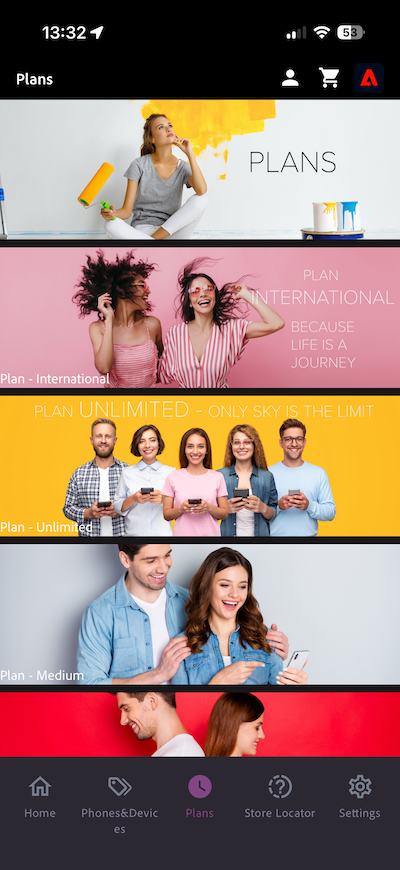

# 3.3.3 인앱 메시지로 캠페인 구성

[Adobe Journey Optimizer](https://experience.adobe.com)&#x200B;(으)로 이동하여 Adobe Experience Cloud에 로그인합니다. **Journey Optimizer**&#x200B;을(를) 클릭합니다.

Journey Optimizer의 **Home** 보기로 리디렉션됩니다. 먼저 올바른 샌드박스를 사용하고 있는지 확인하십시오. 사용할 샌드박스를 `--aepSandboxName--`이라고 합니다. 그러면 샌드박스 **의**&#x200B;홈`--aepSandboxName--` 보기에 있게 됩니다.

## 3.3.3.1 인앱 메시지 채널 구성

왼쪽 메뉴에서 **채널**(으)로 이동한 다음 **채널 구성**&#x200B;을 선택합니다. **채널 구성 만들기**&#x200B;를 클릭합니다.

이름 `--aepUserLdap--_In-app_Messages`을(를) 입력하고 채널 **인앱 메시지**&#x200B;를 선택한 다음 플랫폼 **웹**, **iOS** 및 **Android**&#x200B;을(를) 사용하도록 설정합니다.

아래로 스크롤하면 이 항목이 표시됩니다.

**단일 페이지**&#x200B;가 활성화되어 있는지 확인하십시오.

**Web**&#x200B;의 경우 **시작하기** 모듈의 일부로 이전에 만든 웹 사이트의 URL을 입력하십시오. `https://dsn.adobe.com/web/--aepUserLdap---XXXX`과(와) 비슷합니다. **XXXX**&#x200B;을(를) 웹 사이트의 고유 코드로 변경하는 것을 잊지 마십시오.

**iOS** 및 **Android**&#x200B;의 경우 `com.adobe.dsn.dxdemo`을(를) 입력하십시오.

위로 스크롤하여 **제출**&#x200B;을 클릭합니다.

이제 채널 구성을 사용할 준비가 되었습니다.

## 3.3.3.2 인앱 메시지에 대해 예약된 캠페인 구성

왼쪽 메뉴에서 **캠페인**(으)로 이동한 다음 **캠페인 만들기**&#x200B;를 클릭합니다.

**예약됨 - 마케팅**&#x200B;을 선택한 다음 **만들기**&#x200B;를 클릭합니다.

`--aepUserLdap-- - CitiSignal Fiber Max` 이름을 입력한 다음 **작업**&#x200B;을 클릭합니다.

**+ 작업 추가**&#x200B;를 클릭한 다음 **인앱 메시지**&#x200B;를 선택합니다.

이전 단계에서 만든 인앱 메시지 채널 구성을 선택합니다. 이름이 `--aepUserLdap--_In-app_Messages`입니다. **콘텐츠 편집**&#x200B;을 클릭합니다.

그럼 이걸 보셔야죠 **모달**&#x200B;을 클릭합니다.

**레이아웃 변경**&#x200B;을 클릭합니다.

**미디어 URL** 아이콘을 클릭하여 AEM Assets에서 자산을 선택합니다.

**citisignal-images** 폴더로 이동하여 이미지 파일 **neon-rabbit.jpg**&#x200B;을(를) 선택하십시오. **선택**&#x200B;을 클릭합니다.

**Header** 텍스트의 경우 `CitiSignal Fiber Max`을(를) 사용합니다.
**본문** 텍스트의 경우 `Conquer lag with Fiber Max`을(를) 사용합니다.

**Button #1 text**&#x200B;을(를) `Go to Plans`(으)로 설정합니다.
**target**&#x200B;을(를) `com.adobe.dsn.dxdemo://plans`(으)로 설정합니다.

활성화하려면 **검토**&#x200B;를 클릭하세요.

**활성화**&#x200B;를 클릭합니다.

이제 캠페인의 상태가 **활성화**(으)로 설정됩니다. 캠페인이 라이브되기까지 2분 정도 소요될 수 있습니다.

상태가 **Live**(으)로 변경되면 캠페인을 테스트할 수 있습니다.

## 3.3.3.3 모바일에서 인앱 메시지 캠페인 테스트

모바일 장치에서 앱을 엽니다. 그런 다음 앱을 시작한 후에 새로운 인앱 메시지가 표시되는 것을 볼 수 있습니다. **플랜으로 이동** 단추를 클릭합니다.

**플랜** 페이지로 이동합니다.

## 다음 단계

[요약 및 혜택](./summary.md){target="_blank"}(으)로 이동

[Adobe Journey Optimizer: 푸시 및 인앱 메시지](ajopushinapp.md){target="_blank"}(으)로 돌아가기

[모든 모듈](./../../../../overview.md){target="_blank"}(으)로 돌아가기
