# 3.4.1 트리거 기반 여정 구성 - 주문 확인

[Adobe Journey Optimizer](https://experience.adobe.com)&#x200B;(으)로 이동하여 Adobe Experience Cloud에 로그인합니다. **Journey Optimizer**&#x200B;을(를) 클릭합니다.


Journey Optimizer의 **Home** 보기로 리디렉션됩니다. 먼저 올바른 샌드박스를 사용하고 있는지 확인하십시오. 사용할 샌드박스를 `--aepSandboxName--`이라고 합니다. 그러면 샌드박스 **의**&#x200B;홈`--aepSandboxName--` 보기에 있게 됩니다.


## 3.4.1.1 내 이벤트 만들기

메뉴에서 **구성**(으)로 이동하여 **이벤트**&#x200B;에서 **관리**&#x200B;를 클릭합니다.

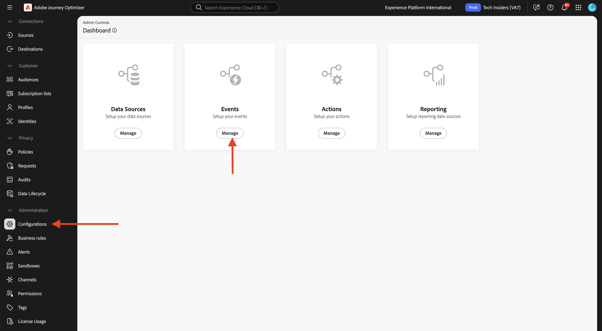

**이벤트** 화면에 다음과 유사한 보기가 표시됩니다. **이벤트 만들기**&#x200B;를 클릭합니다.


그러면 빈 이벤트 구성이 표시됩니다.

먼저 이벤트에 다음과 같은 이름(`--aepUserLdap--PurchaseEvent`)을 지정하고 다음과 같은 설명을 추가하십시오. `Purchase Event`

**Type**&#x200B;에 대해 **Unitary**를 선택합니다.
**이벤트 ID 유형**&#x200B;에 대해 **시스템 생성**&#x200B;을 선택하십시오.


다음은 스키마 선택입니다. 이 연습을 위해 스키마가 준비되었습니다. 스키마 `Demo System - Event Schema for Website (Global v1.1) v.1`을(를) 사용하십시오.

스키마를 선택하면 **페이로드** 섹션에서 여러 필드를 선택할 수 있습니다. 이 이벤트에 필드를 추가하려면 **편집/연필** 아이콘을 클릭하십시오.


그러면 이 팝업이 표시됩니다. 이제 이 이벤트가 트리거될 때 추가 데이터에 액세스하려면 추가 확인란을 선택해야 합니다.

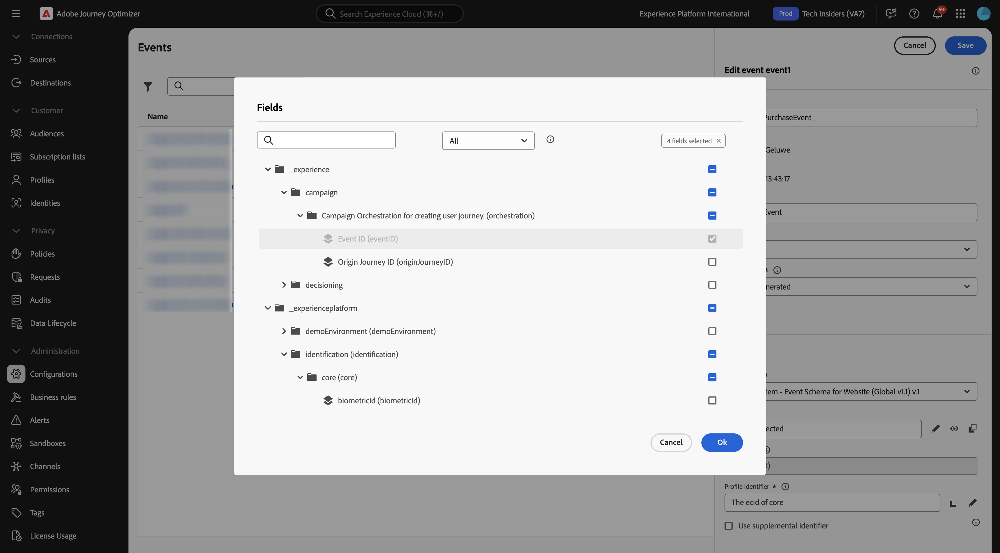

먼저 `--aepTenantId--`줄의 확인란을 선택하십시오.

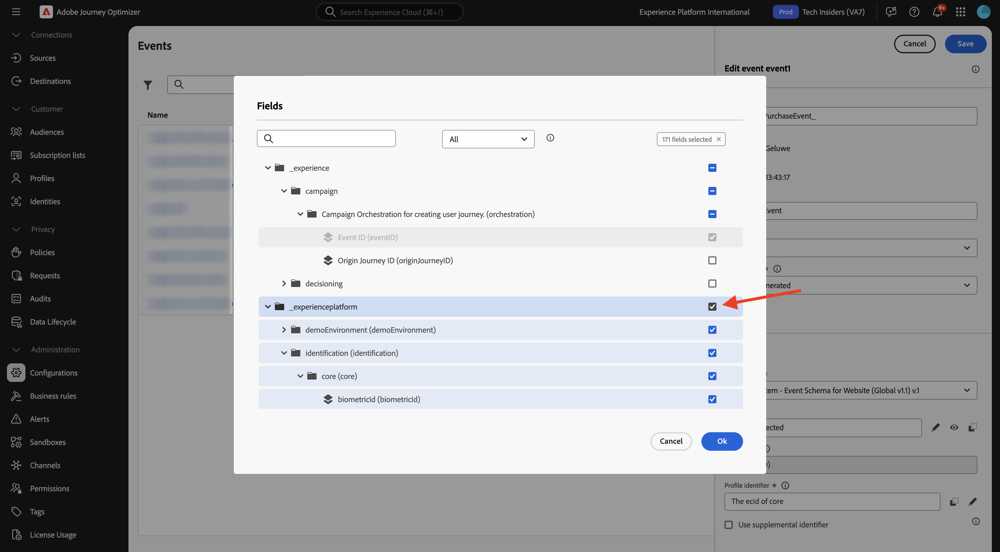

그런 다음 아래로 스크롤하여 `commerce`행의 확인란을 선택합니다.


그런 다음 아래로 스크롤하여 `productListItems`행의 확인란을 선택합니다. **확인**&#x200B;을 클릭합니다.

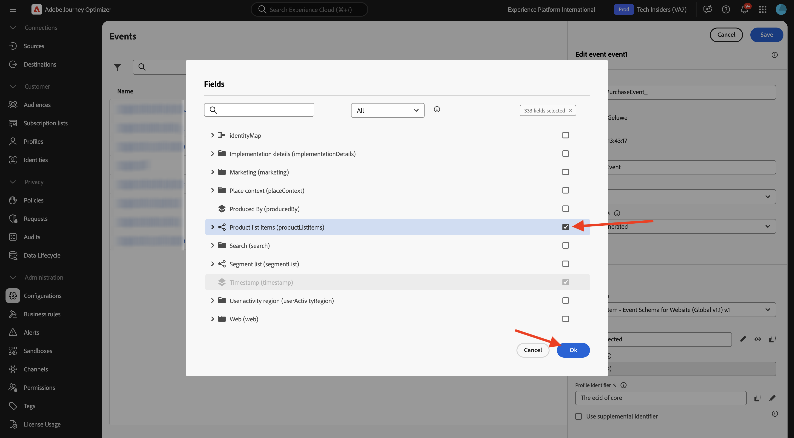

그러면 이벤트에 추가 필드가 추가된 것을 볼 수 있습니다. **저장**&#x200B;을 클릭합니다.

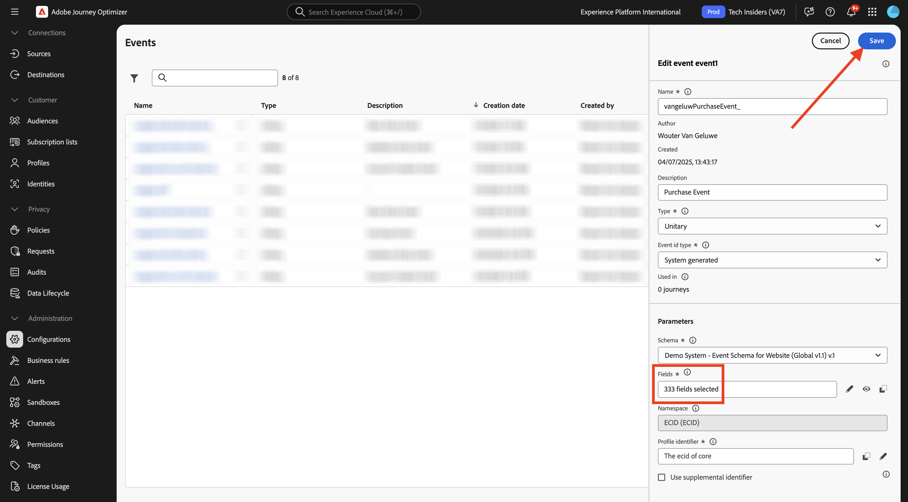

그러면 새 이벤트가 저장되고 이제 사용 가능한 이벤트 목록에 이벤트가 표시됩니다.

이벤트를 다시 클릭하여 **이벤트 편집** 화면을 다시 엽니다.
**페이로드** 필드 위로 마우스를 다시 가져가면 3개의 아이콘이 다시 표시됩니다. **페이로드 보기** 아이콘을 클릭합니다.


이제 예상 페이로드의 예를 볼 수 있습니다. 이벤트에는 고유한 오케스트레이션 eventID가 있으며 `_experience.campaign.orchestration.eventID`이(가) 표시될 때까지 해당 페이로드에서 아래로 스크롤하여 찾을 수 있습니다.

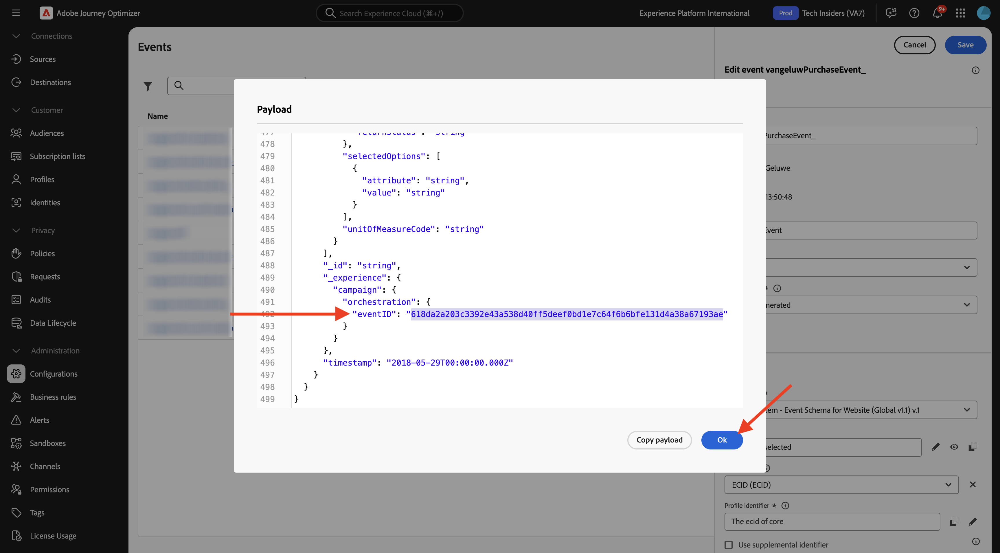

이벤트 ID는 다음 단계에서 빌드할 여정을 트리거하기 위해 Adobe Journey Optimizer에 전송해야 하는 ID입니다. 다음 단계 중 하나에서 필요하므로 이 eventID를 적어 두십시오.
`"eventID": "618da2a203c3392e43a538d40ff5deef0bd1e7c64f6b6bfe131d4a38a67193ae"`

**확인**, **취소**&#x200B;를 차례로 클릭합니다.

이제 이벤트가 구성되었으며 사용할 준비가 되었습니다.

## 3.4.1.2 여정 만들기

메뉴에서 **여정**(으)로 이동하여 **여정 만들기**&#x200B;를 클릭합니다.

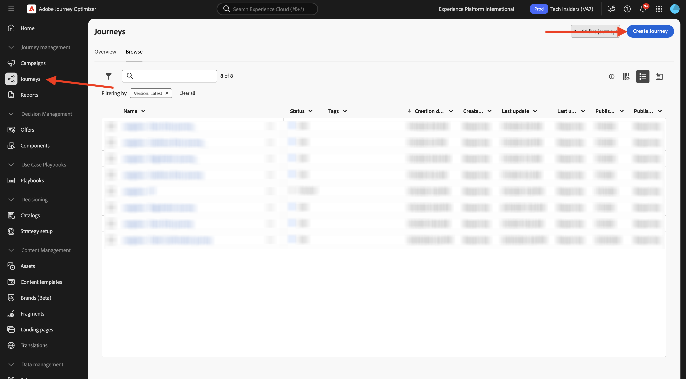

그러면 이걸 보게 될 거야. 여정 이름을 지정합니다. `--aepUserLdap-- - Order Confirmation journey` 사용. **저장**&#x200B;을 클릭합니다.

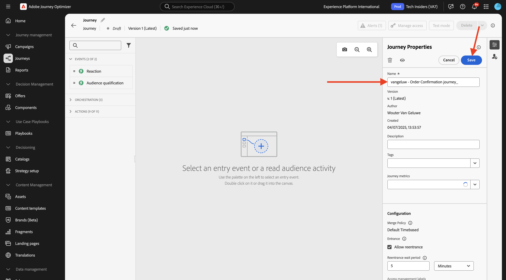

먼저 이벤트를 여정 시작점으로 추가해야 합니다. `--aepUserLdap--PurchaseEvent` 이벤트를 검색하여 캔버스에 끌어서 놓습니다. **저장**&#x200B;을 클릭합니다.

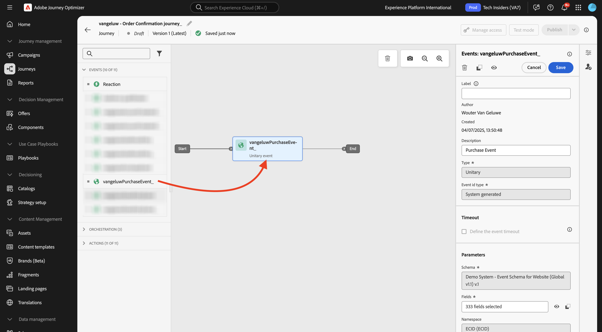

그런 다음 **작업**&#x200B;에서 **전자 메일** 작업을 검색하고 캔버스에 추가합니다.


**카테고리**&#x200B;을(를) **마케팅**(으)로 설정하고 전자 메일을 보낼 수 있는 전자 메일 표면을 선택합니다. 이 경우 선택할 전자 메일 표면은 **전자 메일**&#x200B;입니다. 다음 단계는 메시지를 만드는 것입니다. 이렇게 하려면 **콘텐츠 편집**&#x200B;을 클릭하세요.

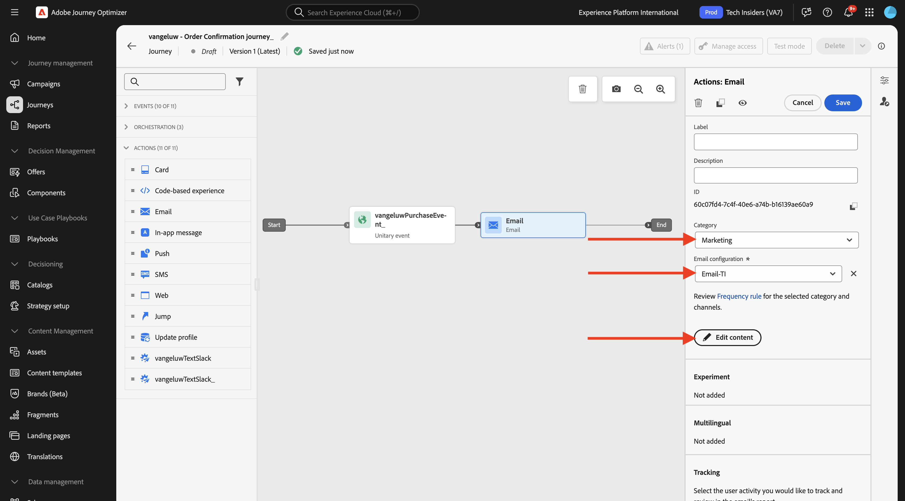

이제 이 항목을 볼 수 있습니다. **제목 줄** 텍스트 필드를 클릭합니다.


텍스트 영역에서 `Thanks for your order, ` 쓰기를 시작하고 **Personalization** 아이콘을 클릭합니다.

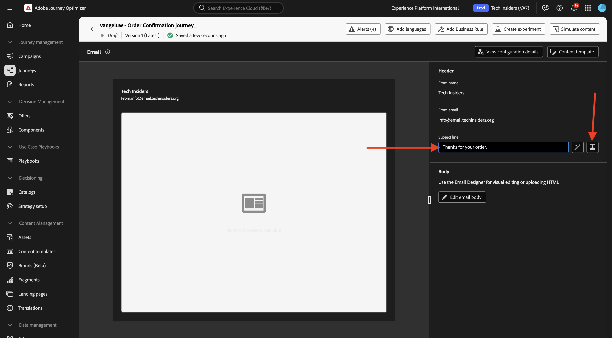

제목란은 아직 완성되지 않았습니다. 다음으로 **아래에 저장된 필드**&#x200B;이름`profile.person.name.firstName`에 대한 개인화 토큰을 가져와야 합니다. 왼쪽 메뉴에서 아래로 스크롤하여 **개인** > **전체 이름** > **이름** 필드를 찾은 다음 **+** 아이콘을 클릭하여 제목 줄에 개인화 토큰을 추가합니다. **저장**&#x200B;을 클릭합니다.


그럼 다시 여기로 오십시오. 전자 메일 콘텐츠를 만들려면 **전자 메일 본문 편집**&#x200B;을 클릭하세요.


다음 화면에서는 **처음부터 디자인**&#x200B;을 클릭합니다.

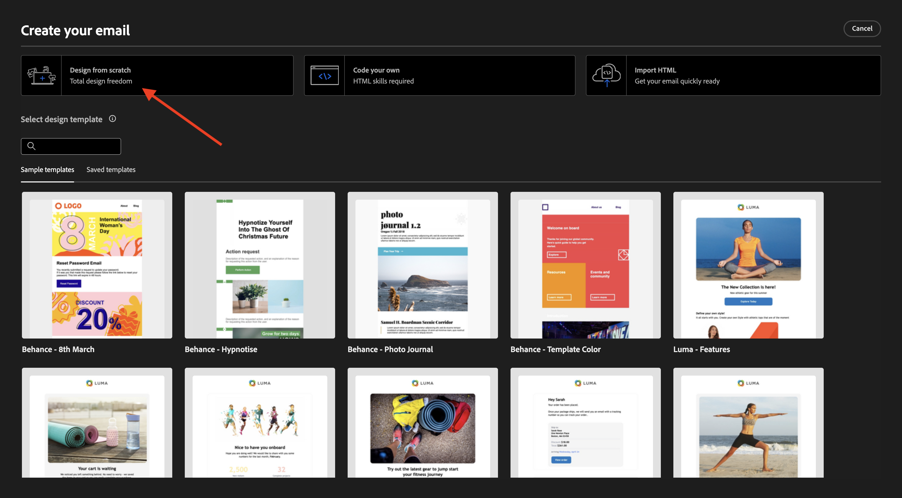

왼쪽 메뉴에서 이메일(행 및 열) 구조를 정의하는 데 사용할 수 있는 구조 구성 요소를 찾을 수 있습니다.

캔버스에 **1:1 열**&#x200B;을 8번 끌어다 놓으십시오. 이렇게 하면 다음과 같은 결과가 발생합니다.


왼쪽 메뉴에서 **조각**(으)로 이동합니다. [연습 3.1.2.1](./../ajob2c-1/ex2.md)에서 이전에 만든 헤더를 캔버스에서 첫 번째 구성 요소로 드래그합니다. [연습 3.1.2.2](./../ajob2c-1/ex2.md)에서 이전에 만든 바닥글을 캔버스에서 마지막 구성 요소로 드래그합니다.


왼쪽 메뉴에서 **+** 아이콘을 클릭합니다. 캔버스에 콘텐츠를 추가하려면 **콘텐츠**(으)로 이동하십시오.


**내용**(으)로 이동하여 **이미지** 구성 요소를 두 번째 행에 끌어다 놓습니다. **찾아보기**&#x200B;를 클릭합니다.

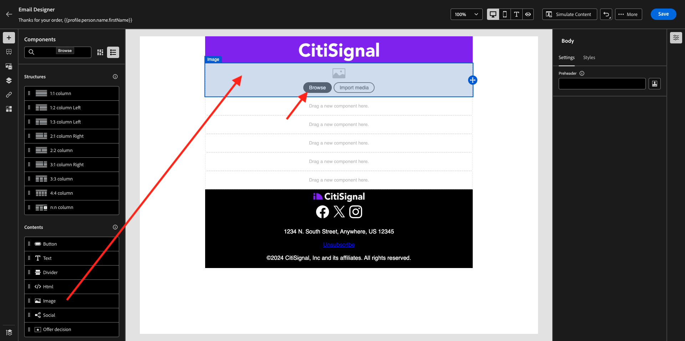

**citi-signal-images** 폴더를 열고 **citigsignal-preparing.png** 이미지를 클릭하여 선택하고 **선택**&#x200B;을 클릭합니다.


**스타일**&#x200B;에서 너비를 **40%**(으)로 변경합니다.


그런 다음 **내용**(으)로 이동하여 세 번째 행에 **텍스트** 구성 요소를 끌어다 놓습니다.


구성 요소 **에서 기본 텍스트를 선택하십시오. 여기에 텍스트를 입력하십시오.**&#x200B;을(를) 아래 텍스트로 바꿉니다.

```javascript
You’re one step closer!

Hi 

We've received your order details!

We will also send you a separate email containing your VAT Invoice.

We'll be back in touch with you as soon as we've finished packing your package. Please read carefully the Order Information detailed below.
```


**안녕하세요** 텍스트 옆에 커서를 놓고 **Personalization 추가**&#x200B;를 클릭합니다.


**개인** > **전체 이름** > **이름** 필드로 이동하고 **+** 아이콘을 클릭하여 제목 줄에 개인화 토큰을 추가합니다. **저장**&#x200B;을 클릭합니다.


그러면 다음과 같은 결과가 표시됩니다.


그런 다음 **내용**(으)로 이동하여 네 번째 행에 **텍스트** 구성 요소를 끌어다 놓습니다.


구성 요소 **에서 기본 텍스트를 선택하십시오. 여기에 텍스트를 입력하십시오.**&#x200B;을(를) 아래 텍스트로 바꿉니다.

`Order Information`

글꼴 크기를 **26px**(으)로 변경하고 텍스트를 이 셀에 가운데로 둡니다. 그러면 다음 항목이 제공됩니다.


그런 다음 **컨텐츠**(으)로 이동하여 다섯 번째 행에 **HTML** 구성 요소를 끌어다 놓습니다. HTML 구성 요소를 클릭한 다음 **소스 코드 표시**&#x200B;를 클릭합니다.


**HTML 편집** 팝업에서 이 HTML을 붙여 넣습니다.

```<table><tbody><tr><td><b>Items purchased</b></td><td></td><td><b>Quantity</b></td><td><b>Subtotal</b></td></tr><tr><td colspan="4" width="500"><hr></td></tr></tbody></table>```

**저장**&#x200B;을 클릭합니다.


그럼 이걸로 드셔보세요 진행률을 저장하려면 **저장**&#x200B;을 클릭하세요.


**컨텐츠**(으)로 이동하여 여섯 번째 행에 **HTML** 구성 요소를 끌어다 놓습니다. HTML 구성 요소를 클릭한 다음 **소스 코드 표시**&#x200B;를 클릭합니다.

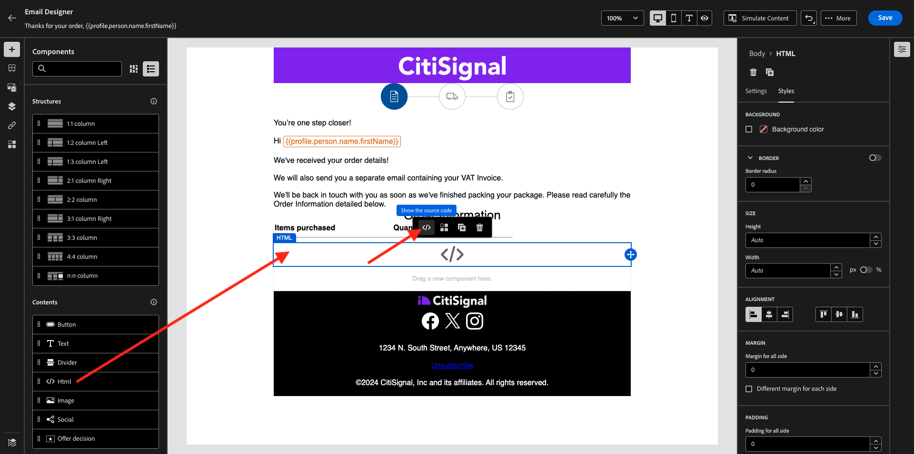

**HTML 편집** 팝업에서 이 HTML을 붙여 넣습니다.

```{{#each xxx as |item|}}<table width="500"><tbody><tr><td></td><td><table><tbody><tr><td><b>{{item.name}}</b><br>{{item.--aepTenantId--.core.subCategory}}<br><b>{{item.priceTotal}}</b><br>&nbsp;<br>Article no: {{item.SKU}}</td></tr></tbody></table></td><td>{{item.quantity}}</td><td><b>{{item.priceTotal}}</b></td></tr></tbody></table>{{/each}}```

그러면 다음 항목이 제공됩니다.


이제 여정을 트리거하는 이벤트의 일부인 productListItems 개체에 대한 참조로 **xxx**&#x200B;을(를) 바꾸어야 합니다.


먼저 HTML 코드에서 **xxx**&#x200B;을(를) 삭제합니다.


왼쪽 메뉴에서 **컨텍스트 특성**&#x200B;을 클릭합니다. 이 컨텍스트는 여정에서 메시지로 전달됩니다.

그러면 이걸 보게 될 거야. 자세히 드릴하려면 **Journey Orchestration** 옆에 있는 화살표를 클릭하십시오.

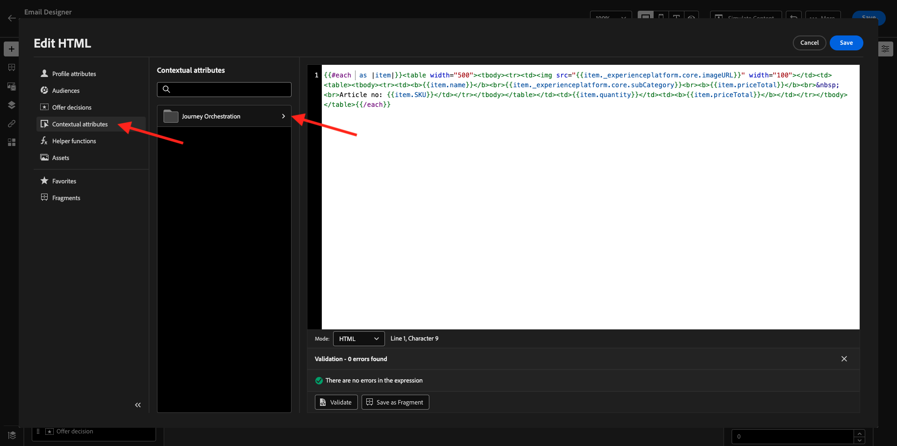

자세히 드릴하려면 **이벤트** 옆에 있는 화살표를 클릭하십시오.


자세히 드릴하려면 `--aepUserLdap--PurchaseEvent` 옆에 있는 화살표를 클릭하십시오.


자세히 드릴하려면 **productListItems** 옆에 있는 화살표를 클릭하십시오.


**이름** 옆에 있는 **+** 아이콘을 클릭하여 캔버스에 추가하십시오. 그럼 이걸로 드셔보세요 이제 아래 스크린샷에 표시된 대로 **.name**&#x200B;을(를) 선택한 다음 **.name**&#x200B;을(를) 제거해야 합니다.

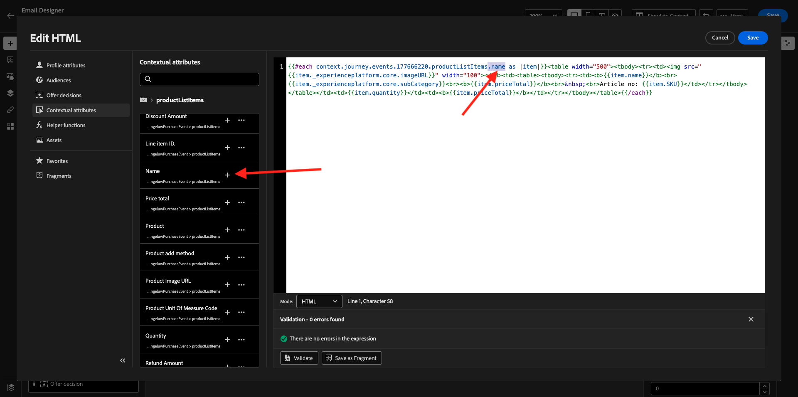

그럼 이걸로 드셔보세요 **저장**&#x200B;을 클릭합니다.

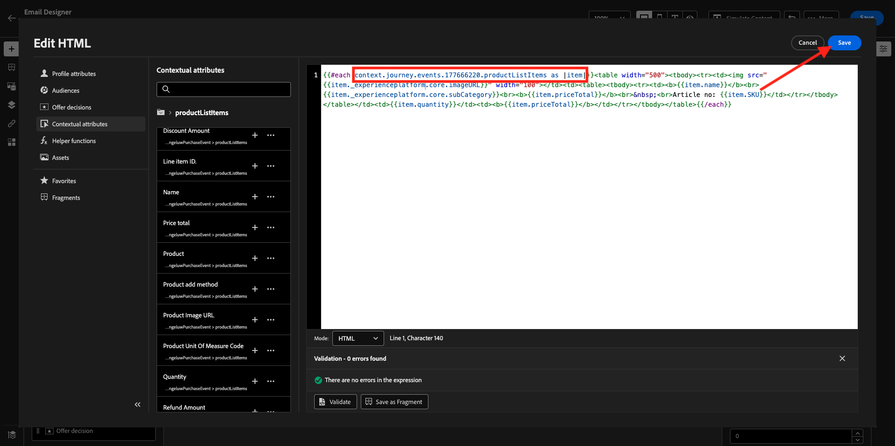

이제 이메일 Designer으로 돌아갑니다. 진행률을 저장하려면 **저장**&#x200B;을 클릭하세요.


그런 다음 **내용**(으)로 이동하여 7번째 행에 **HTML** 구성 요소를 끌어다 놓습니다. HTML 구성 요소를 클릭한 다음 **소스 코드 표시**&#x200B;를 클릭합니다.


**HTML 편집** 팝업에서 이 HTML을 붙여 넣습니다.

```<table><tbody><tr><td><b>Subtotal</b><br>Delivery charge (included)</td><td align="right"><b>xxx</b><br><b>5</b></td></tr><tr><td colspan="2" width="500"><hr></td></tr><tr><td><b>Total including VAT</b></td><td align="right"><b>xxx</b></td></tr></tbody></table>```

이 HTML 코드에는 **xxx**&#x200B;에 대한 2개의 참조가 있습니다. 이제 여정을 트리거하는 이벤트의 일부인 productListItems 개체에 대한 참조로 각 **xxx**&#x200B;을(를) 바꾸어야 합니다.


먼저 HTML 코드에서 첫 번째 **xxx**&#x200B;을(를) 삭제합니다.


왼쪽 메뉴에서 **컨텍스트 특성**을 클릭합니다.
자세히 드릴하려면 **Journey Orchestration** 옆에 있는 화살표를 클릭하십시오.


자세히 드릴하려면 **이벤트** 옆에 있는 화살표를 클릭하십시오.


자세히 드릴하려면 `--aepUserLdap--PurchaseEvent` 옆에 있는 화살표를 클릭하십시오.


자세히 드릴하려면 **Commerce** 옆에 있는 화살표를 클릭하십시오.


더 자세히 드릴하려면 **순서** 옆에 있는 화살표를 클릭하십시오.


**가격 합계** 옆에 있는 **+** 아이콘을 클릭하여 캔버스에 추가하십시오.


그럼 이걸로 드셔보세요 이제 HTML 코드에서 두 번째 **xxx**&#x200B;을(를) 삭제합니다.


**가격 합계** 옆에 있는 **+** 아이콘을 다시 클릭하여 캔버스에 추가합니다.
**Order** 개체 내에서 **Currency** 필드를 캔버스에 추가할 수도 있습니다.
완료되면 **저장**&#x200B;을 클릭하여 변경 내용을 저장합니다.


그러면 이메일 Designer으로 돌아갑니다. **저장**&#x200B;을 다시 클릭합니다.

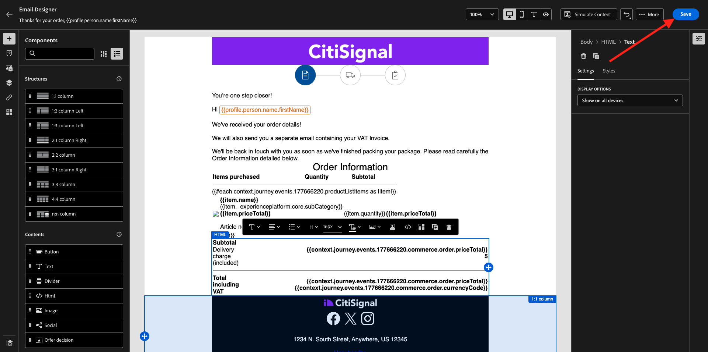

왼쪽 상단 모서리의 제목 줄 텍스트 옆에 있는 **화살표**&#x200B;를 클릭하여 메시지 대시보드로 돌아갑니다.


왼쪽 상단 모서리의 화살표를 클릭하여 여정으로 돌아갑니다.


전자 메일 작업을 닫으려면 **저장**&#x200B;을 클릭하세요.

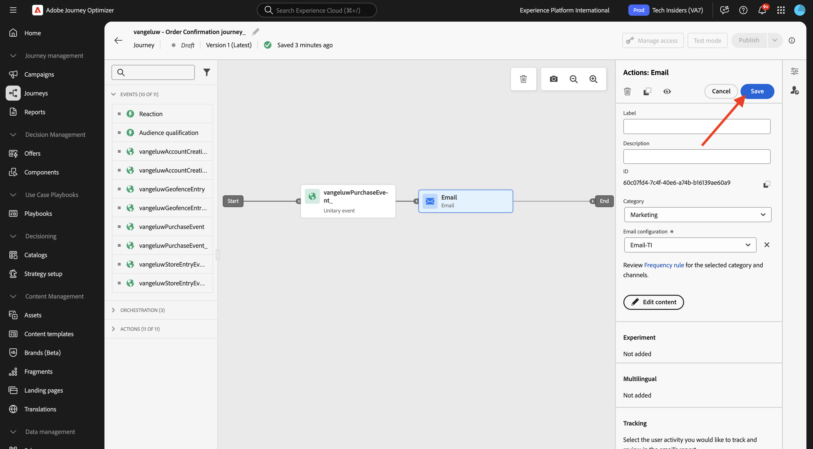

여정을 게시하려면 **게시**&#x200B;를 클릭하십시오.


**게시**&#x200B;를 다시 클릭합니다.


이제 여정이 게시되었습니다.

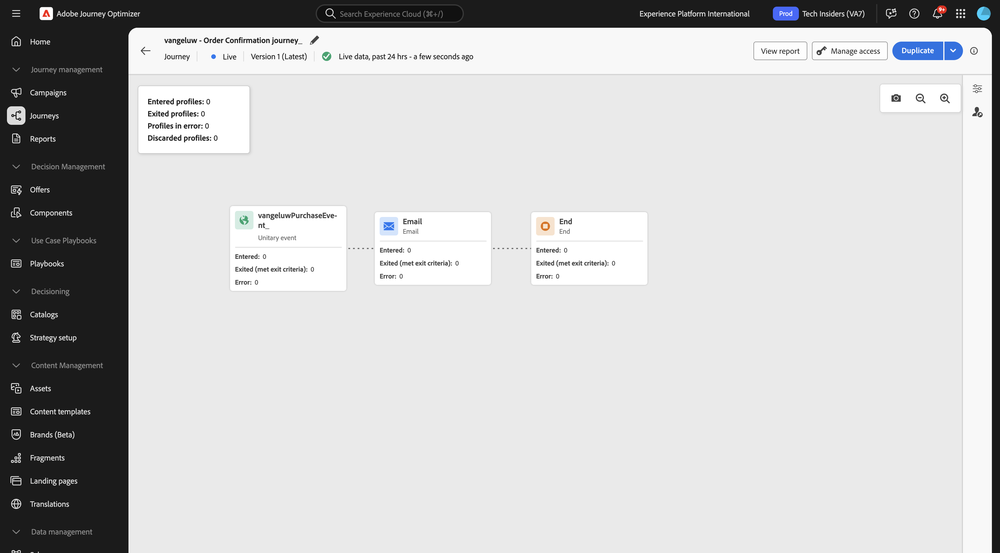

## 3.4.1.5 Adobe Experience Platform 데이터 수집 클라이언트 속성 업데이트

[Adobe Experience Platform 데이터 수집](https://experience.adobe.com/launch/)&#x200B;(으)로 이동하여 **태그**&#x200B;를 선택합니다.

이전에 보았던 Adobe Experience Platform 데이터 수집 속성 페이지입니다.


**시작하기**&#x200B;에서 데모 시스템은 웹 사이트용 클라이언트 속성과 모바일 앱용 클라이언트 속성 두 개를 만들었습니다. `--aepUserLdap--`검색&#x200B;**[!UICONTROL 상자에서]**&#x200B;을(를) 검색하여 찾으십시오. **Web** 속성을 열려면 클릭하세요.


**데이터 요소**(으)로 이동합니다. 데이터 요소 **XDM - Purchase**&#x200B;를 검색하여 엽니다.


그러면 이걸 보게 될 거야. **_experience.campaign.orchestration.eventID** 필드로 이동하여 여기에서 eventID를 입력하십시오. 여기에서 작성할 eventID는 연습 3.4.1.1의 일부로 만든 eventID입니다. **저장** 또는 **라이브러리에 저장**&#x200B;을 클릭하십시오.


속성에 변경 사항을 저장한 다음 개발 라이브러리를 업데이트하여 변경 사항을 게시합니다.

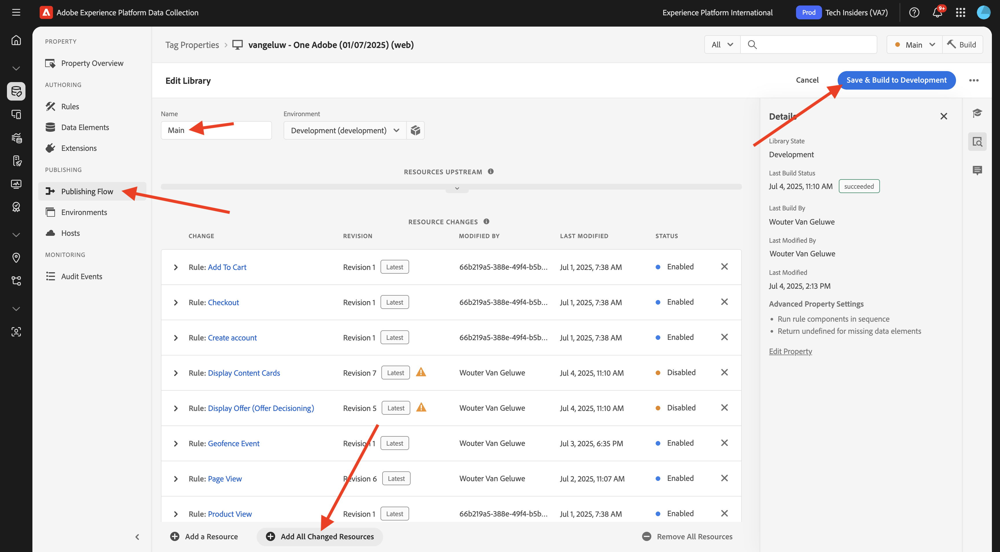

이제 변경 사항이 배포되고 테스트할 수 있습니다.

## 3.4.1.6 데모 웹 사이트를 사용하여 주문 확인 이메일을 테스트합니다.

데모 웹 사이트에서 제품을 구입하여 업데이트된 여정을 테스트해 보겠습니다.

[https://dsn.adobe.com](https://dsn.adobe.com)&#x200B;(으)로 이동합니다. Adobe ID으로 로그인하면 이 메시지가 표시됩니다. 웹 사이트 프로젝트에서 세 점 **..**&#x200B;을(를) 클릭한 다음 **실행**&#x200B;을(를) 클릭하여 엽니다.


그러면 데모 웹 사이트가 열리는 것을 볼 수 있습니다. URL을 선택하고 클립보드에 복사합니다.


새 시크릿 브라우저 창을 엽니다.


이전 단계에서 복사한 데모 웹 사이트의 URL을 붙여 넣습니다. 그런 다음 Adobe ID을 사용하여 로그인하라는 메시지가 표시됩니다.


계정 유형을 선택하고 로그인 프로세스를 완료합니다.


그러면 웹 사이트가 시크릿 브라우저 창에 로드되는 것을 볼 수 있습니다. 모든 연습에서는 새로운 시크릿 브라우저 창을 사용하여 데모 웹 사이트 URL을 로드해야 합니다.


프로필 뷰어 패널과 현재 알 수 없는 이 고객의 기본 식별자로 **Experience Cloud ID**&#x200B;를 사용하는 실시간 고객 프로필을 살펴보십시오.


**로그인** 페이지로 이동하여 **계정 만들기**&#x200B;를 클릭하고 이 필드를 채우십시오. **등록**&#x200B;을 클릭하면 이전 페이지로 리디렉션됩니다.


장바구니에 제품을 추가합니다.


**장바구니** 페이지로 이동합니다. **체크아웃**&#x200B;을 클릭합니다.

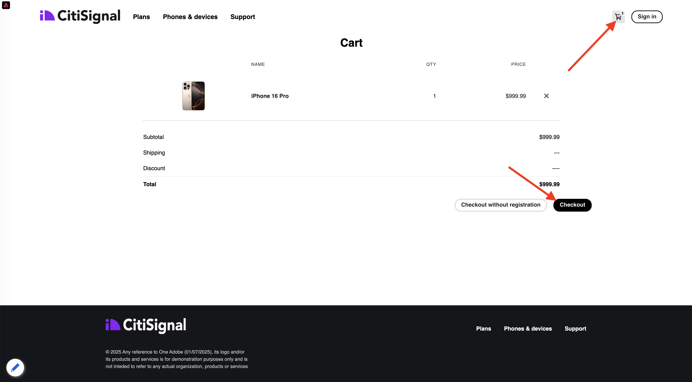

그런 다음 필드를 확인하고 필요한 경우 완료합니다. **진행**&#x200B;을 클릭합니다.


**순서 확인**&#x200B;을 클릭합니다.

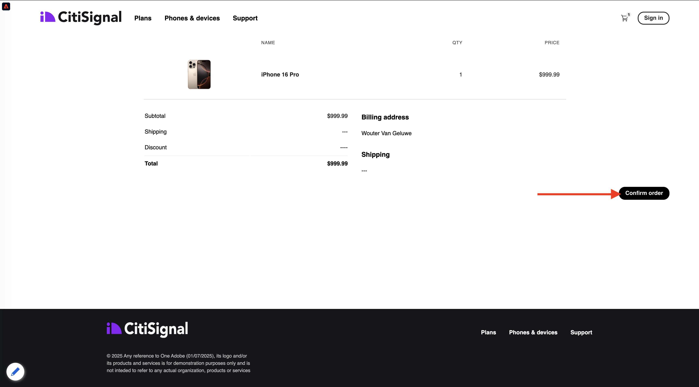

이제 주문이 완료되었습니다.


그러면 몇 초 이내에 주문 확인 이메일을 받게 됩니다.


이 연습을 완료했습니다.

## 다음 단계

[3.4.2(으)로 이동 일괄 처리 기반 뉴스레터 여정 구성](./ex2.md){target="_blank"}

[Adobe Journey Optimizer](journeyoptimizer.md){target="_blank"}로 돌아가기

[모든 모듈](./../../../../overview.md){target="_blank"}(으)로 돌아가기
