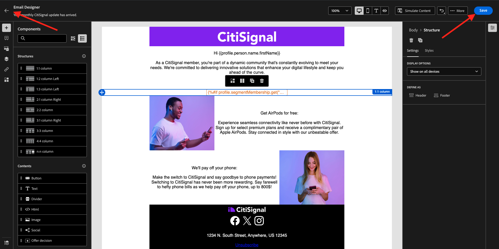

# 3.4.3 이메일 메시지에 세그먼트 기반 개인화 적용

[Adobe Experience Cloud](https://experience.adobe.com)&#x200B;(으)로 이동하여 Adobe Experience Cloud에 로그인합니다. **Adobe Journey Optimizer**&#x200B;을(를) 클릭합니다.

Journey Optimizer의 **Home** 보기로 리디렉션됩니다. 계속하려면 **샌드박스**&#x200B;를 선택해야 합니다. 선택할 샌드박스 이름이 ``--aepTenantId--``입니다.

## 3.4.3.1 세그먼트 기반 개인화

이 연습에서는 세그먼트 멤버십을 기반으로 개인화된 텍스트로 이전 연습에서 만든 뉴스레터 이메일 메시지를 개선합니다.

**캠페인**(으)로 이동합니다. 이전 연습에서 만든 뉴스레터 여정을 찾습니다. `--aepUserLdap-- - CitiSignal Newsletter` 검색 세 점 **..**&#x200B;을(를) 마우스 오른쪽 단추로 클릭하고 **복제**&#x200B;를 클릭합니다.

그러면 이걸 보게 될 거야. **제목**&#x200B;에 사용합니다. `--aepUserLdap-- - CitiSignal Newsletter (SBP)`. **복제**&#x200B;를 클릭합니다.

복제된 캠페인을 클릭하여 엽니다.

콘텐츠를 변경하려면 **편집**&#x200B;을 클릭하세요.

**전자 메일 본문 편집**&#x200B;을 클릭합니다.

그러면 이걸 보게 될 거야.

**콘텐츠 구성 요소**&#x200B;를 열고 **1:1 열**&#x200B;을(를) AirPods 오퍼 위로 드래그합니다.

**Text** 구성 요소를 1:1 열로 끌어다 놓습니다.

전체 기본 텍스트를 선택하고 삭제합니다. 그런 다음 도구 모음에서 **개인화 추가** 단추를 클릭합니다.

그러면 이걸 보게 될 거야. 왼쪽 메뉴에서 **대상**&#x200B;을 클릭합니다.

`--aepUserLdap-- - Interest in Plans` 세그먼트를 선택하고 **+** 아이콘을 클릭하여 캔버스에 추가하십시오.

그런 다음 첫 번째 줄을 그대로 두고 2행과 3행을 다음 코드로 바꿉니다.

&grave;&grave;
    PS: It may be a good idea to check if your plan still meets your needs! Click here to be contacted by one of our experts!

    PS: Thanks for taking the time to read our newsletter. Here is a 10% promo code to use on the website: NEWSLETTER10

&grave;&grave;

그럼 이걸로 드셔보세요 **저장**&#x200B;을 클릭합니다.

텍스트 맞춤을 **가운데 맞춤**(으)로 변경합니다.

이제 오른쪽 상단의 **저장** 단추를 클릭하여 이 메시지를 저장할 수 있습니다. 왼쪽 상단 모서리에서 제목 줄 텍스트 옆에 있는 **화살표**&#x200B;를 클릭합니다.

활성화하려면 **검토**&#x200B;를 클릭하세요.

**활성화**&#x200B;를 클릭합니다.

세그먼트 기반 개인화를 사용하는 뉴스레터가 이제 게시되었습니다. 뉴스레터 이메일 메시지는 일정에 따라 전송되며 마지막 이메일이 전송되는 즉시 여정이 중지됩니다.

사용된 세그먼트에 대한 자격이 있는 경우 받게 되는 이메일에 이 내용이 표시됩니다.

이 연습을 완료했습니다.

## 다음 단계

[요약 및 혜택](./summary.md){target="_blank"}(으)로 이동

[Adobe Journey Optimizer](journeyoptimizer.md){target="_blank"}로 돌아가기

[모든 모듈](./../../../../overview.md){target="_blank"}(으)로 돌아가기
