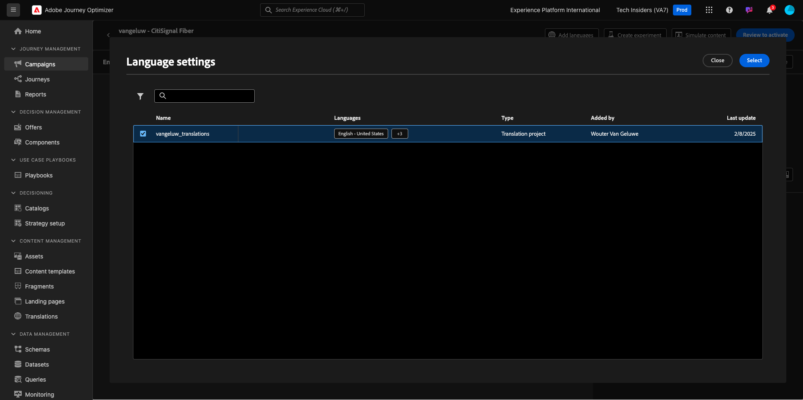

# 3.5.3 이메일에 언어 추가

[https://experience.adobe.com/](https://experience.adobe.com/)(으)로 이동합니다. **Journey Optimizer**&#x200B;을(를) 클릭합니다.

Journey Optimizer의 **Home** 보기로 리디렉션됩니다. 먼저 올바른 샌드박스를 사용하고 있는지 확인하십시오. 사용할 샌드박스를 `--aepSandboxName--`이라고 합니다.

**캠페인**(으)로 이동한 다음 을(를) 클릭하여 방금 만든 캠페인을 엽니다.

**캠페인 수정**&#x200B;을 클릭합니다.

**수정**&#x200B;을 클릭합니다.

**전자 메일** 작업까지 아래로 스크롤한 다음 **콘텐츠 편집**&#x200B;을 클릭합니다.

**언어 추가**&#x200B;를 클릭합니다.

**언어 설정**&#x200B;을 선택하세요(이름: `--aepUserLdap--_translations`). **선택**&#x200B;을 클릭합니다.

그럼 이걸 보셔야죠 **번역으로 보내기**&#x200B;를 클릭합니다.

그러면 다음과 같은 메시지가 표시됩니다. **번역으로 보내기** 워크플로우가 시작되었으며 완료하는 데 2분 정도 소요됩니다.
상태가 **번역 진행 중**(으)로 변경됩니다.

몇 분 후에 번역 워크플로의 상태가 **번역 완료**(으)로 변경됩니다.

**`[es] Spanish`** 번역을 클릭합니다. 그러면 전자 메일 미리 보기와 **제목 줄**&#x200B;에도 업데이트된 텍스트가 표시됩니다.
필요한 경우 **제목 줄** 필드에서 직접 번역을 검토하고 업데이트할 수 있습니다.

전자 메일 내의 번역을 검토하려면 **전자 메일 본문 편집**&#x200B;을 클릭하세요.

번역을 검토해야 하는 경우에 대비하여 텍스트를 수동으로 변경할 수 있습니다.

왼쪽 상단 모서리의 제목 줄 텍스트 옆에 있는 **화살표**&#x200B;를 클릭하여 캠페인 개요로 돌아갑니다.

그럼 다시 오셔야 합니다 이 캠페인을 다시 활성화할 필요가 없습니다.

왼쪽 상단 모서리의 **화살표**&#x200B;를 클릭하여 캠페인으로 돌아갑니다.

캠페인이 **중지됨** 상태인지 확인하십시오.

이제 이 연습을 완료했습니다.

## 다음 단계

[요약 및 혜택](./summary.md)(으)로 이동

[Adobe Journey Optimizer: 번역 서비스](./ajotranslationsvcs.md){target="_blank"}로 돌아가기

[모든 모듈](./../../../../overview.md){target="_blank"}(으)로 돌아가기
