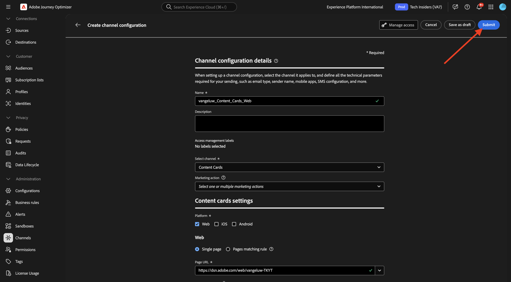
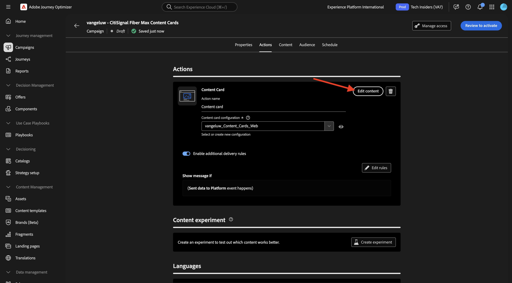
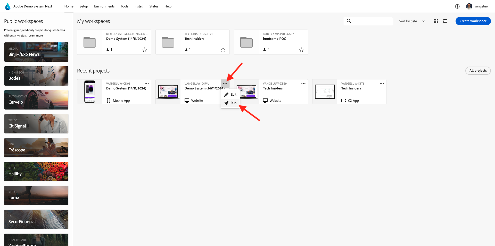
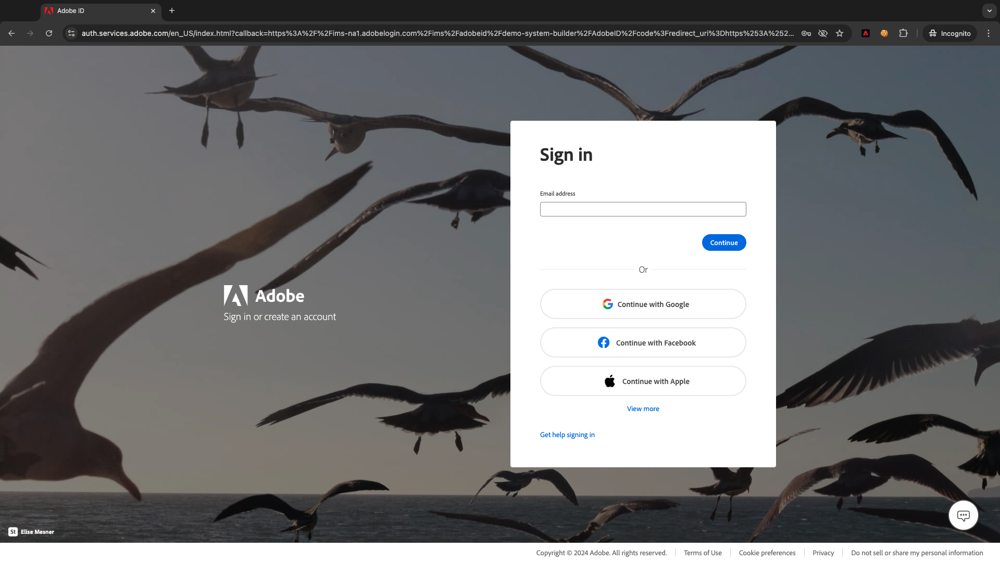

# 3.6.1 컨텐츠 카드

[Adobe Journey Optimizer](https://experience.adobe.com)&#x200B;(으)로 이동하여 Adobe Experience Cloud에 로그인합니다. **Journey Optimizer**&#x200B;을(를) 클릭합니다.


Journey Optimizer의 **Home** 보기로 리디렉션됩니다. 먼저 올바른 샌드박스를 사용하고 있는지 확인하십시오. 사용할 샌드박스를 `--aepSandboxName--`이라고 합니다. 그러면 샌드박스 **의**&#x200B;홈`--aepSandboxName--` 보기에 있게 됩니다.


## 3.6.1.1 콘텐츠 카드 채널 구성

왼쪽 메뉴에서 **채널**(으)로 이동한 다음 **채널 구성**&#x200B;을 선택합니다. **채널 구성 만들기**&#x200B;를 클릭합니다.


이름 `--aepUserLdap--_Content_Cards_Web`을(를) 입력하고 채널 **콘텐츠 카드**&#x200B;를 선택한 다음 플랫폼 **웹**&#x200B;을(를) 사용하도록 설정하십시오.


아래로 스크롤하여 **단일 페이지** 옵션이 활성화되어 있는지 확인합니다.

**시작하기** 모듈의 일부로 이전에 만든 웹 사이트의 URL을 입력하십시오. `https://dsn.adobe.com/web/--aepUserLdap---XXXX`. **XXXX**&#x200B;을(를) 웹 사이트의 고유 코드로 변경하는 것을 잊지 마십시오.

>[!IMPORTANT]
>
>CitiSignal 데모 웹 사이트 URL `https://dsn.adobe.com/web/--aepUserLdap---XXXX`에 대한 위의 참조를 실제 URL로 변경해야 합니다. [https://dsn.adobe.com/](https://dsn.adobe.com/)의 웹 사이트 프로젝트로 이동하여 URL을 찾을 수 있습니다.

**페이지의**&#x200B;위치 필드를 `CitiSignalContentCardContainer`(으)로 설정합니다.


위로 스크롤하여 **제출**&#x200B;을 클릭합니다.



이제 채널 구성을 사용할 준비가 되었습니다.


## 3.6.1.2 콘텐츠 카드에 대해 예약된 캠페인 구성

왼쪽 메뉴에서 **캠페인**(으)로 이동한 다음 **캠페인 만들기**&#x200B;를 클릭합니다.


**예약됨 - 마케팅**&#x200B;을 선택한 다음 **만들기**&#x200B;를 클릭합니다.


`--aepUserLdap-- - CitiSignal Fiber Max Content Cards` 이름을 입력한 다음 **작업**&#x200B;을 클릭합니다.


**+ 작업 추가**&#x200B;를 클릭한 다음 **콘텐츠 카드**&#x200B;를 선택합니다.


이전 단계에서 만든 콘텐츠 카드 채널 구성을 선택합니다. 이름이 `--aepUserLdap--_Content_Cards_Web`입니다.

**규칙 편집**&#x200B;을 클릭합니다.


현재 규칙을 제거하려면 **X**&#x200B;을(를) 클릭하십시오.


**+ 조건 추가**&#x200B;를 클릭합니다.


**플랫폼으로 데이터를 보냈습니다** 조건을 선택하십시오. **완료** 클릭


그럼 이걸 보셔야죠 **콘텐츠 편집**&#x200B;을 클릭합니다.



그럼 이걸 보셔야죠


다음 설정을 구성합니다.

- **제목**: `CitiSignal Fiber Max`
- **본문**: `Lightning speed for gamers`
- **대상 URL**: `https://dsn.adobe.com/web/--aepUserLdap---XXXX/plans`

>[!IMPORTANT]
>
>CitiSignal 데모 웹 사이트 URL `https://dsn.adobe.com/web/--aepUserLdap---XXXX/plans`에 대한 위의 참조를 실제 URL로 변경해야 합니다. [https://dsn.adobe.com/](https://dsn.adobe.com/)의 웹 사이트 프로젝트로 이동하여 URL을 찾을 수 있습니다.

아이콘을 클릭하여 AEM Assets에서 자산을 선택하여 URL을 변경합니다.


**citigsignal-imaes** 폴더로 이동하여 **`neon_rabbit_banner.jpg`** 파일을 선택하십시오. **선택**&#x200B;을 클릭합니다.


그럼 이걸 드셔보세요 **+ 추가 단추**&#x200B;를 클릭합니다.


단추에 대해 다음 설정을 구성합니다.

- **단추 제목**: `Upgrade now!`
- **상호 작용 이벤트**: `click`
- **대상**: `https://dsn.adobe.com/web/--aepUserLdap---XXXX/plans`

>[!IMPORTANT]
>
>CitiSignal 데모 웹 사이트 URL `https://dsn.adobe.com/web/--aepUserLdap---XXXX/plans`에 대한 위의 참조를 실제 URL로 변경해야 합니다. [https://dsn.adobe.com/](https://dsn.adobe.com/)의 웹 사이트 프로젝트로 이동하여 URL을 찾을 수 있습니다.

활성화하려면 **검토**&#x200B;를 클릭하세요.


**활성화**&#x200B;를 클릭합니다.


그러면 캠페인이 활성화됩니다. 이 작업은 2분 정도 소요될 수 있습니다.


몇 분 정도 지나면 캠페인이 활성화됩니다.


## 3.6.1.3 DSN 웹 사이트 업데이트

웹 사이트에 컨텐츠 카드를 표시하려면 CitiSignal 데모 웹 사이트의 홈 페이지 디자인을 변경해야 합니다.

[https://dsn.adobe.com/](https://dsn.adobe.com/)&#x200B;(으)로 이동합니다. 웹 사이트에서 **3개 점**&#x200B;을 클릭하고 **편집**&#x200B;을 클릭합니다.


**홈** 페이지를 선택하려면 클릭하세요. **콘텐츠 편집**&#x200B;을 클릭합니다.


영웅 이미지 위로 마우스를 가져간 후 **+** 단추를 클릭합니다.


**일반**(으)로 이동하고 **배너**&#x200B;을(를) 선택한 다음 **추가**&#x200B;를 클릭합니다.


새로 만든 배너를 클릭하여 선택합니다. **스타일**(으)로 이동하여 필드 `CitiSignalContentCardContainer`사용자 지정 CSS 클래스&#x200B;**에**&#x200B;을(를) 입력하십시오.


**정렬**(으)로 이동합니다. **Alignment** 필드를 `left`(으)로 설정하고 **Vertical Alignment** 필드를 `middle`(으)로 설정합니다.

**X** 아이콘을 클릭하여 대화 상자 창을 닫습니다.


이제 웹 사이트 디자인이 변경되었습니다.

지금 새 브라우저 창에서 사이트를 열면 다음과 같이 표시됩니다. 회색 영역은 새로 만든 배너이지만 아직 컨텐츠가 없습니다.


콘텐츠가 새로 만든 배너에 동적으로 로드되도록 하려면 데이터 수집 태그 속성을 변경해야 합니다.

## 3.6.1.4 데이터 수집 태그 속성 업데이트

[https://experience.adobe.com/#/data-collection/](https://experience.adobe.com/#/data-collection/), **태그**(으)로 이동합니다. [시작하기](./../../../../modules/getting-started/gettingstarted/ex1.md) 모듈의 일부로 데이터 수집 태그 속성이 만들어졌습니다.

이러한 데이터 수집 태그 속성을 이전 모듈의 일부로 이미 사용하고 있습니다.

을 클릭하여 웹용 데이터 수집 속성을 엽니다.


왼쪽 메뉴에서 **규칙**(으)로 이동한 다음 클릭하여 **페이지 보기** 규칙을 엽니다.


**&quot;페이지 보기&quot; 경험 이벤트 보내기** 작업을 클릭합니다.


**페이지 보기** 규칙의 일부로, 특정 표면에 대한 Edge의 개인화 지침을 요청해야 합니다. 표면은 이전 단계에서 구성한 배너입니다. 이렇게 하려면 **Personalization**(으)로 스크롤한 다음 `web://dsn.adobe.com/web/--aepUserLdap---XXXX#CitiSignalContentCardContainer`표면&#x200B;**에**&#x200B;을(를) 입력합니다.

>[!IMPORTANT]
>
>CitiSignal 데모 웹 사이트 URL `web://dsn.adobe.com/web/--aepUserLdap---XXXX#CitiSignalContentCardContainer`에 대한 위의 참조를 실제 URL로 변경해야 합니다. [https://dsn.adobe.com/](https://dsn.adobe.com/)의 웹 사이트 프로젝트로 이동하여 URL을 찾을 수 있습니다.

**변경 내용 유지**&#x200B;를 클릭합니다.


**저장** 또는 **라이브러리에 저장**&#x200B;을 클릭합니다.


왼쪽 메뉴에서 **규칙**(으)로 이동한 다음 **규칙 추가**&#x200B;를 클릭합니다.


`Display AJO Content Cards` 이름을 입력하십시오. 새 이벤트를 추가하려면 **+ 추가**&#x200B;를 클릭하십시오.


**확장**: **Adobe Experience Platform Web SDK**&#x200B;을 선택하고 **이벤트 유형**: **규칙 집합 항목 구독**&#x200B;을 선택합니다.

**스키마**&#x200B;에서 **콘텐츠 카드**&#x200B;를 선택합니다.

**표면**&#x200B;에서 `web://dsn.adobe.com/web/--aepUserLdap---XXXX#CitiSignalContentCardContainer`을(를) 입력하십시오.

>[!IMPORTANT]
>
>CitiSignal 데모 웹 사이트 URL `web://dsn.adobe.com/web/--aepUserLdap---XXXX#CitiSignalContentCardContainer`에 대한 위의 참조를 실제 URL로 변경해야 합니다. [https://dsn.adobe.com/](https://dsn.adobe.com/)의 웹 사이트 프로젝트로 이동하여 URL을 찾을 수 있습니다.

**변경 내용 유지**&#x200B;를 클릭합니다.


그럼 이걸 보셔야죠 새 작업을 추가하려면 **+ 추가**&#x200B;를 클릭하십시오.


**확장**: **코어**&#x200B;를 선택하고 **작업 유형**: **사용자 지정 코드**&#x200B;를 선택합니다.

**언어**: **JavaScript**&#x200B;에 대한 확인란을 활성화한 다음 **편집기 열기**&#x200B;를 클릭합니다.


그러면 빈 편집기 창이 표시됩니다.


아래 코드를 편집기에 붙여 넣고 **저장**&#x200B;을 클릭합니다.

```javascript
if (!Array.isArray(event.propositions)) {
  console.log("No personalization content");
  return;
}

console.log(">>> Content Card response from Edge: ", event.propositions);

event.propositions.forEach(function (payload) {
  payload.items.forEach(function (item) {
    if (!item.data || !item.data.content || item.data.content === "undefined") {
      return;
    }
    console.log(">>> Content Card response from Edge: ", item);
    const { content } = item.data;
    const { title, body, image, buttons } = content;
    const titleValue = title.content;
    const description = body.content;
    const imageUrl = image.url;
    const buttonLabel = buttons[0]?.text.content;
    const buttonLink = buttons[0]?.actionUrl;
    const html = `<div  class="Banner Banner--alignment-left Banner--verticalAlignment-left hero-banner ContentCardContainer"  oxygen-component-id="cmp-0"  oxygen-component="Banner"  role="presentation"  style="color: rgb(255, 255, 255); height: 60%;">  <div class="Image" role="presentation">      </div>  <div class="Banner__content">    <div class="Title Title--alignment-left Title--textAlignment-left">      <div class="Title__content" role="presentation">        <strong class="Title__pretitle">${titleValue}</strong>        <h2>${description}</h2>      </div>    </div>    <div class="Button Button--alignment-left Button--variant-cta">              <button          class="Dniwja_spectrum-Button Dniwja_spectrum-BaseButton Dniwja_i18nFontFamily Dniwja_spectrum-FocusRing Dniwja_spectrum-FocusRing-ring"          type="button"          data-variant="accent"          data-style="fill"          onclick="window.open('${buttonLink}')"       style="color:#FFFFFF;padding: 12px 28px;font-size: 24px;font-family: adobe-clean;font-weight: bolder;" >          <span            id="react-aria5848951631-49"            class="Dniwja_spectrum-Button-label"            >${buttonLabel}</span          >        </button>            </div>  </div></div>`;
    if (document.querySelector(".CitiSignalContentCardContainer")) {
      const contentCardContainer = document.querySelector(
        ".CitiSignalContentCardContainer"
      );
      contentCardContainer.innerHTML = html;
      contentCardContainer.style.height = "60%";
    }
  });
});
```


**변경 내용 유지**&#x200B;를 클릭합니다.


**저장** 또는 **라이브러리에 저장**&#x200B;을 클릭합니다.


왼쪽 메뉴에서 **흐름 게시**(으)로 이동한 다음 클릭하여 **기본** 라이브러리를 엽니다.


**변경된 모든 리소스 추가**&#x200B;를 클릭한 다음 **개발에 저장 및 빌드**&#x200B;를 클릭합니다.


## 3.6.1.5 웹 사이트에서 콘텐츠 카드 테스트

[https://dsn.adobe.com](https://dsn.adobe.com)&#x200B;(으)로 이동합니다. Adobe ID으로 로그인하면 이 메시지가 표시됩니다. 웹 사이트 프로젝트에서 세 점 **..**&#x200B;을(를) 클릭한 다음 **실행**&#x200B;을(를) 클릭하여 엽니다.



그러면 데모 웹 사이트가 열리는 것을 볼 수 있습니다. URL을 선택하고 클립보드에 복사합니다.


새 시크릿 브라우저 창을 엽니다.


이전 단계에서 복사한 데모 웹 사이트의 URL을 붙여 넣습니다. 그런 다음 Adobe ID을 사용하여 로그인하라는 메시지가 표시됩니다.



계정 유형을 선택하고 로그인 프로세스를 완료합니다.


이제 CitiSignal 웹 사이트가 로드되고 이전에 표시했던 빈 회색 영역 대신 구성한 콘텐츠 카드가 표시되어야 합니다.


## 다음 단계

[3.6.2 랜딩 페이지로 이동](./ex2.md)

[Adobe Journey Optimizer: 콘텐츠 관리](./ajocontent.md){target="_blank"}(으)로 돌아가기

[모든 모듈](./../../../../overview.md){target="_blank"}(으)로 돌아가기
