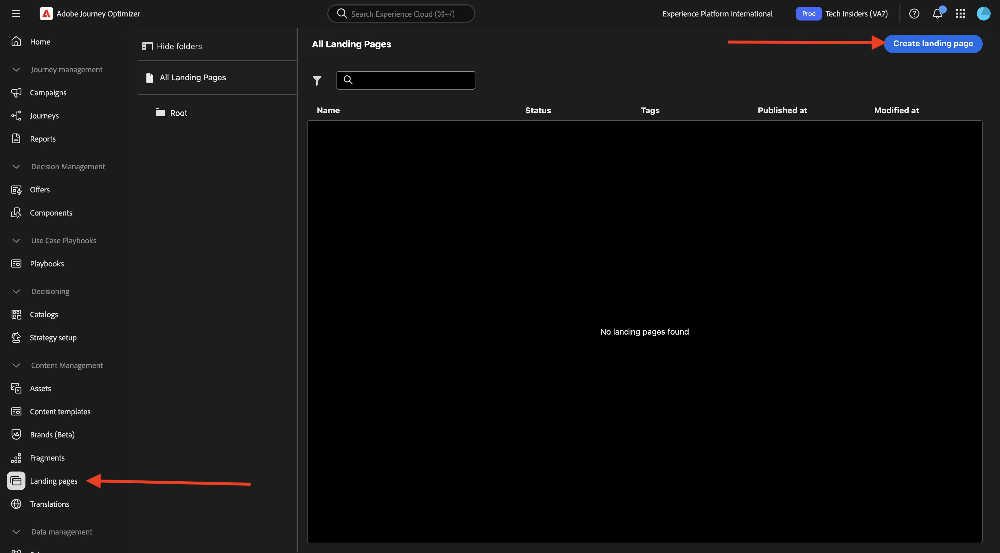
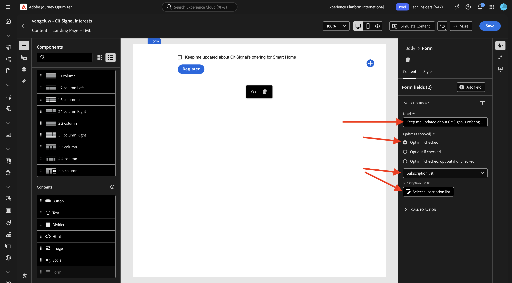
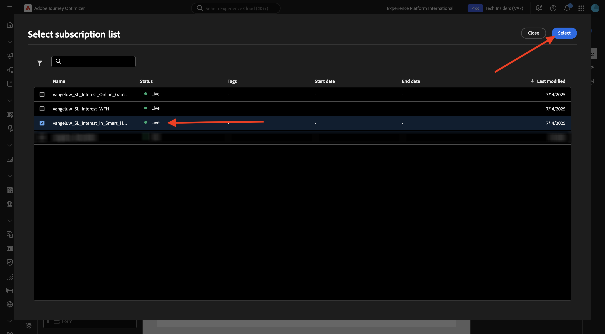
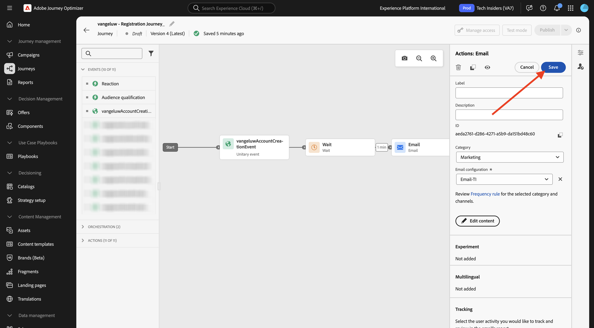

# 3.6.2 랜딩 페이지

[Adobe Journey Optimizer](https://experience.adobe.com)&#x200B;(으)로 이동하여 Adobe Experience Cloud에 로그인합니다. **Journey Optimizer**&#x200B;을(를) 클릭합니다.

Journey Optimizer의 **Home** 보기로 리디렉션됩니다. 먼저 올바른 샌드박스를 사용하고 있는지 확인하십시오. 사용할 샌드박스를 `--aepSandboxName--`이라고 합니다. 그러면 샌드박스 **의**&#x200B;홈`--aepSandboxName--` 보기에 있게 됩니다.

## 3.6.2.1개의 구독 목록

Adobe Journey Optimizer의 랜딩 페이지는 **구독 목록**&#x200B;과(와) 함께 작동합니다. 랜딩 페이지를 설정하려면 먼저 **구독 목록**&#x200B;을 구성해야 합니다.

CitiSignal은 고객에게 다음 도메인에 대한 관심을 묻고 싶습니다.

- 스마트 홈
- 재택근무
- 온라인 게임

고객이 이러한 도메인 중 하나에 관심을 보이면 이후 예정된 캠페인의 일부로 특정 콘텐츠를 타겟팅할 수 있도록 해당 고객을 특정 목록에 추가해야 합니다.

이제 3개의 구독 목록을 만듭니다.

왼쪽 메뉴에서 **구독 목록**(으)로 이동합니다. **구독 목록 만들기**&#x200B;를 클릭합니다.

**제목**&#x200B;의 경우 `--aepUserLdap--_SL_Interest_in_Smart_Home`을(를) 사용합니다.
**설명**&#x200B;의 경우 `Interest in Smart Home`을(를) 사용합니다.

**제출을 클릭합니다**.

다른 목록을 만들려면 **구독 목록 만들기**&#x200B;를 클릭하십시오.

**제목**&#x200B;의 경우 `--aepUserLdap--_SL_Interest_WFH`을(를) 사용합니다.
**설명**&#x200B;의 경우 `Interest in Work From Home`을(를) 사용합니다.

**제출을 클릭합니다**.

다른 목록을 만들려면 **구독 목록 만들기**&#x200B;를 클릭하십시오.

**제목**&#x200B;의 경우 `--aepUserLdap--_SL_Interest_Online_Gaming`을(를) 사용합니다.
**설명**&#x200B;의 경우 `Interest in Online Gaming`을(를) 사용합니다.

**제출을 클릭합니다**.

이제 필요한 3개의 목록을 만들었습니다.

## 3.6.2.2 랜딩 페이지 사전 설정

Adobe Journey Optimizer에서 랜딩 페이지를 사용하려면 사전 설정을 만들어야 합니다.

왼쪽 메뉴에서 **관리** > **채널**(으)로 이동한 다음 **랜딩 페이지 사전 설정**&#x200B;을 선택합니다.

**랜딩 페이지 사전 설정 만들기**&#x200B;를 클릭합니다.

필드 **이름**&#x200B;에 대해 `--aepUserLdap-- - CitiSignal LP`을(를) 사용하고 인스턴스에서 사용할 수 있는 하위 도메인을 선택하십시오.

>[!NOTE]
>
>인스턴스에 하위 도메인이 표시되지 않으면 AJO 관리자에게 문의하여 추가되었는지 확인하십시오.

**제출을 클릭합니다**.

이제 랜딩 페이지 사전 설정이 생성되었습니다.

## 3.6.2.3 랜딩 페이지

이제 랜딩 페이지를 만들 수 있습니다. 왼쪽 메뉴에서 **콘텐츠 관리** > **랜딩 페이지**&#x200B;로 이동합니다.

**랜딩 페이지 만들기**&#x200B;를 클릭합니다.

필드 **제목**&#x200B;의 경우 `vangeluw - CitiSignal Interests`을(를) 사용합니다. 그런 다음 이전 단계에서 구성한 **랜딩 페이지 사전 설정**&#x200B;을(를) 선택합니다.

**만들기**&#x200B;를 클릭합니다.

그럼 이걸 보셔야죠

필드 **페이지 이름**&#x200B;을(를) `--aepUserLdap-- - CitiSignal Interests`(으)로 변경합니다.

**액세스 설정**: `--aepUserLdap---citisignal-interests` 아래에 이 사용자 지정 이름을 입력하십시오.

**Designer 열기**&#x200B;를 클릭합니다.

**처음부터 디자인**&#x200B;을 선택하십시오.

그럼 이걸 보셔야죠

구조 구성 요소 **1:1 열**&#x200B;을(를) 캔버스에 추가합니다.

콘텐츠 구성 요소 **양식**&#x200B;을(를) 캔버스에 추가합니다.

**확인란 1**&#x200B;의 필드 **레이블**&#x200B;을(를) `Keep me updated about CitiSignal's offering for Smart Home`(으)로 업데이트하십시오.

**선택한 경우 옵트인** 확인란이 활성화되어 있고 **구독 목록**&#x200B;이 선택되어 있는지 확인하십시오.

**구독 목록 선택**&#x200B;을 클릭하세요.

`--aepUserLdap--_SL_Interest_in_Smart_Home` 목록을 선택한 다음 **선택**&#x200B;을 클릭합니다.

**+ 필드 추가**&#x200B;를 클릭한 다음 **확인란**&#x200B;을 선택합니다.

그럼 이걸 보셔야죠

**확인란 2**&#x200B;의 필드 **레이블**&#x200B;을(를) `Keep me updated about CitiSignal's offering for Work From Home`(으)로 업데이트하십시오.

**선택한 경우 옵트인** 확인란이 활성화되어 있고 **구독 목록**&#x200B;이 선택되어 있는지 확인하십시오.

**구독 목록 선택**&#x200B;을 클릭하세요.

`--aepUserLdap--_SL_Interest_WFH` 목록을 선택한 다음 **선택**&#x200B;을 클릭합니다.

**+ 필드 추가**&#x200B;를 클릭한 다음 **확인란**&#x200B;을 선택합니다.

그럼 이걸 보셔야죠

**확인란 3**&#x200B;의 필드 **레이블**&#x200B;을(를) `Keep me updated about CitiSignal's offering for Online Gaming`(으)로 업데이트하십시오.

**선택한 경우 옵트인** 확인란이 활성화되어 있고 **구독 목록**&#x200B;이 선택되어 있는지 확인하십시오.

**구독 목록 선택**&#x200B;을 클릭하세요.

`--aepUserLdap--_SL_Interest_Online_Gaming` 목록을 선택한 다음 **선택**&#x200B;을 클릭합니다.

그럼 이걸 보셔야죠

양식 필드 **CALL TO ACTION**(으)로 이동합니다.

다음 필드를 업데이트합니다.

- **텍스트** - 단추 레이블: `Save`.
- **확인 작업**: **확인 텍스트**&#x200B;을 선택합니다.
- **확인 텍스트**: 사용: `Thanks for updating your preferences!`
- **오류 작업**: **오류 텍스트**&#x200B;을(를) 선택하십시오.
- **오류 텍스트**: 사용: `There was an error updating your preferences.`

**저장**&#x200B;을 클릭한 다음 왼쪽 상단 모서리의 화살표를 클릭하여 이전 화면으로 돌아갑니다.

**게시**&#x200B;를 클릭합니다.

**게시**&#x200B;를 다시 클릭합니다.

이제 랜딩 페이지가 게시되어 이메일에서 사용할 수 있습니다.

## 3.6.2.4 전자 메일에 랜딩 페이지 포함

연습 3.1에서 이름이 `--aepUserLdap-- - Registration Journey`인 여정을 만들었습니다.

이제 해당 여정에서 이메일 메시지를 업데이트하여 랜딩 페이지에 대한 링크를 포함해야 합니다.

왼쪽 메뉴에서 **여정**(으)로 이동하여 `--aepUserLdap-- - Registration Journey` 여정을 엽니다.

**자세히..**&#x200B;를 클릭한 다음 **새 버전 만들기**&#x200B;를 선택합니다.

**새 버전 만들기**&#x200B;를 클릭합니다.

**전자 메일** 작업을 클릭하여 선택한 다음 **콘텐츠 편집**&#x200B;을 선택합니다.

**전자 메일 본문 편집**&#x200B;을 클릭합니다.

그럼 이런 걸 보셔야겠네요 새 구조 구성 요소 **1:1 열**&#x200B;을(를) 캔버스에 추가합니다.

새로 만든 구조 구성 요소에 새 콘텐츠 구성 요소 **Text**&#x200B;을(를) 추가합니다.

**텍스트** 콘텐츠 구성 요소에 다음 텍스트를 붙여넣습니다.

`Would you like to hear from us about Smart Home news? Do you work from home and would you like to hear our tips? Or are you an avid online gamer and do you want to receive our game reviews? Click here to update your preferences and interests!`

텍스트 스타일을 이 모양으로 지정한 다음 `here` 단어를 선택합니다. **링크** 아이콘을 클릭합니다.

링크의 **Type**&#x200B;을(를) **랜딩 페이지**(으)로 설정하고 필드 **Target**&#x200B;을(를) **Blank**(으)로 설정합니다.

연결할 랜딩 페이지를 선택하려면 **편집** 아이콘을 클릭하십시오.

랜딩 페이지 `--aepUserLdap-- - CitiSignal Interests`을(를) 선택합니다. **선택**&#x200B;을 클릭합니다.

그럼 이걸 보셔야죠 **저장**&#x200B;을 클릭합니다.

왼쪽 상단 모서리의 화살표를 클릭하여 이전 화면으로 돌아갑니다.

왼쪽 상단 모서리의 화살표를 클릭하여 이전 화면으로 다시 돌아갑니다.

**저장**&#x200B;을 클릭합니다.

**게시**&#x200B;를 클릭합니다.

**게시**&#x200B;를 다시 클릭합니다.

이제 변경 사항이 게시되었으며 여정을 테스트할 수 있습니다.

## 3.6.2.5 여정 및 랜딩 페이지 테스트

[https://dsn.adobe.com](https://dsn.adobe.com)&#x200B;(으)로 이동합니다. Adobe ID으로 로그인하면 이 메시지가 표시됩니다. 웹 사이트 프로젝트에서 세 점 **..**&#x200B;을(를) 클릭한 다음 **실행**&#x200B;을(를) 클릭하여 엽니다.

그러면 데모 웹 사이트가 열리는 것을 볼 수 있습니다. URL을 선택하고 클립보드에 복사합니다.

새 시크릿 브라우저 창을 엽니다.

이전 단계에서 복사한 데모 웹 사이트의 URL을 붙여 넣습니다. 그런 다음 Adobe ID을 사용하여 로그인하라는 메시지가 표시됩니다.

계정 유형을 선택하고 로그인 프로세스를 완료합니다.

그러면 웹 사이트가 시크릿 브라우저 창에 로드되는 것을 볼 수 있습니다. 모든 연습에서는 새로운 시크릿 브라우저 창을 사용하여 데모 웹 사이트 URL을 로드해야 합니다. **로그인**(으)로 이동

**계정 만들기**&#x200B;를 클릭합니다. 자세한 내용을 입력하고 **등록**&#x200B;을 클릭하세요.

이제 홈페이지로 리디렉션됩니다. 프로필 뷰어 패널을 열고 실시간 고객 프로필로 이동합니다. 프로필 뷰어 패널에 새로 추가된 이메일 및 전화 식별자와 같은 모든 개인 데이터가 표시됩니다.

계정을 만든 후 1분이 지나면 Adobe Journey Optimizer에서 계정 만들기 이메일을 받게 됩니다.

이메일의 링크를 클릭하여 환경 설정을 업데이트합니다.

그런 다음 만든 양식이 표시됩니다. 일부 확인란을 사용하도록 설정하고 **저장**&#x200B;을 클릭합니다.

그러면 확인 메시지가 표시됩니다.

## 3.6.2.6 구독 목록 보고

구독 목록에서 사용 가능한 보고를 보려면 왼쪽 메뉴에서 **구독 목록**(으)로 이동하여 이전에 구성한 구독 목록 중 하나를 클릭하여 엽니다.

**보고서**&#x200B;를 클릭합니다.

그러면 목록의 개요와 구독 또는 구독 취소한 사람의 수가 표시됩니다.

## 다음 단계

[3.6.3 AJO 및 GenStudio for Performance Marketing으로 이동](./ex3.md)

[Adobe Journey Optimizer: 콘텐츠 관리](./ajocontent.md){target="_blank"}(으)로 돌아가기

[모든 모듈](./../../../../overview.md){target="_blank"}(으)로 돌아가기
