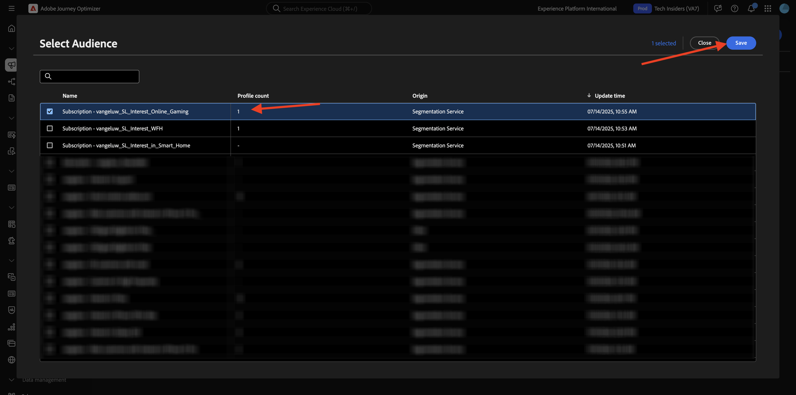
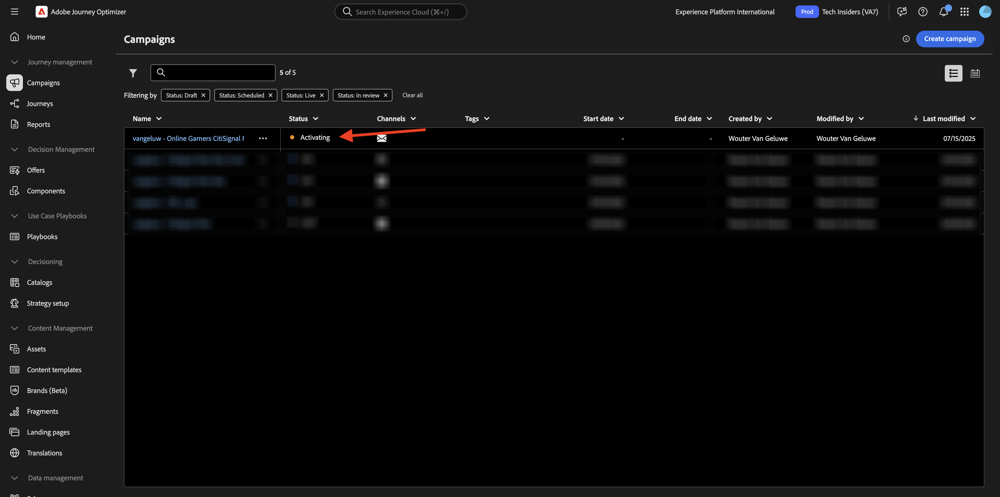

# 3.6.3 AJO 및 GenStudio for Performance Marketing

>[!IMPORTANT]
>
>이 연습을 완료하려면 현재 베타 버전인 GenStudio for Performance Marketing과의 통합을 위해 프로비저닝된 Adobe Journey Optimizer 환경에 액세스할 수 있어야 합니다.

>[!IMPORTANT]
>
>이 연습을 완료하려면 Adobe GenStudio for Performance Marketing에 대해 프로비저닝된 인스턴스에 액세스할 수 있어야 합니다.

>[!IMPORTANT]
>
>이 연습의 모든 단계를 실행하려면 기존 Adobe Workfront 환경에 액세스할 수 있어야 하며 해당 환경에서는 프로젝트 및 승인 워크플로우를 만들어야 합니다. [Adobe Workfront을 통한 워크플로우 관리](./../../../../modules/workflow-planning/module1.2/workfront.md){target="_blank"} 연습을 수행하면 필요한 설정을 사용할 수 있습니다.

## 1.3.4.1 Adobe GenStudio에서 이메일 경험 만들기 및 승인

[https://experience.adobe.com/](https://experience.adobe.com/){target="_blank"}(으)로 이동합니다. **GenStudio**&#x200B;을(를) 엽니다.


그럼 이걸 보셔야죠 왼쪽 메뉴에서 **만들기**(으)로 이동합니다. **전자 메일**&#x200B;을 선택하세요.


이전에 가져온 **전자 메일** 서식 파일(`--aepUserLdap---citisignal-email-template`)을 선택하십시오. **사용**&#x200B;을 클릭합니다.


그럼 이걸 보셔야죠 광고 이름을 `--aepUserLdap-- - Email Online Gamers Fiber Max`(으)로 변경합니다.


**매개 변수**&#x200B;에서 다음 옵션을 선택하십시오.

- **브랜드**: `--aepUserLdap-- - CitiSignal`
- **언어**: `English (US)`
- **사용자**: `--aepUserLdap-- - Smart Home Families`
- **제품**: `--aepUserLdap-- - CitiSignal Fiber Max`

**콘텐츠에서 선택**&#x200B;을 클릭합니다.


자산 `--aepUserLdap-- - neon rabbit.png`을(를) 선택합니다. **사용**&#x200B;을 클릭합니다.


`convince online gamers to start playing online multiplayer games using CitiSignal internet` 프롬프트를 입력하고 **생성**&#x200B;을 클릭합니다.


그러면 4개의 이메일 변형이 생성되는 이와 같은 상황이 표시됩니다. 기본 보기에는 **모바일** 보기가 표시되며, **컴퓨터** 아이콘을 클릭하여 데스크톱 보기로 전환할 수 있습니다.


모든 이메일에 대해 준수 점수가 자동으로 계산됩니다. 자세한 내용을 보려면 점수를 클릭하십시오.


**문제 보기 및 수정**&#x200B;을 클릭합니다.


그런 다음 복잡성 점수를 최적화하기 위해 수행할 수 있는 작업에 대해 자세히 확인할 수 있습니다.


그런 다음 **승인 요청**&#x200B;을 클릭하여 Adobe Workfront에 연결합니다.


`--aepUserLdap-- - CitiSignal Fiber Launch`(으)로 지정해야 하는 Adobe Workfront 프로젝트를 선택하십시오. **사용자 초대**&#x200B;에 자신의 전자 메일 주소를 입력하고 역할이 **승인자**(으)로 설정되어 있는지 확인하십시오.


또는 Adobe Workfront에서 기존 승인 워크플로를 사용할 수도 있습니다. 이렇게 하려면 **템플릿 사용**&#x200B;을 클릭하고 템플릿 `--aepuserLdap-- - Approval Workflow`을(를) 선택하십시오. **보내기**&#x200B;를 클릭합니다.


**Workfront에서 댓글 보기**&#x200B;를 클릭하면 이제 Adobe Workfront Proof UI로 전송됩니다.


Adobe Workfront Proof UI에서 **결정**&#x200B;을 클릭합니다.


**승인됨**&#x200B;을(를) 선택하고 **결정**&#x200B;을 클릭합니다.


**게시**&#x200B;를 클릭합니다.


`--aepUserLdap-- - CitiSignal Fiber Launch Campaign` 캠페인을 선택하고 **게시**&#x200B;를 클릭합니다.


**콘텐츠에서 열기**&#x200B;를 클릭합니다.


이제 4개의 전자 메일 경험을 **콘텐츠** > **경험**&#x200B;에서 사용할 수 있습니다.


## 1.3.4.2 AJO에서 캠페인 만들기

[Adobe Journey Optimizer](https://experience.adobe.com)&#x200B;(으)로 이동하여 Adobe Experience Cloud에 로그인합니다. **Journey Optimizer**&#x200B;을(를) 클릭합니다.


Journey Optimizer의 **Home** 보기로 리디렉션됩니다. 먼저 올바른 샌드박스를 사용하고 있는지 확인하십시오. 사용할 샌드박스를 `--aepSandboxName--`이라고 합니다. 그러면 샌드박스 **의**&#x200B;홈`--aepSandboxName--` 보기에 있게 됩니다.


이제 캠페인을 만듭니다. 들어오는 경험 이벤트 또는 대상 항목 또는 종료에 의존하여 1개의 특정 고객에 대한 여정을 트리거하는 이전 연습의 이벤트 기반 여정과 달리, 캠페인은 뉴스레터, 일회성 프로모션 또는 일반 정보와 같은 고유한 콘텐츠나 생일 캠페인 및 미리 알림과 같이 정기적으로 전송되는 유사한 콘텐츠로 전체 대상을 한 번 타겟팅합니다.

메뉴에서 **캠페인**(으)로 이동하여 **캠페인 만들기**&#x200B;를 클릭합니다.


**예약됨 - 마케팅**&#x200B;을 선택하고 **만들기**&#x200B;를 클릭합니다.


캠페인 생성 화면에서 다음을 구성합니다.

- **이름**: `--aepUserLdap--  - Online Gamers CitiSignal Fiber Max`.
- **설명**: 온라인 게이머를 위한 파이버 캠페인

**작업**&#x200B;을 클릭합니다.


**+ 작업 추가**&#x200B;를 클릭한 다음 **전자 메일**&#x200B;을 선택합니다.


기존 **전자 메일 구성**&#x200B;을 선택한 다음 **콘텐츠 편집**&#x200B;을 클릭하세요.


그러면 이걸 보게 될 거야. **제목 줄**&#x200B;에 대해 다음 항목을 사용하십시오.

```
{{profile.person.name.firstName}}, say goodbye to delays!
```

**콘텐츠 편집**&#x200B;을 클릭합니다.


**HTML 가져오기**&#x200B;를 클릭합니다.


**Adobe GenStudio for Performance Marketing**&#x200B;에 대한 단추를 클릭합니다.


그러면 GenStudio for Performance Marketing에 게시된 모든 이메일 경험을 표시하는 팝업 창이 표시됩니다. 사용 가능한 전자 메일 환경 중 하나를 선택하고 **사용**&#x200B;을 클릭합니다.


`--aepUserLdap-- - CitiSignal dev`(이)라는 이름의 AEM Assets CS 저장소를 선택하고 **가져오기**&#x200B;를 클릭합니다.


그럼 이걸 보셔야죠 누락된 이미지 단추를 선택하고 **자산 선택**&#x200B;을 클릭합니다.


**GenStudio.zip.....부터 이 폴더와 같은 폴더로 이동합니다.**&#x200B;을(를) 선택하고 `--aepUserLdap-- - neon rabbit.png` 이미지를 선택합니다. **선택**&#x200B;을 클릭하세요.


그럼 이걸 보셔야죠


바닥글까지 아래로 스크롤하여 **구독 취소**&#x200B;를 선택하고 **링크** 아이콘을 클릭합니다.


**Type**&#x200B;을(를) **외부 옵트아웃/구독 취소**(으)로 설정하고 URL을 `https://techinsiders.org/unsubscribe.html`(구독 취소 링크에 빈 URL을 사용할 수 없음)로 설정합니다.

**저장**&#x200B;을 클릭한 다음 화면 왼쪽 상단의 **화살표**&#x200B;를 클릭하여 캠페인 구성으로 돌아갑니다.


**대상자**(으)로 이동합니다.


**대상 선택**&#x200B;을 클릭합니다.


`--aepUserLdap--_SL_Interest_Online_Gaming`(이)라는 이름을 지정해야 하는 온라인 게이머의 구독 목록에서 대상을 선택하십시오. **저장**&#x200B;을 클릭합니다.



활성화하려면 **검토**&#x200B;를 클릭하세요.


캠페인 구성에 문제가 없으면 **활성화**&#x200B;를 클릭할 수 있습니다.


그러면 캠페인이 활성화되고, 2분 정도 소요됩니다.



몇 분 후에 캠페인이 라이브가 되고 선택한 구독 목록으로 이메일이 전송됩니다.


이제 이 연습을 완료했습니다.

## 다음 단계

[요약 및 혜택](./summary.md)(으)로 이동

[Adobe Journey Optimizer: 콘텐츠 관리](./ajocontent.md){target="_blank"}(으)로 돌아가기

[모든 모듈](./../../../../overview.md){target="_blank"}(으)로 돌아가기
