# 3.8.1 관계형 데이터 기반 설정

[https://experience.adobe.com](https://experience.adobe.com)&#x200B;(으)로 이동하여 Adobe Journey Optimizer에 로그인합니다. **Journey Optimizer**&#x200B;을(를) 클릭합니다.

Journey Optimizer의 **Home** 보기로 리디렉션됩니다. 먼저 올바른 샌드박스를 사용하고 있는지 확인하십시오. 사용할 샌드박스를 `--aepSandboxName--`이라고 합니다.

## 3.8.1.1 관계형 기반 스키마 설정

관계형 기반 스키마는 모델 기반 데이터 모델에 대한 형식적 정의입니다.

다음을 지정합니다.

- 테이블 세트
- 각 테이블의 열
- 제한
- 테이블 간의 관계

모델 기반 데이터 모델에서 스키마 또는 테이블 구성은 데이터를 여러 테이블로 구조화하는 것입니다. 각 테이블에 한 가지 유형의 엔티티/스키마가 저장되어 있는지 확인합니다.

Adobe Journey Optimizer Orchestrated Campaigns를 사용하기위해에 데이터를 수집하는 경우 다음 소스를 사용할 수 있습니다.

- Amazon S3
- Google 클라우드 스토리지
- SFTP
- Snowflake
- Google BigQuery
- 데이터 랜딩 구역
- Azure Databricks
- 로컬 파일 업로드

이 연습의 첫 번째 단계는 관계형 기반 XDM 스키마의 구성입니다. 왼쪽 메뉴에서 **데이터 관리**(으)로 스크롤한 다음 **스키마**&#x200B;를 선택합니다. **+ 스키마 만들기**&#x200B;를 클릭합니다.

**관계형**&#x200B;을(를) 선택하십시오.

**DDL 파일 업로드**&#x200B;를 선택한 다음 **파일 선택**&#x200B;을 클릭합니다.

데스크톱에 [citigsignal_ddl_tables_only.sql](./assets/citisignal_ddl_tables_only.sql) 파일을 다운로드합니다.

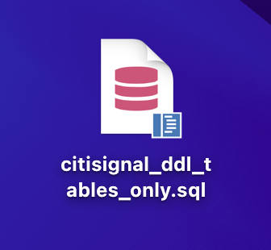

**`citisignal_ddl_tables_only.sql`** 파일을 선택하고 **열기**&#x200B;를 클릭합니다.

그럼 이걸 보셔야죠 **다음**&#x200B;을 클릭합니다.

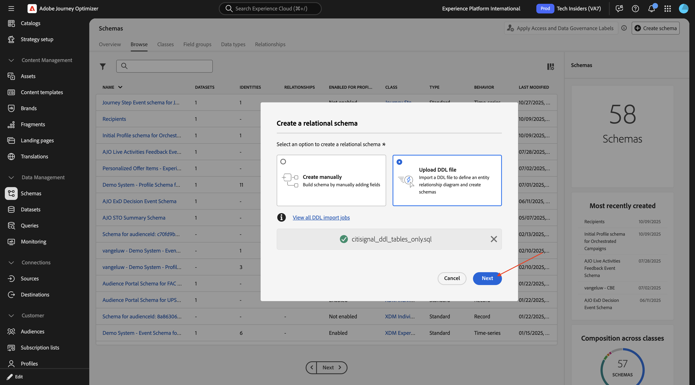

### ID

일부 스키마에는 개인 식별자가 포함되어 있으며 해당 필드는 **ID**(으)로 표시되어야 하며 해당 특정 ID 유형에 적용할 수 있는 **네임스페이스**&#x200B;를 선택해야 합니다.

**`citisignal_accounts`**

이 스키마의 경우 필드 **account_id**(으)로 이동하여 **ID** 유형을 **데모 시스템 - CRMID**(으)로 설정하십시오.

**`citisignal_recipients`**

이 스키마의 경우 필드 **account_id**(으)로 이동하여 **Identity** 유형을 **데모 시스템 - CRMID**(으)로 설정하고 필드 **email**(으)로 이동하여 **Identity** 유형을 **Email**(으)로 설정합니다.

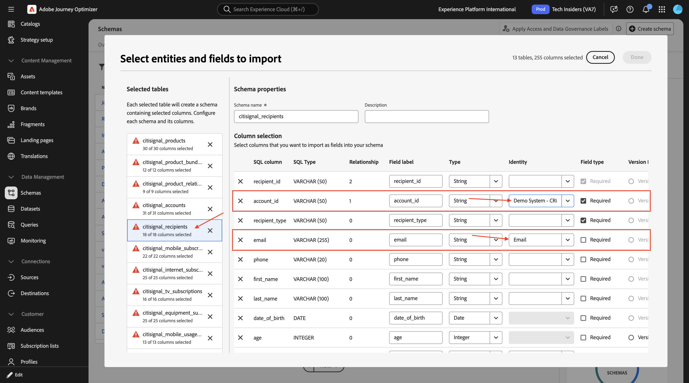

### 버전 매기기

이러한 스키마에 대해 수집될 데이터의 업데이트를 추적하려면 업로드된 데이터의 버전을 추적하는 데 사용할 필드를 설정해야 합니다. 이러한 모든 스키마에서 이 필드에 사용되는 필드는 업로드된 데이터의 타임스탬프가 포함된 **lastmodified** 필드입니다.

이제 각 스키마에서 **lastmodified** 필드에 대한 **버전 관리** 확인란을 선택해야 합니다.

**`citisignal_products`**

필드 **lastmodified**&#x200B;에 대한 **버전 관리** 확인란을 선택하십시오.

**`citisignal_product_bundles`**

필드 **lastmodified**&#x200B;에 대한 **버전 관리** 확인란을 선택하십시오.

**`citisignal_product_relationships`**

필드 **lastmodified**&#x200B;에 대한 **버전 관리** 확인란을 선택하십시오.

**`citisignal_accounts`**

필드 **lastmodified**&#x200B;에 대한 **버전 관리** 확인란을 선택하십시오.

**`citisignal_recipients`**

필드 **lastmodified**&#x200B;에 대한 **버전 관리** 확인란을 선택하십시오.

**`citisignal_mobile_subscriptions`**

필드 **lastmodified**&#x200B;에 대한 **버전 관리** 확인란을 선택하십시오.

**`citisignal_internet_subscriptions`**

필드 **lastmodified**&#x200B;에 대한 **버전 관리** 확인란을 선택하십시오.

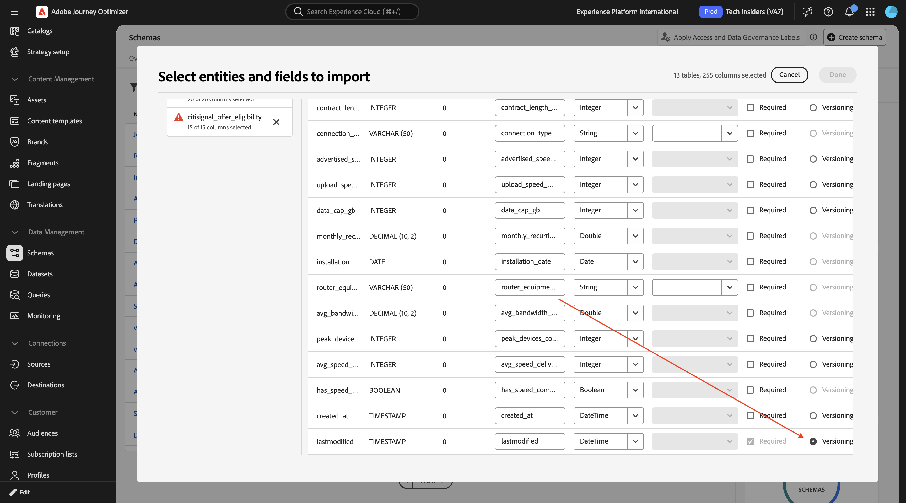

**`citisignal_tv_subscriptions`**

필드 **lastmodified**&#x200B;에 대한 **버전 관리** 확인란을 선택하십시오.

**`citisignal_equipment_subscriptions`**

필드 **lastmodified**&#x200B;에 대한 **버전 관리** 확인란을 선택하십시오.

**`citisignal_mobile_usage_summary`**

필드 **lastmodified**&#x200B;에 대한 **버전 관리** 확인란을 선택하십시오.

**`citisignal_internet_usage_summary`**

필드 **lastmodified**&#x200B;에 대한 **버전 관리** 확인란을 선택하십시오.

**`citisignal_offers`**

필드 **lastmodified**&#x200B;에 대한 **버전 관리** 확인란을 선택하십시오.

**`citisignal_offer_eligibility`**

필드 **lastmodified**&#x200B;에 대한 **버전 관리** 확인란을 선택하십시오.

### 스키마 이름

공유 샌드박스에서 활성화를 위해 이러한 스키마를 수집하는 경우 특정 샌드박스에서 고유하도록 각 스키마의 이름을 변경해야 합니다. 이 변경 작업을 수행하는 이유는 스키마 이름 지정 충돌을 피하기 위해서입니다.

이 실습의 경우 각 스키마 이름 앞에 LDAP를 추가해야 합니다. 즉, 모든 스키마 이름에는 `--aepUserLdap--_` 접두사가 있어야 합니다.

**`citisignal_products`**

스키마 이름을 `--aepUserLdap--_ citisignal_products`(으)로 변경합니다.

**`citisignal_product_bundles`**

스키마 이름을 `--aepUserLdap--_ citisignal_product_bundles`(으)로 변경합니다.

**`citisignal_product_relationships`**

스키마 이름을 `--aepUserLdap--_ citisignal_product_relationships`(으)로 변경합니다.

**`citisignal_accounts`**

스키마 이름을 `--aepUserLdap--_ citisignal_accounts`(으)로 변경합니다.

**`citisignal_recipients`**

스키마 이름을 `--aepUserLdap--_ citisignal_recipients`(으)로 변경합니다.

**`citisignal_mobile_subscriptions`**

스키마 이름을 `--aepUserLdap--_ citisignal_mobile_subscriptions`(으)로 변경합니다.

**`citisignal_internet_subscriptions`**

스키마 이름을 `--aepUserLdap--_ citisignal_internet_subscriptions`(으)로 변경합니다.

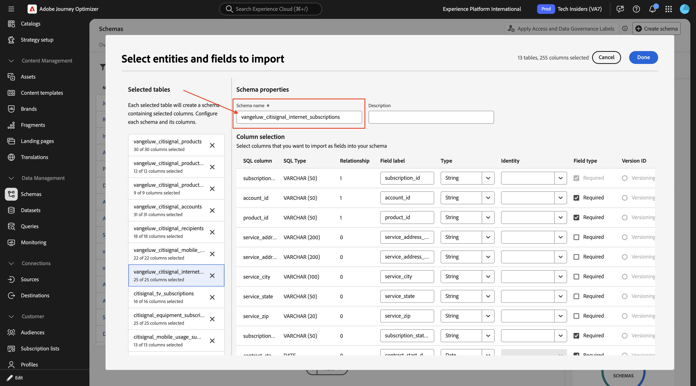

**`citisignal_tv_subscriptions`**

스키마 이름을 `--aepUserLdap--_ citisignal_internet_subscriptions`(으)로 변경합니다.

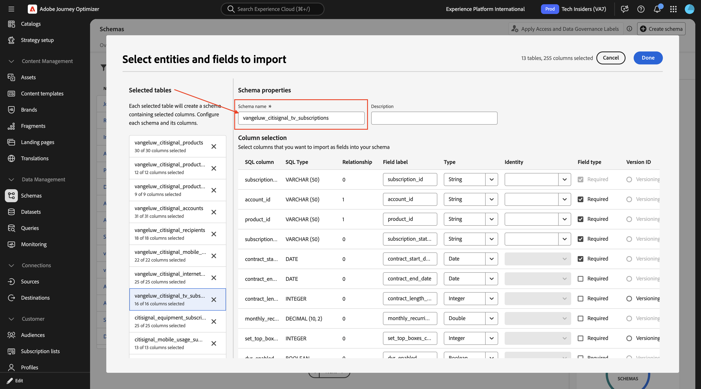

**`citisignal_equipment_subscriptions`**

스키마 이름을 `--aepUserLdap--_ citisignal_equipment_subscriptions`(으)로 변경합니다.

**`citisignal_mobile_usage_summary`**

스키마 이름을 `--aepUserLdap--_ citisignal_mobile_usage_summary`(으)로 변경합니다.

**`citisignal_internet_usage_summary`**

스키마 이름을 `--aepUserLdap--_ citisignal_internet_usage_summary`(으)로 변경합니다.

**`citisignal_offers`**

스키마 이름을 `--aepUserLdap--_ citisignal_offers`(으)로 변경합니다.

**`citisignal_offer_eligibility`**

스키마 이름을 `--aepUserLdap--_ citisignal_offer_eligibility`(으)로 변경합니다.

이제 스키마를 저장할 준비가 되었습니다. **완료**&#x200B;를 클릭합니다.

그럼 이걸 보셔야죠 **저장**&#x200B;을 클릭합니다.

**작업 열기**&#x200B;를 클릭합니다.

그럼 이걸 보셔야죠 작업이 성공적으로 완료될 때까지 기다린 후 다음 단계를 계속 진행해야 합니다.

작업이 성공적으로 완료되면 다음 단계를 계속할 수 있습니다. 5~10분 정도 소요될 수 있습니다.

이제 관계형 XDM 스키마가 구성되고 데이터가 수집되므로, 다음 연습에서 해당 데이터를 사용하여 오케스트레이션된 캠페인을 생성할 수 있습니다.

## 3.8.1.2 데이터 수집

**데이터 세트**(으)로 이동합니다. 그러면 만든 각 스키마에 대해 만들어진 데이터 세트가 표시됩니다.

[data.zip](./assets/data.zip) 파일을 데스크톱에 다운로드하고 압축 해제합니다.

**data** 폴더를 엽니다. 생성된 각 스키마에 대한 CSV 파일이 표시됩니다. 이제 해당 데이터를 각 해당 데이터 세트에 업로드해야 합니다. 이 실습의 경우 각 데이터 세트에 로컬 파일을 업로드하여 해당 작업을 수행합니다.

**`vangeluw_citisignal_products`**

**소스**(으)로 이동하여 `local`을(를) 검색한 다음 **로컬 파일 업로드**&#x200B;에서 **데이터 추가**&#x200B;를 클릭합니다.

**변경 데이터 캡처 사용**&#x200B;에 대한 전환을 사용하도록 설정합니다.

데이터 집합 `vangeluw_citisignal_products`을(를) 선택하십시오.

**다음**&#x200B;을 클릭합니다.

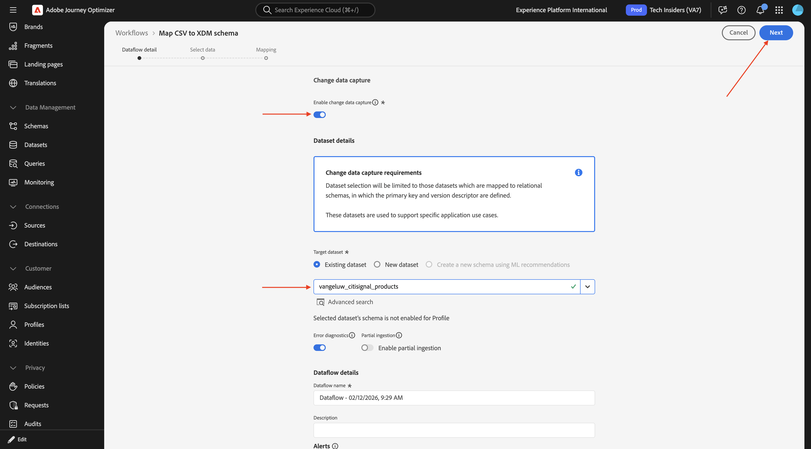

**파일 선택**&#x200B;을 클릭합니다. **`citisignal_products.csv`** 파일을 선택하고 **열기**&#x200B;를 클릭합니다.

**다음** 클릭

**마침을 클릭합니다**.

몇 분 후에 데이터 세트에 수집되는 데이터를 볼 수 있습니다.

**`vangeluw_citisignal_product_bundles`**

**소스**(으)로 이동하여 `local`을(를) 검색한 다음 **로컬 파일 업로드**&#x200B;에서 **데이터 추가**&#x200B;를 클릭합니다.

**변경 데이터 캡처 사용**&#x200B;에 대한 전환을 사용하도록 설정합니다.

데이터 집합 `vangeluw_citisignal_product_bundles`을(를) 선택하십시오.

**다음**&#x200B;을 클릭합니다.

**파일 선택**&#x200B;을 클릭합니다. **`citisignal_product_bundles.csv`** 파일을 선택하고 **열기**&#x200B;를 클릭합니다.

**다음** 클릭

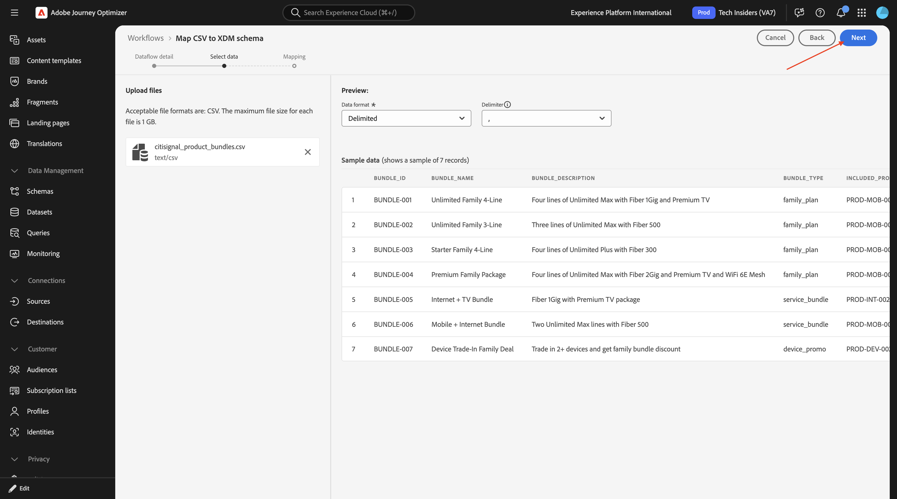

**마침을 클릭합니다**.

몇 분 후에 데이터 세트에 수집되는 데이터를 볼 수 있습니다.

**`vangeluw_citisignal_product_relationships`**

**소스**(으)로 이동하여 `local`을(를) 검색한 다음 **로컬 파일 업로드**&#x200B;에서 **데이터 추가**&#x200B;를 클릭합니다.

**변경 데이터 캡처 사용**&#x200B;에 대한 전환을 사용하도록 설정합니다.

데이터 집합 `vangeluw_citisignal_product_relationships`을(를) 선택하십시오.

**다음**&#x200B;을 클릭합니다.

**파일 선택**&#x200B;을 클릭합니다. **`citisignal_product_relationships.csv`** 파일을 선택하고 **열기**&#x200B;를 클릭합니다.

**다음** 클릭

**마침을 클릭합니다**.

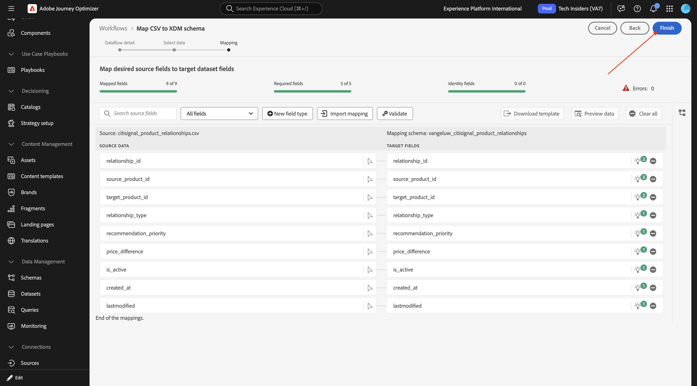

몇 분 후에 데이터 세트에 수집되는 데이터를 볼 수 있습니다.

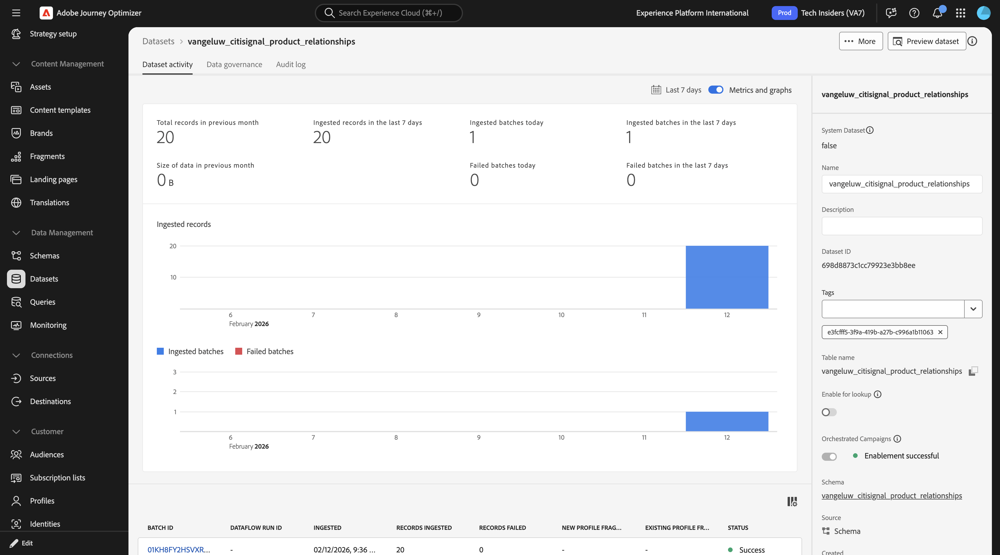

**`vangeluw_citisignal_accounts`**

**소스**(으)로 이동하여 `local`을(를) 검색한 다음 **로컬 파일 업로드**&#x200B;에서 **데이터 추가**&#x200B;를 클릭합니다.

**변경 데이터 캡처 사용**&#x200B;에 대한 전환을 사용하도록 설정합니다.

데이터 집합 `vangeluw_citisignal_accounts`을(를) 선택하십시오.

**다음**&#x200B;을 클릭합니다.

**파일 선택**&#x200B;을 클릭합니다. **`citisignal_accounts.csv`** 파일을 선택하고 **열기**&#x200B;를 클릭합니다.

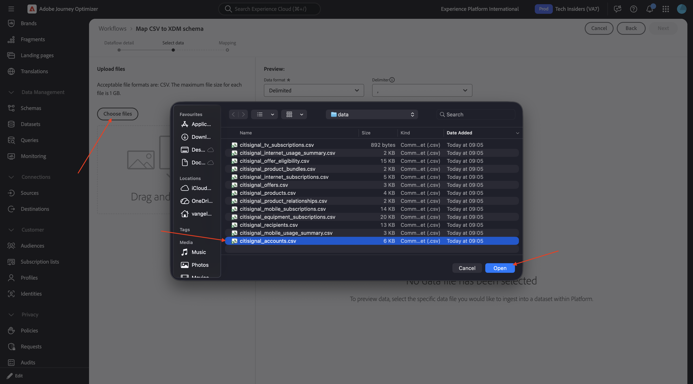

**다음** 클릭

**마침을 클릭합니다**.

몇 분 후에 데이터 세트에 수집되는 데이터를 볼 수 있습니다.

**`vangeluw_citisignal_recipients`**

**소스**(으)로 이동하여 `local`을(를) 검색한 다음 **로컬 파일 업로드**&#x200B;에서 **데이터 추가**&#x200B;를 클릭합니다.

**변경 데이터 캡처 사용**&#x200B;에 대한 전환을 사용하도록 설정합니다.

데이터 집합 `vangeluw_citisignal_recipients`을(를) 선택하십시오.

**다음**&#x200B;을 클릭합니다.

**파일 선택**&#x200B;을 클릭합니다. **`citisignal_recipients.csv`** 파일을 선택하고 **열기**&#x200B;를 클릭합니다.

**다음** 클릭

**마침을 클릭합니다**.

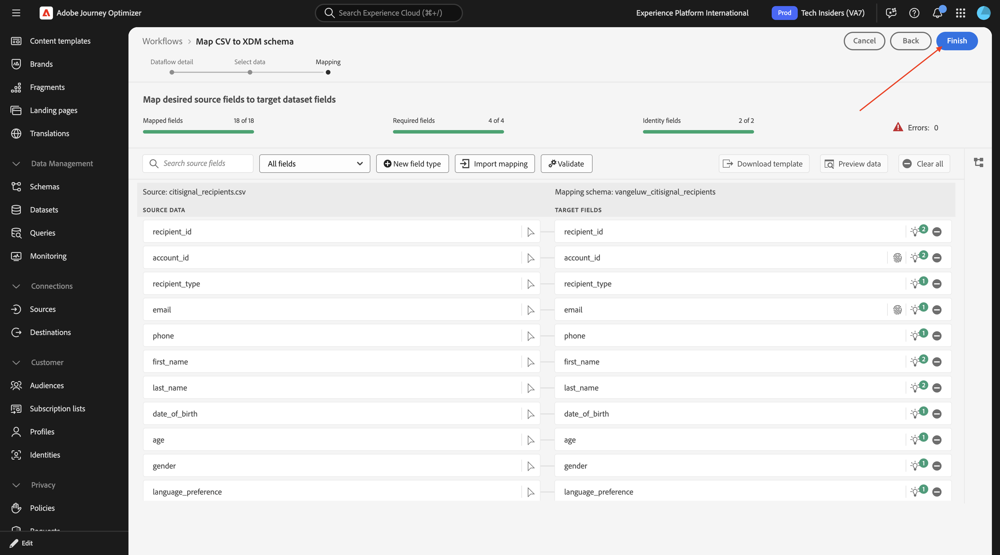

몇 분 후에 데이터 세트에 수집되는 데이터를 볼 수 있습니다.

**`vangeluw_citisignal_mobile_subscriptions`**

**소스**(으)로 이동하여 `local`을(를) 검색한 다음 **로컬 파일 업로드**&#x200B;에서 **데이터 추가**&#x200B;를 클릭합니다.

**변경 데이터 캡처 사용**&#x200B;에 대한 전환을 사용하도록 설정합니다.

데이터 집합 `vangeluw_citisignal_mobile_subscriptions`을(를) 선택하십시오.

**다음**&#x200B;을 클릭합니다.

**파일 선택**&#x200B;을 클릭합니다. **`citisignal_mobile_subscriptions.csv`** 파일을 선택하고 **열기**&#x200B;를 클릭합니다.

**다음** 클릭

**마침을 클릭합니다**.

몇 분 후에 데이터 세트에 수집되는 데이터를 볼 수 있습니다.

**`vangeluw_citisignal_internet_subscriptions`**

**소스**(으)로 이동하여 `local`을(를) 검색한 다음 **로컬 파일 업로드**&#x200B;에서 **데이터 추가**&#x200B;를 클릭합니다.

**변경 데이터 캡처 사용**&#x200B;에 대한 전환을 사용하도록 설정합니다.

데이터 집합 `vangeluw_citisignal_internet_subscriptions`을(를) 선택하십시오.

**다음**&#x200B;을 클릭합니다.

**파일 선택**&#x200B;을 클릭합니다. **`citisignal_internet_subscriptions.csv`** 파일을 선택하고 **열기**&#x200B;를 클릭합니다.

**다음** 클릭

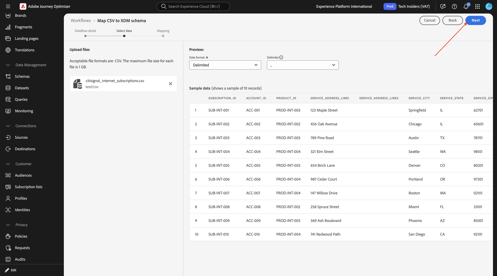

**마침을 클릭합니다**.

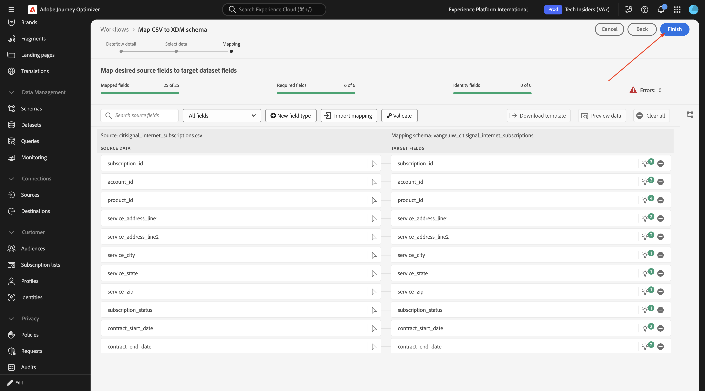

몇 분 후에 데이터 세트에 수집되는 데이터를 볼 수 있습니다.

**`vangeluw_citisignal_tv_subscriptions`**

**소스**(으)로 이동하여 `local`을(를) 검색한 다음 **로컬 파일 업로드**&#x200B;에서 **데이터 추가**&#x200B;를 클릭합니다.

**변경 데이터 캡처 사용**&#x200B;에 대한 전환을 사용하도록 설정합니다.

데이터 집합 `vangeluw_citisignal_tv_subscriptions`을(를) 선택하십시오.

**다음**&#x200B;을 클릭합니다.

**파일 선택**&#x200B;을 클릭합니다. **`citisignal_tv_subscriptions.csv`** 파일을 선택하고 **열기**&#x200B;를 클릭합니다.

**다음** 클릭

**마침을 클릭합니다**.

몇 분 후에 데이터 세트에 수집되는 데이터를 볼 수 있습니다.

**`vangeluw_citisignal_equipment_subscriptions`**

**소스**(으)로 이동하여 `local`을(를) 검색한 다음 **로컬 파일 업로드**&#x200B;에서 **데이터 추가**&#x200B;를 클릭합니다.

**변경 데이터 캡처 사용**&#x200B;에 대한 전환을 사용하도록 설정합니다.

데이터 집합 `vangeluw_citisignal_equipment_subscriptions`을(를) 선택하십시오.

**다음**&#x200B;을 클릭합니다.

**파일 선택**&#x200B;을 클릭합니다. **`citisignal_equipment_subscriptions.csv`** 파일을 선택하고 **열기**&#x200B;를 클릭합니다.

**다음** 클릭

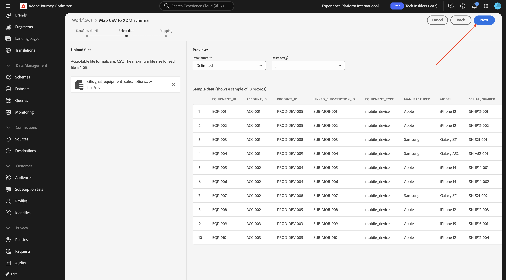

**마침을 클릭합니다**.

몇 분 후에 데이터 세트에 수집되는 데이터를 볼 수 있습니다.

**`vangeluw_citisignal_mobile_usage_summary`**

**소스**(으)로 이동하여 `local`을(를) 검색한 다음 **로컬 파일 업로드**&#x200B;에서 **데이터 추가**&#x200B;를 클릭합니다.

**변경 데이터 캡처 사용**&#x200B;에 대한 전환을 사용하도록 설정합니다.

데이터 집합 `vangeluw_citisignal_mobile_usage_summary`을(를) 선택하십시오.

**다음**&#x200B;을 클릭합니다.

**파일 선택**&#x200B;을 클릭합니다. **`citisignal_mobile_usage_summary.csv`** 파일을 선택하고 **열기**&#x200B;를 클릭합니다.

**다음** 클릭

**마침을 클릭합니다**.

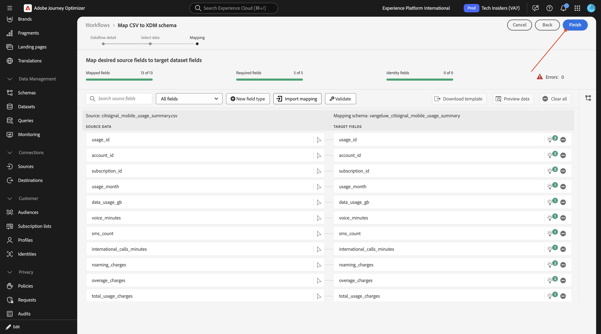

몇 분 후에 데이터 세트에 수집되는 데이터를 볼 수 있습니다.

**`vangeluw_citisignal_internet_usage_summary`**

**소스**(으)로 이동하여 `local`을(를) 검색한 다음 **로컬 파일 업로드**&#x200B;에서 **데이터 추가**&#x200B;를 클릭합니다.

**변경 데이터 캡처 사용**&#x200B;에 대한 전환을 사용하도록 설정합니다.

데이터 집합 `vangeluw_citisignal_internet_usage_summary`을(를) 선택하십시오.

**다음**&#x200B;을 클릭합니다.

**파일 선택**&#x200B;을 클릭합니다. **`citisignal_internet_usage_summary.csv`** 파일을 선택하고 **열기**&#x200B;를 클릭합니다.

**다음** 클릭

**마침을 클릭합니다**.

몇 분 후에 데이터 세트에 수집되는 데이터를 볼 수 있습니다.

**`vangeluw_citisignal_offers`**

**소스**(으)로 이동하여 `local`을(를) 검색한 다음 **로컬 파일 업로드**&#x200B;에서 **데이터 추가**&#x200B;를 클릭합니다.

**변경 데이터 캡처 사용**&#x200B;에 대한 전환을 사용하도록 설정합니다.

데이터 집합 `vangeluw_citisignal_offers`을(를) 선택하십시오.

**다음**&#x200B;을 클릭합니다.

**파일 선택**&#x200B;을 클릭합니다. **`citisignal_offers.csv`** 파일을 선택하고 **열기**&#x200B;를 클릭합니다.

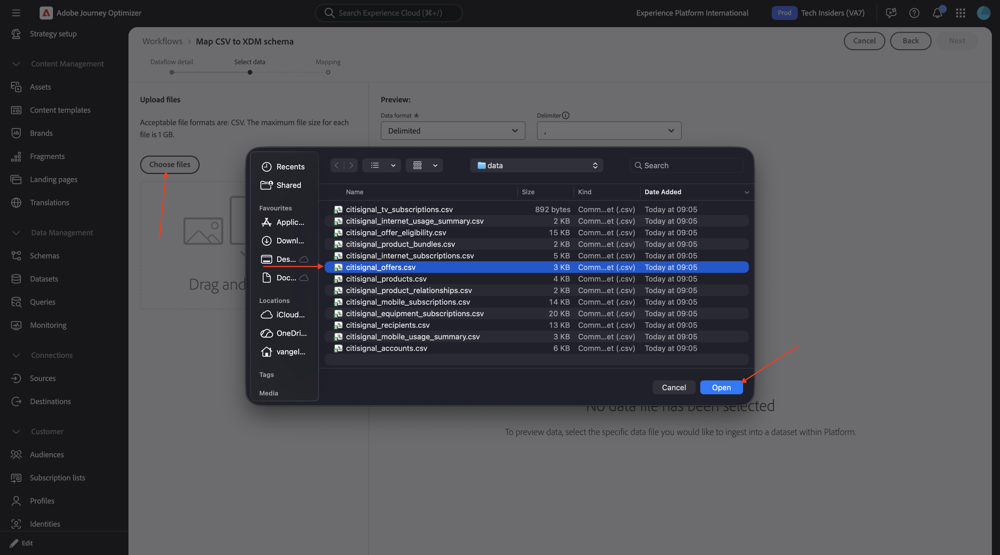

**다음** 클릭

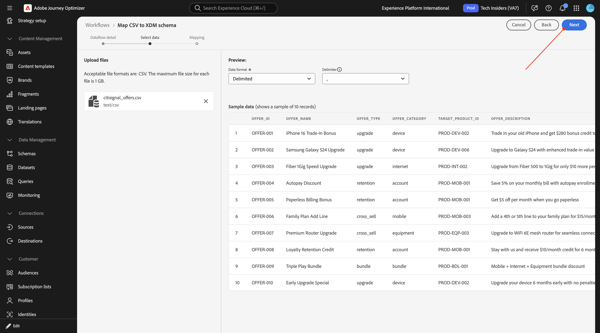

**마침을 클릭합니다**.

몇 분 후에 데이터 세트에 수집되는 데이터를 볼 수 있습니다.

**`vangeluw_citisignal_offer_eligibility`**

**소스**(으)로 이동하여 `local`을(를) 검색한 다음 **로컬 파일 업로드**&#x200B;에서 **데이터 추가**&#x200B;를 클릭합니다.

**변경 데이터 캡처 사용**&#x200B;에 대한 전환을 사용하도록 설정합니다.

데이터 집합 `vangeluw_citisignal_offer_eligibility`을(를) 선택하십시오.

**다음**&#x200B;을 클릭합니다.

**파일 선택**&#x200B;을 클릭합니다. **`citisignal_offer_eligibility.csv`** 파일을 선택하고 **열기**&#x200B;를 클릭합니다.

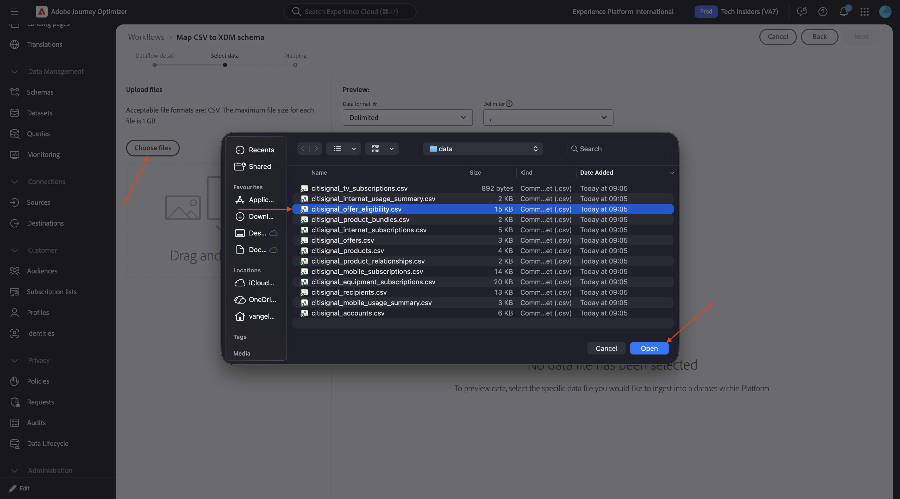

**다음** 클릭

**마침을 클릭합니다**.

몇 분 후에 데이터 세트에 수집되는 데이터를 볼 수 있습니다.

이제 모든 데이터가 수집됩니다.

## 3.8.1.3 프로필 대상 Dimension

오케스트레이션된 캠페인을 통해 Adobe Experience Platform의 관계형 스키마 기능을 활용하여 엔티티 수준에서 타깃팅된 커뮤니케이션을 디자인하고 제공할 수 있습니다. Experience Platform은 스키마를 사용하여 데이터의 구조를 일관되고 재사용 가능한 방식으로 설명합니다. 데이터가 Experience Platform에 수집되면 XDM 스키마에 따라 구조화됩니다.

오케스트레이션된 캠페인에 대한 세그멘테이션은 주로 관계형 스키마에서 작동하지만 실제 메시지 게재는 항상 프로필 수준에서 발생합니다.

타깃팅을 구성할 때는 두 가지 주요 측면을 정의합니다.

- 타겟팅 가능한 스키마: 타겟팅에 적합한 관계형 스키마를 지정합니다. 기본적으로 수신자라는 스키마가 사용되지만, 방문자, 고객 등과 같은 대체 요소를 구성할 수 있습니다.

- 프로필 링크: 시스템은 대상 스키마가 프로필 스키마에 매핑되는 방식을 이해해야 합니다. 이는 대상 스키마와 프로필 스키마 모두에 있고 ID 네임스페이스로 구성된 공유 ID 필드를 통해 수행됩니다.

이제 프로필 대상 차원을 구성해야 합니다. **관리** > **구성**(으)로 이동한 다음 **프로필 대상 Dimension**&#x200B;에서 **관리**&#x200B;를 클릭합니다.

그럼 이걸 보셔야죠 **만들기**&#x200B;를 클릭합니다.

**스키마**&#x200B;에 대해 `--aepUserLdap--_citisignal_accounts`을(를) 선택합니다. **ID 값**&#x200B;에 대해 **account_id**&#x200B;을(를) 선택하십시오.

**저장**&#x200B;을 클릭합니다.

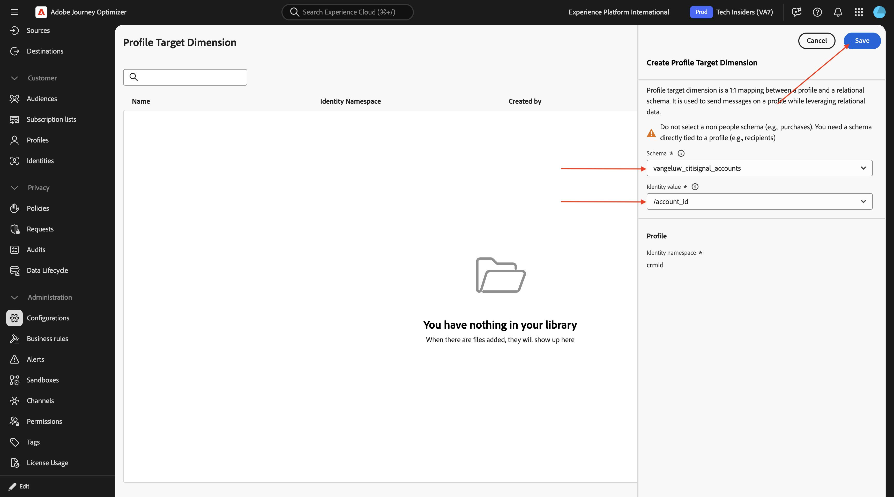

**만들기**&#x200B;를 다시 클릭합니다.

**스키마**&#x200B;에 대해 `--aepUserLdap--_citisignal_recipients`을(를) 선택합니다. **ID 값**&#x200B;에 대해 **account_id**&#x200B;을(를) 선택하십시오.

**저장**&#x200B;을 클릭합니다.

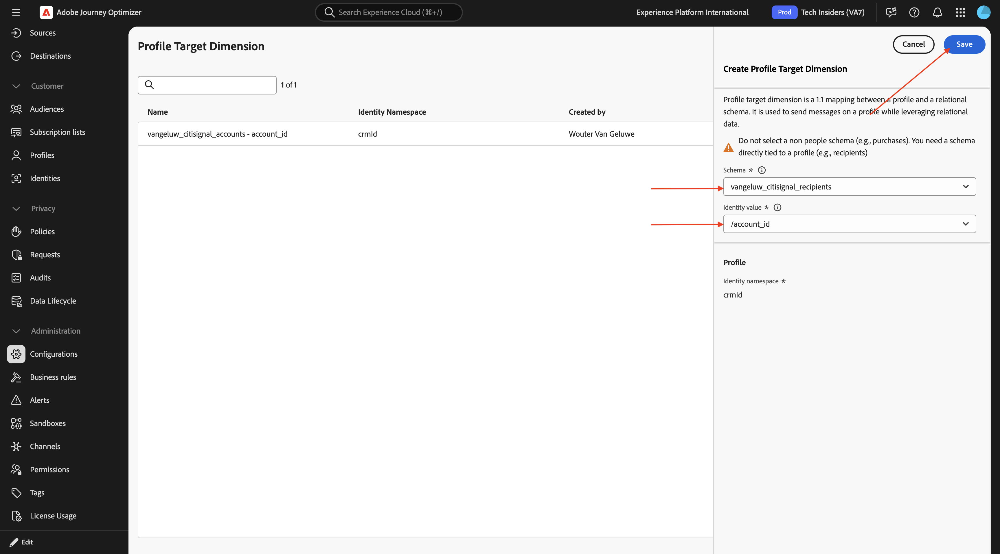

**만들기**&#x200B;를 다시 클릭합니다.

**스키마**&#x200B;에 대해 `--aepUserLdap--_citisignal_recipients`을(를) 선택합니다. **ID 값**&#x200B;에 대해 **전자 메일**&#x200B;을 선택하세요.

**저장**&#x200B;을 클릭합니다.

그럼 이걸 드셔보세요

다음 연습에서는 이러한 데이터를 오케스트레이션된 캠페인의 일부로 사용하기 시작합니다.

## 다음 단계

[오케스트레이션된 캠페인 만들기](./ex2.md){target="_blank"}(으)로 이동

[Adobe Journey Optimizer: 오케스트레이션된 캠페인](./ajocampaigns.md){target="_blank"}(으)로 돌아가기

[모든 모듈](./../../../../overview.md){target="_blank"}(으)로 돌아가기
