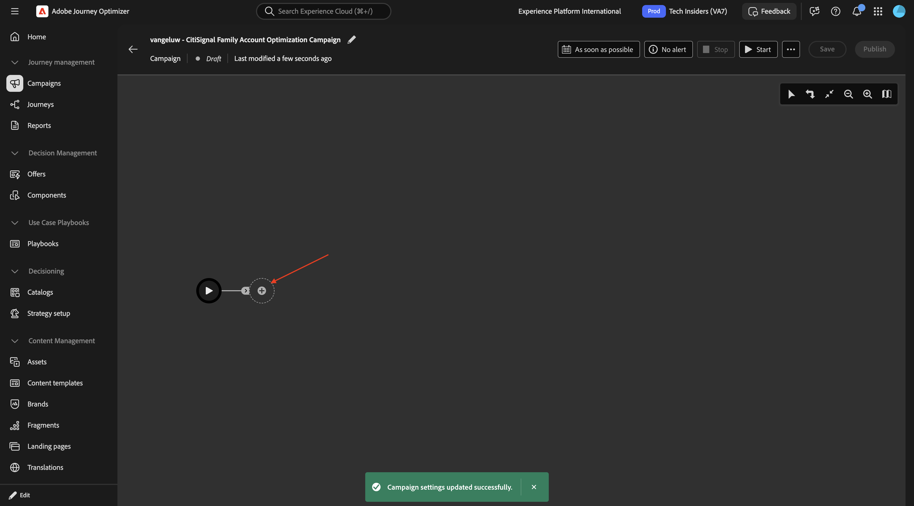

# 3.8.2 오케스트레이션된 캠페인 만들기

## 3.8.2.1 오케스트레이션된 캠페인 만들기

**캠페인**(으)로 이동합니다. **캠페인 만들기**&#x200B;를 클릭합니다.

**오케스트레이션 - 마케팅**&#x200B;을 선택하고 **확인**&#x200B;을 클릭합니다.

캠페인 이름 `--aepUserLdap-- - CitiSignal Family Account Optimization Campaign`을(를) 입력하고 **저장**&#x200B;을(를) 클릭합니다.

그럼 이걸 보셔야죠 **+** 아이콘을 클릭합니다.

## 다음 단계

[Adobe Journey Optimizer: 캠페인](./ajocampaigns.md){target="_blank"}(으)로 돌아가기

[모든 모듈](./../../../../overview.md){target="_blank"}(으)로 돌아가기
