# 3.8.2 오케스트레이션된 캠페인 만들기

## 3.8.2.1 오케스트레이션된 캠페인 만들기

**캠페인**(으)로 이동합니다. **캠페인 만들기**&#x200B;를 클릭합니다.

**오케스트레이션 - 마케팅**&#x200B;을 선택하고 **확인**&#x200B;을 클릭합니다.

캠페인 이름 `--aepUserLdap-- - CitiSignal Family Account Optimization Campaign`을(를) 입력하고 **저장**&#x200B;을(를) 클릭합니다.

그럼 이걸 보셔야죠 **+** 아이콘을 클릭합니다.

**포크**&#x200B;를 선택합니다.

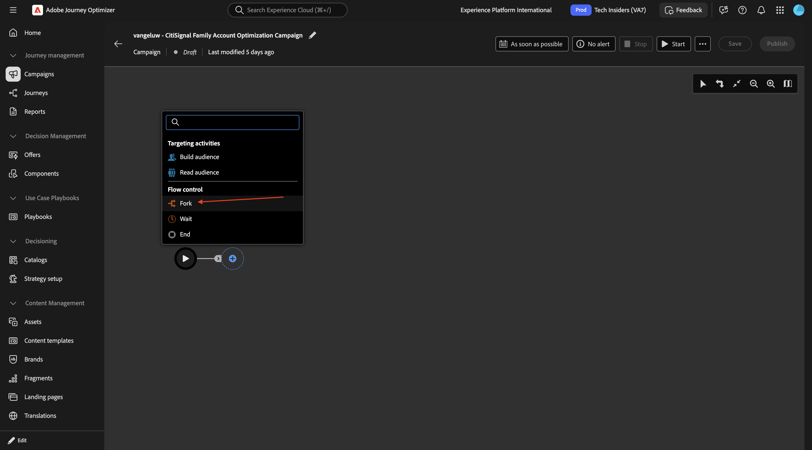

### 대상 1 작성

**+** 아이콘을 클릭한 다음 **대상자 빌드**&#x200B;를 선택합니다.

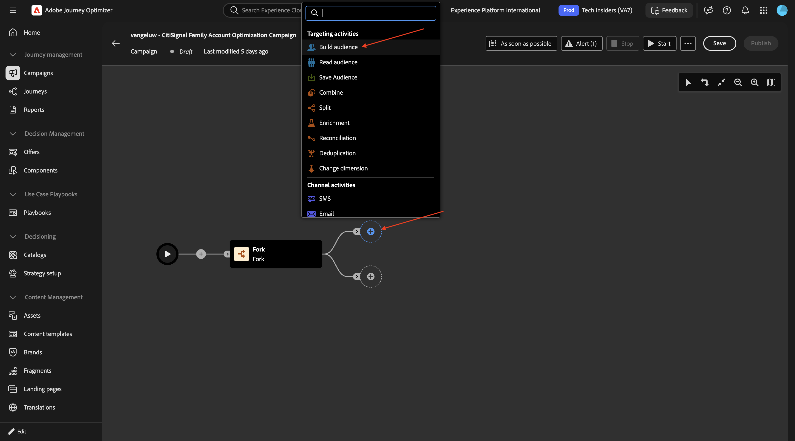

**타겟팅 차원**&#x200B;에 대한 폴더를 열려면 클릭하세요.

**`--aepUserLdap--_citisignal_recipients`**&#x200B;을(를) 선택하고 **확인**&#x200B;을(를) 클릭합니다.

**대상 만들기**&#x200B;를 클릭합니다.

**조건 추가**&#x200B;를 클릭합니다.

**recipient_type**&#x200B;을(를) 선택하고 **확인**&#x200B;을(를) 클릭합니다.

**`account_holder`**&#x200B;값&#x200B;**필드에**&#x200B;을(를) 입력하고 **계산**&#x200B;을(를) 클릭합니다.

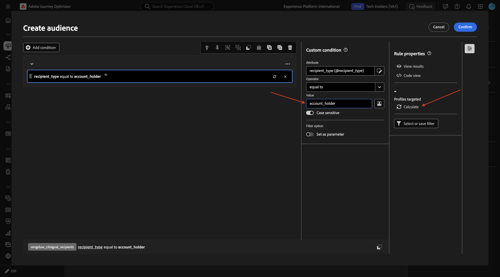

**프로필 대상**&#x200B;에 대한 숫자가 표시됩니다. 표시된 대로 회색 영역 내 아무 곳이나 클릭합니다.

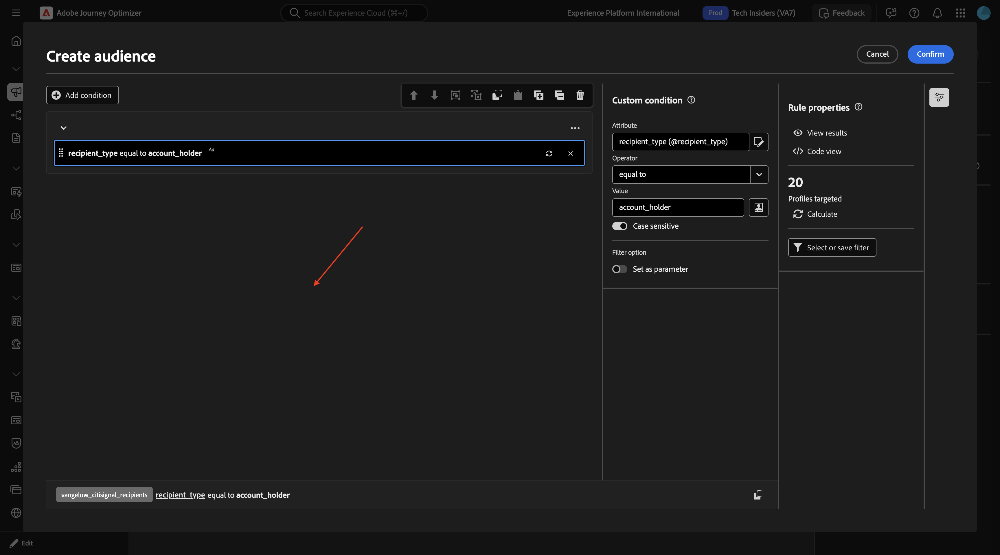

**조건 추가**&#x200B;를 클릭합니다.

**`citisignal_accounts`**(으)로 드릴다운합니다.

**`account_status`**&#x200B;을(를) 선택하고 **확인**&#x200B;을(를) 클릭합니다.

**`active`**&#x200B;값&#x200B;**필드에**&#x200B;을(를) 입력하십시오. 그런 다음 표시된 대로 회색 영역 내 아무 곳이나 클릭합니다.

**조건 추가**&#x200B;를 클릭합니다.

**`citisignal_mobile_subscriptions`**(으)로 드릴다운합니다.

**`subscription_id`**&#x200B;을(를) 선택하고 **확인**&#x200B;을(를) 클릭합니다.

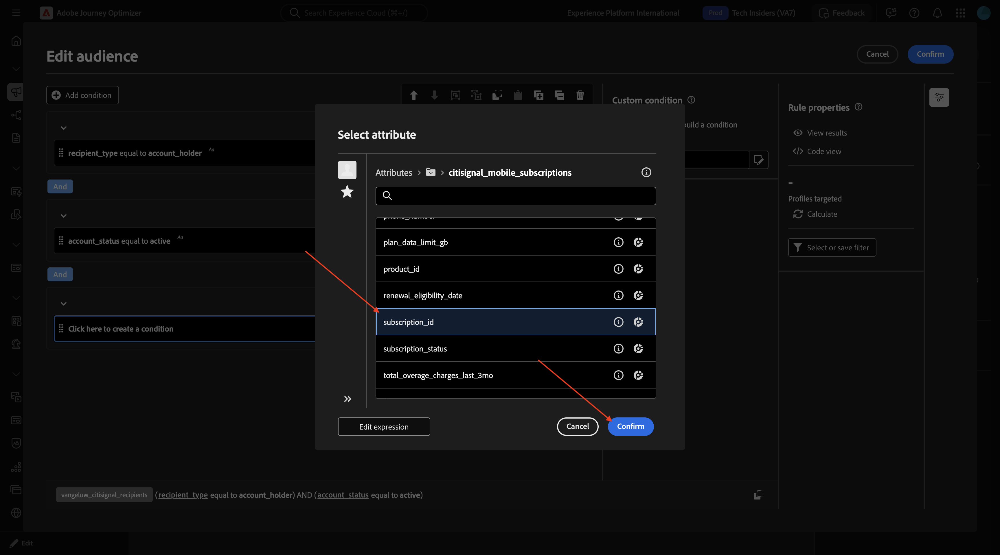

**집계 데이터**&#x200B;에 대해 전환기를 사용하도록 설정하십시오. 그런 다음 다음을 선택합니다.

- **집계 함수**: **개수**
- **연산자**: **다음보다 크거나 같음**
- **값**: **1**

**확인**&#x200B;을 클릭합니다.

그럼 이걸 보셔야죠 **확인**&#x200B;을 클릭합니다.

### 대상 2 작성

다른 경로의 다음 노드에서 **+** 아이콘을 클릭합니다.

**대상자 빌드**&#x200B;를 선택합니다.

**타겟팅 차원**&#x200B;에 대한 폴더를 열려면 클릭하세요.

**`--aepUserLdap--_mobile_subscriptions`**&#x200B;을(를) 선택하고 **확인**&#x200B;을(를) 클릭합니다.

**대상 만들기**&#x200B;를 클릭합니다.

**조건 추가**&#x200B;를 클릭합니다.

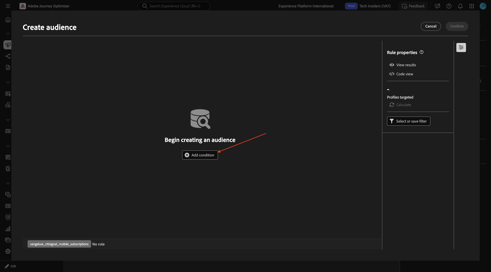

**subscription_status**&#x200B;을(를) 선택하고 **확인**&#x200B;을(를) 클릭합니다.

**`active`**&#x200B;값&#x200B;**필드에**&#x200B;을(를) 입력하십시오. 그런 다음 **조건 추가**&#x200B;를 클릭합니다.

**`is_upgrade_eligible`**&#x200B;을(를) 선택하고 **확인**&#x200B;을(를) 클릭합니다.

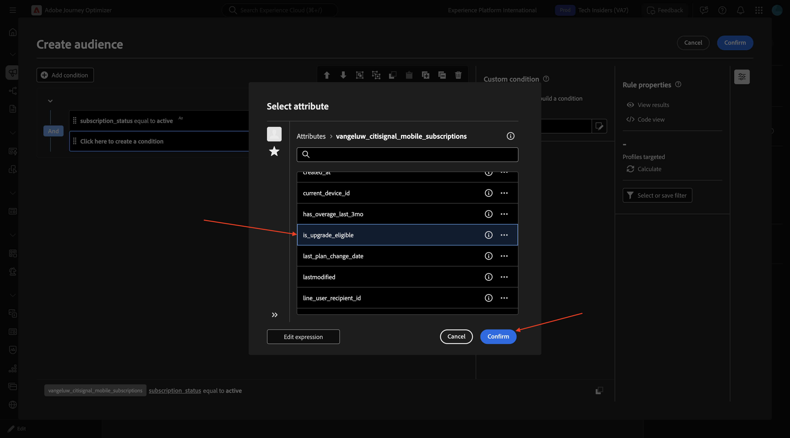

**값**&#x200B;을(를) **true**(으)로 설정

이 대상자에 적합한 예상 프로필을 보려면 **계산**&#x200B;을 클릭하세요. 그런 다음 **확인**&#x200B;을 클릭합니다

### 분할

**+** 아이콘을 클릭한 다음 **분할**&#x200B;을 선택합니다.

필드 **Label**&#x200B;을(를) **90/10 처리 대 제어**(으)로 변경하십시오. 개체 **하위 집합**&#x200B;을(를) 열려면 클릭하세요.

**제한 사용**&#x200B;에 대해 전환기를 사용하도록 설정하고 **제한 크기**&#x200B;을(를) **10 최신**(으)로 설정합니다.

**세그먼트 추가**&#x200B;를 클릭하면 **결과** 개체가 추가됩니다.

**저장**&#x200B;을 클릭합니다.

### 대상자 저장

**+** 아이콘을 클릭한 다음 **대상자 저장**&#x200B;을 선택합니다.

필드 **대상 레이블**&#x200B;을(를) **`--aepUserLdap-- - Control Group`**(으)로 설정합니다. **대상 매핑 추가**&#x200B;를 클릭합니다.

**타깃팅 차원**(으)로 드릴다운합니다.

**`account_id`**&#x200B;을(를) 선택하고 **확인**&#x200B;을(를) 클릭합니다.

**프로필 매핑 필드**&#x200B;을(를) **`--aepUserLdap--_citisignal_recipients - account_id`**(으)로 설정합니다.

### 데이터 보강: 인터넷 구독

**+** 아이콘을 클릭합니다.

**데이터 보강**&#x200B;을 선택합니다.

그럼 이걸 보셔야죠 **보강 데이터 추가**&#x200B;를 클릭합니다.

**`Targeting dimension`**(으)로 드릴다운합니다.

**`citisignal_accounts`**(으)로 드릴다운합니다.

**`citisignal_internet_subscriptions`**(으)로 드릴다운합니다.

**`account_id`**&#x200B;을(를) 선택하고 **확인**&#x200B;을(를) 클릭합니다.

그럼 이걸 보셔야죠 **특성 추가**&#x200B;를 클릭합니다.

**`subscription_status`**&#x200B;을(를) 선택하고 **확인**&#x200B;을(를) 클릭합니다.

**특성 추가**&#x200B;를 클릭합니다.

**`connection_type`**&#x200B;을(를) 선택하고 **확인**&#x200B;을(를) 클릭합니다.

**특성 추가**&#x200B;를 클릭합니다.

**`service_city`**&#x200B;을(를) 선택하고 **확인**&#x200B;을(를) 클릭합니다.

**특성 추가**&#x200B;를 클릭합니다.

**`avg_bandwidth_usage_gb`**&#x200B;을(를) 선택하고 **확인**&#x200B;을(를) 클릭합니다.

**특성 추가**&#x200B;를 클릭합니다.

**`data_cap_gb`**&#x200B;을(를) 선택하고 **확인**&#x200B;을(를) 클릭합니다.

**특성 추가**&#x200B;를 클릭합니다.

**`advertised_speed_mbps`**&#x200B;을(를) 선택하고 **확인**&#x200B;을(를) 클릭합니다.

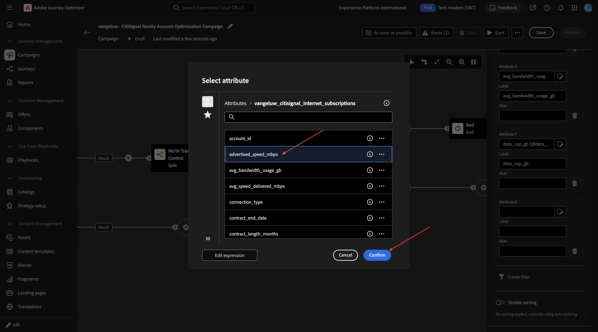

**특성 추가**&#x200B;를 클릭합니다.

**`monthly_recurring_charge`**&#x200B;을(를) 선택하고 **확인**&#x200B;을(를) 클릭합니다.

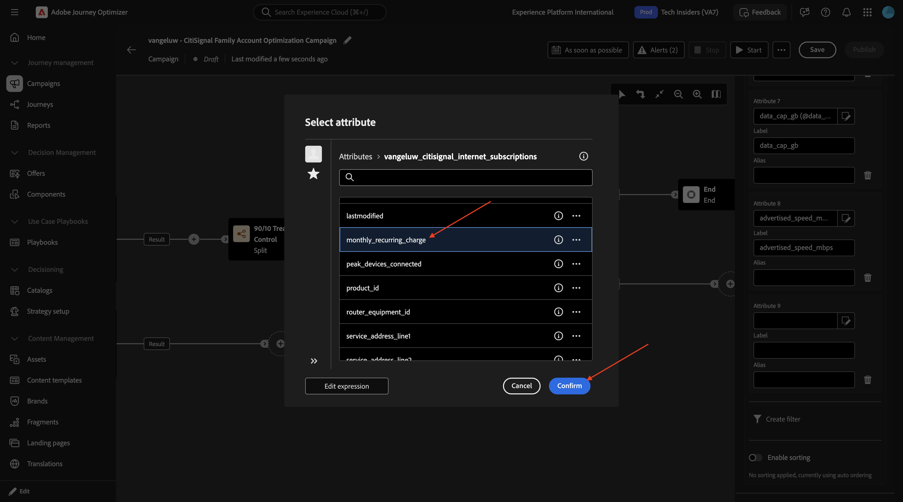

**저장**&#x200B;을 클릭합니다.

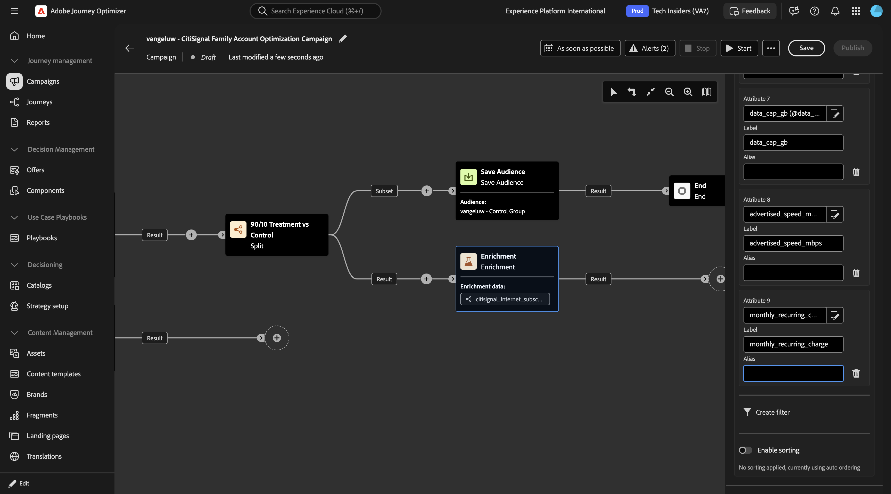

위로 스크롤하여 필드 **레이블**&#x200B;을(를) `Enrichment: Internet Subscription`(으)로 변경합니다.

### 데이터 보강: 모바일 장치 구독

다음 노드에서 **+** 아이콘을 클릭하고 **데이터 보강**&#x200B;을 선택합니다.

필드 **Label**&#x200B;을(를) `Enrichment: Mobile Devices Subscription`(으)로 변경한 다음 **데이터 보강 추가**&#x200B;를 클릭합니다.

**타깃팅 차원**(으)로 드릴다운합니다.

**`citisignal_accounts`**(으)로 드릴다운합니다.

**`citisignal_mobile_subscriptions`**(으)로 드릴다운합니다.

**`phone_number`**&#x200B;을(를) 선택하고 **확인**&#x200B;을(를) 클릭합니다.

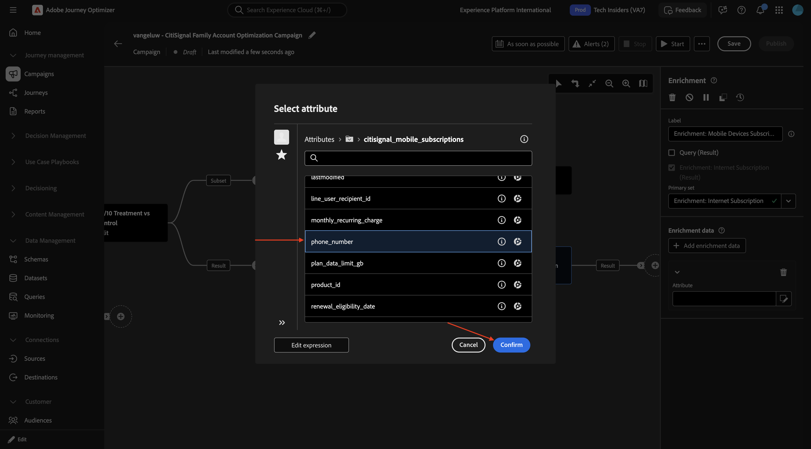

**특성 추가**&#x200B;를 클릭합니다.

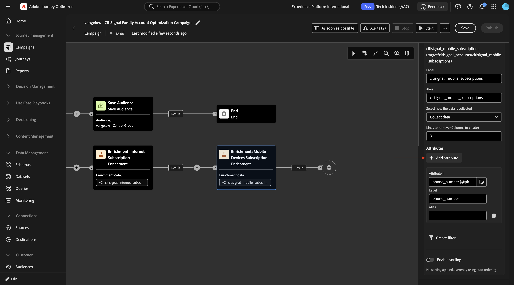

**`citisignal_equipment_subscriptions`**(으)로 드릴다운합니다.

**`model`**&#x200B;을(를) 선택하고 **확인**&#x200B;을(를) 클릭합니다.

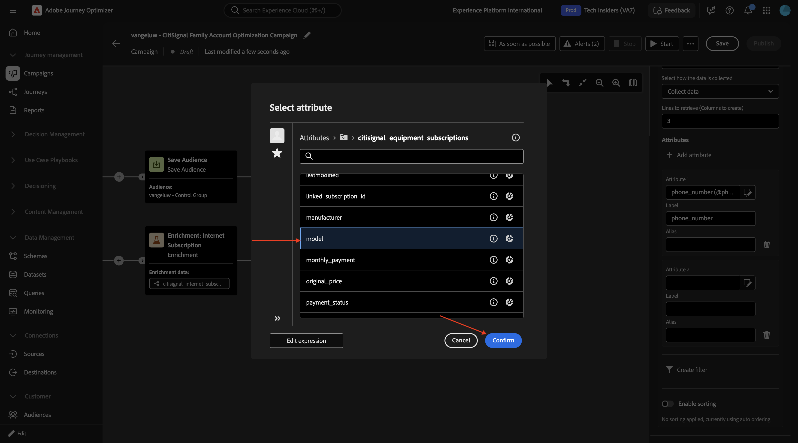

**특성 추가**&#x200B;를 클릭합니다.

**`citisignal_equipment_subscriptions`**(으)로 드릴다운합니다.

**`recommended_device_model`**&#x200B;을(를) 선택하고 **확인**&#x200B;을(를) 클릭합니다.

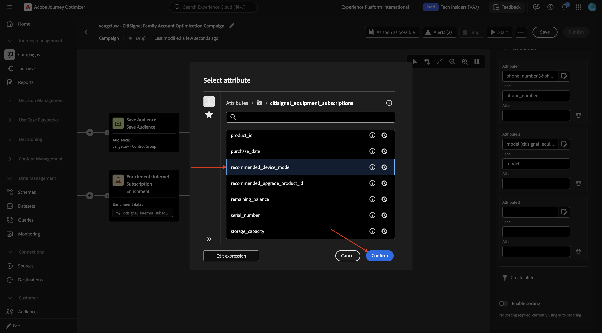

**특성 추가**&#x200B;를 클릭합니다.

**`citisignal_equipment_subscriptions`**(으)로 드릴다운합니다.

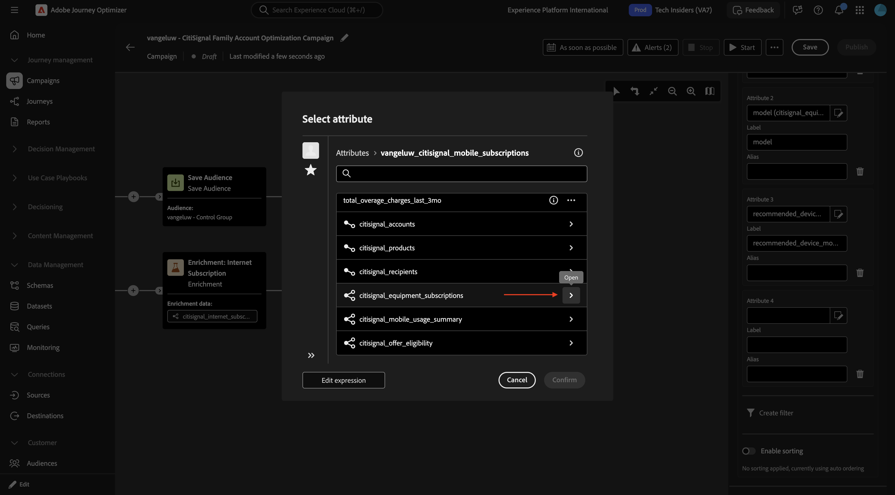

**`is_upgrade_eligible`**&#x200B;을(를) 선택하고 **확인**&#x200B;을(를) 클릭합니다.

이제 테스트 실행을 통해 진행 상황을 테스트하고 캠페인에서 사용할 수 있는 데이터를 확인할 수 있습니다.

변경 내용을 저장한 다음 **시작**&#x200B;을 클릭합니다.

시간이 좀 지나면 이걸 볼 수 있을 거야. **결과 미리 보기**&#x200B;를 클릭합니다.

그러면 이와 비슷한 것을 볼 수 있을 겁니다. Click **Close**.

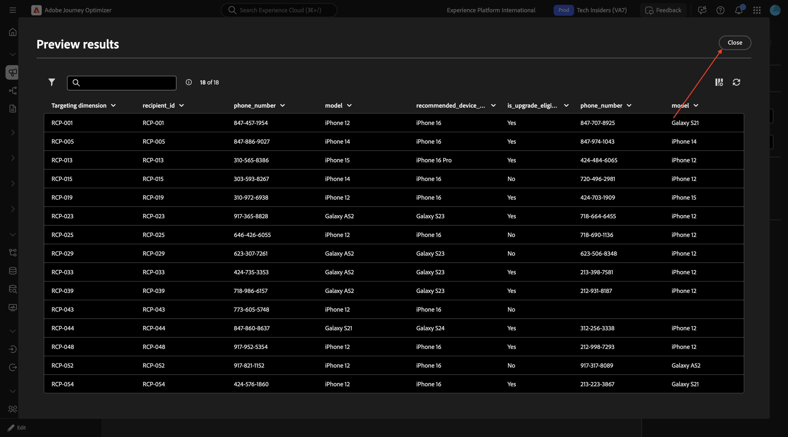

**데이터 보강: 모바일 장치 구독** 노드로 돌아갑니다.

**특성 추가**&#x200B;를 클릭합니다.

**`account_id`**&#x200B;을(를) 선택하고 **확인**&#x200B;을(를) 클릭합니다.

**특성 추가**&#x200B;를 클릭합니다.

**`subscription_id`**&#x200B;을(를) 선택하고 **확인**&#x200B;을(를) 클릭합니다.

**특성 추가**&#x200B;를 클릭합니다.

**`renewal_eligibility_date`**&#x200B;을(를) 선택하고 **확인**&#x200B;을(를) 클릭합니다.

**특성 추가**&#x200B;를 클릭합니다.

**`line_user_recipient_id`**&#x200B;을(를) 선택하고 **확인**&#x200B;을(를) 클릭합니다.

**특성 추가**&#x200B;를 클릭합니다.

**`current_device_id`**&#x200B;을(를) 선택하고 **확인**&#x200B;을(를) 클릭합니다.

**특성 추가**&#x200B;를 클릭합니다.

**`contract_start_date`**&#x200B;을(를) 선택하고 **확인**&#x200B;을(를) 클릭합니다.

**특성 추가**&#x200B;를 클릭합니다.

**`citisignal_equipment_subscriptions`**(으)로 드릴다운합니다.

**`manufacturer`**&#x200B;을(를) 선택하고 **확인**&#x200B;을(를) 클릭합니다.

**특성 추가**&#x200B;를 클릭합니다.

**`citisignal_equipment_subscriptions`**(으)로 드릴다운합니다.

**`device_age_months`**&#x200B;을(를) 선택하고 **확인**&#x200B;을(를) 클릭합니다.

**특성 추가**&#x200B;를 클릭합니다.

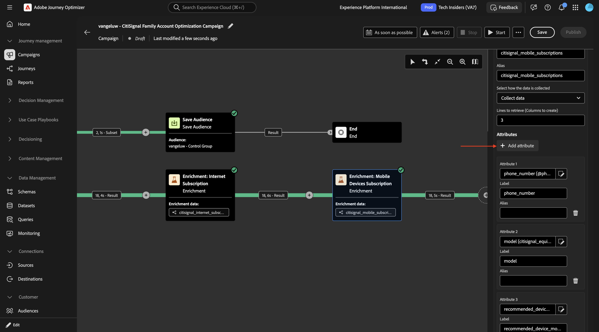

**`citisignal_equipment_subscriptions`**(으)로 드릴다운합니다.

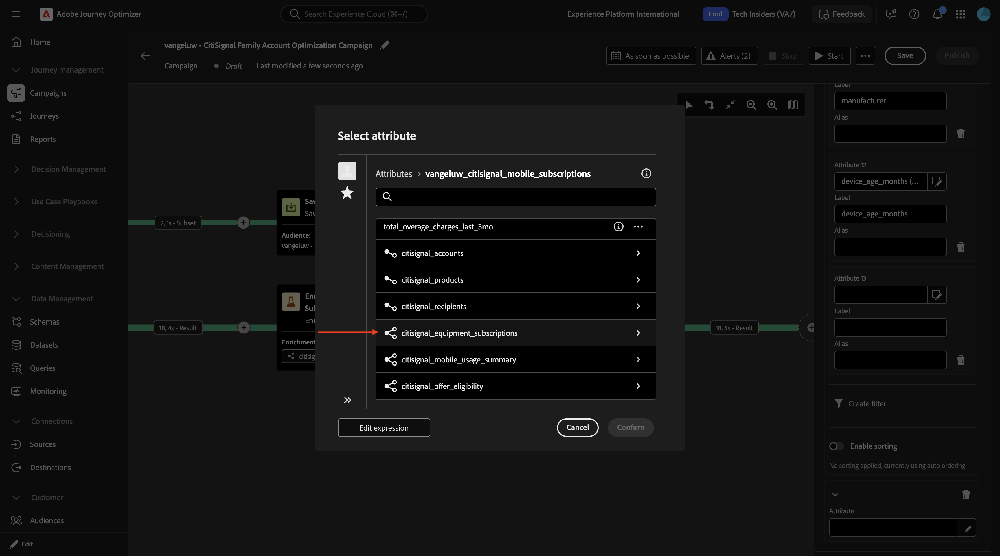

**`trade_in_value`**&#x200B;을(를) 선택하고 **확인**&#x200B;을(를) 클릭합니다.

**특성 추가**&#x200B;를 클릭합니다.

**`citisignal_equipment_subscriptions`**(으)로 드릴다운합니다.

**`monthly_payment`**&#x200B;을(를) 선택하고 **확인**&#x200B;을(를) 클릭합니다.

### 데이터 보강: 모바일 장치 구독

그럼 이걸 드셔보세요 **저장**&#x200B;을 클릭합니다. 그런 다음 **+** 아이콘을 클릭하여 새 노드를 추가하고 **데이터 보강**&#x200B;을(를) 선택합니다.

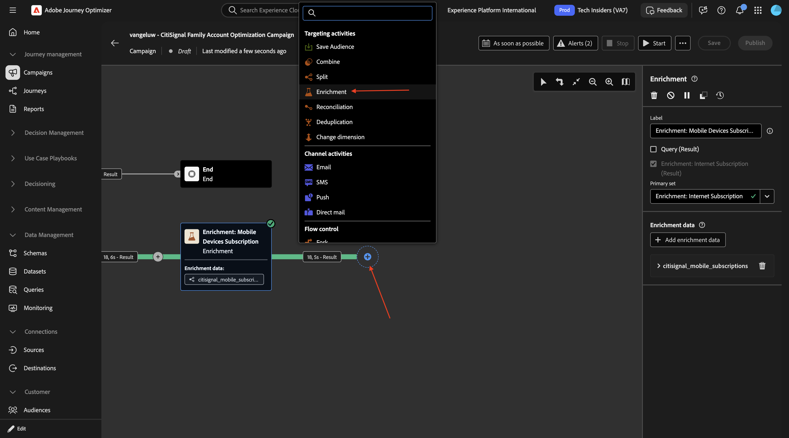

그럼 이걸 보셔야죠 **보강 데이터 추가**&#x200B;를 클릭합니다.

**타깃팅 차원**(으)로 드릴다운합니다.

**`citisignal_offer_eligibility`**(으)로 드릴다운합니다.

**`citisignal_offers`**(으)로 드릴다운합니다.

**`offer_name`**&#x200B;을(를) 선택하고 **확인**&#x200B;을(를) 클릭합니다.

**특성 추가**&#x200B;를 클릭합니다.

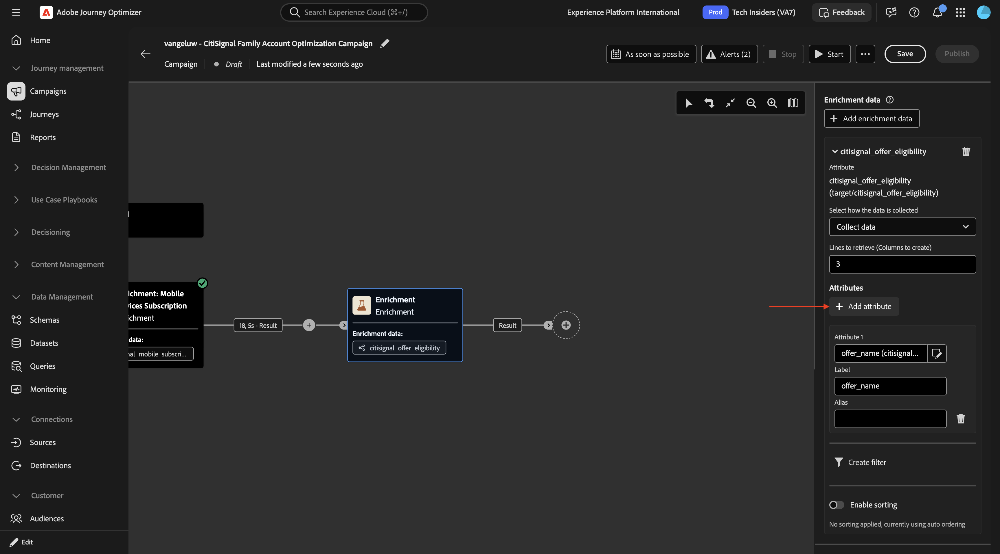

**`citisignal_offers`**(으)로 드릴다운합니다.

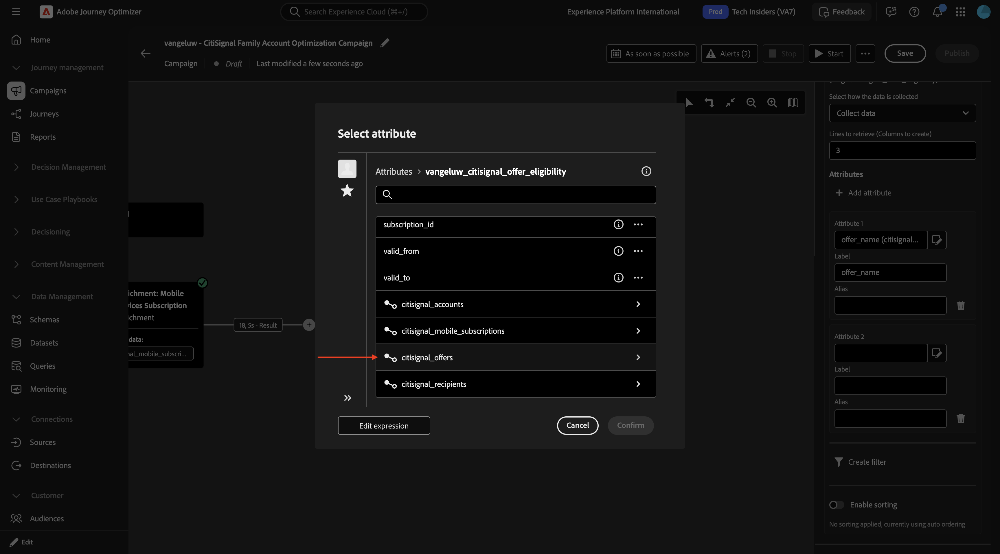

**`offer_code`**&#x200B;을(를) 선택하고 **확인**&#x200B;을(를) 클릭합니다.

**특성 추가**&#x200B;를 클릭합니다.

**`citisignal_offers`**(으)로 드릴다운합니다.

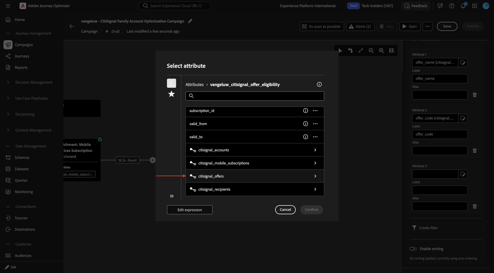

**`offer_description`**&#x200B;을(를) 선택하고 **확인**&#x200B;을(를) 클릭합니다.

**특성 추가**&#x200B;를 클릭합니다.

**`citisignal_offers`**(으)로 드릴다운합니다.

**`offer_description`**&#x200B;을(를) 선택하고 **확인**&#x200B;을(를) 클릭합니다.

**정렬 사용**&#x200B;을 켭니다.

**`citisignal_offers`**(으)로 드릴다운합니다.

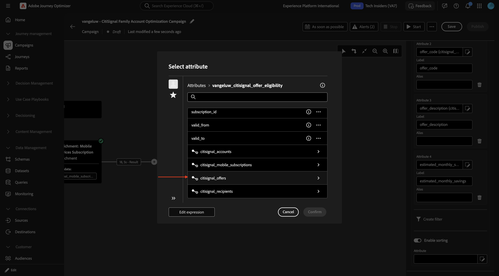

**`offer_priority`**&#x200B;을(를) 선택하고 **확인**&#x200B;을(를) 클릭합니다.

이제 캠페인을 테스트할 수 있습니다. **시작**&#x200B;을 클릭합니다.

시간이 좀 지나면 이걸 볼 수 있을 거야. **결과**&#x200B;를 클릭한 다음 **결과 미리 보기**&#x200B;를 선택합니다.

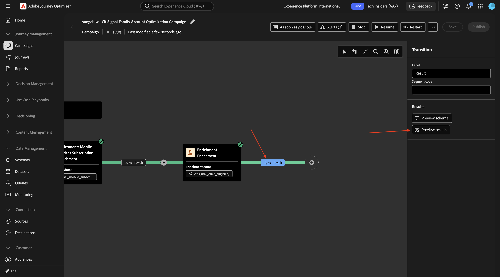

그러면 이와 비슷한 것을 볼 수 있을 겁니다.

### 이메일 활동

**+** 아이콘을 클릭한 다음 **전자 메일**&#x200B;을(를) 선택합니다.

**전자 메일 편집**&#x200B;을 클릭합니다.

**작업**(으)로 이동합니다.

이전에 만든 **전자 메일 채널 구성**&#x200B;을 선택한 다음 **콘텐츠 편집**&#x200B;을 클릭합니다.

**제목 줄**&#x200B;에 대해 다음을 붙여 넣으십시오.

`{{target.--aepUserLdap--_citisignal_recipients.first_name}}, Your CitiSignal Family Account Summary`

**전자 메일 본문 편집**&#x200B;을 클릭합니다.

데스크톱에 [family_account_review.zip](./assets/family_account_review.zip) 파일을 다운로드합니다.

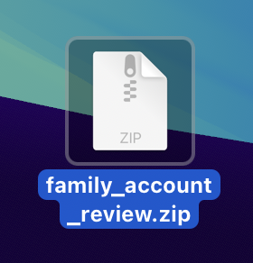

**HTML 가져오기**&#x200B;를 클릭합니다.

을(를) 클릭하여 파일을 선택합니다.

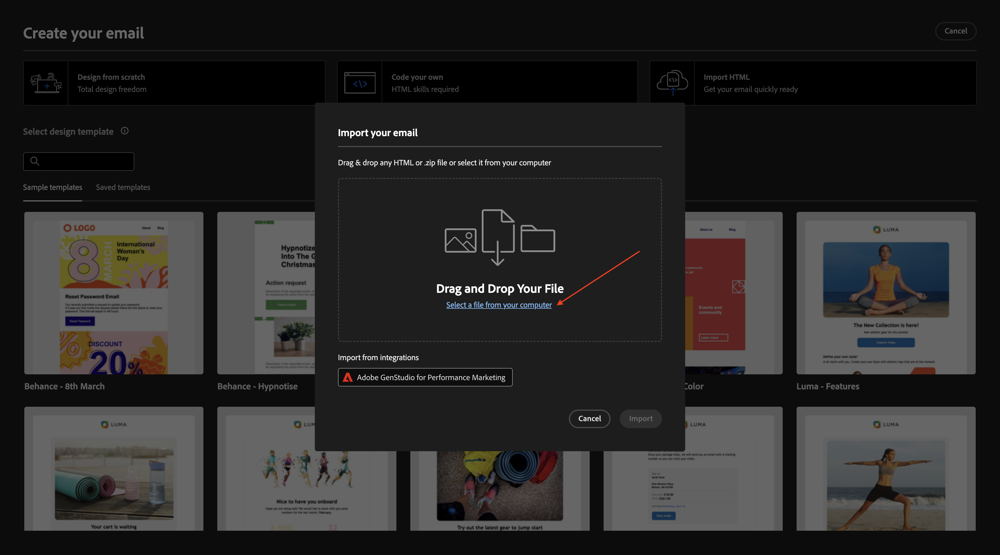

**`family_account_review.zip`** 파일을 선택하십시오.

**다음**&#x200B;을 클릭합니다.

그럼 이걸 보셔야죠

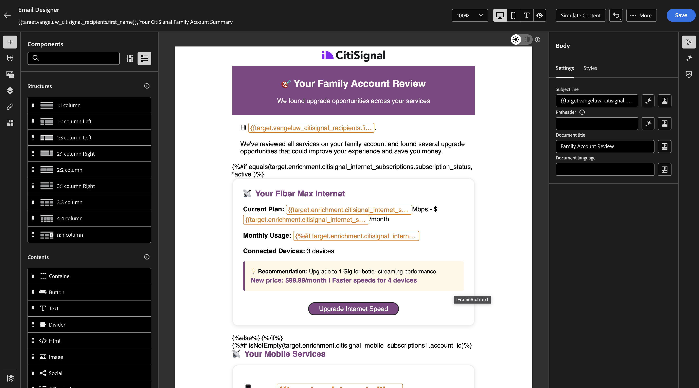

## 다음 단계

[Adobe Journey Optimizer: 오케스트레이션된 캠페인](./ajocampaigns.md){target="_blank"}(으)로 돌아가기

[모든 모듈](./../../../../overview.md){target="_blank"}(으)로 돌아가기
