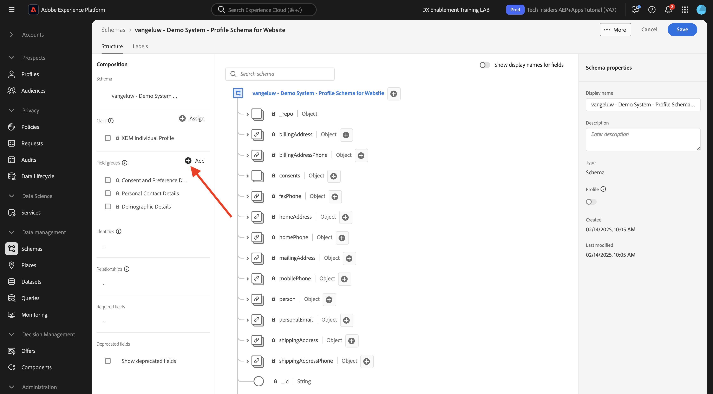
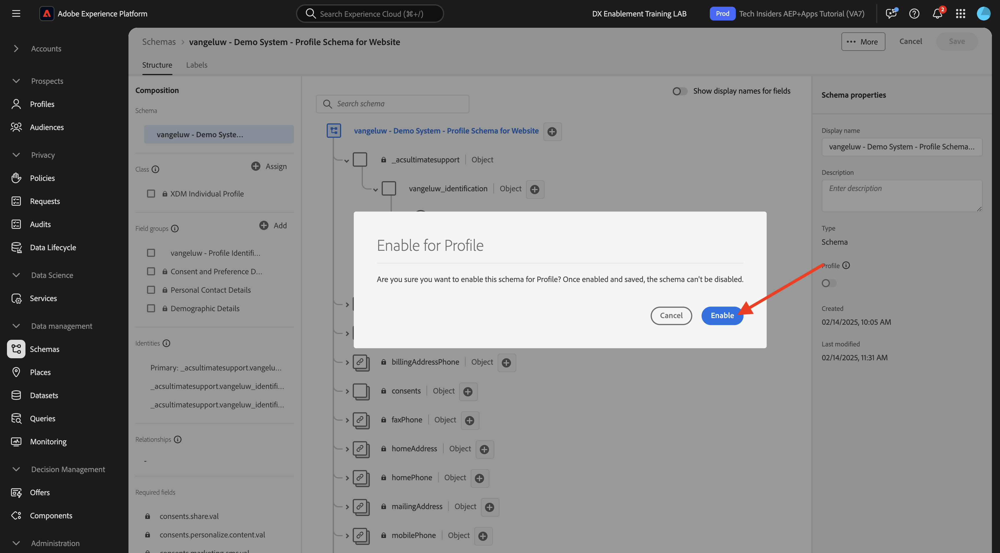

# 1.2.2 스키마 및 식별자 설정 구성

이 연습에서는 프로필 정보 및 고객 행동을 분류하기 위해 필요한 XDM 스키마 구성을 검토합니다. 모든 XDM 스키마에서 기본 식별자가 모든 고객 관련 정보를에 연결하도록 정의된 것도 볼 수 있습니다.

## 스토리

XDM 스키마의 구성 및 식별자 정의를 시작하기 전에 수행할 작업의 비즈니스 컨텍스트에 대해 고려해야 합니다.

- 데이터를 원하는 경우
- 데이터를 고객에 연결하려는 경우
- 점진적 실시간 고객 프로필을 빌드하려는 경우

캡처할 데이터에는 두 가지 유형이 있습니다.

- 이 고객은 누구입니까?
- 이 고객은 어떤 작업을 수행합니까?

그러나 질문 **이 고객은 누구입니까?**&#x200B;은(는) 답변이 많은 매우 개방적인 질문입니다. 조직에서 이 질문에 대한 답변을 보려는 경우 이름, 성 및 주소와 같은 인구 통계학적 정보를 찾고 있습니다. 이메일 주소나 휴대폰 번호와 같은 연락처 정보의 경우도 있습니다. 또한 언어, OptIn/OptOut 및 프로필 사진에도 연결된 정보가 필요할 수 있습니다. 마지막으로, 귀사에서 사용하는 다양한 시스템에서 이 고객을 어떻게 식별해야 하는지 알아야 합니다.

**이 고객은 어떤 일을 하고 있는지 묻는 질문도 마찬가지입니다.** 질문에 답합니다. 그것은 많은 대답이 있는 매우 솔직한 질문이다. 조직에서 이 질문이 답변되는 것을 보려는 경우 고객이 온라인 및 오프라인 속성과 가졌던 상호 작용을 찾고 있습니다. 방문한 페이지 또는 제품 이 고객이 장바구니에 제품을 추가했거나 제품을 구매했습니까? 웹 사이트를 탐색하는 데 사용된 디바이스와 브라우저는 무엇입니까? 이 고객이 원하는 정보는 무엇이며, 이를 사용하여 이 고객에게 쾌적한 경험을 구성하고 제공할 수 있는 방법은 무엇입니까? 마지막으로, 조직이 사용할 다양한 시스템에서 이 고객을 어떻게 식별해야 하는지 알아야 합니다.

## 이 고객은 누구입니까

**이(가) 누구인지에 대한 답변을 캡처하고 있습니다.조직의**&#x200B;은(는) 로그인/등록 페이지를 통해 수행됩니다.

스키마 관점에서는 이것을 **클래스**&#x200B;로 봅니다. 질문: **이 고객은 누구입니까?**&#x200B;은(는) 클래스 **[!UICONTROL XDM 개별 프로필]**&#x200B;에서 정의하는 항목입니다.

**에 대한 답변을 캡처하기 위해 XDM 스키마를 만들 때 이 고객은 누구입니까?**, 우선 클래스 **[!UICONTROL XDM 개별 프로필]**&#x200B;을 참조하는 1개의 스키마를 만들고 정의해야 합니다.

해당 질문에 대한 답변 종류를 지정하려면 [!UICONTROL 필드 그룹]을 정의해야 합니다. [!UICONTROL 필드 그룹]은(는) 프로필 클래스의 확장이며 매우 구체적인 구성을 가집니다. 예를 들어 이름, 성, 성별, 생일 등 인구 통계 정보는 [!UICONTROL 필드 그룹]의 일부입니다. **[!UICONTROL 인구 통계 세부 정보]**.

두 번째로, 조직은 이 고객을 식별하는 방법을 결정해야 합니다. 조직의 경우 알려진 고객의 기본 식별자가 특정 고객 ID(예: 이메일 주소)일 수 있습니다. 그러나 기술적으로, 조직에서 고객을 식별하는 방법에는 휴대폰 번호를 사용하는 것과 같은 다른 방법이 있습니다.
이 실습에서는 이메일 주소를 기본 식별자로 정의하고 전화번호를 보조 식별자로 정의합니다.

마지막으로 데이터가 캡처된 채널을 구분하는 것이 중요합니다. 이 경우 웹 사이트 등록과 정의해야 하는 스키마에 등록 데이터가 캡처된 **where**&#x200B;를 반영해야 합니다. 채널은 또한 캡처되는 데이터에 영향을 미치는 데 중요한 역할을 할 것입니다. 따라서 채널, 기본 식별자 및 수집된 데이터 유형의 모든 조합에 대해 스키마를 정의하는 것이 좋습니다.

위의 사항을 기반으로 Adobe Experience Platform에서 스키마를 만들었습니다.

URL [https://experience.adobe.com/platform](https://experience.adobe.com/platform)로 이동하여 Adobe Experience Platform에 로그인합니다.

로그인하면 Adobe Experience Platform 홈페이지에 접속하게 됩니다.

계속하려면 **샌드박스**&#x200B;를 선택해야 합니다. 선택할 샌드박스 이름이 ``--aepSandboxName--``입니다. 적절한 샌드박스를 선택하면 화면이 변경되고 이제 전용 샌드박스에 있습니다.

Adobe Experience Platform의 화면 왼쪽에 있는 메뉴에서 **[!UICONTROL 스키마]**&#x200B;를 클릭합니다. 사용 가능한 [!UICONTROL 스키마] 목록이 표시됩니다. 새 스키마를 만들어야 합니다. 새 스키마를 만들려면 **[!UICONTROL + 스키마 만들기]**&#x200B;를 클릭합니다.

**수동**&#x200B;을 선택하고 **선택**&#x200B;을 클릭합니다.

그런 다음 **개인 프로필**&#x200B;을 선택하고 **다음**&#x200B;을 클릭합니다.

다음과 같이 스키마 이름을 입력하십시오. `--aepUserLdap-- - Demo System - Profile Schema for Website`. **마침을 클릭합니다**.

이제 새 스키마가 만들어집니다.

이제 **이(가) 누구냐는 질문에 대한 답변을 정의해야 합니다.**은(는) 다음과 같아야 합니다.
이 실습의 소개에서는 고객을 정의하기 위해 다음과 같은 속성이 필요하다는 점에 주목했습니다.

- 이름, 성 및 주소와 같은 인구 통계 정보
- 집 주소, 이메일 주소 또는 휴대폰 번호와 같은 연락처 정보
- 언어, OptIn/OptOut 및 프로필 사진에 연결된 기타 정보.
- 고객의 기본 식별자

해당 정보를 스키마의 일부로 만들려면 스키마에 다음 [!UICONTROL 필드 그룹]을 추가해야 합니다.

- 인구 통계 세부 정보(인구 통계 정보)
- 개인 연락처 세부 정보(연락처 정보)
- 동의 및 환경 설정 세부 정보(기타 정보)
- 조직의 사용자 지정 프로필 식별 필드 그룹(기본 및 보조 식별자)

**필드 그룹** 아래의 **+추가** 단추를 클릭합니다.

**[!UICONTROL 필드 그룹 추가]** 화면에서 [!UICONTROL 필드 그룹] **[!UICONTROL 인구 통계학적 세부 정보]**, **[!UICONTROL 개인 연락처 세부 정보]** 및 **[!UICONTROL 동의 및 환경 설정 세부 정보]**&#x200B;를 선택합니다.

**[!UICONTROL 필드 그룹 추가]** 단추를 클릭하여 [!UICONTROL 필드 그룹]을(를) 스키마에 추가합니다.

이제 다음 항목이 제공됩니다.

그런 다음 데이터 수집에 사용되는 **[!UICONTROL 식별자]**&#x200B;을(를) 캡처하려면 새 [!UICONTROL 필드 그룹]이 필요합니다. 앞의 연습에서 보듯이 식별자의 개념이 있습니다. 기본 식별자는 수집된 모든 데이터가 이 식별자에 연결되므로 가장 중요합니다.

이제 사용자 지정 [!UICONTROL 필드 그룹]을(를) 만듭니다. 따라서 조직의 요구 사항에 맞게 [!UICONTROL XDM 스키마]을(를) 확장합니다.

**필드 그룹** 아래의 **[!UICONTROL + 추가]**&#x200B;를 클릭하여 [!UICONTROL 필드 그룹]을(를) 추가합니다.

기존 [!UICONTROL 필드 그룹]을 다시 사용하는 대신 이제 고유한 [!UICONTROL 필드 그룹]을 만듭니다. **[!UICONTROL 새 필드 그룹 만들기]**&#x200B;를 선택하여 이를 수행할 수 있습니다.

이제 새 [!UICONTROL 필드 그룹]에 **[!UICONTROL 표시 이름]** 및 **[!UICONTROL 설명]**&#x200B;을 제공해야 합니다.

스키마의 이름으로 다음을 사용합니다.
`--aepUserLdap-- - Profile Identification Field Group`

새로 만든 [!UICONTROL 필드 그룹]을 스키마에 추가하려면 **[!UICONTROL 필드 그룹 추가]** 단추를 클릭하십시오.

이제 이 스키마 구조를 갖추게 되었습니다.

새 [!UICONTROL 필드 그룹]이(가) 아직 비어 있으므로 이제 해당 [!UICONTROL 필드 그룹]에 필드를 추가해야 합니다.
[!UICONTROL 필드 그룹] 목록에서 사용자 지정 [!UICONTROL 필드 그룹]을 클릭합니다.

이제 여러 개의 새 버튼이 표시됩니다.

스키마의 최상위 수준에서 **[!UICONTROL + 필드 추가]** 단추를 클릭합니다.

**[!UICONTROL + 필드 추가]** 단추를 클릭하면 이제 스키마에 제목 없는 새 필드가 표시됩니다.

이제 다음 객체 정의를 사용하여 이 새 필드의 정보를 입력해야 합니다.

- 필드 이름: **`--aepUserLdap--_identification`**
- 표시 이름: **`--aepUserLdap--_identification`**
- 유형: **[!UICONTROL 개체]**
- 필드 그룹: **`--aepUserLdap-- - Profile Identification Field Group`**

**적용**&#x200B;을 클릭합니다.

이제 스키마에 Adobe Experience Platform 테넌트 ID의 이름을 딴 사용자 지정 **[!UICONTROL 개체]**&#x200B;를 나타내는 새 개체가 표시됩니다. Adobe Experience Platform 테넌트 ID는 `--aepTenantId--`이며 모든 AEP 인스턴스에 대해 고유합니다.

이제 방금 만든 **ID** 개체의 해당 테넌트 아래에 3개의 새 필드 개체를 추가합니다. 이 3개 필드 중 하나라도 추가하려면 모든 필드에 대해 **식별** 아래의 **+-아이콘**&#x200B;을(를) 클릭하십시오.

아래 정보를 사용하여 **[!UICONTROL ID]** 개체 아래에 세 개의 새 필드를 만드십시오.

- ecid:
   - 필드 이름: **`--aepUserLdap--_ecid`**
   - 표시 이름: **`--aepUserLdap--ecid`**
   - 형식: **[!UICONTROL 문자열]**
   - 필드 그룹: **`--aepUserLdap-- - Profile Identification Field Group`**

- emailId
   - 필드 이름: **`--aepUserLdap--_emailId`**
   - 표시 이름: **`--aepUserLdap--_emailId`**
   - 형식: **[!UICONTROL 문자열]**
   - 필드 그룹: **`--aepUserLdap-- - Profile Identification Field Group`**

- mobilener
   - 필드 이름: **`--aepUserLdap--_mobilenr`**
   - 표시 이름: **`--aepUserLdap--_mobilenr`**
   - 형식: **[!UICONTROL 문자열]**
   - 필드 그룹: **`--aepUserLdap-- - Profile Identification Field Group`**

각 필드는 초기 필드 구성 후 표시되어야 합니다.

- `--aepUserLdap--_mobilenr`

필드를 저장하려면 **[!UICONTROL 적용]** 단추가 표시될 때까지 **[!UICONTROL 필드 속성]**&#x200B;에서 아래로 스크롤하십시오. **[!UICONTROL 적용]** 단추를 클릭합니다.

- `--aepUserLdap--_ecid`

아래로 스크롤하고 **적용**&#x200B;을 클릭하는 것을 잊지 마십시오.

- `--aepUserLdap--_emailId`

아래로 스크롤하고 **적용**&#x200B;을 클릭하는 것을 잊지 마십시오.

각 필드는 유형 **[!UICONTROL 문자열]**(으)로 정의되었으며 이제 이러한 필드를 **[!UICONTROL ID]**(으)로 구성합니다. 이 스키마의 경우 고객은 항상 이메일 주소로 식별된다고 가정해 보겠습니다. 즉, **[!UICONTROL emailId]** 필드를 **[!UICONTROL 기본]** 식별자로 구성하고 다른 필드는 일반 식별자로 구성해야 합니다.

이제 3개 필드를 **[!UICONTROL ID]** 필드로 정의해야 합니다.

이러한 필드를 **[!UICONTROL ID]** 필드로 정의하려면 다음 단계를 수행하십시오.

- 필드 **`--aepUserLdap--_emailId`**&#x200B;을(를) 선택합니다.
- 오른쪽의 필드 속성에서 **[!UICONTROL ID]**&#x200B;이 표시될 때까지 아래로 스크롤합니다. **[!UICONTROL ID]**&#x200B;에 대한 확인란을 선택하십시오.

- 이제 **[!UICONTROL 기본 ID]**&#x200B;에 대한 확인란을 선택하십시오.

- 마지막으로 **[!UICONTROL 네임스페이스]** 목록에서 **[!UICONTROL 전자 메일]** 네임스페이스를 선택하십시오. 네임스페이스 는 Adobe Experience Platform의 ID 그래프에서 네임스페이스에서 식별자를 분류하고 해당 네임스페이스 간의 관계를 정의하는 데 사용됩니다. 변경 내용을 저장하려면 **[!UICONTROL 적용]**&#x200B;을 클릭하세요.

다음으로 **`--aepUserLdap--_ecid`** 및 **`--aepUserLdap--_mobilenr`**&#x200B;에 대한 다른 필드를 표준 식별자로 정의해야 합니다.

필드 **`--aepUserLdap--_ecid`**&#x200B;을(를) 선택합니다. 오른쪽의 필드 속성에서 **[!UICONTROL ID]**&#x200B;이 표시될 때까지 아래로 스크롤합니다. **[!UICONTROL ID]**에 대한 확인란을 선택하십시오.
**[!UICONTROL 네임스페이스]** 목록에서 **[!UICONTROL ECID]** 네임스페이스를 선택합니다.
변경 내용을 저장하려면 **[!UICONTROL 적용]**&#x200B;을 클릭하세요.

필드 **`--aepUserLdap--_mobilenr`**&#x200B;을(를) 선택합니다. 오른쪽의 필드 속성에서 **[!UICONTROL ID]**&#x200B;이 표시될 때까지 아래로 스크롤합니다. **[!UICONTROL ID]**에 대한 확인란을 선택하십시오.
**[!UICONTROL 네임스페이스]** 목록에서 **[!UICONTROL Phone]** 네임스페이스를 선택하십시오.
변경 내용을 저장하려면 **[!UICONTROL 적용]**&#x200B;을 클릭하세요.

이제 **[!UICONTROL ID]** 개체가 이렇게 표시되어야 합니다. 이제 3개의 ID 필드에 식별자로 정의되었음을 나타내는 **[!UICONTROL 지문]** 아이콘도 표시됩니다.

변경 내용을 저장하려면 **[!UICONTROL 저장]**&#x200B;을 클릭하세요.

여기서 마지막으로 수행할 작업은 **[!UICONTROL 프로필]**에 연결할 스키마를 활성화하는 것입니다.
프로필에 대한 스키마를 활성화하면 이 스키마에 대해 Adobe Experience Platform으로 전송되는 모든 데이터가 실시간 고객 프로필 환경의 일부가 되어 쿼리, 세그멘테이션 및 활성화에 해당 데이터를 실시간으로 모두 사용할 수 있게 됩니다.

이렇게 하려면 스키마의 이름을 선택합니다.

스키마의 오른쪽 탭에서 **[!UICONTROL 프로필 전환]**&#x200B;을 클릭합니다(현재 비활성화됨).

[!UICONTROL 프로필] 활성화 - 클릭하여 전환합니다.

프로필에 대해 이 스키마를 활성화하려면 **[!UICONTROL 활성화]**&#x200B;를 클릭하십시오.

이제 스키마가 [!UICONTROL 실시간 고객 프로필]의 일부가 되도록 구성되었습니다. 스키마를 저장하려면 **[!UICONTROL 저장]**&#x200B;을 클릭하세요.

## 이 고객은 어떤 작업을 수행합니까?

**질문에 대한 답변을 캡처하는 중입니다. 이 고객은 어떻게 합니까?조직의**&#x200B;은(는) 예를 들어 제품 페이지의 제품 보기를 통해 수행됩니다.

스키마 관점에서 **[!UICONTROL 클래스]**(으)로 봅니다. 질문: **이 고객의 활동 내용**&#x200B;은(는) **[!UICONTROL ExperienceEvent]** 클래스에서 정의한 것입니다.

[!UICONTROL XDM 스키마]를 만들어 **이(가) 수행하는 작업을 캡처할 때**, 우선 클래스 **[!UICONTROL ExperienceEvent]**&#x200B;을(를) 참조하는 1개의 스키마를 만들고 정의해야 합니다.

해당 질문에 대한 답변 종류를 지정하려면 [!UICONTROL 필드 그룹]을 정의해야 합니다. [!UICONTROL 필드 그룹]은(는) [!UICONTROL ExperienceEvent] 클래스의 확장이며 매우 구체적인 구성을 가집니다. 예를 들어 고객이 장바구니에 보거나 추가한 제품 종류에 대한 정보는 [!UICONTROL 필드 그룹] **Commerce 세부 정보**&#x200B;에 포함되어 있습니다.

두 번째로, 조직은 이 고객의 행동을 어떻게 식별할 것인지 결정해야 합니다. 웹 사이트에서의 상호 작용에 대해 이야기하고 있으므로 조직에서 고객을 알고 있을 수 있지만 알 수 없는 익명 방문자가 웹 사이트에서 활성화되어 있을 수도 있습니다. 따라서 이메일 주소와 같은 식별자는 사용할 수 없습니다. 이 경우 조직은 기본 식별자로 [!UICONTROL ECID(Experience Cloud ID)]을(를) 사용하기로 결정할 수 있습니다.

마지막으로 데이터가 캡처된 채널을 구분하는 것이 중요합니다. 이 경우 웹 사이트 상호 작용 및 정의해야 하는 스키마가 상호 작용 데이터가 캡처된 **where**&#x200B;를 반영해야 합니다. 채널은 또한 캡처되는 데이터에 영향을 미치는 데 중요한 역할을 할 것입니다. 따라서 채널, 기본 식별자 및 수집된 데이터 유형의 모든 조합에 대해 스키마를 정의하는 것이 좋습니다.

위의 사항을 기반으로 Adobe Experience Platform에서 스키마를 구성해야 합니다.

로그인하면 Adobe Experience Platform 홈페이지에 접속하게 됩니다.

계속하려면 **[!UICONTROL 샌드박스]**&#x200B;를 선택해야 합니다. 선택할 [!UICONTROL 샌드박스] 이름이 ``--aepSandboxName--``입니다. 적절한 샌드박스를 선택하면 화면이 변경되고 이제 전용 샌드박스에 있습니다.

Adobe Experience Platform의 화면 왼쪽에 있는 메뉴에서 **[!UICONTROL 스키마]**&#x200B;를 클릭하고 **찾아보기**(으)로 이동합니다. 새 스키마를 만들어야 합니다. 새 스키마를 만들려면 **[!UICONTROL + 스키마 만들기]** 단추를 클릭하십시오.

**수동**&#x200B;을 선택하고 **선택**&#x200B;을 클릭합니다.

**경험 이벤트**&#x200B;를 선택하고 **다음**&#x200B;을 클릭합니다.

스키마 이름을 다음과 같이 입력하십시오. `--aepUserLdap-- - Demo System - Event Schema for Website`. **마침을 클릭합니다**.

새 스키마가 만들어지고 여기에서 수집할 데이터를 구성할 수 있습니다.

이제 **이(가) 수행하는 작업에 대한 답변을 정의해야 합니다.**은(는) 다음과 같아야 합니다.
이 실습의 도입부에서 고객이 수행하는 작업을 정의하기 위해 다음과 같은 속성이 필요하다는 점에 주목했습니다.

- 방문한 페이지 또는 제품
- 이 고객이 장바구니에 제품을 추가했거나 품목을 구매했습니까?
- 웹 사이트를 탐색하는 데 사용된 디바이스와 브라우저는 무엇입니까?
- 이 고객이 원하는 정보는 무엇이며, 이를 사용하여 이 고객에게 쾌적한 경험을 구성하고 제공할 수 있는 방법은 무엇입니까?
- 고객의 기본 식별자

해당 정보를 스키마의 일부로 만들려면 스키마에 다음 [!UICONTROL 필드 그룹]을(를) 추가해야 합니다.

- AEP 웹 SDK 경험 이벤트
- 조직의 사용자 지정 프로필 ID [!UICONTROL 필드 그룹]

**필드 그룹**&#x200B;에서 **+ 추가**&#x200B;를 클릭합니다.

**[!UICONTROL 필드 그룹 추가]** 화면에서 [!UICONTROL 필드 그룹] **[!UICONTROL AEP 웹 SDK ExperienceEvent]**&#x200B;를 선택합니다. **[!UICONTROL 필드 그룹 추가]**&#x200B;를 클릭합니다.

그러면 다음 항목이 제공됩니다.

그런 다음 데이터 수집에 사용되는 **[!UICONTROL 식별자]**&#x200B;를 캡처하려면 새 [!UICONTROL 필드 그룹]을(를) 만들어야 합니다.

이제 사용자 지정 [!UICONTROL 필드 그룹]을(를) 만듭니다. 따라서 조직의 요구 사항에 맞게 [!UICONTROL XDM 스키마]을(를) 확장합니다.

[!UICONTROL 필드 그룹]이(가) [!UICONTROL 클래스]에 연결되어 있으므로 이전에 만든 [!UICONTROL 필드 그룹]을(를) 다시 사용할 수 없습니다.

**[!UICONTROL + 추가]** 단추를 클릭하여 [!UICONTROL 필드 그룹] 추가를 시작합니다.

기존 [!UICONTROL 필드 그룹]을 다시 사용하는 대신 이제 고유한 [!UICONTROL 필드 그룹]을 만듭니다. **[!UICONTROL 새 필드 그룹 만들기]**&#x200B;를 선택하고 다음과 같이 필드 그룹의 이름을 입력하십시오. `--aepUserLdap-- - ExperienceEvent Identification Field Group`.
**필드 그룹 추가** 클릭

이제 이 [!UICONTROL 스키마] 구조를 사용해야 합니다.

새 [!UICONTROL 필드 그룹]이(가) 아직 비어 있으므로 이제 해당 필드 그룹에 필드를 추가해야 합니다.
[!UICONTROL 필드 그룹] 목록에서 사용자 지정 [!UICONTROL 필드 그룹]을 클릭합니다.

이제 여러 개의 새 버튼이 표시됩니다.

스키마의 최상위 수준에서 스키마 - 이름 옆에 있는 **[!UICONTROL +]** 단추를 클릭합니다.

**+** 단추를 클릭하면 이제 스키마에 제목 없는 새 필드가 표시됩니다.

새 필드를 정의할 때 사용합니다.

- 필드 이름: **`--aepUserLdap--_identification`**
- 표시 이름: **`--aepUserLdap--_identification`**
- 유형: **[!UICONTROL 개체]**
- 필드 그룹: `--aepUserLdap-- - ExperienceEvent Identification Field Group`

**적용**&#x200B;을 클릭합니다.

이제 새 필드가 Adobe Experience Platform 테넌트 ID에 만들어집니다. Adobe Experience Platform 테넌트 ID는 `--aepTenantId--`입니다.

이제 **[!UICONTROL ID]** 개체 아래에 1개의 새 필드를 추가합니다.

새 필드를 만들려면 **[!UICONTROL 식별]** 개체 옆에 있는 **[!UICONTROL +]** 단추를 클릭하십시오.

ECID 필드는 유형 **[!UICONTROL 문자열]**(으)로 정의되며 이 필드는 **[!UICONTROL ID]**(으)로 구성됩니다. 스키마 **[!UICONTROL 데모 시스템 - 웹 사이트에 대한 이벤트 스키마]**&#x200B;의 경우 고객은 항상 [!UICONTROL ECID]로 식별된다고 가정합니다. 즉, **[!UICONTROL ECID]** 필드를 **기본** 식별자로 구성해야 합니다

이제 빈 필드가 있습니다. 위 필드를 표시된 대로 구성해야 합니다.

- ecid:

   - 필드 이름: **`--aepUserLdap--_ecidweb`**
   - 표시 이름: **`--aepUserLdap--_ecidweb`**
   - 형식: **[!UICONTROL 문자열]**
   - 필드 그룹: `--aepUserLdap-- - ExperienceEvent Identification Field Group`

다음은 초기 필드 구성 후 `--aepUserLdap--_ecidweb` 필드가 표시되는 방식입니다.

아래로 스크롤하여 **[!UICONTROL 적용]**&#x200B;을 클릭합니다.

이제 새 필드가 있지만 이 필드는 아직 **[!UICONTROL ID]** 필드로 정의되지 않았습니다.

이러한 필드를 **[!UICONTROL ID]** 필드로 정의하려면 **`--aepUserLdap--_ecidweb`** 필드를 선택하십시오.
오른쪽의 필드 속성에서 **[!UICONTROL ID]**&#x200B;이 표시될 때까지 아래로 스크롤합니다. **[!UICONTROL ID]**&#x200B;에 대한 확인란을 선택하고 **[!UICONTROL 기본 ID]**에 대한 확인란을 선택합니다.
**[!UICONTROL 네임스페이스]** 목록에서 **[!UICONTROL ECID]** 네임스페이스를 선택합니다.

변경 내용을 저장하려면 **[!UICONTROL 적용]**&#x200B;을 클릭하세요.

이제 **[!UICONTROL ID]** 개체가 이렇게 표시되어야 합니다. 이제 ecid 필드에 식별자로 정의되었음을 나타내는 **지문** 아이콘도 표시됩니다.
변경 내용을 저장하려면 **[!UICONTROL 저장]**&#x200B;을 클릭하세요.

결국 이 스키마에 대해 데이터를 수집할 때 일부 필드가 필요합니다.
예를 들어 필드 **[!UICONTROL _id]** 및 **[!UICONTROL 타임스탬프]**&#x200B;은(는) 필수 필드이며, 이는 ExperienceEvent 클래스에서 지정한 요구 사항입니다.

- _id에는 특정 데이터 수집을 위한 고유 id가 포함되어야 합니다.
- 타임스탬프는 **`"YYYY-MM-DDTHH:MM:SSSZ"`** 형식의 이 히트의 타임스탬프이어야 합니다(예: **`"2024-11-18T07:20:000Z"`**).

이제 스키마를 정의하고, 기존 및 새로 만든 [!UICONTROL 필드 그룹]에 연결했으며, 식별자를 정의했습니다.

여기서 마지막으로 수행할 작업은 **[!UICONTROL 프로필]**에 연결할 스키마를 활성화하는 것입니다.
[!UICONTROL 프로필]에 대한 스키마를 활성화하면 이 스키마에 대해 Adobe Experience Platform으로 전송되는 모든 데이터가 실시간 고객 프로필의 일부가 되어 실시간으로 쿼리, 세분화 및 활성화에 사용될 수 있게 됩니다.

이렇게 하려면 스키마 이름을 클릭합니다.

스키마의 오른쪽 탭에 현재 비활성화되어 있는 **[!UICONTROL 프로필] 전환**&#x200B;이 표시됩니다. 활성화하려면 [!UICONTROL 프로필] - 전환을 클릭하십시오.

이 메시지가 표시됩니다. 프로필에 대해 이 스키마를 활성화하려면 **[!UICONTROL 활성화]**&#x200B;를 클릭하십시오.

이제 스키마가 실시간 고객 프로필의 일부가 되도록 구성되었습니다.

스키마를 저장하려면 **[!UICONTROL 저장]**&#x200B;을 클릭하세요.

이제 실시간 고객 프로필에서 사용하도록 활성화된 스키마를 빌드했습니다.

다음 연습에서는 데이터 세트를 살펴보겠습니다.

## 다음 단계

[1.2.3 데이터 세트 구성](./ex3.md){target="_blank"}(으)로 이동

[데이터 수집](./data-ingestion.md){target="_blank"}으로 돌아가기

[모든 모듈](./../../../../overview.md){target="_blank"}(으)로 돌아가기
