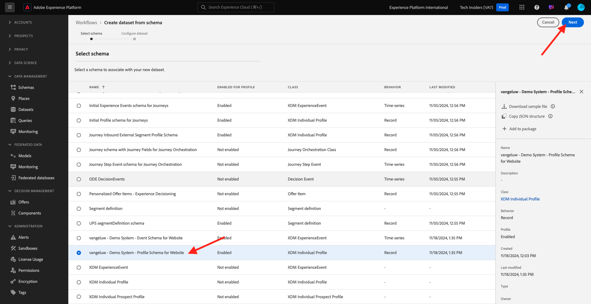
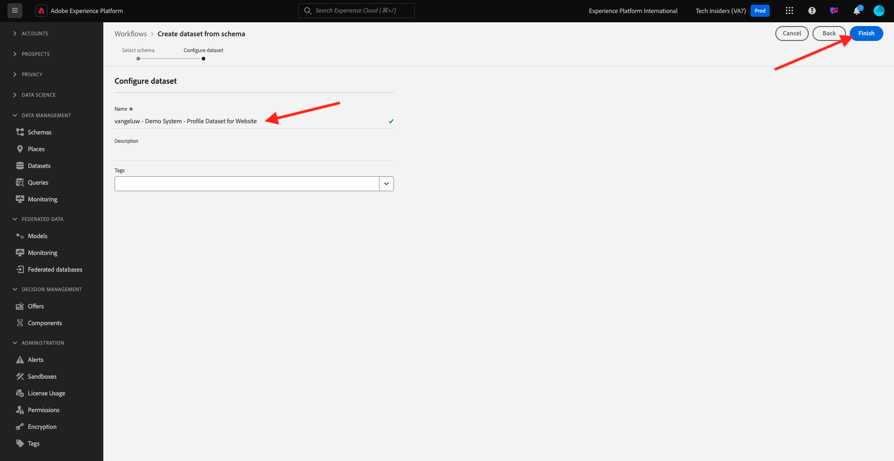

# 1.2.3 데이터 세트 구성

이 연습에서는 프로필 정보 및 고객 행동을 캡처하고 저장하도록 데이터 세트를 구성합니다. 여기에서 만드는 모든 데이터 세트는 이전 단계에서 빌드한 스키마 중 하나를 사용합니다.

## 컨텍스트

**질문에 대한 답변을 정의한 후 이 고객은 누구입니까?** 및 **이 고객은 어떤 작업을 합니까?**&#x200B;은(는) 다음과 같아야 합니다. 이제 해당 정보를 사용하는 버킷을 만들어 Adobe Experience Platform으로 전송된 데이터를 받고 유효성을 검사해야 합니다.

## 데이터 세트 만들기

이제 2개의 데이터 세트를 만들어야 합니다.

- **에 답변하는 정보를 캡처할 데이터 세트 1개** - 질문.
- **에 답변하는 정보를 캡처할 데이터 세트 1개** - 질문.

URL [https://experience.adobe.com/platform](https://experience.adobe.com/platform)로 이동하여 Adobe Experience Platform에 로그인합니다.

로그인하면 Adobe Experience Platform 홈페이지에 접속하게 됩니다.

계속하려면 **[!UICONTROL 샌드박스]**&#x200B;를 선택해야 합니다. 선택할 샌드박스 이름이 ``--aepSandboxName--``입니다. 적절한 [!UICONTROL 샌드박스]를 선택하면 화면이 변경되고 이제 전용 [!UICONTROL 샌드박스]에 있게 됩니다.

Adobe Experience Platform의 화면 왼쪽에 있는 메뉴에서 **[!UICONTROL 데이터 세트]**&#x200B;를 클릭합니다.  그러면 다음과 같은 결과가 표시됩니다.

먼저 웹 사이트 등록 정보를 캡처하기 위한 데이터 세트를 만들어 보겠습니다.

새 데이터 세트를 만들어야 합니다. 새 데이터 집합을 만들려면 **[!UICONTROL + 데이터 집합 만들기]** 단추를 클릭하십시오.

이전 단계에서 정의한 스키마에서 데이터 세트를 정의해야 합니다. **[!UICONTROL 스키마에서 데이터 집합 만들기]** - 옵션을 클릭합니다.

다음 화면에서는 1, `--aepUserLdap-- - Demo System - Profile Schema for Website`에서 만든 스키마를 선택해야 합니다.

**다음**&#x200B;을 클릭합니다.

데이터 세트에 이름을 지정하겠습니다.

데이터 세트의 이름으로 다음을 사용합니다.

`--aepUserLdap-- - Demo System - Profile Dataset for Website`

**마침을 클릭합니다**.

이제 다음이 표시됩니다.

[!UICONTROL 데이터 세트] 개요로 돌아갑니다. 이제 만든 데이터 세트가 개요에 표시됩니다.

그런 다음 웹 사이트 상호 작용을 캡처하도록 두 번째 데이터 세트를 구성합니다.

**[!UICONTROL + 데이터 집합 만들기]**&#x200B;를 클릭합니다.

이전 단계에서 정의한 스키마에서 데이터 세트를 정의해야 합니다. **[!UICONTROL 스키마에서 데이터 집합 만들기]** - 옵션을 클릭합니다.

다음 화면에서는 이전에 만든 스키마 `--aepUserLdap-- - Demo System - Event Schema for Website`을(를) 선택해야 합니다.

**다음**&#x200B;을 클릭합니다.

데이터 세트에 이름을 지정하겠습니다.

데이터 세트의 이름으로 다음을 사용하십시오.

`--aepUserLdap-- - Demo System - Event Dataset for Website`

**마침을 클릭합니다**.

그러면 다음과 같은 결과가 표시됩니다.

[!UICONTROL 데이터 세트] 개요 화면으로 돌아갑니다.

이제 데이터 세트가 Adobe Experience Platform의 실시간 고객 프로필에 포함되도록 활성화해야 합니다.

데이터 집합 `--aepUserLdap-- - Demo System - Profile Dataset for Website`을(를) 클릭하여 엽니다.

화면 오른쪽에서 [!UICONTROL 프로필] 전환 아이콘을 찾습니다.
[!UICONTROL 프로필] 전환을 클릭하여 [!UICONTROL 프로필]에 대해 이 데이터 세트를 사용하도록 설정합니다.

**[!UICONTROL 사용]**&#x200B;을 클릭합니다.

이제 데이터 세트가 [!UICONTROL 프로필]에 대해 활성화됩니다.

데이터 세트 개요로 돌아가 웹 사이트용 데이터 세트 `--aepUserLdap-- - Demo System - Event Dataset`을(를) 클릭하여 엽니다.

화면 오른쪽에서 [!UICONTROL 프로필] 전환 아이콘을 찾습니다. [!UICONTROL 프로필] 전환을 클릭하여 [!UICONTROL 프로필]을(를) 활성화합니다.

**[!UICONTROL 사용]**&#x200B;을 클릭합니다.

이제 데이터 세트가 [!UICONTROL 프로필]에 대해 활성화됩니다.

## 다음 단계

오프라인 원본에서 [1.2.4 데이터 수집](./ex4.md){target="_blank"}(으)로 이동

[데이터 수집](./data-ingestion.md){target="_blank"}으로 돌아가기

[모든 모듈](./../../../../overview.md){target="_blank"}(으)로 돌아가기
