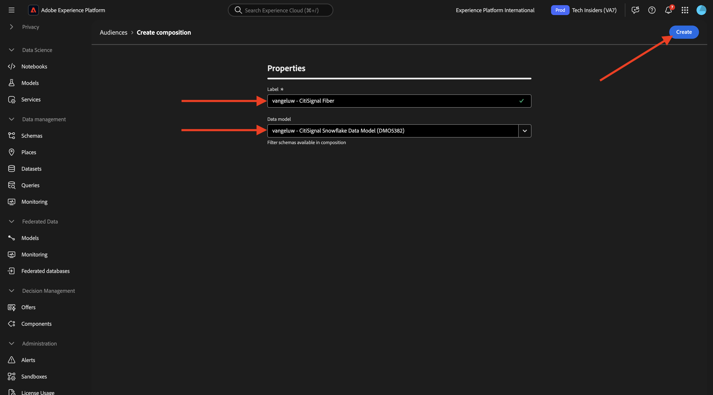
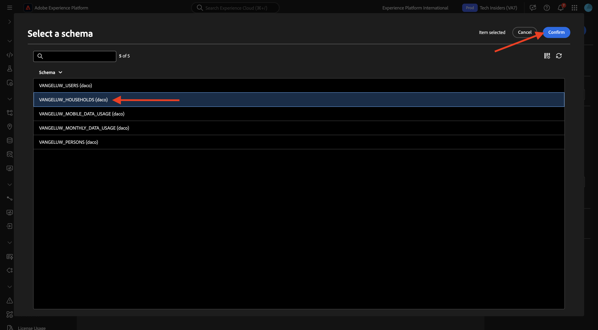
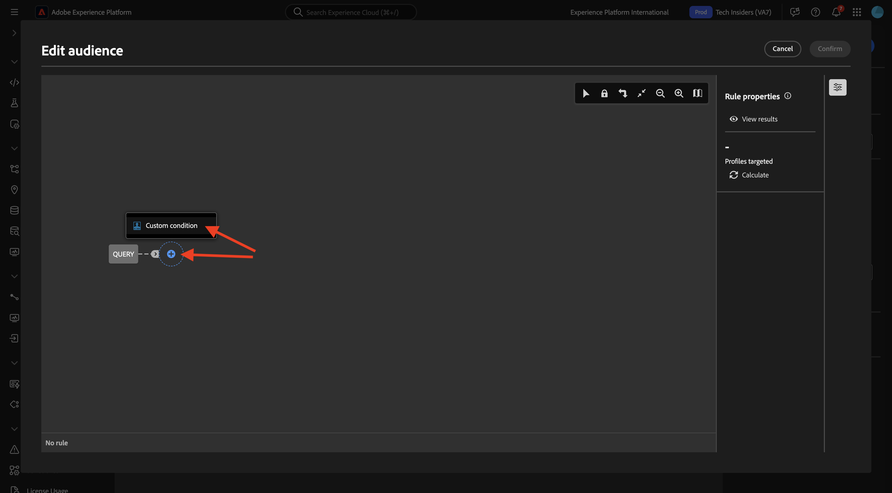
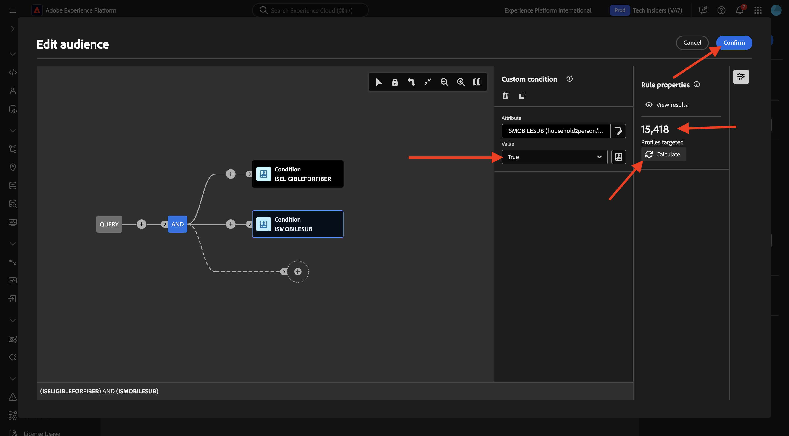
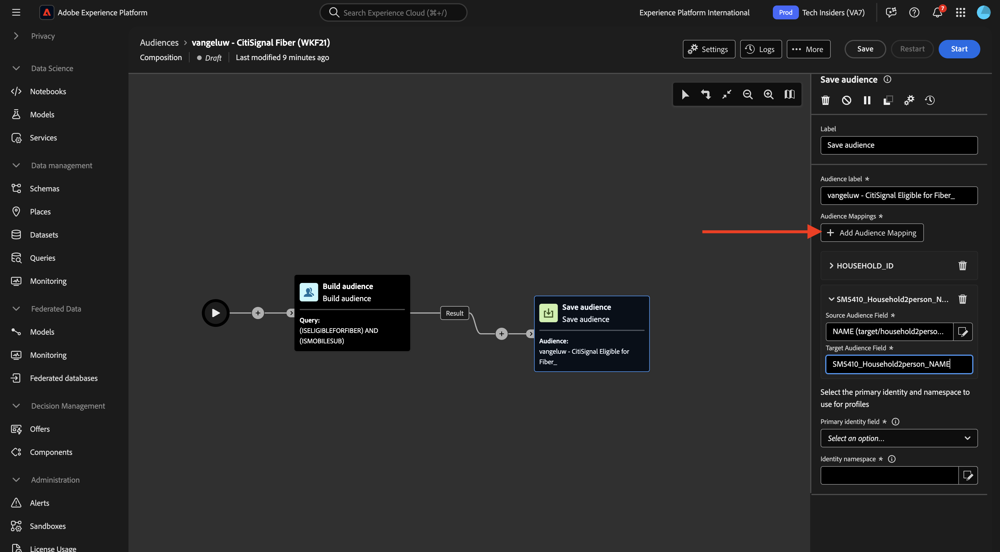

# 1.3.3 통합 컴포지션 만들기

이제 AEP에서 통합 대상 구성을 구성할 수 있습니다.

URL [https://experience.adobe.com/platform](https://experience.adobe.com/platform)로 이동하여 Adobe Experience Platform에 로그인합니다.

로그인하면 Adobe Experience Platform 홈페이지에 접속하게 됩니다.

계속하려면 **샌드박스**&#x200B;를 선택해야 합니다. 선택할 샌드박스 이름이 ``--aepSandboxName--``입니다. 적절한 샌드박스를 선택하면 화면이 변경되고 이제 전용 샌드박스에 있습니다.

## 1.3.3.1 대상자 만들기

왼쪽 메뉴에서 **대상**(으)로 이동한 다음 **통합 구성**(으)로 이동합니다. **컴포지션 만들기**&#x200B;를 클릭합니다.

레이블에는 `--aepUserLdap-- - CitiSignal Fiber`을(를) 사용합니다. 이전 연습에서 만든 데이터 모델을 선택하십시오(`--aepUserLdap-- - CitiSignal Snowflake Data Model`). **만들기**&#x200B;를 클릭합니다.

그러면 이걸 보게 될 거야.

**+** 아이콘을 클릭하고 **대상자 빌드**&#x200B;를 클릭합니다.

그러면 이걸 보게 될 거야. **대상 만들기**&#x200B;를 선택합니다. 스키마를 선택하려면 **검색** 아이콘을 클릭하십시오.

스키마 **—aepUserLdap—_POPULATIONS**&#x200B;을(를) 선택하십시오. **확인**&#x200B;을 클릭합니다.

그런 다음 **계속**&#x200B;을 클릭합니다.

이제 Snowflake으로 전송할 쿼리 작성을 시작할 수 있습니다. **+** 아이콘을 클릭한 다음 **사용자 지정 조건**&#x200B;을 클릭합니다.

**ISELIGIBLEFORFIBER** 특성을 선택합니다. **확인**&#x200B;을 클릭합니다.

그러면 이걸 보게 될 거야. 필드 **Value**&#x200B;을(를) **True**(으)로 설정합니다. 쿼리를 Snowflake으로 푸시하고 현재 자격을 갖춘 예상 프로필을 얻으려면 **계산**&#x200B;을 클릭하세요.

그런 다음 **+** 아이콘을 다시 클릭하고 **사용자 지정 조건**&#x200B;을 다시 클릭하여 다른 조건을 추가합니다.

추가할 두 번째 조건은 `Is the user an existing CitiSignal Mobile subscriber?`입니다. 이 질문에 답변하는 방법은 다른 테이블 **—aepUserLdap—_PERSONS**&#x200B;에 정의된 가정과 가정의 기본 고객 간의 관계를 사용하는 것입니다. **household2person** 링크를 사용하여 특성 메뉴에서 드릴다운할 수 있습니다.

**ISMOBILESUB** 특성을 선택하고 **확인**&#x200B;을 클릭합니다.

필드 **Value**&#x200B;을(를) **True**(으)로 설정합니다. 타겟팅할 프로필 수를 업데이트하려면 **계산**&#x200B;을(를) 다시 클릭합니다. **확인**&#x200B;을 클릭합니다.

**+** 아이콘을 클릭한 다음 **대상자 저장**&#x200B;을 클릭합니다.

**대상 레이블**&#x200B;을(를) `--aepUserLdap-- - CitiSignal Eligible for Fiber`(으)로 설정합니다.

**+ 대상 매핑 추가**&#x200B;를 클릭합니다.

**HOUSEHOLD_ID**&#x200B;을(를) 선택하고 **확인**&#x200B;을 클릭합니다.

**+ 대상 매핑 추가**&#x200B;를 클릭합니다.

**타깃팅 차원**&#x200B;을 클릭하여 드릴다운합니다.

**household2person** 링크를 클릭하여 드릴다운합니다.

필드 **이름**&#x200B;을(를) 선택하십시오. **확인**&#x200B;을 클릭합니다.

**+ 대상 매핑 추가**&#x200B;를 클릭합니다.

**타깃팅 차원**&#x200B;을 클릭하여 드릴다운합니다.

**household2person** 링크를 클릭하여 드릴다운합니다.

필드 **전자 메일**&#x200B;을(를) 선택하십시오. **확인**&#x200B;을 클릭합니다.

그러면 이걸 보게 될 거야. 이제 **기본 ID 필드**&#x200B;을(를) 설정하고 **Household2person_EMAIL**(으)로 설정해야 합니다. **ID 네임스페이스**&#x200B;을(를) **전자 메일**(으)로 설정합니다.

**저장**&#x200B;을 클릭합니다.

작성이 완료되었습니다. 실행하려면 **시작**&#x200B;을 클릭하세요.

이제 쿼리를 Snowflake으로 푸시하고 여기에서 소스 데이터를 쿼리합니다. 결과는 AEP로 다시 푸시되지만 소스 데이터는 Snowflake에 유지됩니다.

이제 대상이 채워지고 AEP 생태계 내에서 대상을 타깃팅할 수 있습니다.

## 다음 단계

[요약 및 혜택](./summary.md){target="_blank"}(으)로 이동

[Federated Audience Composition](./fac.md){target="_blank"}(으)로 돌아가기

[모든 모듈](./../../../../overview.md){target="_blank"}(으)로 돌아가기
