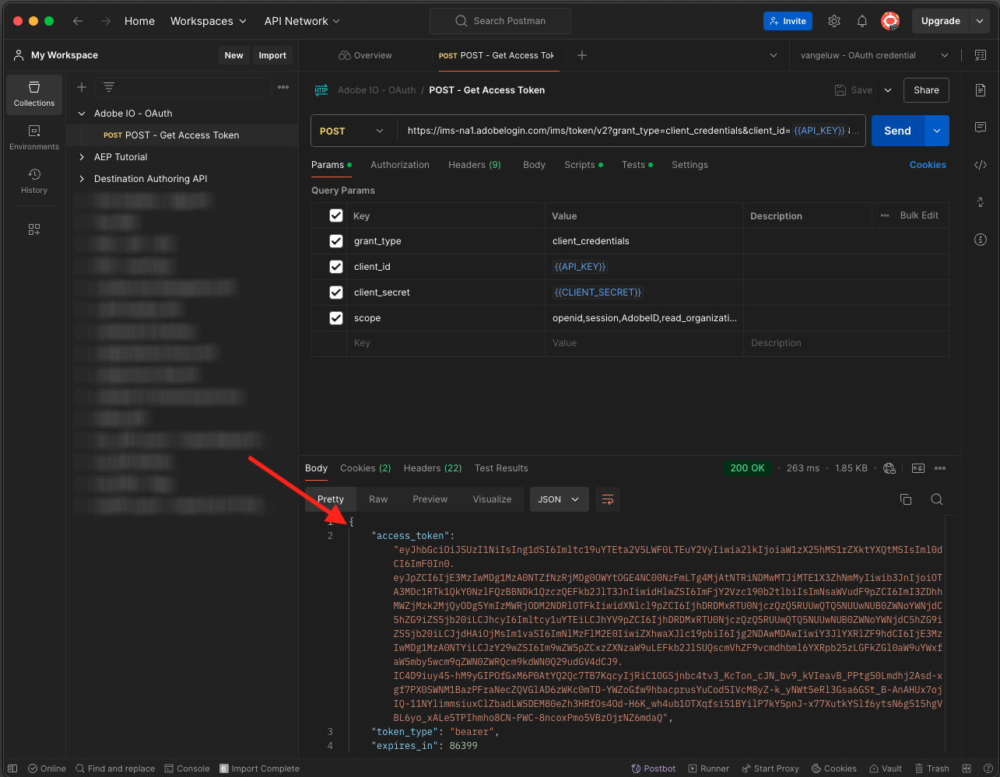
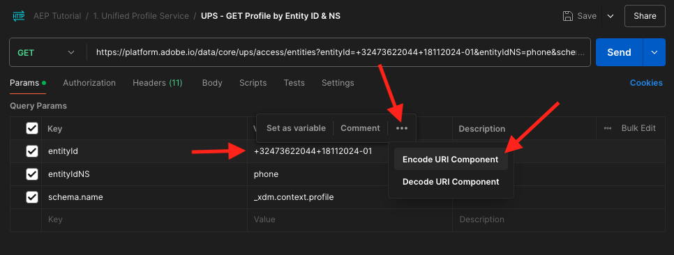
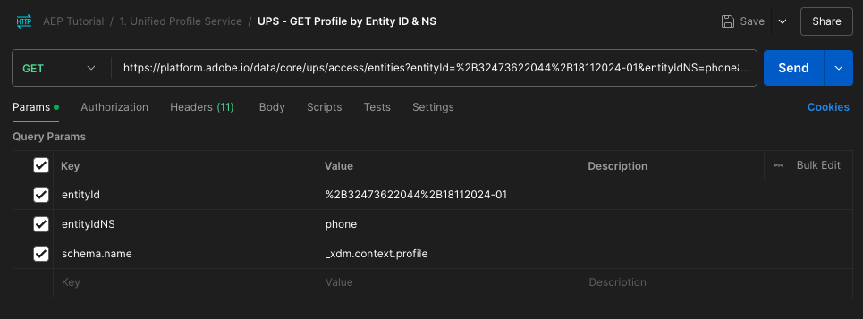

# 2.1.3 자신의 실시간 고객 프로필 시각화 - API

이 연습에서는 Postman 및 Adobe I/O을 사용하여 Adobe Experience Platform의 API를 쿼리하여 자신의 실시간 고객 프로필을 봅니다.

## 컨텍스트

실시간 고객 프로필에는 모든 프로필 데이터가 기존 대상 멤버십은 물론 이벤트 데이터와 함께 표시됩니다. 표시되는 데이터는 Adobe 애플리케이션 및 외부 솔루션에서 어디에서나 가져올 수 있습니다. 이것은 기록의 경험 시스템인 Adobe Experience Platform에서 가장 강력한 보기입니다.

실시간 고객 프로필은 모든 Adobe 애플리케이션에서 사용할 수 있으며, 콜 센터나 매장 클라이언트 앱과 같은 외부 솔루션에서도 사용할 수 있습니다. 이렇게 하는 방법은 이러한 외부 솔루션을 Adobe Experience Platform의 API에 연결하는 것입니다.

## 내 식별자

웹 사이트의 프로필 뷰어 패널에서 여러 ID를 찾을 수 있습니다. 모든 ID는 네임스페이스에 연결됩니다.


X-ray 패널에서 ID와 네임스페이스의 4가지 다른 조합을 볼 수 있습니다.

| ID | 네임스페이스 |
|:-------------:| :---------------:|
| Experience Cloud ID (ECID) | 79943948563923140522865572770524243489 |
| Experience Cloud ID (ECID) | 70559351147248820114888181867542007989 |
| 이메일 ID | woutervangeluwe+18112024-01@gmail.com |
| 모바일 번호 ID | +32473622044+18112024-01 |

다음 단계를 위해 이러한 식별자를 기억하십시오.

## Adobe I/O 프로젝트 구성

이 연습에서는 Adobe I/O을 상당히 집중적으로 사용하여 Platform의 API에 대해 쿼리합니다. Adobe I/O을 설정하려면 아래 단계를 따르십시오.

[https://developer.adobe.com/console/home](https://developer.adobe.com/console/home)(으)로 이동


화면 오른쪽 상단에서 올바른 Adobe Experience Platform 인스턴스를 선택해야 합니다. 인스턴스는 `--aepImsOrgName--`입니다. **새 프로젝트 만들기**&#x200B;를 클릭합니다.


**+ 프로젝트에 추가**&#x200B;를 선택하고 **API**&#x200B;를 선택합니다.


그러면 다음과 같은 결과가 표시됩니다.


**Experience Platform API**&#x200B;를 선택하고 **다음**&#x200B;을(를) 클릭합니다.


이제 이 항목을 볼 수 있습니다. 자격 증명의 이름을 지정하십시오. `--aepUserLdap-- - OAuth credential`. **다음**&#x200B;을 클릭합니다.


그런 다음 이 통합에 사용할 수 있는 권한을 정의할 제품 프로필을 선택해야 합니다.

필요한 제품 프로필을 선택합니다.

>[!NOTE]
>
> 제품 프로필 이름은 인스턴스별로 다르므로 Adobe Experience Platform 인스턴스에서 달라집니다. Adobe Admin Console 및 AEP 권한 UI에 설정된 적절한 액세스 권한이 있는 제품 프로필을 하나 이상 선택해야 합니다.

**구성된 API 저장**&#x200B;을 클릭합니다.


이제 Adobe I/O 통합이 준비되었습니다.


**Postman용 다운로드** 단추를 클릭한 다음 **OAuth 서버-서버**&#x200B;를 클릭하여 Postman 환경을 다운로드합니다(환경이 다운로드될 때까지 기다리십시오. 2초 정도 소요될 수 있습니다).


현재 IO 프로젝트에 일반 이름이 있습니다. 통합에 친숙한 이름을 지정해야 합니다. 표시된 대로 **프로젝트 X**(또는 유사한 이름)을 클릭합니다.


**프로젝트 편집**&#x200B;을 클릭합니다.


통합의 이름 및 설명을 입력하십시오. `--aepUserLdap-- AEP Tutorial`.

**저장**&#x200B;을 클릭합니다.


이제 Adobe I/O 통합이 완료되었습니다.


>[!NOTE]
>
>이 Adobe I/O 프로젝트가 Adobe Experience Platform의 권한 설정에 액세스할 수 있도록 하는 추가 단계가 있습니다. 프로젝트의 API 자격 증명을 시스템 관리자 액세스 권한이 필요한 Adobe Experience Platform의 권한 UI에 추가해야 합니다. 단계는 아래에 설명되어 있지만 필요한 액세스 권한이 없는 경우 시스템 관리자에게 문의하여 이를 처리해야 할 수 있습니다.

## API 자격 증명에 대한 AEP 권한

>[!IMPORTANT]
>
>시스템 관리자 액세스 권한이 없는 경우 직접 이 단계를 실행할 수 없으며 **권한** UI에 액세스할 수 있는 권한이 없습니다. 이 경우 시스템 관리자에게 문의하거나 조직의 지원 채널에 질문을 게시하십시오.

[Adobe Experience Platform](https://experience.adobe.com/platform)(으)로 이동합니다. 로그인하면 Adobe Experience Platform 홈페이지에 접속하게 됩니다.

**권한**, **역할**(으)로 이동한 다음 관련 제품 프로필을 클릭합니다.

>[!NOTE]
>
> 제품 프로필 이름은 인스턴스별로 다르므로 Adobe Experience Platform 인스턴스에서 달라집니다. Adobe Admin Console 및 AEP 권한 UI에 설정된 적절한 액세스 권한이 있는 제품 프로필을 하나 이상 선택해야 합니다.


**API 자격 증명**&#x200B;을 클릭합니다.


**+ API 자격 증명 추가**&#x200B;를 클릭합니다.


새로 만든 Adobe I/O 프로젝트를 선택하고 **저장**&#x200B;을 클릭합니다.


## Adobe I/O 인증

>[!IMPORTANT]
>
>Adobe 직원의 경우 [PostBuster](./../../../../modules/getting-started/gettingstarted/ex8.md)을(를) 사용하려면 여기 지침을 따르십시오.

[https://www.postman.com/downloads/](https://www.postman.com/downloads/)(으)로 이동합니다.

OS용 Postman의 관련 버전을 다운로드하여 설치합니다.


Postman 설치 후 애플리케이션을 시작합니다.

Postman에는 환경과 컬렉션의 두 가지 개념이 있습니다.

- 환경에는 거의 일관되지 않은 모든 환경 변수가 포함되어 있습니다. 환경에서는 개인 키 및 기타 같은 보안 자격 증명과 함께 플랫폼 환경의 IMSOrg와 같은 것을 찾을 수 있습니다. 환경 파일은 이전 연습에서 Adobe I/O 설정 중에 다운로드한 파일로, 이름은 **`oauth_server_to_server.postman_environment.json`**&#x200B;입니다.

- 컬렉션에는 사용할 수 있는 여러 API 요청이 포함되어 있습니다. 2개의 컬렉션을 사용합니다.
   - Adobe I/O 인증을 위한 1개 컬렉션
   - 이 단원의 연습에 대한 컬렉션 1개
   - 대상 작성용 Real-Time CDP 모듈의 연습에 대한 컬렉션 1개

로컬 데스크톱에 [postman.zip](./../../../../assets/postman/postman_profile.zip) 파일을 다운로드하십시오.

이 **postman.zip** 파일에서 다음 파일을 찾을 수 있습니다.

- `Adobe IO - OAuth.postman_collection.json`
- `AEP Tutorial.postman_collection.json`
- `Destination_Authoring_API.json`

**postman.zip** 파일의 압축을 풀고 Adobe I/O에서 다운로드한 Postman 환경과 함께 이 3개의 파일을 바탕 화면의 폴더에 저장합니다. 이 폴더에 다음 4개의 파일이 있어야 합니다.


Postman으로 돌아갑니다. **가져오기**&#x200B;를 클릭합니다.


**파일**&#x200B;을 클릭합니다.


다운로드한 4개의 파일을 추출한 바탕 화면의 폴더로 이동합니다. 이 4개의 파일을 동시에 선택하고 **열기**&#x200B;를 클릭합니다.


**열기**&#x200B;를 클릭하면 Postman에 가져오려는 환경 및 컬렉션에 대한 개요가 표시됩니다. **가져오기**&#x200B;를 클릭합니다.


이제 Postman에서 API를 통해 Adobe Experience Platform과 상호 작용하기 시작하는 데 필요한 모든 것을 갖추고 있습니다.

가장 먼저 해야 할 일은 자신이 제대로 인증되었는지 확인하는 것입니다. 인증을 받으려면 액세스 토큰을 요청해야 합니다.

요청을 실행하기 전에 올바른 환경을 선택했는지 확인하십시오. 오른쪽 상단의 환경 드롭다운 목록을 확인하여 현재 선택한 환경을 확인할 수 있습니다.

선택한 환경의 이름은 이 `--aepUserLdap-- OAuth Credential`과(와) 유사해야 합니다.


이제 Postman 환경 및 컬렉션이 구성되고 작동합니다. 이제 Postman에서 Adobe I/O으로 인증할 수 있습니다.

**Adobe IO - OAuth** 컬렉션에서 이름이 **POST - 액세스 토큰 가져오기**&#x200B;인 요청을 선택합니다. **보내기**&#x200B;를 클릭합니다.


몇 초 후에 Postman의 **본문** 섹션에 응답이 표시됩니다.



구성이 성공하면 다음 정보가 포함된 유사한 응답이 표시됩니다.

| 키 | 값 |
|:-------------:| :---------------:| 
| token_type | **전달자** |
| access_token | **eyJhbGciOiJSU...jrNZ6mdaQ** |
| expires_in | **86399** |

Adobe I/O에서 특정 값(매우 긴 access_token)과 만료 창이 있는 **전달자** 토큰을 지정했습니다.

우리가 받은 토큰은 이제 24시간 동안 유효합니다. 즉, 24시간 후 Postman을 사용하여 Adobe I/O을 인증하려면 이 요청을 다시 실행하여 새 토큰을 생성해야 합니다.

## 실시간 고객 프로필 API, 스키마: 프로필

이제 플랫폼의 실시간 고객 프로필 API로 첫 번째 요청을 보낼 수 있습니다.

Postman에서 컬렉션 **AEP 튜토리얼**&#x200B;을(를) 찾습니다.


**1에 있습니다. 통합 프로필 서비스**&#x200B;에서 이름 **UPS - 엔티티 ID 및 NS별 GET 프로필**&#x200B;을(를) 가진 첫 번째 요청을 클릭합니다.


이 요청의 경우 세 가지 필수 변수가 있습니다.

| 키 | 값 | 정의 |
|:-------------:| :---------------:| :---------------:| 
| entityId | **id** | 특정 고객 ID |
| entityIdNS | **네임스페이스** | ID에 적용할 수 있는 특정 네임스페이스 |
| schema.name | **_xdm.context.profile** | 정보를 받을 특정 스키마 |

따라서 Adobe Experience Platform의 API에 자체 ECID에 대한 모든 프로필 정보를 제공하도록 요청하려면 다음과 같이 요청을 구성해야 합니다.

| 키 | 값 |
|:-------------:| :---------------:| 
| entityId | **yourECID** |
| entityIdNS | **ecid** |
| schema.name | **_xdm.context.profile** |


요청의 **헤더** 필드도 확인해야 합니다. **머리글**(으)로 이동합니다. 그러면 다음과 같은 결과가 표시됩니다.


>[!NOTE]
>
>사용 중인 Adobe Experience Platform 샌드박스의 이름을 지정해야 합니다. x-sandbox-name은 `--aepSandboxName--`이어야 합니다.

| 키 | 값 |
| ----------- | ----------- |
| x-sandbox-name | `--aepSandboxName--` |


샌드박스 이름을 확인했으면 **보내기**&#x200B;를 클릭하여 Platform으로 요청을 보냅니다.

Platform에서 즉시 응답을 받아 다음과 같은 정보를 표시해야 합니다.


다음은 Platform의 전체 응답입니다.

```javascript
{
    "A2_ETHkJxMvxbiEmIZlAj8Qn": {
        "entityId": "A2_ETHkJxMvxbiEmIZlAj8Qn",
        "mergePolicy": {
            "id": "64e4b0ed-dfc3-4084-8e67-643e977168d7"
        },
        "sources": [
            "672a10cdb015162aefedfc0f",
            "672a10b1a05e282aee19737c"
        ],
        "tags": [
            "0938B898-469A-4513-8E86-87464307120F:va7",
            "3ba34930-405e-4b31-aafa-bac22d35203e:va7"
        ],
        "identityGraph": [
            "G7z3JAFBY4I6Rzg",
            "A2_ETHkJxMvxbiEmIZlAj8Qn",
            "BkFvK4QcJpSPByuDGF4UAS0wMQ",
            "BUF9zMKLrXq72p4HpbsHv1SDGF4UAS0wMUBnbWFpbC5jb20",
            "A29btmFXmrfrYbXQWISCT9ZD"
        ],
        "entity": {
            "_experienceplatform": {
                "identification": {
                    "core": {
                        "ecid": "79943948563923140522865572770524243489",
                        "phoneNumber": "+32473622044+18112024-01",
                        "email": "woutervangeluwe+18112024-01@gmail.com"
                    }
                }
            },
            "userAccount": {
                "ID": "3688250"
            },
            "pushNotificationDetails": [
                {
                    "denylisted": false,
                    "token": "2E0945F186CE5ED8CBFD1EB519A8CF38BA2B28A67FB381D45AA15EE37D289214",
                    "identity": {
                        "namespace": {
                            "code": "ECID"
                        },
                        "id": "70559351147248820114888181867542007989"
                    },
                    "platform": "apns",
                    "appID": "com.adobe.demosystem.dxdemo"
                }
            ],
            "personalEmail": {
                "address": "woutervangeluwe+18112024-01@gmail.com"
            },
            "_repo": {
                "createDate": "2024-11-18T10:39:12.296Z"
            },
            "extSourceSystemAudit": {
                "lastUpdatedDate": "2024-11-19T07:46:52.001Z"
            },
            "testProfile": true,
            "mobilePhone": {
                "number": "+32473622044"
            },
            "consents": {
                "metadata": {
                    "time": "2024-11-19T07:46:52.001Z"
                },
                "idSpecific": {
                    "ECID": {
                        "70559351147248820114888181867542007989": {
                            "collect": {
                                "val": "y"
                            }
                        }
                    }
                }
            },
            "person": {
                "name": {
                    "lastName": "Van Geluwe",
                    "firstName": "Wouter"
                }
            },
            "userActivityRegions": {
                "IRL1": {
                    "captureTimestamp": "2024-11-19T07:46:51.239Z"
                }
            },
            "identityMap": {
                "ecid": [
                    {
                        "id": "70559351147248820114888181867542007989"
                    },
                    {
                        "id": "79943948563923140522865572770524243489"
                    }
                ],
                "email": [
                    {
                        "id": "woutervangeluwe+18112024-01@gmail.com"
                    }
                ],
                "phone": [
                    {
                        "id": "+32473622044+18112024-01"
                    }
                ],
                "userid": [
                    {
                        "id": "3688250"
                    }
                ]
            }
        },
        "lastModifiedAt": "2024-11-19T07:47:23Z"
    }
}
```

현재 이 ECID에 대해 플랫폼에서 사용할 수 있는 모든 프로필 데이터입니다.

플랫폼의 실시간 고객 프로필에서 프로필 데이터를 요청하기 위해 ECID를 사용할 필요가 없으며, 네임스페이스의 모든 ID를 사용하여 이 데이터를 요청할 수 있습니다.

Postman으로 돌아가서 콜센터라고 가정하고 **전화**&#x200B;의 네임스페이스와 휴대폰 번호를 지정하는 요청을 플랫폼으로 보내겠습니다.

따라서 플랫폼의 API에 특정 전화기에 대한 모든 프로필 정보를 제공하도록 요청하려면 다음과 같이 요청을 구성해야 합니다.

| 키 | 값 |
|:-------------:| :---------------:| 
| entityId | **전화 번호** |
| entityIdNS | **phone**(ecid를 전화로 바꾸기) |
| schema.name | **_xdm.context.profile** |

전화 번호에 **+**&#x200B;과(와) 같은 특수 기호가 포함되어 있는 경우 전체 전화 번호를 선택하고 마우스 오른쪽 단추를 클릭한 다음 **EncodeURIComponent**&#x200B;을(를) 클릭합니다.



그러면 다음 항목이 제공됩니다.



요청의 **헤더** 필드도 확인해야 합니다. **머리글**(으)로 이동합니다. 그러면 다음과 같은 결과가 표시됩니다.


>[!NOTE]
>
>사용 중인 Adobe Experience Platform 샌드박스의 이름을 지정해야 합니다. x-sandbox-name은 `--aepSandboxName--`이어야 합니다.

| 키 | 값 |
| ----------- | ----------- |
| x-sandbox-name | `--aepSandboxName--` |


**보내기**&#x200B;를 클릭하고 응답을 확인하면 ECID를 ID로 사용할 때와 같은 응답이 표시됩니다.


**전자 메일**&#x200B;의 네임스페이스와 전자 메일 주소를 지정하여 전자 메일 주소에 대해 동일한 작업을 수행해 보겠습니다.

따라서 특정 이메일 주소에 대한 모든 프로필 정보를 제공하도록 플랫폼의 API에 요청하려면 다음과 같이 요청을 구성해야 합니다.

| 키 | 값 |
|:-------------:| :---------------:| 
| entityId | **다시 메일** |
| entityIdNS | **전자 메일**(전화를 전자 메일로 바꾸기) |
| schema.name | **_xdm.context.profile** |

전자 메일 주소에 **+**&#x200B;과(와) 같은 특수 기호가 포함되어 있는 경우 전체 전자 메일 주소를 선택하고 마우스 오른쪽 단추를 클릭한 다음 **EncodeURIComponent**&#x200B;을(를) 클릭합니다.


그러면 다음 항목이 제공됩니다.


요청의 **헤더** 필드도 확인해야 합니다. **머리글**(으)로 이동합니다. 그러면 다음과 같은 결과가 표시됩니다.

>[!NOTE]
>
>사용 중인 Adobe Experience Platform 샌드박스의 이름을 지정해야 합니다. x-sandbox-name은 `--aepSandboxName--`이어야 합니다.


| 키 | 값 |
| ----------- | ----------- |
| x-sandbox-name | `--aepSandboxName--` |

**보내기**&#x200B;를 클릭하고 응답을 확인하면 ECID와 전화 번호로 이전과 동일한 응답을 다시 볼 수 있습니다.


이는 브랜드에 제공되는 매우 중요한 종류의 유연성입니다. 즉, 모든 환경에서 여러 네임스페이스 및 ID의 복잡성을 이해하지 않고도 자체 ID 및 네임스페이스를 사용하여 Platform에 요청을 보낼 수 있습니다.

예:

- 콜센터는 **phone** 네임스페이스를 사용하여 플랫폼에서 데이터를 요청할 수 있습니다.
- 충성도 시스템은 **전자 메일** 네임스페이스를 사용하여 플랫폼에서 데이터를 요청할 수 있습니다.
- 온라인 응용 프로그램에서는 **ecid** 네임스페이스를 사용할 수 있습니다.

콜 센터는 충성도 시스템에 사용되는 식별자의 종류를 반드시 알고 있지 않으며 충성도 시스템은 온라인 애플리케이션에서 사용되는 식별자의 종류를 반드시 알고 있지 않습니다. 각 개별 시스템은 자신이 가지고 있고 이해하고 있는 정보를 활용하여 필요할 때 필요한 정보를 얻을 수 있다.

## 실시간 고객 프로필 API, 스키마: 프로필 및 ExperienceEvent

이제 Platform의 API에 프로필 데이터를 쿼리한 후 ExperienceEvent 데이터를 사용하여 동일한 작업을 수행해 보겠습니다.

Postman에서 컬렉션 **AEP 튜토리얼**&#x200B;을(를) 찾습니다.


**1에 있습니다. 통합 프로필 서비스**&#x200B;에서 이름이 **UPS - GET 프로필 및 EE인 두 번째 요청을 엔티티 ID 및 NS**&#x200B;로 선택합니다.


이 요청의 경우 네 가지 필수 변수가 있습니다.

| 키 | 값 | 정의 |
|:-------------:| :---------------:|  :---------------:| 
| schema.name | **_xdm.context.experienceevent** | 정보를 받을 특정 스키마. 이 경우 ExperienceEvent 스키마에 대해 매핑된 데이터를 찾고 있습니다. |
| relatedSchema.name | **_xdm.context.profile** | ExperienceEvent 스키마에 대해 매핑된 데이터를 찾는 동안 해당 데이터를 받을 ID를 지정해야 합니다. ID에 액세스할 수 있는 스키마는 프로필 스키마이므로 여기에 있는 relatedSchema는 프로필 스키마입니다. |
| relatedEntityId | **id** | 특정 고객 I D |
| relatedEntityIdNS | **네임스페이스** | ID에 적용할 수 있는 특정 네임스페이스 |

따라서 Platform의 API에 자신의 ecid에 대한 모든 프로필 정보를 제공하도록 요청하려면 다음과 같이 요청을 구성해야 합니다.

| 키 | 값 |
|:-------------:| :---------------:| 
| schema.name | **_xdm.context.experienceevent** |
| relatedSchema.name | **_xdm.context.profile** |
| relatedEntityId | **yourECID** |
| relatedEntityIdNS | **ecid** |


요청의 **헤더** 필드도 확인해야 합니다. **머리글**(으)로 이동합니다. 그러면 다음과 같은 결과가 표시됩니다.


>[!NOTE]
>
>사용 중인 Adobe Experience Platform 샌드박스의 이름을 지정해야 합니다. x-sandbox-name은 `--aepSandboxName--`이어야 합니다.

| 키 | 값 |
| ----------- | ----------- |
| x-sandbox-name | `--aepSandboxName--` |

**보내기**&#x200B;를 클릭하여 플랫폼으로 요청을 보냅니다.

Platform에서 즉시 응답을 받아 다음과 같은 정보를 표시해야 합니다.


다음은 Platform의 전체 응답입니다. 이 예에는 이 고객의 ECID에 연결된 8개의 ExperienceEvents가 있습니다. 이전 연습에서 Launch에서의 구성에 대한 직접적인 결과이므로 아래를 살펴보고 요청에 대한 여러 변수를 살펴보십시오.

또한 X-ray 패널에 ExperienceEvent 정보가 표시되면 아래 페이로드를 사용하여 제품 이름(아래 페이로드에서 productName 검색) 및 제품 이미지 URL(아래 페이로드에서 productImageUrl 검색)과 같은 정보를 구문 분석하고 검색합니다.

```javascript
{
    "_page": {
        "orderby": "timestamp",
        "start": "b1325606-9b96-4e51-b7dd-73aacf527c72-0",
        "count": 14,
        "next": ""
    },
    "children": [
        {
            "relatedEntityId": "A2_ETHkJxMvxbiEmIZlAj8Qn",
            "entityId": "b1325606-9b96-4e51-b7dd-73aacf527c72-0",
            "sourceId": "672a10b1074ceb2af0aa7034",
            "timestamp": 1731923802848,
            "entity": {
                "environment": {
                    "ipV4": "141.134.241.99",
                    "type": "browser",
                    "browserDetails": {
                        "userAgentClientHints": {
                            "mobile": false,
                            "platform": "macOS",
                            "brands": [
                                {
                                    "brand": "Chromium",
                                    "version": "130"
                                },
                                {
                                    "brand": "Google Chrome",
                                    "version": "130"
                                },
                                {
                                    "brand": "Not?A_Brand",
                                    "version": "99"
                                }
                            ]
                        },
                        "userAgent": "Mozilla/5.0 (Macintosh; Intel Mac OS X 10_15_7) AppleWebKit/537.36 (KHTML, like Gecko) Chrome/130.0.0.0 Safari/537.36",
                        "viewportHeight": 992,
                        "viewportWidth": 1920
                    }
                },
                "web": {
                    "webPageDetails": {
                        "name": "Home",
                        "viewName": "Home",
                        "pageViews": {
                            "value": 1
                        },
                        "URL": "https://dsn.adobe.com/web/vangeluw-QIMU"
                    },
                    "webReferrer": {
                        "URL": "https://auth.services.adobe.com/"
                    }
                },
                "_experienceplatform": {
                    "interactionDetails": {
                        "core": {
                            "channel": "web"
                        }
                    },
                    "demoEnvironment": {
                        "brandName": "vangeluw-QIMU"
                    },
                    "identification": {
                        "core": {
                            "ecid": "79943948563923140522865572770524243489"
                        }
                    }
                },
                "implementationDetails": {
                    "name": "https://ns.adobe.com/experience/alloy/reactor",
                    "version": "2.24.0+2.27.0",
                    "environment": "browser"
                },
                "identityMap": {
                    "ECID": [
                        {
                            "id": "79943948563923140522865572770524243489",
                            "authenticatedState": "ambiguous",
                            "primary": true
                        }
                    ]
                },
                "eventType": "web.webpagedetails.pageViews",
                "_id": "b1325606-9b96-4e51-b7dd-73aacf527c72-0",
                "placeContext": {
                    "localTime": "2024-11-18T10:56:42.848+01:00",
                    "localTimezoneOffset": -60
                },
                "device": {
                    "screenOrientation": "landscape",
                    "screenWidth": 1920,
                    "screenHeight": 1080
                },
                "timestamp": "2024-11-18T09:56:42.848Z"
            },
            "lastModifiedAt": "2024-11-18T09:56:45Z"
        },
    "_links": {
        "next": {
            "href": ""
        }
    }
}
```

현재 이 ECID에 대해 Platform에서 사용할 수 있는 모든 ExperienceEvent 데이터입니다.

Adobe Experience Platform의 실시간 프로필에서 ExperienceEvent 데이터를 요청하기 위해 ECID를 사용할 필요는 없으며, 네임스페이스의 ID를 사용하여 이 데이터를 요청할 수 있습니다.

## 다음 단계

[2.1.4 대상자 만들기 - UI](./ex4.md){target="_blank"}(으)로 이동

[실시간 고객 프로필](./real-time-customer-profile.md){target="_blank"}(으)로 돌아가기

[모든 모듈](./../../../../overview.md){target="_blank"}(으)로 돌아가기
