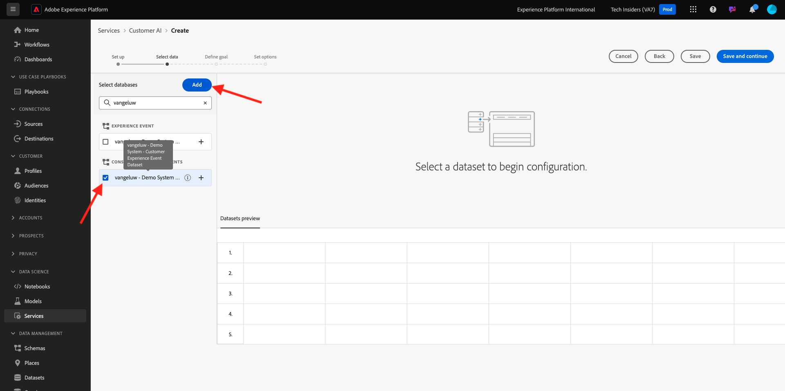

# 2.2.2 Customer AI - 새 인스턴스 만들기(구성)

고객 AI는 기존 고객 경험 이벤트 데이터를 분석하여 이탈 또는 전환 성향 점수를 예측합니다. 새로운 고객 AI 인스턴스를 생성하면 마케터가 목표와 측정값을 정의할 수 있습니다.

## 새 Customer AI 인스턴스 설정

Adobe Experience Platform의 왼쪽 메뉴에서 **서비스**&#x200B;를 클릭합니다. **서비스** 브라우저가 나타나고 사용자가 원하는 대로 사용 가능한 모든 서비스를 표시합니다. Customer AI용 카드에서 **열기**&#x200B;를 클릭합니다.

**인스턴스 만들기**&#x200B;를 클릭합니다.

그러면 이걸 보게 될 거야.

고객 AI 인스턴스에 대한 필수 세부 정보를 입력합니다.

- 이름: `--aepUserLdap-- Product Purchase Propensity` 사용
- 설명: 사용: **고객이 제품을 구매할 가능성 예측**
- 성향 유형: **전환** 선택

**저장 후 계속**&#x200B;을 클릭합니다.

그러면 이걸 보게 될 거야. 이름이 `--aepUserLdap-- - Demo System - Customer Experience Event Dataset`인 이전 연습에서 만든 데이터 집합을 선택하십시오. **추가를 클릭합니다**.

그러면 이걸 보게 될 거야. **ID** 필드를 정의해야 합니다. **없음**&#x200B;을 클릭합니다.

팝업에서 **ID 맵(identityMap)**&#x200B;을 선택한 다음 네임스페이스 **데모 시스템 - CRMID(crmId)**&#x200B;을 선택합니다. 그런 다음 **저장**&#x200B;을 클릭합니다.

**저장 후 계속**&#x200B;을 클릭합니다.

특정 데이터 집합에서 **다음이 발생합니다**. **commerce.purchases.value** 필드를 대상 변수로 정의합니다.

그런 다음 **주별**&#x200B;을 실행하도록 일정을 설정하고 가능한 현재 시간에 가까운 시간을 설정합니다. **프로필에 대한 점수 활성화** 토글이 활성화되어 있는지 확인하십시오. **저장 후 계속**&#x200B;을 클릭합니다.

인스턴스를 구성하면 고객 AI 서비스 목록에 표시되고, 고객 AI 인스턴스 행을 클릭하여 설정 및 실행 세부 사항의 요약을 미리 볼 수도 있습니다. 오류가 발견된 경우 요약 패널에 오류 세부 정보도 표시됩니다.

>[!NOTE]
>
>Customer AI 인스턴스의 상태가 **교육 대기 중** 또는 **오류**&#x200B;인 경우 정의나 특성을 수정할 수 있습니다.

모델이 실행되면 이 메시지가 표시됩니다.

## 다음 단계

[2.2.3 Customer AI - 채점 대시보드 및 세분화(예측 및 작업 수행)로 이동](./ex3.md){target="_blank"}

[지능형 서비스](./intelligent-services.md){target="_blank"}(으)로 돌아가기

[모든 모듈](./../../../../overview.md){target="_blank"}(으)로 돌아가기
