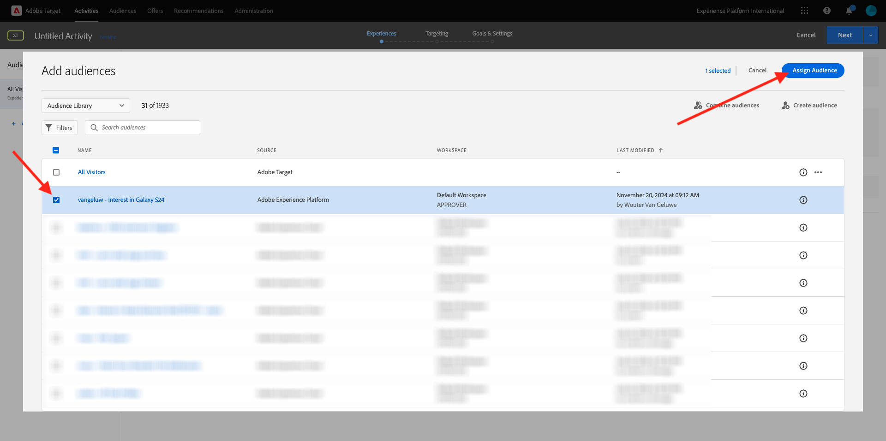

# 2.3.5 조치 취하기: 대상자를 Adobe Target으로 보내기

[Adobe Experience Platform](https://experience.adobe.com/platform)&#x200B;(으)로 이동합니다. 로그인하면 Adobe Experience Platform 홈페이지에 접속하게 됩니다.


계속하려면 **샌드박스**&#x200B;를 선택해야 합니다. 선택할 샌드박스 이름이 ``--aepSandboxName--``입니다. 적절한 [!UICONTROL 샌드박스]를 선택하면 화면이 변경되고 이제 전용 [!UICONTROL 샌드박스]에 있게 됩니다.


## 데이터 스트림 확인

Real-Time CDP의 Adobe Target 대상은 데이터를 Adobe Edge Network로 수집하는 데 사용되는 데이터 스트림에 연결됩니다. Adobe Target 대상을 설정하려면 먼저 데이터 스트림이 Adobe Target에 대해 이미 활성화되어 있는지 확인해야 합니다. 데이터 스트림이 [연습 0.2 데이터 스트림 만들기](./../../../modules/../getting-started/gettingstarted/ex2.md)에서 구성되었으며 이름이 `--aepUserLdap-- - Demo System Datastream`입니다.

왼쪽 메뉴에서 아래로 스크롤하여 **데이터스트림**&#x200B;을 클릭합니다. 데이터스트림에서 이름이 `--aepUserLdap-- - Demo System Datastream`인 데이터스트림을 검색합니다. 데이터 스트림을 클릭하여 엽니다.


그러면 **Adobe Experience Platform** 옆에 있는 **..**&#x200B;을 클릭한 다음 **편집**&#x200B;을 클릭합니다.


**Edge 세분화** 및 **Personalization 대상**&#x200B;에 대한 확인란을 모두 선택합니다. **저장**&#x200B;을 클릭합니다.


**+ 서비스 추가**&#x200B;를 클릭합니다.


서비스 **Adobe Target**&#x200B;을(를) 선택하십시오. **저장**&#x200B;을 클릭합니다.


이제 데이터 스트림이 Adobe Target에 대해 구성됩니다.


## Adobe Target 대상 설정

Adobe Target은 Real-Time CDP에서 대상으로 사용할 수 있습니다. Adobe Target 통합을 설정하려면 **대상**, **카탈로그**(으)로 이동하십시오.

**카테고리** 메뉴에서 **Personalization**&#x200B;을(를) 클릭합니다. 그러면 **(v2) Adobe Target** 대상 카드가 표시됩니다.


**대상에 연결**&#x200B;을 클릭합니다.


그러면 이걸 보게 될 거야. 나만의 Adobe Target 대상을 만들어야 하므로 다음 지침을 따르십시오.

- 이름: `--aepUserLdap-- - Adobe Target v2  (Web)` 이름을 사용합니다.
- 데이터 스트림 ID: [연습 0.2 데이터 스트림 만들기](./../../../modules/../getting-started/gettingstarted/ex2.md)에서 구성한 데이터 스트림을 선택해야 합니다. 데이터 스트림의 이름은 `--aepUserLdap-- - Demo System Datastream`이어야 합니다.
- Workspace: Adobe Target 작업 영역과 관련되어 있습니다. 사용할 특정 작업 영역이 없으면 **기본 Workspace**&#x200B;을(를) 선택하십시오.

**다음**&#x200B;을 클릭합니다.


이제 선택적으로 데이터 거버넌스 정책을 선택할 수 있습니다. **다음**&#x200B;을 클릭합니다.


사용 가능한 대상 목록에서 이전 연습 [대상 만들기](./ex1.md)에서 만든 대상(`--aepUserLdap-- - Interest in Galaxy S24`)을 선택합니다. 그런 다음 **다음**&#x200B;을 클릭합니다.


**매핑** 화면에서 Adobe Target에서 사용할 수 있도록 프로필 특성을 매핑할 수 있습니다. 이렇게 하면 웹 사이트에 추가 개인화 계층을 추가하는 데 도움이 됩니다. **새 필드 추가**&#x200B;를 클릭합니다.


새 필드에 대해 **person.name.firstName** 필드를 선택합니다. **저장**&#x200B;을 클릭합니다.


그럼 이걸로 드셔보세요 **다음**&#x200B;을 클릭합니다.


**마침을 클릭합니다**.


이제 대상자가 Adobe Target을 향해 활성화됩니다.


>[!IMPORTANT]
>
>Real-Time CDP에서 Adobe Target 대상을 방금 만든 경우 대상이 활성 상태가 되는 데 최대 1시간이 걸릴 수 있습니다. 백엔드 구성 설정으로 인한 일회성 대기 시간입니다. 초기 1시간 대기 시간 및 백엔드 구성이 완료되면 Adobe Target 대상으로 전송된 새로 추가된 대상을 실시간으로 타겟팅할 수 있습니다.

## Adobe Target 양식 기반 활동 구성

이제 Real-Time CDP 대상자가 Adobe Target으로 전송되도록 구성되었으므로 Adobe Target에서 경험 타깃팅 활동을 구성할 수 있습니다. 이 연습에서는 양식 기반 활동을 구성합니다.

[https://experiencecloud.adobe.com/](https://experiencecloud.adobe.com/)&#x200B;(으)로 이동하여 Adobe Experience Cloud 홈페이지로 이동합니다. **Target**&#x200B;을 클릭하여 엽니다.


**Adobe Target** 홈 페이지에 기존의 모든 활동이 표시됩니다. **활동 만들기**&#x200B;를 클릭한 다음 **경험 타깃팅**&#x200B;을 클릭합니다.


**Web**, **Form** 및 **속성 제한 없음**&#x200B;을 선택하십시오. **만들기**&#x200B;를 클릭합니다.


이제 양식 기반 활동 작성기입니다.


필드 **LOCATION 1**&#x200B;에 대해 **target-global-mbox**&#x200B;를 선택하십시오.


기본 대상은 현재 **모든 방문자**&#x200B;입니다. **모든 방문자** 옆의 **3개 점**&#x200B;을 클릭하고 **대상 변경**&#x200B;을 클릭합니다.


이제 사용 가능한 대상 목록이 표시되며, 이전에 만들어 Adobe Target으로 보낸 Adobe Experience Platform 대상은 이제 이 목록의 일부입니다. 이전에 Adobe Experience Platform에서 만든 대상자를 선택합니다. **대상자 할당**&#x200B;을 클릭합니다.



이제 Adobe Experience Platform 대상자는 이 경험 타깃팅 활동의 일부입니다.


이제 홈페이지 홈페이지에서 영웅 이미지를 변경하겠습니다. **기본 콘텐츠** 옆에 있는 드롭다운 목록을 클릭하여 열고 **HTML 오퍼 만들기**&#x200B;를 클릭합니다.


다음 코드를 붙여넣습니다.

```javascript
<script>document.querySelector("#SpectrumProvider > div.App > div > div.Page.home > main > div.Banner.Banner--alignment-right.Banner--verticalAlignment-middle.main-banner > div.Image > img").src="https://one-adobe-tech-insiders.s3.us-west-2.amazonaws.com/citisignal-new-hero.png"; document.querySelector("#SpectrumProvider > div.App > div > div.Page.home > main > div.Banner.Banner--alignment-right.Banner--verticalAlignment-middle.main-banner > div.Banner__content > div > div > h1").innerHTML="Hi there ";
document.querySelector("#SpectrumProvider > div.App > div > div.Page.home > main > div.Banner.Banner--alignment-right.Banner--verticalAlignment-middle.main-banner > div.Banner__content > div > div > div > div > p").innerHTML="What about 10% off of your next Galaxy S24 smartphone?";
</script>
```


그런 다음 Adobe Experience Platform의 프로필 속성에서 개인화 토큰을 추가해야 합니다. 대상을 Adobe Target으로 활성화하면 Adobe Target과 공유할 필드 **person.name.firstName**&#x200B;도 선택해야 합니다. 필드를 검색하려면 원본 **Adobe Experience Platform**&#x200B;을(를) 선택하고 샌드박스(`--aepSandboxName--`)를 선택한 다음 특성 **person.name.firstName**&#x200B;을(를) 선택하십시오.


**추가** 단추를 클릭하기 전에 `... > h1").innerHTML="Hi there ";`이(가) 표시된 줄로 이동하여 `there` 단어 뒤에 커서를 대괄호 안에 넣으십시오.

```
... > h1").innerHTML="Hi there ";
```

그런 다음 **추가** 단추를 클릭합니다. 그러면 토큰이 추가되고 다음과 같이 코드가 업데이트됩니다.

```
... > h1").innerHTML="Hi there ${aep.person.name.firstName}";
```


**다음**&#x200B;을 클릭합니다.


그러면 선택한 대상에 대한 새 이미지에 대한 경험 개요가 표시됩니다. **다음**&#x200B;을 클릭합니다.


왼쪽 위 모서리에서 활동 제목을 클릭하여 다음과 같이 이름을 변경합니다. `--aepUserLdap-- - RTCDP - XT (Form)`


**목표 및 설정** - 페이지에서 **목표 지표**(으)로 이동합니다. 기본 목표를 **참여** - **사이트 시간**(으)로 설정합니다. **저장 및 닫기**&#x200B;를 클릭합니다.


이제 **활동 개요** 페이지에 있습니다. 활동을 활성화해야 합니다. **비활성** 필드를 클릭하고 **활성화**&#x200B;를 선택합니다.


그런 다음 활동이 현재 라이브 상태임을 시각적으로 확인할 수 있습니다.


이제 활동이 라이브 상태이며 데모 웹 사이트에서 테스트할 수 있습니다.

>[!IMPORTANT]
>
>Real-Time CDP에서 Adobe Target 대상을 방금 만든 경우 대상이 활성 상태가 되는 데 최대 1시간이 걸릴 수 있습니다. 백엔드 구성 설정으로 인한 일회성 대기 시간입니다. 초기 1시간 대기 시간 및 백엔드 구성이 완료되면 Adobe Target 대상으로 전송된 새로 추가된 Edge Audiences를 실시간으로 타겟팅할 수 있습니다.

이제 데모 웹 사이트로 돌아가 Galaxy S24에 대한 제품 페이지를 방문하면 만든 대상에 대한 자격이 주어지고 Adobe Target 활동이 홈 페이지에 실시간으로 표시됩니다.


## 다음 단계

[2.3.6 대상 SDK](./ex6.md){target="_blank"}(으)로 이동

[실시간 CDP로 돌아가기 - 대상자를 빌드하고 작업 수행](./real-time-cdp-build-a-segment-take-action.md){target="_blank"}

[모든 모듈](./../../../../overview.md){target="_blank"}(으)로 돌아가기
