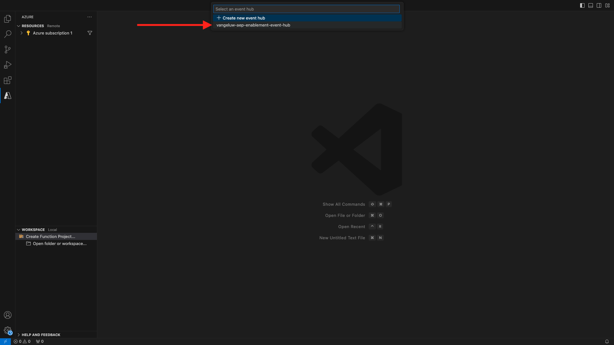
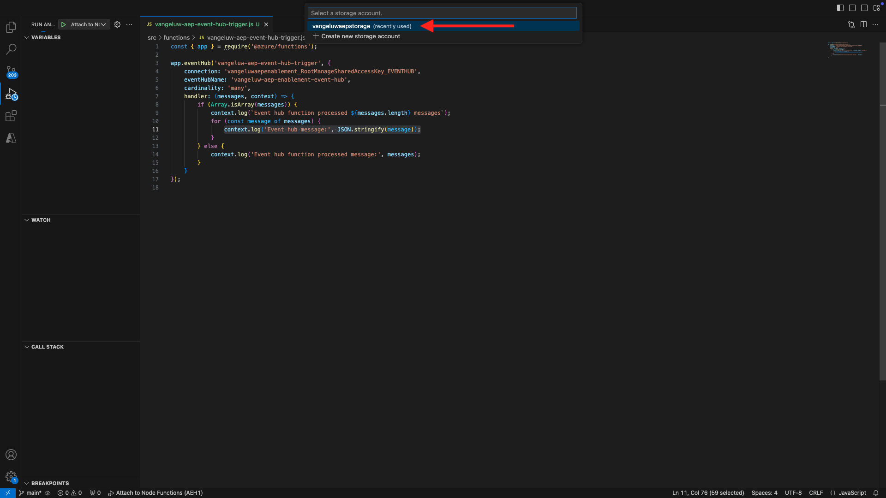

# 2.4.6 Microsoft Azure 프로젝트 만들기

## Azure 이벤트 허브 기능 익히기

Azure 함수를 사용하면 응용 프로그램 인프라에 대한 걱정 없이 작은 코드 조각(**함수**)을 실행할 수 있습니다. Azure 기능을 사용하면 클라우드 인프라에서 규모에 맞게 애플리케이션을 실행하는 데 필요한 모든 최신 서버를 제공합니다.
특정 유형의 이벤트에 의해 함수가 **트리거됨**&#x200B;됩니다. 지원되는 트리거에는 데이터 변경 사항에 응답, 메시지(예: 이벤트 허브)에 응답, 일정에 따라 실행 또는 HTTP 요청의 결과가 포함됩니다.
Azure Functions는 인프라를 명시적으로 프로비전하거나 관리하지 않고도 이벤트 트리거 코드를 실행할 수 있는 서버를 사용하지 않는 계산 서비스입니다.
Azure 이벤트 허브는 서버를 사용하지 않는 아키텍처를 위해 Azure 기능과 통합됩니다.
## Visual Studio Code 및 Azure에 로그온 열기

Visual Studio 코드를 사용하면 다음 작업을 쉽게 수행할 수 있습니다.
- azure 기능을 정의하고 이벤트 허브에 바인딩합니다.- 로컬에서 테스트- azure에 배포- 원격 로그 기능 실행
### Visual Studio 코드 열기

### Azure에 로그온

이전 연습에서 등록하는 데 사용한 Azure 계정으로 로그온하면 Visual Studio 코드를 사용하여 모든 이벤트 허브 리소스를 찾아서 바인딩할 수 있습니다.
Visual Studio 코드를 열고 **Azure** 아이콘을 클릭합니다.
다음으로 **Azure에 로그인**&#x200B;을 선택합니다.

로그인하려면 브라우저로 리디렉션됩니다. 등록하는 데 사용한 Azure 계정을 선택해야 합니다.
브라우저에 다음 화면이 표시되면 Visual Code Studio로 로그인됩니다.

Visual Code Studio로 돌아갑니다. Azure 구독 이름이 표시됩니다(예: **Azure 구독 1**).

## Azure 프로젝트 만들기

**함수 프로젝트 만들기...**&#x200B;를 클릭합니다.

원하는 로컬 폴더를 선택하거나 만들어 프로젝트를 저장하고 **선택**&#x200B;을 클릭합니다.

이제 프로젝트 만들기 마법사로 들어갑니다. 프로젝트의 언어로 **Javascript**&#x200B;를 클릭합니다.

**모델 v4**&#x200B;을(를) 선택하십시오.

**Azure Event Hub 트리거**&#x200B;를 프로젝트의 첫 번째 함수 템플릿으로 선택합니다.

함수의 이름을 입력하고 `--aepUserLdap---aep-event-hub-trigger` 형식을 사용한 후 Enter 키를 누르십시오.

**새 로컬 앱 설정 만들기** 선택:

이전에 만든 `--aepUserLdap---aep-enablement` 이벤트 허브 네임스페이스를 클릭하여 선택합니다.

그런 다음 앞에서 만든 이벤트 허브(`--aepUserLdap---aep-enablement-event-hub`)를 클릭하여 선택합니다.

**RootManageSharedAccessKey**&#x200B;을(를) 이벤트 허브 정책으로 선택하려면 클릭하세요.

프로젝트를 여는 방법에 대해 **작업 영역에 추가**&#x200B;를 선택하십시오.

그런 다음 이와 같은 메시지를 받을 수 있습니다. 이 경우 **예, 작성자를 신뢰함**&#x200B;을 클릭하세요.

프로젝트를 만든 후 편집기에서 `--aepUserLdap---aep-event-hub-trigger.js` 파일을 엽니다.

Adobe Experience Platform이 이벤트 허브에 전송하는 페이로드는 다음과 같습니다.
```json
{
  "identityMap": {
    "ecid": [
      {
        "id": "36281682065771928820739672071812090802"
      }
    ]
  },
  "segmentMembership": {
    "ups": {
      "94db5aed-b90e-478d-9637-9b0fad5bba11": {
        "createdAt": 1732129904025,
        "lastQualificationTime": "2024-11-21T07:33:52Z",
        "mappingCreatedAt": 1732130611000,
        "mappingUpdatedAt": 1732130611000,
        "name": "vangeluw - Interest in Plans",
        "status": "realized",
        "updatedAt": 1732129904025
      }
    }
  }
}
```

Visual Studio 코드의 `--aepUserLdap---aep-event-hub-trigger.js`에 있는 코드를 아래 코드로 업데이트합니다. 이 코드는 Real-Time CDP가 이벤트 허브 대상에 대상 자격을 전송할 때마다 실행됩니다. 이 예제에서 코드는 수신 페이로드를 표시하는 것이지만 대상 자격을 실시간으로 처리하고 데이터 파이프라인 에코시스템을 더 세부적으로 사용하는 추가 기능을 상상할 수 있습니다.
`--aepUserLdap---aep-event-hub-trigger.js` 파일의 11행에 현재 다음이 표시됩니다.
```javascript
context.log('Event hub message:', message);
```

`--aepUserLdap---aep-event-hub-trigger.js`의 11행을 다음과 같이 변경합니다.
```javascript
context.log('Event hub message:', JSON.stringify(message));
```

그러면 총 페이로드는 다음과 같아야 합니다.
```javascript
const { app } = require('@azure/functions');

app.eventHub('--aepUserLdap---aep-event-hub-trigger', {
    connection: '--aepUserLdap--aepenablement_RootManageSharedAccessKey_EVENTHUB',
    eventHubName: '--aepUserLdap---aep-enablement-event-hub',
    cardinality: 'many',
    handler: (messages, context) => {
        if (Array.isArray(messages)) {
            context.log(`Event hub function processed ${messages.length} messages`);
            for (const message of messages) {
                context.log('Event hub message:', message);
            }
        } else {
            context.log('Event hub function processed message:', messages);
        }
    }
});
```


결과는 다음과 같아야 합니다.

## Azure 프로젝트 실행

이제 프로젝트를 실행할 차례입니다. 이 단계에서는 Azure에 프로젝트를 배포하지 않습니다. 디버그 모드에서 로컬로 실행합니다. 실행 아이콘을 선택하고 녹색 화살표를 클릭합니다.

디버그 모드에서 프로젝트를 처음 실행할 때 Azure 저장소 계정을 첨부해야 합니다. **저장소 계정 선택**&#x200B;을 클릭하세요.

그런 다음 이전에 만든 `--aepUserLdap--aepstorage` 저장소 계정을 선택합니다.

이제 프로젝트가 실행 중이고 이벤트 허브에서 이벤트 목록을 작성하고 있습니다. 다음 연습에서는 CitiSignal 데모 웹 사이트에서 사용자에게 적합한 동작을 보여 줍니다. 그 결과 Event Hub 트리거 기능 터미널에서 대상 자격 페이로드를 받게 됩니다.

## Azure 프로젝트 중지

프로젝트를 중지하려면 VSC의 LENU **CALL STACK**(으)로 이동하여 실행 중인 프로젝트의 화살표를 클릭한 다음 **중지**&#x200B;를 클릭합니다.

## 다음 단계

[2.4.7 전체 시나리오로 이동](./ex7.md){target="_blank"}
[Real-Time CDP: Audience Activation에서 Microsoft Azure Event Hub로 이동](./segment-activation-microsoft-azure-eventhub.md){target="_blank"}
[모든 모듈](./../../../../overview.md){target="_blank"}(으)로 돌아가기
