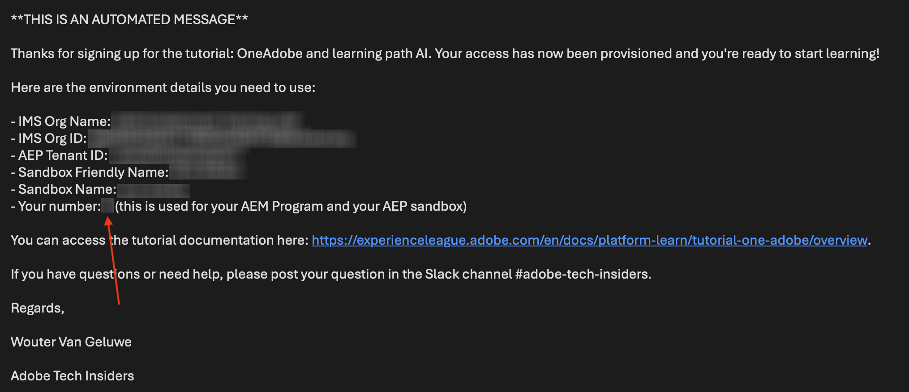
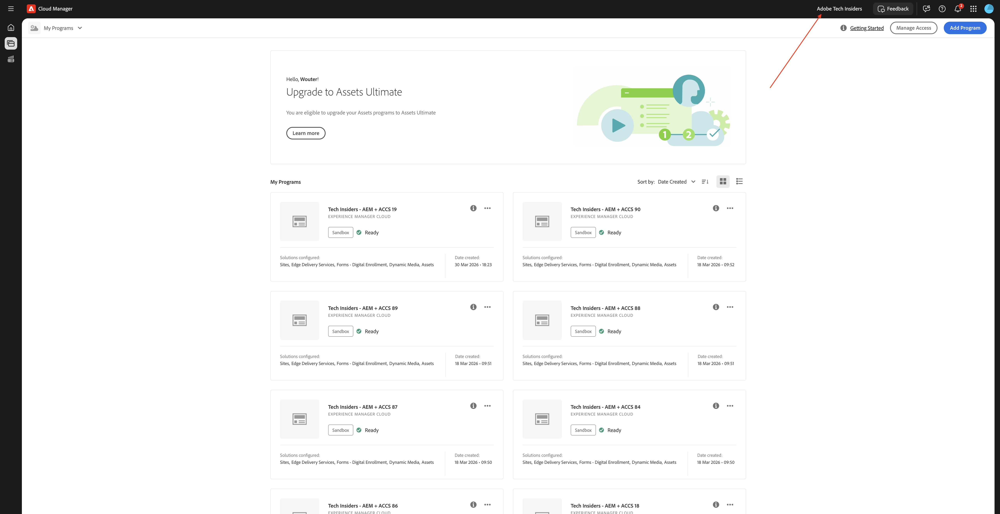

# AEM 웹 사이트 및 AEP 샌드박스 사용

아젠틱 AI 테크랩을 수강할 때는 Edge Delivery Services을 사용하는 기존 AEM as a Cloud Service 프로그램을 사용하게 된다. Edge Delivery Services을 사용하는 이 AEM as a Cloud Service 프로그램은 사용자를 위해 만들어졌으며 기술 랩의 시작 부분에서 이미 사용할 수 있습니다.

## 내 번호

지원 환경에 액세스하면 번호가 할당되었습니다. 이 숫자는 사용해야 하는 AEM as a Cloud Service 프로그램과 Brand Concierge 기술 랩에 사용해야 하는 AEP 샌드박스를 나타냅니다.

>[!IMPORTANT]
>
>이 이메일을 아직 받지 못한 경우 아래 단계를 아직 실행할 수 없습니다. 아래 Adobe 애플리케이션에 액세스하기 전에 아래 이메일을 받을 때까지 기다려야 합니다.

## AEM 프로그램

>[!NOTE]
>
>아래 스크린샷은 모두 그림 용도로만 숫자 1을 사용합니다. 아래 단계를 진행하는 동안 받은 이메일의 일부로 할당된 번호를 사용해야 합니다.

AEM 프로그램은 해당 이름에 할당된 번호를 사용합니다. AEM 프로그램의 이름은 다음 중 하나여야 합니다.

- **`Tech Insiders - AEM + ACCS X`**&#x200B;입니다. 여기서 X는 사용자에게 할당된 숫자를 나타냅니다.
- **`Tech Insiders On Demand - AEM + ACCS X`**&#x200B;입니다. 여기서 X는 사용자에게 할당된 숫자를 나타냅니다.
- **`--aepUserLdap-- - CitiSignal AEM+ACCS`**. 이 경우 직접 만든 AEM 프로그램을 사용하고 있으므로 번호가 없습니다.

[https://experience.adobe.com/cloud-manager/landing.html](https://experience.adobe.com/cloud-manager/landing.html)&#x200B;(으)로 이동하여 AEM 프로그램에 액세스하고 찾을 수 있습니다. 선택한 환경이 **`--aepImsOrgName--`**&#x200B;인지 확인하십시오. 화면의 오른쪽 상단 모서리에서 확인할 수 있습니다.

### AEM 프로그램 최대 절전 모드 해제

사용되는 AEM 프로그램은 &#39;샌드박스&#39; 프로그램입니다. AEM 샌드박스는 두 시간 동안 사용되지 않으면 자동으로 최대 절전 모드로 전환됩니다. 즉, 샌드박스를 사용하기 전에 해당 샌드박스의 최대 절전 모드를 해제해야 합니다. 프로그램의 최대 절전 모드를 해제하려면 [https://experience.adobe.com/cloud-manager/landing.html](https://experience.adobe.com/cloud-manager/landing.html)&#x200B;(으)로 이동하십시오. 을(를) 클릭하여 프로그램을 엽니다.

그럼 이걸 보셔야죠 세 점 **..**&#x200B;을(를) 클릭한 다음 **최대 절전 모드 해제**&#x200B;를 선택합니다.

**제출을 클릭합니다**. 최대 절전 모드 해제는 10~15분 정도 소요됩니다.

### AEM 프로그램용 GitHub 저장소

각 AEM 프로그램은 Edge Delivery Services을 사용하여 웹 사이트를 배포합니다. 즉, 웹 사이트의 코드가 GitHub 저장소에 호스팅됩니다. GitHub 저장소는 사용자를 위해 만들어졌으며 다음 위치로 이동하여 액세스할 수 있습니다.

**https://github.com/woutervangeluwe/techinsidersX-citisignal-aem-accs**. 따라서 X를 사용자 번호로 바꿔야 합니다.

GitHub 리포지토리는 다음과 같아야 합니다.

기술 랩 세션이 시작되기 전에 온보딩 프로세스의 일부로 GitHub 사용자 이름을 입력하라는 메시지가 표시됩니다. GitHub 사용자 이름을 제공하면 웹 사이트에 첨부된 GitHub 저장소에 공동 작업자로 추가되어 변경할 수 있습니다.

### 웹 사이트에 액세스

웹 사이트에 액세스하려면 다음 기본 URL을 사용할 수 있습니다.

- **`https://main--techinsidersX-citisignal-aem-accs--woutervangeluwe.aem.page/`**
- **`https://main--techinsidersX-citisignal-aem-accs--woutervangeluwe.aem.live/`**

이러한 URL의 X를 할당된 번호로 대체해야 합니다.

또한 다음 URL을 사용하여 액세스할 수 있는 각 웹 사이트에 대해 사용자 정의 도메인 이름이 생성되었습니다.

- **`https://techinsidersX.adobedemosystem.com/`**

이러한 URL의 X를 할당된 번호로 대체해야 합니다.

그러면 다음과 유사한 웹 사이트를 볼 수 있습니다.

## AEP 샌드박스

>[!NOTE]
>
>아래 스크린샷은 모두 그림 용도로만 숫자 1을 사용합니다. 아래 단계를 진행하는 동안 받은 이메일의 일부로 할당된 번호를 사용해야 합니다.

Brand Concierge Tech Lab의 경우 특정 AEP 샌드박스를 사용해야 합니다. 이 AEP 샌드박스의 이름은 **techinsidersX**&#x200B;이므로 할당된 번호로 X를 바꿔야 합니다.

[https://platform.adobe.com](https://platform.adobe.com)&#x200B;(으)로 이동합니다. 화면 오른쪽 상단 모서리에서 드롭다운을 열고 샌드박스를 선택합니다.

Brand Concierge 기술 랩에 대해서만 이 샌드박스를 사용하면 됩니다.

## 다음 단계

[시작하기 - Agentic AI](./getting-started-agentic-ai.md){target="_blank"}(으)로 돌아가기

[모든 모듈](./../../../overview.md){target="_blank"}./이미지로 돌아가기
